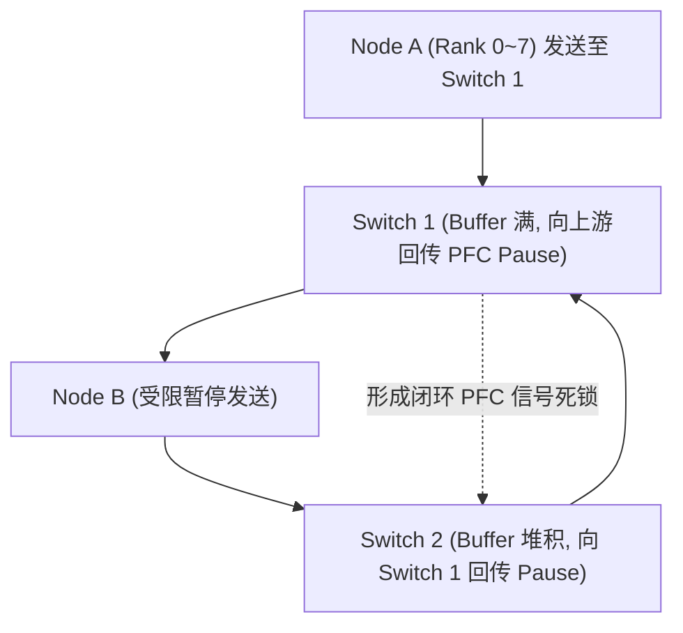

# 05 HCCL 集群通信超时与网络丢包案例

## 案例 1：RoCE 交换机 PFC 死锁导致万卡 NPU 集群集体挂起

### 1. 现场故障现象
万卡 NPU 集群在执行到第 1820 步时，所有 Worker 节点集体抛出 HCCL 超时：
```text
[HCCL_ERROR] 2026-09-07 03:14:22 [Rank 4120]: Watchdog detected HCCL collective AllReduce timeout after 1800000ms
[HCCL_DEBUG] Link state: RoCE Tx Queue 100% full, PFC Pause frames received continuous
```



### 2. 根因剖析与网络优化方案
1. **PFC 死锁机理**：在大规模 All-to-All 突发通信中，多对一流量瞬间填满交换机入口队列，触发跨交换机的连续 Pause 帧反压，形成顺时针循环死锁。
2. **综合修复措施**：
   - **动态缓冲水线**：配置 ECN 标记门限（$X_{low} = 24\text{ KB}, X_{high} = 96\text{ KB}$），在队列溢出前由源端主动降速；
   - **开启 PFC Deadlock Watchdog**：当交换机某个端口检测到持续 $200\mu s$ 的 Pause 信号时，强制忽略并清空违规队列；
   - **HCCL 通信优化**：开启跨节点分层双二叉树（Hierarchical Double Binary Tree）通信算法，消除多对一拥塞。
