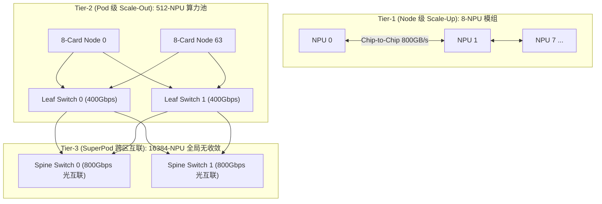

# 06 超大规模 NPU 集群 Scale-Up 与 Scale-Out 拓扑推导

## 1. 万卡 NPU 集群三层网络架构拓扑

构建 16,384 卡超大规模 AI 集群需要分层设计无阻塞胖树（Non-Blocking Fat-Tree）互联：

---

## 2. 万卡并行 AllReduce 通信延迟数学模型

对于传输大小为 $S$ 的 Tensor，在 $P$ 个 NPU 节点上执行 Ring AllReduce：
$$T_{comm}(S, P) = 2(P-1) \alpha + 2 \times \frac{P-1}{P} \times \frac{S}{B}$$

- $\alpha$：单跳网络握手固定时延（RoCEv2 通常为 $1.2\mu s$）；
- $B$：单链路有效网络传输带宽（400 Gbps $\approx 50\text{ GB/s}$）；
- **在大集群下（$P \gg 1$）**：
$$T_{comm} \approx 2 P \alpha + \frac{2 S}{B}$$
- 结论：当卡数 $P$ 扩大到 16,384 时，网络握手时延项 $2P\alpha$ 将达到 $39.3\text{ ms}$！因此万卡集群**必须引入分层分级通信（Hierarchical Ring/Tree）**，将跨节点大环拆解为 `Node内 -> Pod内 -> Pod间` 三级嵌套，将延迟项压缩至 $\approx 2 \times (\log_2 P) \alpha$。
