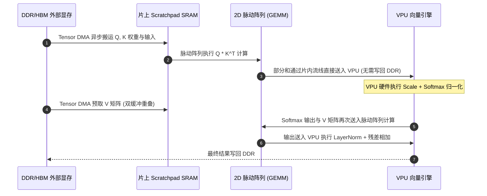

# 01 Transformer 块在脉动阵列与 VPU 上的端到端数据流推演

## 1. 全硬件执行路径

```mermaid
sequenceDiagram
    autonumber
    participant DDR as DDR/HBM 外部显存
    participant SRAM as 片上 Scratchpad SRAM
    participant SA as 2D 脉动阵列 (GEMM)
    participant VPU as VPU 向量引擎

    DDR->>SRAM: Tensor DMA 异步搬运 Q, K 权重与输入
    SRAM->>SA: 脉动阵列执行 Q * K^T 计算
    SA->>VPU: 部分和通过片内流线直接送入 VPU (无需写回 DDR)
    Note over VPU: VPU 硬件执行 Scale + Softmax 归一化
    DDR->>SRAM: Tensor DMA 预取 V 矩阵 (双缓冲重叠)
    VPU->>SA: Softmax 输出与 V 矩阵再次送入脉动阵列计算
    SA->>VPU: 输出送入 VPU 执行 LayerNorm + 残差相加
    VPU-->>DDR: 最终结果写回 DDR
```
