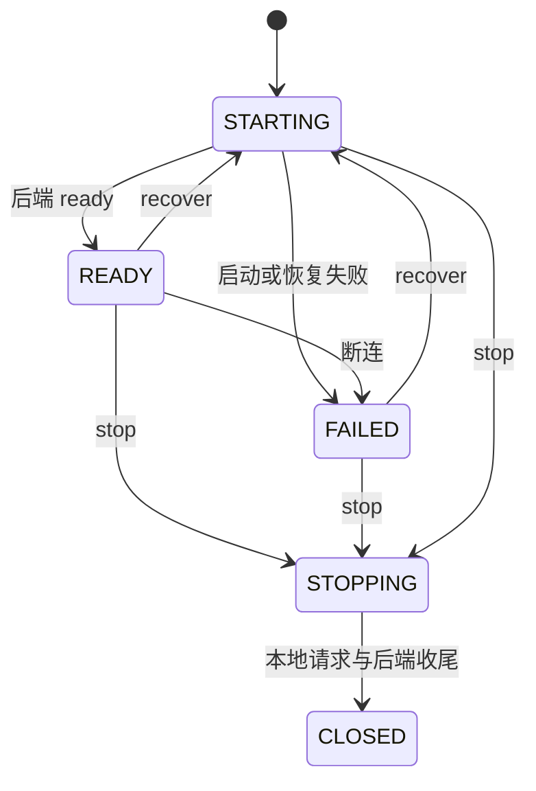

# 异步 SDK：先定义提交以后欠下的结果

`submit()` 返回成功以后，请求可能还在队列里。此时调用者能否复用原 buffer？队列满是立即失败还是稍后通知？停止时还有哪些结果必须交付？这些问题先于函数名和目录分层。

本章以受约束的设备 SDK 为例。业务核心接收事件、输出动作；Linux 与 FreeRTOS runtime 分别负责执行。前置阅读：[并发与所有权](https://xidianedu.cc/tech/linux/mechanisms/07-concurrency-ownership/)、[事件与时间](https://xidianedu.cc/tech/linux/mechanisms/06-events-time/)。头文件和实现见[源码与版本](../reference/source.md)。

## 区分入队、接受和完成

| 阶段 | 本例行为 | 对调用者的义务 |
| --- | --- | --- |
| 同步拒绝 | 参数错误、入口关闭或入口已满 | 立即返回错误，不再回调 |
| QUEUED | payload 已复制进入有界入口，返回 ticket | owner 后续给一次 ACCEPT 或 REJECT |
| ACCEPT | 请求取得业务在途槽位 | 后续给一次 TERMINAL |
| REJECT | 状态或业务容量不允许接受 | 此 ticket 收尾，不再给 TERMINAL |
| TERMINAL | completed、timed_out、cancelled 或 failed | 释放业务槽位，同一请求不再次终结 |

入口容量和在途额度解决不同问题。入口暂存多个生产者的事件；在途额度限制已经交给业务和后端的请求。返回 QUEUED 不能被写成“设备已接受命令”。

本例 `submit()` 在返回前复制 payload，调用者随后可以复用原数据。回调里的 payload 则只在该次回调期间有效；需要异步保存时由应用再复制。

## 用一组事件把两本账走完

下面的 `Q` 表示 API 已返回 QUEUED 的 ticket 总数，`pending` 表示尚待 admission 的 ticket。表中是契约层的累计账，并非某一瞬间的快照字段。

| 事件 | Q | accepted | rejected | pending | terminal | live |
| --- | ---: | ---: | ---: | ---: | ---: | ---: |
| A 入队 | 1 | 0 | 0 | 1 | 0 | 0 |
| owner 接受 A | 1 | 1 | 0 | 0 | 0 | 1 |
| B 入队 | 2 | 1 | 0 | 1 | 0 | 1 |
| owner 因额度满拒绝 B | 2 | 1 | 1 | 0 | 0 | 1 |
| A 收到成功响应 | 2 | 1 | 1 | 0 | 1 | 0 |
| C 入队，随后停止 | 3 | 1 | 1 | 1 | 1 | 0 |
| owner 拒绝 C，停止完成 | 3 | 1 | 2 | 0 | 1 | 0 |

由此得到：

```text
Q = accepted + rejected + pending
accepted = completed + timed_out + cancelled + failed + live
```

停止成功以后，两项余量 `pending` 和 `live` 都要归零。只检查 `live=0` 会遗漏仍在入口中的 ticket。

代码中的 `stats.queued` 在 `C_SUBMIT` 到达 core 时才递增，runtime 发布的 snapshot 还可能滞后。因此运行中的 snapshot 不能直接替代上表的外部入队账，也不能独自证明入口已排空。具体反例见[停止与入队守恒](https://xidianedu.cc/tech/linux/cases/01-stop-drain/)。

## 请求身份必须跨恢复边界

身份使用三元组：

```text
instance / generation / id
```

instance 隔离不同 SDK 实例；generation 区分恢复前后的会话；id 在同一会话内区分请求。恢复后新请求可能重新从 id=1 开始，单独比较 id 会让旧回复误完成新请求。id 接近耗尽时应返回显式错误，不能无声回绕。

本例只保留 64 项终态历史。近期重复或迟到回复可以分类；历史被淘汰以后，只能计为 unknown。有限内存需要这种边界，日志中也应保留完整身份。

## deadline、取消与远端副作用

deadline 从提交时确定，用单调时间表达；排队时间也消耗预算。响应时间恰好等于 deadline 时，本例按超时处理。超时说明本地等待结束，远端可能已经执行命令。取消事件成功入队，也不保证它先于响应生效。

接口因此分别声明：本地终态通知、远端取消能力、业务幂等性和恢复策略。本例能力查询明确报告不支持 remote cancel。具有副作用的命令需要协议层的幂等标识或状态查询，不能在超时后无条件重发。

## 状态、停止与销毁



`post_stop()` 先关闭入口；snapshot 可能暂时仍显示 READY。core 的 CLOSED 是业务状态，运行时和外部 API 使用者仍要收尾。应用以 `sdk_stop()` 或 `sdk_stop_wait()` 成功确认停止，再保证其他调用者全部结束，最后 destroy。

`stop_wait()` 超时返回 `SDK_ETIME`，对象仍然有效且继续停止；稍后可以再次等待。owner 回调不能同步等待自身退出，应返回上下文错误，改用 `post_stop()` 通知外部线程收尾。

## 把契约变成可区分的测试

在[专用工具容器](../guide/environment.md)的项目根目录执行：

```sh
make -C platform core-test linux-test
python3 scripts/mutation-check.py
```

core 向量覆盖身份、终态、deadline 边界和额度。变异检查把 deadline 的 `>=` 改成 `>`，要求指定边界断言能够检测该变化。验证应检查准确的失败原因，不能把任意编译失败或非零退出当成边界测试有效。

实现到新后端时，保留这些共同语义，再增加该后端的资源、能力与退出测试。运行机制的对照见[Linux 与 FreeRTOS](03-linux-freertos.md)。
