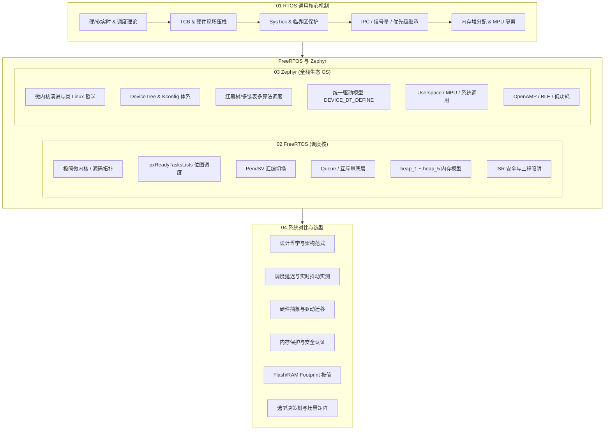

# RTOS 架构总览

RTOS 通过任务调度、中断处理和同步机制协调并发执行。分析实时性时，需要关注中断响应、调度延迟、临界区长度和任务的截止时间。

---

## 推荐学习路线

### 路线一：内核工程师（底层原理与汇编级现场）
> 专注处理器微架构交互、中断延迟压制与上下文切换细节。
>
> 1. [实时性与调度理论](../01-RTOS-Fundamentals/01-realtime-principles-scheduling.md) →
> 2. [任务生命周期与上下文切换](../01-RTOS-Fundamentals/02-task-lifecycle-tcb-context-switch.md) →
> 3. [PendSV 汇编现场切换](../02-FreeRTOS-Deep-Dive/03-context-switch-pendsv-assembly.md) →
> 4. [中断体系与临界区保护](../01-RTOS-Fundamentals/03-interrupt-systick-critical-section.md) →
> 5. [任务栈溢出与内存破坏分析](../Case-Studies/02-stack-overflow-isr-corruption-debug.md)

### 路线二：嵌入式软件架构师（系统选型与驱动生态）
> 权衡系统复杂度、开发成本、可移植性与软硬件解耦。
>
> 1. [FreeRTOS 架构哲学与源码拓扑](../02-FreeRTOS-Deep-Dive/01-freertos-architecture-source-topology.md) →
> 2. [Kconfig 与 DeviceTree 体系](../03-Zephyr-Deep-Dive/02-build-system-kconfig-devicetree.md) →
> 3. [统一设备驱动模型](../03-Zephyr-Deep-Dive/04-unified-driver-model.md) →
> 4. [设计哲学与架构范式对比](../04-Comparative-Study/01-philosophy-architectural-paradigm.md) →
> 5. [场景选型决策树与选型矩阵](../04-Comparative-Study/06-selection-decision-tree.md)

### 路线三：异构与多核开发工程师（SoC 协同与核间通信）
> 掌握核间中断、共享内存与 AMP 架构下的 RTOS 角色。
>
> 1. [子系统生态与多核 AMP](../03-Zephyr-Deep-Dive/07-subsystems-amp-power-management.md) →
> 2. [异构多核 AMP RPMsg 协同](../Case-Studies/03-amp-rpmsg-heterogeneous-multicore.md) →
> 3. [内存模型与保护机制](../01-RTOS-Fundamentals/05-memory-management-safety.md)

### 路线四：RVKernel 内核实验
> 在 QEMU RISC-V 环境中运行和调试 RVKernel。
>
> 1. [RVKernel 实验总览与环境准备](../Labs/README.md) →
> 2. [启动、Trap 现场与 Sv32 页表](../Labs/lab01-rv32-boot-trap-paging.md) →
> 3. [SBI 定时器中断与用户态抢占](../Labs/lab02-rv32-timer-preemption-scheduler.md) →
> 4. [环形缓冲与具名管道 IPC](../Labs/lab03-rv32-bounded-pipe-ipc.md) →
> 5. [1~4 核 SMP 多核启动与 IPI](../Labs/lab04-rv32-smp-multicore-ipi.md)

