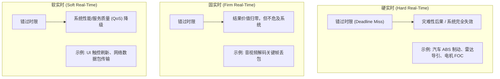
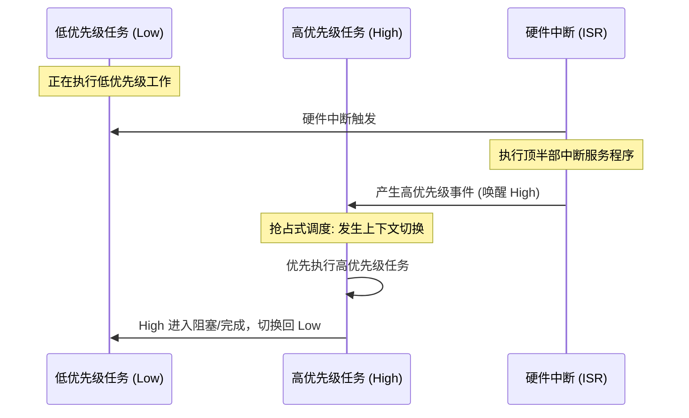

# 实时性与调度理论

## 1. 实时性的工程本质

在操作系统语境中，“实时”（Real-Time）常被误解为“计算速度快”。在硬件与控制工程视角下，**实时性的核心本质是时序确定性（Timing Determinism）**：

$$\text{正确性} = \text{逻辑结果正确} \land \text{在限定时限 (Deadline) 内完成}$$

如果一个电动机磁场定向控制（FOC）算法在 $50\,\mu\text{s}$ 内完成闭环能完美输出 PWM，但由于调度延迟或中断抖动拖到 $80\,\mu\text{s}$ 才输出，即使计算出的电流角度完全正确，系统也会引发逆变器过流击穿或电机失步。

### 关键时序指标

| 指标名称 | 英文定义 | 物理意义 | 典型目标量级 |
| :--- | :--- | :--- | :--- |
| **响应时间** | Response Time | 从事件触发（如引脚跳变）到处理任务完成的整段时间 | 数微秒至数毫秒 |
| **中断延迟** | Interrupt Latency | 硬件中断触发到 CPU 执行 ISR 第一条指令的时间间隔 | $< 1\,\mu\text{s}$ |
| **调度延迟** | Scheduling Latency | 就绪任务产生到调度器切换至该任务开始执行的时间 | $1 \sim 10\,\mu\text{s}$ |
| **时钟抖动** | Jitter | 周期性任务实际执行周期的离散程度（$\Delta T = |T_{\text{act}} - T_{\text{exp}}|$） | $< 5\%$ 周期 |

---

## 2. 任务模型与经典调度理论

在周期性实时任务模型中，每个任务 $\tau_i$ 由四元组定义：

$$\tau_i = (C_i, T_i, D_i, P_i)$$

- $C_i$ (Computation Time)：最坏情况执行时间（WCET, Worst-Case Execution Time）。
- $T_i$ (Period)：任务释放周期。
- $D_i$ (Deadline)：相对截止时间（通常隐式等于周期 $D_i = T_i$）。
- $P_i$ (Priority)：分配给该任务的静态或动态优先级。

系统的处理器利用率 $U$ 定义为：

$$U = \sum_{i=1}^{n} \frac{C_i}{T_i}$$

### 2.1 单调速率调度算法（RMS, Rate-Monotonic Scheduling）

RMS 是针对静态优先级抢占式调度的经典最优算法（[Liu & Layland, 1973](https://www.cs.ru.nl/~hooman/DES/liu-layland.pdf)）。
* **规则**：任务周期 $T_i$ 越短（即请求速率越高），静态分配的优先级 $P_i$ 越高。
* **可调度性充分性判据（Liu & Layland Utilization Bound）**：
  若满足下列假设，且系统总利用率满足不等式：

  $$U = \sum_{i=1}^{n} \frac{C_i}{T_i} \le n(2^{1/n} - 1)$$

  则 RMS **保证该任务集是可调度的（Sufficient Condition，充分非必要条件）**。

  当任务数 $n \to \infty$ 时，该界限下确界收敛为：

  $$\lim_{n \to \infty} n(2^{1/n} - 1) = \ln 2 \approx 0.693$$

!!! warning
    **定理成立的严苛前提假设（Assumptions）**：
    1. **独立任务（Independent）**：任务之间不存在 IPC 互斥锁阻塞、前序同步或共享资源竞态（Blocking Time $B_i = 0$）。
    2. **隐式时限（Implicit Deadline）**：每个任务的相对截止时间严格等于其周期（$D_i = T_i$）。
    3. **理想零开销（Zero Overhead）**：忽略上下文切换时间、时钟中断处理和调度器决策耗时。
    4. **完全可抢占（Fully Preemptive）**：不存在长时间关中断或关调度的不可抢占临界区。

!!! note
    **工程判据修正与谐波周期例外**：
    * **充分而非必要**：若利用率 $U > n(2^{1/n} - 1)$，**并不代表系统不可调度**！该界限是最坏情况下的悲观下界。
    * **谐波周期（Harmonic / Simply Periodic）**：若系统中所有任务的周期彼此成整数倍（例如 $10\,\text{ms}, 20\,\text{ms}, 40\,\text{ms}$），RMS 的可调度利用率上限可达 **$100\%$ ($U \le 1.0$)**。
    * **实际工程中的响应时间分析（RTA）**：实际工程中存在关中断、信号量阻塞和切换开销，通常需使用精确的响应时间递归分析方程（Response Time Analysis）逐一验证：$R_i = C_i + B_i + \sum_{j \in hp(i)} \lceil R_i / T_j \rceil C_j \le D_i$。

### 2.2 最早截止时间优先（EDF, Earliest Deadline First）

EDF 是动态优先级调度的理论最优算法。
* **规则**：在任意调度决策点，截止时间 $d_i$ 离当前时间最近的任务获得最高执行权。
* **可调度性界限**：在单核抢占式系统下，EDF 的利用率理论上限可达 **$100\%$ ($U \le 1.0$)**。
* **工程落地代价**：EDF 必须在每次调度或任务释放时，根据绝对 Deadline 动态重构就绪队列（维护最小堆或红黑树），运算开销随任务数增加。瞬时过载（Overload）还可能造成连续超时。因此许多面向 MCU 的内核（如 FreeRTOS）选择实现开销为 $O(1)$ 的静态优先级抢占。

### 2.3 受限时限下的 Deadline Monotonic（DM）

当任务存在 $D_i < T_i$（受限时限，Constrained Deadline）时，周期不再可靠反映紧急度，RMS 失去最优性。**DM（Deadline Monotonic）**按**相对截止时间 $D_i$ 越短优先级越高**分配静态优先级，是受限时限条件下静态优先级调度中的最优算法（Leung & Whitehead, 1982）；当 $D_i = T_i$ 时 DM 退化为 RMS。

| 维度 | RMS | DM | EDF |
| :--- | :--- | :--- | :--- |
| **优先级依据** | 周期 $T_i$ 越短越高 | 相对时限 $D_i$ 越短越高 | 绝对时限 $d_i$ 最近者优先（动态） |
| **最优性范围** | $D_i = T_i$ 时静态最优 | $D_i \le T_i$ 时静态最优 | 单核抢占式下动态最优 |
| **利用率界限（$D=T$）** | $n(2^{1/n}-1) \to \ln 2 \approx 0.693$ | 同 RMS | $U \le 1.0$ |
| **调度点开销** | 位图选取 $O(1)$ | 同 RMS | 就绪结构按 $d_i$ 重排 $O(\log N)$ |
| **过载行为** | 低优先级任务先失效，高优先级隔离降级 | 同 RMS | Domino 连环失效（见 2.5） |
| **工业采用** | FreeRTOS / Zephyr 手工排序惯例 | AUTOSAR OS 等工具链自动分配 | QNX 等少数商用内核（可选特性） |

### 2.4 精确判定：响应时间分析（RTA）数值算例

L&L 利用率界是**充分条件**：$U$ 超界 ≠ 不可调度。精确判定采用 RTA 不动点迭代：

$$R_i^{(k+1)} = C_i + B_i + \sum_{j \in hp(i)} \left\lceil \frac{R_i^{(k)}}{T_j} \right\rceil C_j$$

从 $R_i^{(0)} = C_i$ 出发，序列单调不降，收敛值即最坏响应时间；**任意一步 $R_i^{(k)} > D_i$ 即刻判不可调度并终止**（无需等收敛）。给定任务集（隐式时限，$B_i = 0$，RMS 排序 $\tau_1 > \tau_2 > \tau_3$）：

| 任务 | $C_i$ | $T_i = D_i$ |
| :--- | :--- | :--- |
| $\tau_1$ | 1 | 4 |
| $\tau_2$ | 2 | 6 |
| $\tau_3$ | 3 | 12 |

$$U = \frac{1}{4} + \frac{2}{6} + \frac{3}{12} \approx 0.833 \;>\; 3(2^{1/3} - 1) \approx 0.780$$

利用率判据在此失效，RTA 接管（以 $\tau_3$ 为例：$w^{(k+1)} = 3 + \lceil w^{(k)}/4 \rceil \cdot 1 + \lceil w^{(k)}/6 \rceil \cdot 2$）：

| 迭代 | $w^{(0)}$ | $w^{(1)}$ | $w^{(2)}$ | $w^{(3)}$ | $w^{(4)}$ | $w^{(5)}$ | 结论 |
| :--- | :--- | :--- | :--- | :--- | :--- | :--- | :--- |
| $\tau_2$ | 2 | 3 | 3 | — | — | — | $R_2 = 3 \le 6$ ✅ |
| $\tau_3$ | 3 | 6 | 7 | 9 | 10 | 10 | $R_3 = 10 \le 12$ ✅ |

另有 $R_1 = C_1 = 1 \le 4$。**结论：任务集可调度**，CPU 利用率仍低于 100%，但剩余比例不能直接当作可追加任务的调度余量——这正是"充分非必要"的定量体现。

!!! note
    **Audsley 最优优先级分配（OPA）**
    任务数超过 4 个后，手工猜测优先级排序不可维护。Audsley 算法**自最低优先级档向上逐档试放**：对每个未分配任务，以"其余尚未分配优先级的任务"为干扰集执行一次 RTA 检验，首个通过者固定于该档；若整档无人通过，则任务集在静态优先级下无解。对独立受限时限任务集，OPA 被证明：**若存在可行分配则必被其找到**。工程上 RTA + OPA 组成"自动配权"闭环，是 AUTOSAR 工具链的标准做法。

### 2.5 过载行为：可预测降级 vs Domino 雪崩

* **静态优先级（RMS/DM）**：只有当高优先级任务的执行、阻塞和干扰仍满足预算时，才可能将过载影响限制在较低优先级任务——失效半径在设计期即可圈定（Graceful Degradation，可预测降级）。
* **EDF**：过载时，未完成作业可能继续占用处理器并影响后续作业。EDF 本身不会自动顺延截止时间，错过时限后是丢弃、继续还是降级，应由系统策略规定。

---

## 3. 常见调度范式与对比

### 3.1 抢占式调度（Preemptive Scheduling）
* 当更高优先级的任务就绪时，内核**立即暂停**当前正在运行的低优先级任务，保存其寄存器上下文，并切入高优先级任务。
* **优点**：极低且确定性的响应时间，高优先级任务无需等待低优先级任务主动交出 CPU。
* **缺点**：上下文切换频繁，临界资源共享需要严格使用互斥锁或临界区。

### 3.2 协作式调度（Cooperative Scheduling）
* 任务一旦获得 CPU，将持续占用，直到其显式调用 `task_yield()`、进入延时或因等待资源自愿放弃控制权。
* **优点**：无非预期的线程交织，重入问题大幅降低，几乎不需要考虑微秒级并发锁竞争，RAM 占用极低。
* **缺点**：实时确定性脆弱，任何一个任务的死循环或长时间计算将直接造成全系统挂起。

### 3.3 时间片轮转（Time-Slicing Round-Robin）
* 多个具有**相同优先级**的就绪任务，各自被分配固定的时间配额（通常为 1 个 SysTick Tick）。
* 当 Tick 中断发生且当前任务时间片耗尽，调度器顺位切入同优先级的下一个任务。

---

## 4. 现场排查：周期任务偶发超时的定位顺序

1. **分段测量，先定位"哪一段"**：用 GPIO 翻转 + 示波器，或 DWT 周期计数器，把总延迟拆解为 *中断延迟 → 调度延迟 → 任务执行 → 阻塞 $B_i$* 四段；没有分段数据之前不做任何根因猜测。
2. **中断延迟段超标** → 审计最长关中断时长（对 BASEPRI/PRIMASK 置位区间打水印并记录历史最大值）；核查强实时中断是否被误置于内核受管区（见 [中断体系与临界区保护](03-interrupt-systick-critical-section.md)）。
3. **调度延迟段超标** → 检查 PendSV 是否被误设为非最低优先级、同级时间片配置、调度器临界区内是否混入了长操作。
4. **任务执行段超标** → WCET 低估：用 ETM/Trace 或最坏路径注入定位热点；警惕 Flash 等待周期、优化等级差异、未关闭的断言与日志。
5. **阻塞段超标** → 检查持锁临界区长度；是否误用二值信号量保护共享资源（隐式优先级反转，见 [IPC 通信与同步机制](04-ipc-synchronization-primitives.md)）；队列满深度阻塞。
6. **设计复核** → 以实测 $C_i$、$B_i$ 重跑 RTA；优先级排序可疑时用 Audsley OPA 重排并回归压测。
