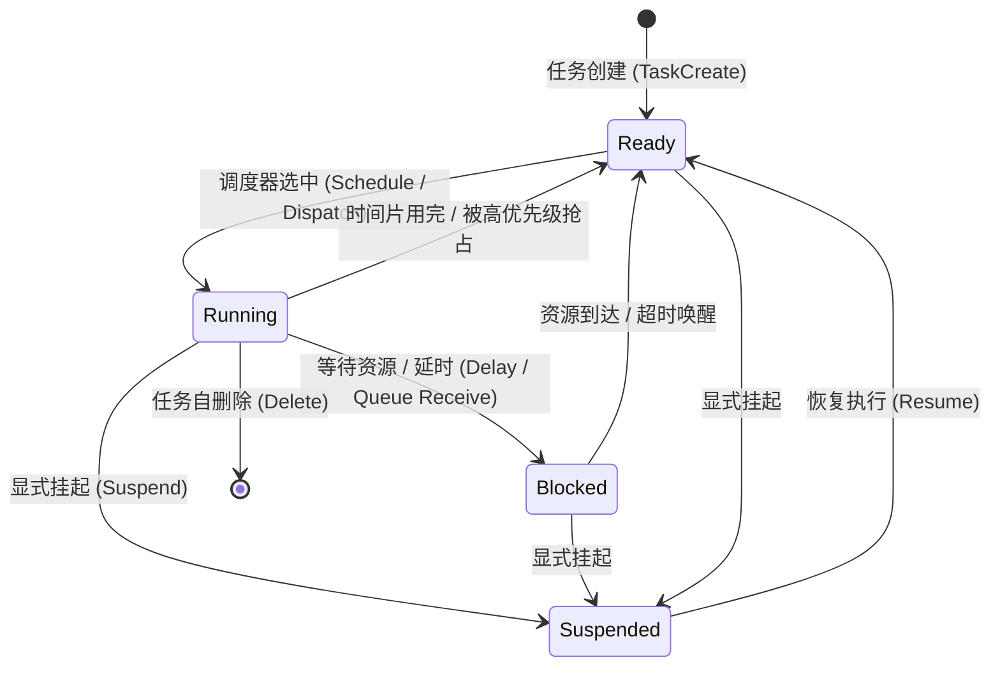
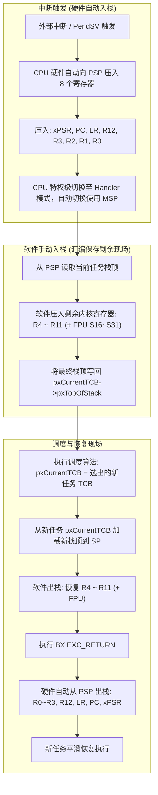

# 任务生命周期与上下文切换

## 1. 任务状态机（Task State Machine）

在标准 RTOS 中，任务（或线程 Thread）的生命周期始终在有限的状态集合中流转。



| 状态 | 特征与行为 | 对应内核链表/容器 |
| :--- | :--- | :--- |
| **Running** | 实际占有 CPU 核心并在流水线上执行指令 | 全局指针（如 `pxCurrentTCB`）直接指向 |
| **Ready** | 一切前置条件就绪，仅等待 CPU 调度切入 | 就绪队列（Ready List / Ready Bitmap） |
| **Blocked** | 正在等待特定时间超时或外设/IPC 事件（信号量、队列、事件标志） | 延时列表（Delayed List）或内核对象等待列表 |
| **Suspended** | 被外界显式挂起，不受超时唤醒影响，直到显式解除 | 挂起列表（Suspended List） |

---

## 2. 任务控制块（TCB）内存拓扑

任务控制块（Task Control Block, TCB）是内核感知并操纵任务的唯一抽象句柄。为了实现汇编上下文切换的最高性能，**当前堆栈指针（Stack Pointer）必须作为 TCB 结构体的第一个成员**。

```c
typedef struct tskTaskControlBlock
{
    volatile StackType_t   *pxTopOfStack;     /* [偏移量 0] 栈顶指针，上下文切换汇编入口极速存取 */

    #if (portUSING_MPU_WRAPPERS == 1)
    xMPU_SETTINGS           xMPUSettings;      /* MPU 区域配置（基址、大小、权限属性） */
    #endif

    ListItem_t              xStateListItem;    /* 通用状态链表节点（就绪/延时/挂起/事件列表） */
    ListItem_t              xEventListItem;    /* 资源等待链表节点（互斥锁、队列排队） */
    UBaseType_t             uxPriority;        /* 任务当前优先级（支持优先级继承动态提升） */
    StackType_t             *pxStack;          /* 任务栈起始分配物理地址（用于栈底边界防护） */
    char                    pcTaskName[16];    /* 调试与跟踪使用的 ASCII 任务名称 */

    #if (portSTACK_GROWTH > 0)
    StackType_t             *pxEndOfStack;     /* 向上生长栈的边界指针 */
    #endif
} tskTCB;
```

> [!TIP]
> **为何 `pxTopOfStack` 必须在偏移量 0？**  
> 在 Cortex-M 的上下文切换汇编中，只需要执行一句 `LDR R0, =pxCurrentTCB` 和 `LDR R1, [R0]`，即可一步到位将 TCB 首地址转化为栈顶地址，无需任何结构体偏移计算指令，减少上下文恢复的指令数。

---

## 3. 硬件双栈机制与上下文切换全流程

现代嵌入式架构（以 ARM Cortex-M 为代表）在硬件级别将堆栈解耦为两个独立指针：
- **MSP（Main Stack Pointer）**：主堆栈指针，由操作系统内核与中断服务程序（ISR / Exception）共享使用。
- **PSP（Process Stack Pointer）**：进程堆栈指针，由各个独立的用户任务独享。



### 3.1 栈帧（Stack Frame）物理内存排布

当任务发生切换并在内存中休眠时，其私有栈从高地址向低地址生长的完整内存镜像如下：

| 内存相对位置 | 寄存器分类 | 压栈操纵方 | 内容与含义 |
| :--- | :--- | :--- | :--- |
| **高地址（初始栈底）** | xPSR | **硬件（Hardware）** | 程序状态寄存器（Thumb 位、中断状态） |
|  | PC (R15) | **硬件** | 任务下一次被唤醒时执行的指令地址 |
|  | LR (R14) | **硬件** | 任务内部的子函数返回链接地址 |
|  | R12 | **硬件** | 通用内部暂存寄存器 |
|  | R3 ~ R0 | **硬件** | 函数入参及通用调用者保存寄存器（Caller-Saved） |
| **中间地址** | *FPU S16~S31* | *可选* | 若使能浮点单元，根据 Lazy Stacking 压入 |
|  | R11 ~ R4 | **软件（Software）** | 被调用者保存寄存器（Callee-Saved），由汇编指令压入 |
| **低地址（当前栈顶）** | **pxTopOfStack** | — | 当前保存在 `pxTopOfStack` 中的指针数值 |

---

## 4. 栈溢出（Stack Overflow）的三种防御层级

1. **编译期静态栈分析（Static Stack Usage Analysis）**：
   使用 GCC 编译参数 `-fstack-usage`，由编译器导出每个函数局部变量的最大调用消耗，并由链接脚本生成调用图上限。无法直接计算深层递归或中断嵌套。
2. **内核软件水印探测（Watermark Checking）**：
   * **方法一**：在切换任务时检查 `pxTopOfStack <= pxStack`（栈指针是否已跌出下界）。
   * **方法二（Magic Pattern）**：在栈底保留 16~32 字节并预填充魔数（如 `0xA5A5A5A5`），切换时如果发现魔数被破坏，立即触发 `vApplicationStackOverflowHook`。
3. **硬件 MPU 边界隔离（Hardware Guard Region）**：
   利用 ARM Cortex-M MPU，将每个任务私有栈底前 32 字节配置为“不可读写无访问权限（No Access）”。当指针触碰栈底瞬间，硬件立刻触发 **MemManage Fault**，实现零延迟就地捕获。

---

## 5. 微架构跨平台对照：ARM Cortex-M vs RISC-V RVKernel

| 架构特性 | ARM Cortex-M (FreeRTOS 方案) | RISC-V 32 (RVKernel 实验方案) |
| :--- | :--- | :--- |
| **硬件双栈解耦** | 硬件提供专用 **MSP** (Handler态) 与 **PSP** (线程态) | 仅单物理 SP，依靠 **`sscratch`** 寄存器在汇编入口执行原子交换 |
| **异常进入压栈** | **硬件自动压入** 8 个 Caller 寄存器 (xPSR, PC, LR, R0-R3, R12) | **硬件零自动压栈**，仅更新 `sepc` / `scause`，由软件统一压入 144 字节 `trap_frame` |
| **协作式调度换栈** | 依然触发 PendSV 异常完成完整现场出入栈 | 直接通过 `switch_context` 仅压入 14 个 Callee 寄存器 (`ra, sp, s0-s11`)，耗时减半 |
| **特权隔离机制** | 特权模式 (Privileged) vs 非特权模式 (Unprivileged) + MPU 物理切分 | **S-Mode** (内核态) vs **U-Mode** (用户态) + **Sv32** 虚拟内存二级页表隔离 |
| **动手实践入口** | [FreeRTOS PendSV 汇编现场切换](../02-FreeRTOS-Deep-Dive/03-context-switch-pendsv-assembly.md) | [RVKernel Lab 01 & 02: 启动与换栈实操](../Labs/lab01-rv32-boot-trap-paging.md) |

