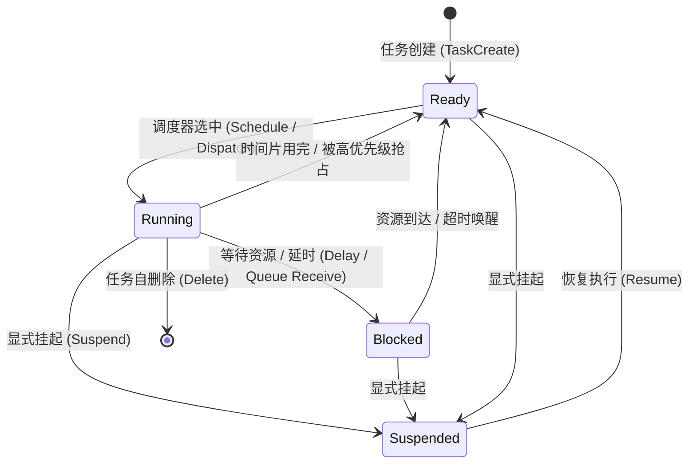
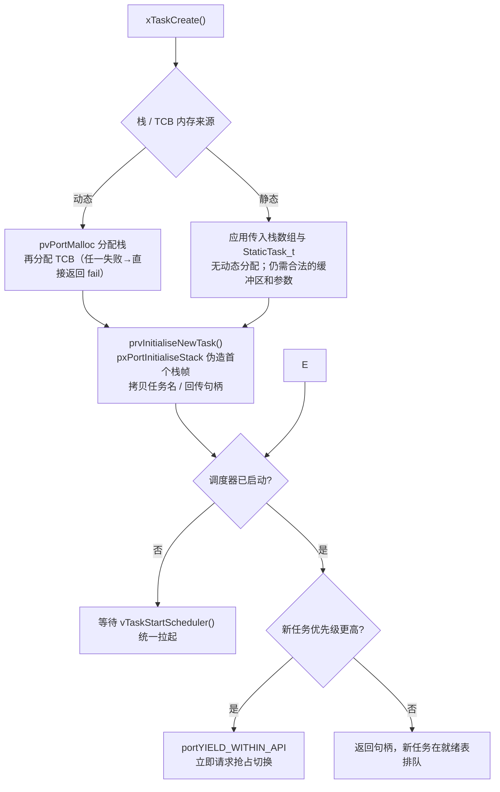
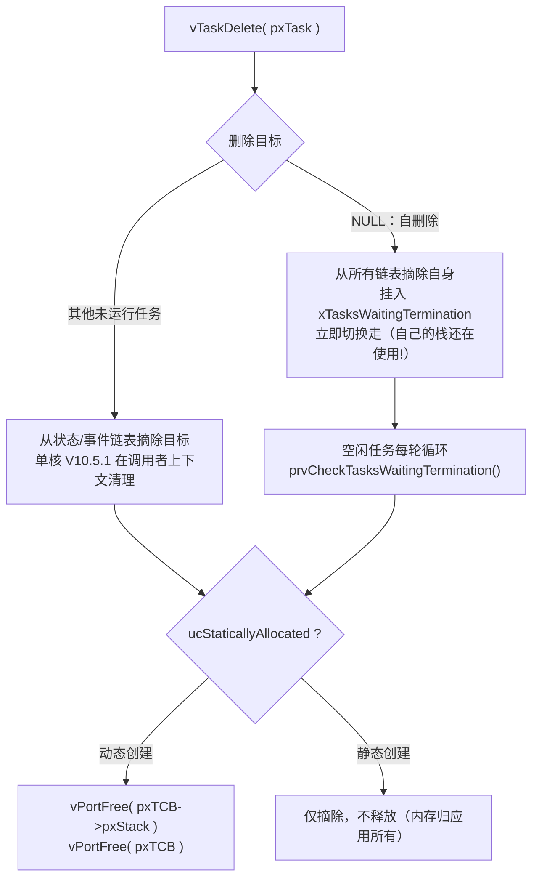
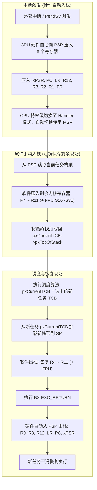

# 任务生命周期与上下文切换

## 1. 任务状态机（Task State Machine）

在标准 RTOS 中，任务（或线程 Thread）的生命周期始终在有限的状态集合中流转。



| 状态 | 特征与行为 | 对应内核链表/容器 |
| :--- | :--- | :--- |
| **Running** | 实际占有 CPU 核心并在流水线上执行指令 | 全局指针（如 `pxCurrentTCB`）直接指向 |
| **Ready** | 一切前置条件就绪，仅等待 CPU 调度切入 | 就绪队列（Ready List / Ready Bitmap） |
| **Blocked** | 正在等待特定时间超时或外设/IPC 事件（信号量、队列、事件标志） | 延时列表（Delayed List）或内核对象等待列表 |
| **Suspended** | 被外界显式挂起，不受超时唤醒影响，直到显式解除 | 挂起列表（Suspended List） |

!!! note
    **带超时阻塞的"双重挂载"**：调用 `xQueueReceive(q, buf, 100)` 的任务会**同时**挂在对象等待链表（`xTasksWaitingToReceive`）与延时列表（`pxDelayedTaskList`）上。任一条件先满足（事件到达或超时），内核都会把它从**两张表一并摘除**——这解释了为何超时唤醒不会在对象上残留"幽灵等待者"，也是理解删除任务时"从所有链表完整摘除"这一动作的前提。


---

## 2. 任务控制块（TCB）内存拓扑

任务控制块（Task Control Block, TCB）是内核感知并操纵任务的唯一抽象句柄。为了实现汇编上下文切换的最高性能，**当前堆栈指针（Stack Pointer）必须作为 TCB 结构体的第一个成员**。

```c
/* 依据 FreeRTOS V10.5.1 tasks.c 语义的教学精简版，条件编译字段视内核裁剪而定 */
typedef struct tskTaskControlBlock
{
    volatile StackType_t   *pxTopOfStack;     /* [偏移量 0] 栈顶指针，上下文切换汇编入口极速存取 */

    #if ( portUSING_MPU_WRAPPERS == 1 )
    xMPU_SETTINGS           xMPUSettings;     /* MPU 区域配置（基址、大小、权限属性） */
    #endif

    ListItem_t              xStateListItem;   /* 状态链表节点：就绪 / 延时 / 挂起 */
    ListItem_t              xEventListItem;   /* 事件链表节点：队列、信号量、互斥量等待队列 */
    UBaseType_t             uxPriority;       /* 当前优先级（优先级继承时被动态提升） */
    StackType_t             *pxStack;         /* 栈起始地址（水位检测与越界防护基准） */
    char                    pcTaskName[ 16 ]; /* 调试与跟踪名称 */

    #if ( configUSE_MUTEXES == 1 )
    UBaseType_t             uxBasePriority;   /* 基础优先级：继承提升的还原基准 */
    UBaseType_t             uxMutexesHeld;    /* 持锁计数：嵌套继承的降级判定依据 */
    #endif

    #if ( configTASK_NOTIFICATION_ARRAY_ENTRIES > 0 )
    volatile uint32_t       ulNotifiedValue[ configTASK_NOTIFICATION_ARRAY_ENTRIES ];
    volatile uint8_t        ucNotifyState[ configTASK_NOTIFICATION_ARRAY_ENTRIES ];
    #endif

    #if ( portSTACK_GROWTH > 0 )
    StackType_t             *pxEndOfStack;    /* 向上生长栈的边界指针 */
    #endif

    uint8_t                 ucStaticallyAllocated; /* 静态创建标志：idle 回收时决定是否 vPortFree */
} tskTCB;
```

### 2.1 关键字段走读：谁在驱动状态机

| 字段 | 工程语义 | 在生命周期中的角色 |
| :--- | :--- | :--- |
| `pxTopOfStack` | 换栈汇编 `LDR R1, [R0]` 零偏移直取 | 现场保存/恢复的唯一锚点（§5） |
| `xStateListItem` | 同一节点复用于就绪/延时/挂起链表 | Running↔Ready↔Blocked↔Suspended 全部迁移边 |
| `xEventListItem` | 挂入内核对象等待链表，按优先级排序 | 进入/退出 Blocked 的"等什么"维度 |
| `uxPriority` / `uxBasePriority` | 继承提升的当前值与还原基准 | 抢占判定 + 优先级继承（见 [Queue 队列与互斥量继承](../02-FreeRTOS-Deep-Dive/04-queue-internals-semaphore-mutex.md)） |
| `uxMutexesHeld` | 持锁计数 | 释放锁时是否降回基准优先级的判定输入 |
| `ulNotifiedValue[]` / `ucNotifyState[]` | 任务通知的值与状态 | 轻量 IPC，不经过任何内核对象 |
| `ucStaticallyAllocated` | 创建方式标记 | 决定 idle 回收路径是否释放内存（§4） |
| `xMPUSettings` | MPU 区域上下文副本 | 任务级内存隔离的切换载荷 |

!!! tip
    **为何 `pxTopOfStack` 必须在偏移量 0？**
    在 Cortex-M 的上下文切换汇编中，通常先加载 `pxCurrentTCB`，再取出当前任务的栈指针。具体指令和偏移取决于端口实现；阅读汇编时应以对应版本的 `port.c` 和汇编文件为准。


---

## 3. 任务创建全流程：从 `xTaskCreate` 到首次调度



### 3.1 `pxPortInitialiseStack`：凭空伪造一个"从未运行过"的现场

任务从未执行过，何来可恢复的栈帧？答案是内核**手工伪造**一个与真实异常返回完全同构的栈帧，让调度器"恢复现场"后自然落入任务函数入口（教学节选，按 ARM_CM4F 端口语义简化）：

```c
static StackType_t *pxPortInitialiseStack( StackType_t *pxTopOfStack,
                                           TaskFunction_t pxCode,
                                           void *pvParameters )
{
    pxTopOfStack--;                                        /* 保持向下对齐递减 */
    *pxTopOfStack = portINITIAL_XPSR;                      /* xPSR = 0x01000000：Thumb 位必须置 1 */
    pxTopOfStack--;
    *pxTopOfStack = ( ( StackType_t ) pxCode ) & ~0x01UL;  /* PC：任务入口（清最低位，统一 Thumb 地址） */
    pxTopOfStack--;
    *pxTopOfStack = ( StackType_t ) prvTaskExitError;      /* LR：任务函数非法 return 时的陷阱 */
    pxTopOfStack -= 5;                                     /* R12, R3, R2, R1 占位 */
    *pxTopOfStack = ( StackType_t ) pvParameters;          /* R0：任务形参按 ABI 约定传入 */
    pxTopOfStack--;
    *pxTopOfStack = 0xFFFFFFFDUL;                          /* ARM_CM4F 保存的 EXC_RETURN */
    pxTopOfStack -= 8;                                     /* R11 ~ R4 占位 */
    return pxTopOfStack;                                   /* 最终值回写 TCB->pxTopOfStack */
}
```

* **xPSR Thumb 位**：若初始化为 0，首次异常返回即触发 INVSTATE UsageFault——任务一次都跑不进去。
* **R0 传参**：`pvParameters` 借硬件出栈机制恰好落入 AAPCS 的第一形参寄存器。
* **LR = `prvTaskExitError`**：任务函数**永不 return**，合法退出只有 `vTaskDelete(NULL)`；直接 `return` 落入断言陷阱。

---

## 4. 任务删除与僵尸回收：`vTaskDelete` 的延迟清理



* **为什么必须延迟回收**：自删除的任务绝不能释放自己**正在其上运行**的栈；且 heap 的相邻块合并操作也不适合放在中断退出路径里执行。空闲任务是唯一保证不持有任何被删任务栈/TCB 引用的安全上下文。
* **回收吞吐有限**：空闲任务的清理函数循环处理待清理任务；短时间内批量删除会积压在 `xTasksWaitingTermination` 中，依赖 `uxDeletedTasksWaitingCleanUp` 计数逐步清零。

!!! warning
    **删除持锁任务 = 经典事故源**：
    1. 任务持有互斥量时被删除，内核**不会**代为释放锁——锁将永久保持占用状态，所有等待者无限阻塞；
    2. 应用层散落的任务句柄立即悬空（use-after-free），故障可能在删除后很久才显形。
    工程铁律：**删除前确保任务不持锁、外部无残留句柄引用**；高频创建/删除的业务改用常驻任务 + 命令队列。


---

## 5. 硬件双栈机制与上下文切换全流程

现代嵌入式架构（以 ARM Cortex-M 为代表）在硬件级别将堆栈解耦为两个独立指针：
- **MSP（Main Stack Pointer）**：主堆栈指针，由操作系统内核与中断服务程序（ISR / Exception）共享使用。
- **PSP（Process Stack Pointer）**：进程堆栈指针，由各个独立的用户任务独享。



### 5.1 栈帧（Stack Frame）物理内存排布

当任务发生切换并在内存中休眠时，其私有栈从高地址向低地址生长的完整内存镜像如下：

| 内存相对位置 | 寄存器分类 | 压栈操纵方 | 内容与含义 |
| :--- | :--- | :--- | :--- |
| **高地址（初始栈底）** | xPSR | **硬件（Hardware）** | 程序状态寄存器（Thumb 位、中断状态） |
|  | PC (R15) | **硬件** | 任务下一次被唤醒时执行的指令地址 |
|  | LR (R14) | **硬件** | 任务内部的子函数返回链接地址 |
|  | R12 | **硬件** | 通用内部暂存寄存器 |
|  | R3 ~ R0 | **硬件** | 函数入参及通用调用者保存寄存器（Caller-Saved） |
| **中间地址** | *FPU S16~S31* | *可选* | 若使能浮点单元，根据 Lazy Stacking 压入 |
|  | R11 ~ R4 | **软件（Software）** | 被调用者保存寄存器（Callee-Saved），由汇编指令压入 |
| **低地址（当前栈顶）** | **pxTopOfStack** | — | 当前保存在 `pxTopOfStack` 中的指针数值 |

!!! note
    §3.1 的伪造栈帧与上表**逐项同构**——这正是"新建任务的首次调度"与"老任务的现场恢复"能复用同一段 PendSV 汇编的根本原因：内核从不特殊对待新任务，只认 `pxTopOfStack` 指向的栈帧形状。


---

## 6. 栈溢出（Stack Overflow）的三种防御层级

1. **编译期静态栈分析（Static Stack Usage Analysis）**：
   使用 GCC 编译参数 `-fstack-usage`，由编译器导出每个函数局部变量的最大调用消耗，并由链接脚本生成调用图上限。无法直接计算深层递归或中断嵌套。
2. **内核软件水印探测（Watermark Checking）**：
   * **方法一**：在切换任务时检查 `pxTopOfStack <= pxStack`（栈指针是否已跌出下界）。
   * **方法二（Magic Pattern）**：在栈底保留 16~32 字节并预填充魔数（如 `0xA5A5A5A5`），切换时如果发现魔数被破坏，立即触发 `vApplicationStackOverflowHook`。
3. **硬件 MPU 边界隔离（Hardware Guard Region）**：
   利用 ARM Cortex-M MPU，将每个任务私有栈底前 32 字节配置为"不可读写无访问权限（No Access）"。当指针触碰栈底瞬间，硬件立刻触发 **MemManage Fault**，实现零延迟就地捕获。

三种手段的取舍矩阵与栈尺寸确定方法学详见 [内存模型与保护机制](05-memory-management-safety.md)。

---

## 7. 微架构跨平台对照：ARM Cortex-M vs RISC-V RVKernel

| 架构特性 | ARM Cortex-M (FreeRTOS 方案) | RISC-V 32 (RVKernel 实验方案) |
| :--- | :--- | :--- |
| **硬件双栈解耦** | 硬件提供专用 **MSP** (Handler态) 与 **PSP** (线程态) | 仅单物理 SP，依靠 **`sscratch`** 寄存器在汇编入口执行原子交换 |
| **异常进入压栈** | **硬件自动压入** 8 个 Caller 寄存器 (xPSR, PC, LR, R0-R3, R12) | **硬件零自动压栈**，仅更新 `sepc` / `scause`，由软件统一压入 144 字节 `trap_frame` |
| **协作式调度换栈** | 依然触发 PendSV 异常完成完整现场出入栈 | 直接通过 `switch_context` 仅压入 14 个 Callee 寄存器 (`ra, sp, s0-s11`)，耗时减半 |
| **特权隔离机制** | 特权模式 (Privileged) vs 非特权模式 (Unprivileged) + MPU 物理切分 | **S-Mode** (内核态) vs **U-Mode** (用户态) + **Sv32** 虚拟内存二级页表隔离 |
| **动手实践入口** | [FreeRTOS PendSV 汇编现场切换](../02-FreeRTOS-Deep-Dive/03-context-switch-pendsv-assembly.md) | [RVKernel Lab 01 & 02: 启动与换栈实操](../Labs/lab01-rv32-boot-trap-paging.md) |

---

## 8. 现场排查：创建 / 运行 / 删除的典型事故树

1. **任务创建成功但从不运行**：
   * 优先级配错方向或被 `configMAX_PRIORITIES` 上限截断（开 `configASSERT` 即拦）；
   * 被某处遗漏的 `vTaskSuspend()` 挂起，或 Resume 条件从未到达；
   * `main()` 里创建完就原地死循环等它跑——`vTaskStartScheduler()` 根本没执行。
   * 手段：`uxTaskGetSystemState()` 快照核对每个任务的状态、优先级与高水位。
2. **创建即 HardFault**：
   * `pvPortMalloc` 失败未判 NULL（栈或 TCB 空指针直接解引用）；
   * 任务栈未按 8 字节对齐（静态数组加 `__attribute__((aligned(8)))`）；
   * 任务函数签名不是 `void (*)(void *)`，形参错位引发野指针。
   * 手段：开 malloc failed hook + 断言；从故障栈帧的 PC/LR 反查 `addr2line`。
3. **删除后偶发崩溃（时间上远滞后于删除点）**：
   * 悬空句柄 use-after-free——全代码检索句柄是否逃逸出创建作用域；
   * 被删任务持互斥量——锁永久占用，下游连环超时（§4 WARNING）；
   * 终止链表未消化前句柄被复用——旧 TCB 内存随后被 idle 释放。
   * 手段：删除后加观察期再压测；对释放内存打魔数标记，捕获"死后写入"。
