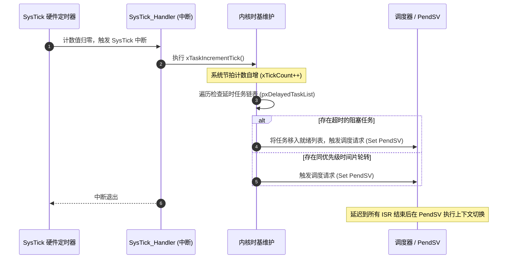
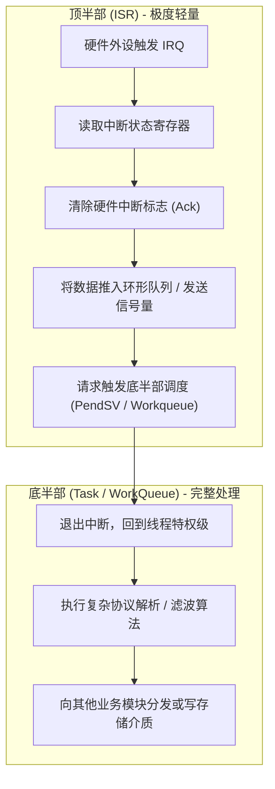
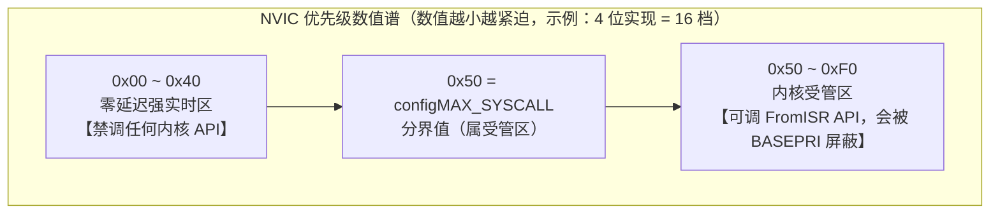

# 中断体系与临界区保护

## 1. SysTick 与系统时间基准

实时操作系统必须依赖一个精准的周期性硬件定时器提供时基（Tick Timebase）。在 ARM Cortex-M 体系中，通常直接绑定内核自带的 **SysTick** 定时器。



* **Tick Rate 权衡**：
  * **1000 Hz (1ms)**：时间精度高，超时响应快；但每秒产生 1000 次中断和调度开销，对于低功耗微控制器（MCU）较为耗电。
  * **100 Hz (10ms)**：上下文开销极低，节省电池功耗；但时间粒度较粗，无法处理微秒级精度控制。
* **Tickless Idle 机制**：
  当调度器发现就绪列表中除空闲任务（Idle Task）外再无其他就绪任务，且下一个最近的任务唤醒时间在较长的未来（如 200ms 后），内核会**停用周期性 SysTick**，并根据唤醒时间重配一个低功耗定时器（LPTIM）进入深度休眠（Deep Sleep），在预定时间前由中断统一补齐 `xTickCount`。

---

## 2. 中断延迟（Interrupt Latency）的硬件与软件成因

中断延迟定义为：**从外设拉高中断请求线（IRQ Line）到处理器执行中断服务程序（ISR）的第一条有效指令所流逝的物理时间**。

$$\text{Latency}_{\text{total}} = T_{\text{disabled}} + T_{\text{synch}} + T_{\text{arbitration}} + T_{\text{stacking}}$$

```mermaid
gantt
    title 中断延迟时钟周期构成 (Cortex-M)
    dateFormat X
    axisFormat %s
    section 硬件与软件延时
    内核处于临界区 (PRIMASK/BASEPRI 屏蔽) :done, 0, 15
    硬件仲裁与 NVIC 抢占判定              :active, 15, 20
    硬件自动压栈 (xPSR, PC, LR, R0-R3, R12)  :crit, 20, 32
    跳转执行 ISR 第一条指令                 :done, 32, 36
```



1. **$T_{\text{disabled}}$（关中断时长）**：操作系统或用户任务在执行临界区代码时，显式关闭中断的时间。这是中断延迟的最主要和最大波动来源（Jitter 制造者）。
2. **$T_{\text{arbitration}}$（硬件仲裁）**：中断控制器（如 NVIC/GIC/PLIC）对比当前正在运行的优先级与新到达中断的优先级。
3. **$T_{\text{stacking}}$（硬件自动压栈）**：ARM Cortex-M 硬件自动将 8 个核心寄存器（Caller-Saved）推入 PSP/MSP 栈，通常消耗 12 个时钟周期（若开启 FPU 且触发延后压栈 Lazy Stacking，开销有所变化）。
4. **尾链（Tail-Chaining）优化**：当一个 ISR 退出时，若已有同级或低级中断在排队挂起，硬件跳过"出栈再入栈"过程，仅耗费约 6 个时钟周期直接切入下一个 ISR，极大缩减中断间延迟。

### 2.1 NVIC 硬件三连：迟到、尾链与退出路径抢占

| 硬件行为 | 触发场景 | 典型开销（示例值，M3/M4 零等待存储） | 对实时性的意义 |
| :--- | :--- | :--- | :--- |
| **迟到（Late Arrival）** | 正为低优先级中断压栈/取向量时，更高优先级中断到达 | 新中断近乎零额外延迟直接进入（低优先级被打入挂起） | 强实时中断不被"正在进入的"低优先级中断拖累 |
| **尾链（Tail-Chaining）** | ISR 退出瞬间 NVIC 已有挂起中断 | 约 6 周期（省去出栈再入栈，硬件直接换取向量） | 中断背靠背吞吐的关键优化 |
| **退出路径抢占（Pop Preemption）** | ISR 出栈（异常返回）过程中更高优先级中断到达 | 放弃出栈、重新入栈进入新中断 | 保证退出路径上仍不丧失抢占能力 |

!!! note
    这组硬件行为解释了一个工程事实：**NVIC 的中断响应延迟是高度确定的一小段，真正的波动大头永远是软件关中断窗口 $T_{\text{disabled}}$**。压中断延迟的工程主战场在临界区审计（§4），而不是硬件侧。


---

## 3. 中断顶半部与底半部划分

为了最大程度压低 $T_{\text{disabled}}$，RTOS 严禁在 ISR 内部执行长耗时操作（如浮点运算、大块拷贝、阻塞等待锁）。



---

## 4. 临界区保护手段与安全分级

临界区（Critical Section）保护用于防御多任务并发竞争（Race Conditions）以及任务与中断并发读写共享数据结构。

| 保护机制 | 汇编底层指令 | 影响范围 | 开销 | 适用场景 |
| :--- | :--- | :--- | :--- | :--- |
| **关全局中断** | `CPSID i` (设置 PRIMASK = 1) | 屏蔽除 NMI 和 HardFault 外的**所有中断** | 1~2 周期 | 极短代码段（数条指令）、芯片冷启动初期 |
| **中断阈值遮罩** | `MSR BASEPRI, R0` (设置中断屏蔽阈值) | 仅屏蔽优先级低于设定的中断，**高优先级强实时中断不受影响** | 2~4 周期 | FreeRTOS 内核标准临界区实现 |
| **关调度器** | `vTaskSuspendAll()` | **不屏蔽任何硬件中断**，仅禁止任务间上下文切换 | 数十周期 | 长耗时操作且允许中断持续响应的线程级共享 |
| **互斥信号量** | Mutex (带优先级继承) | 仅阻塞尝试获取同一资源的竞争任务 | 涉及调度开销 | 耗时长的外设资源共享（如 SPI/I2C 总线） |

### 4.1 三层屏蔽寄存器对比：PRIMASK / FAULTMASK / BASEPRI

| 寄存器 | 置位 / 清零 | 屏蔽范围 | 对 NMI / HardFault | 典型用途 |
| :--- | :--- | :--- | :--- | :--- |
| **PRIMASK** | `CPSID i` / `CPSIE i` | 全部可屏蔽中断（一刀切） | 均不影响 | 冷启动初期、数条指令的极短临界区 |
| **FAULTMASK** | `CPSID f` / `CPSIE f` | 可屏蔽中断 + HardFault（当前执行优先级视为 -1） | NMI 免疫 | Fault 处理器内防止二次故障嵌套；异常返回时自动清零 |
| **BASEPRI** | `MSR BASEPRI, Rn` | 优先级数值 ≥ 阈值的所有中断（**写 0 = 解除屏蔽**） | 均不影响 | RTOS 内核临界区：屏蔽受管中断，放行强实时中断 |

!!! warning
    **BASEPRI 的两个经典坑**：
    1. **只有写 0 才是"解除屏蔽"**——BASEPRI 本身没有使能位，非零即生效。任何路径残留非零值，受管中断就永远沉默。
    2. **只实现高 `__NVIC_PRIO_BITS` 位**（如 4 位实现仅高半字节有效）——阈值必须左移到高位后写入，未移位的"看似合法值"会屏蔽错误的目标集合。


### 4.2 临界区嵌套计数：`vPortEnterCritical` / `vPortExitCritical`

BASEPRI 硬件不记忆旧值，嵌套保护完全由软件计数承担（教学节选，按 V10.5.1 ARM_CM4F 端口语义）：

```c
void vPortEnterCritical( void )
{
    portDISABLE_INTERRUPTS();       /* 先写 BASEPRI 屏蔽 … */
    uxCriticalNesting++;            /* … 再递增计数：顺序即安全窗口 */
    portMEMORY_BARRIER();           /* dsb + isb：屏蔽生效前的访存不可越界 */
}

void vPortExitCritical( void )
{
    configASSERT( uxCriticalNesting > 0 );
    uxCriticalNesting--;
    if( uxCriticalNesting == 0 )    /* 仅最外层退出时真正解除屏蔽 */
    {
        portENABLE_INTERRUPTS();    /* BASEPRI = 0 */
    }
}
```

* **嵌套语义靠计数**：退出多于进入会触发下溢断言；若断言关闭，则静默解除他人尚未完成的屏蔽——竞态窗口直接打开。
* **临界区铁律**：内部禁止任何可阻塞 API、禁止主动让出。被挂起的任务若带着"未配对的 BASEPRI"切出，屏蔽状态泄漏到整个系统。
* **挂起 PendSV ≠ 立即切换**：临界区内 `portYIELD()` 只悬挂标志，真正的上下文切换发生在 BASEPRI 清零、中断退出之后（尾链进入 PendSV）。

### 4.3 零延迟中断：`configMAX_SYSCALL_INTERRUPT_PRIORITY` 的分区设计



* 内核进入临界区即写 `BASEPRI = 0x50`：数值更大的 0x50~0xF0 档被屏蔽，数值更小的 0x00~0x40 档照常响应。把急停保护、高频电流环采样放进零延迟区，即可获得**完全不受内核临界区影响**的硬件响应权。
* 分界值本身（数值等于阈值）会被 BASEPRI 屏蔽，因此**允许**调用 FromISR API——"会被内核屏蔽"正是 FromISR 安全的前提。

!!! warning
    **两个历史级事故模式**：
    1. `configMAX_SYSCALL_INTERRUPT_PRIORITY` 不可设为 0——BASEPRI = 0 等于永不屏蔽，FromISR 的重入保护彻底失效，内核链表随时可被中断撕裂。
    2. 部分芯片厂商配套代码默认把所有外设中断配成最高优先级 0（数值最小 = 零延迟区），应用照抄后在其中调用 FromISR API 直接崩内核。整改：**所有调用内核 API 的中断必须显式压回受管区**。


* **优先级分组（Priority Grouping）陷阱**：AIRCR.PRIGROUP 将优先级位划分为"抢占组 / 子优先级组"，而**抢占判定与 BASEPRI 屏蔽只对抢占组位生效**。若把全部实现位划给子优先级，任何中断之间都互不抢占，临界区行为变得反直觉——分组必须在系统初始化阶段一次定死并全工程统一。

---

## 5. 现场排查：中断不触发 / 偶发丢失

### 5.1 中断从不触发（完全沉默）

1. **NVIC 使能链**：目标中断在 ISER 中的使能位是否置位（`HAL_NVIC_EnableIRQ` 或等价操作）、执行时序是否早于外设触发；
2. **优先级配置**：优先级数值是否越界（超出实现位宽）；分组设置后抢占组位是否被误清零；
3. **外设侧**：外设自身中断使能位、标志位、GPIO 复用（AF）选择与外部中断映射（如 EXTI 控制器选通）逐级核对；
4. **屏蔽残留**：BASEPRI 残留非零（临界区进出不配对）、PRIMASK 忘开、FAULTMASK 未清；
5. **手段**：直接读 NVIC 的 ISER/ICPR 寄存器快照确认"挂起到没到处理器"；在 ISR 首条指令放计数器或 GPIO 翻转，切分"硬件没送来"还是"软件没执行"。

### 5.2 中断偶发丢失（时有时无）

1. **标志清除过早**：ISR 内先清标志再读数据，清零与读取之间的窗口内新事件直接丢失——核对"读数据 → 再清标志"的顺序；
2. **pending 被误消费**：中断在使能前已挂起，又被初始化代码手动清除；
3. **临界区过长 + 事件无锁存**：电平型、无锁存的外设在屏蔽窗口内的事件彻底消失（对比：边沿挂起型会延后到解除屏蔽再触发）；
4. **子优先级陷阱**：关键中断与长 ISR 被划入同抢占组不同子组——子优先级**不产生抢占**，关键中断只能排队；
5. **手段**：在 ISR 入口打时间戳统计到达间隔，与理论周期比对；将丢失时刻与临界区水印记录做时间相关性分析，即可锁定肇事窗口。
