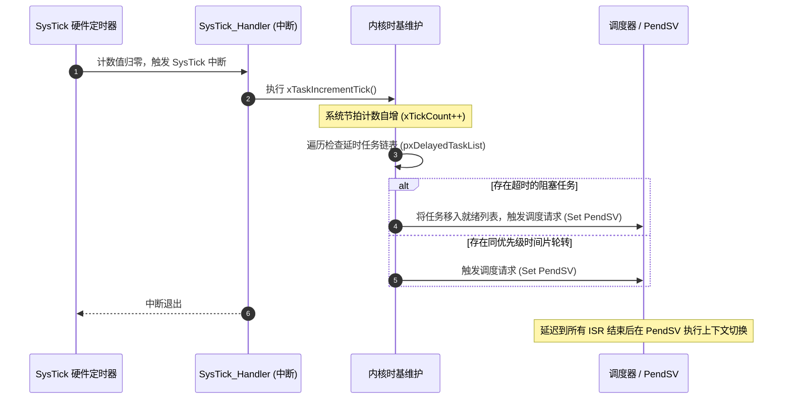
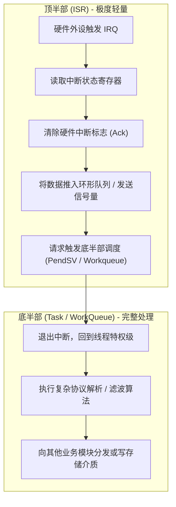

# 中断体系与临界区保护

## 1. SysTick 与系统时间基准

实时操作系统必须依赖一个精准的周期性硬件定时器提供时基（Tick Timebase）。在 ARM Cortex-M 体系中，通常直接绑定内核自带的 **SysTick** 定时器。

* **Tick Rate 权衡**：
  * **1000 Hz (1ms)**：时间精度高，超时响应快；但每秒产生 1000 次中断和调度开销，对于低功耗微控制器（MCU）较为耗电。
  * **100 Hz (10ms)**：上下文开销极低，节省电池功耗；但时间粒度较粗，无法处理微秒级精度控制。
* **Tickless Idle 机制**：
  当调度器发现就绪列表中除空闲任务（Idle Task）外再无其他就绪任务，且下一个最近的任务唤醒时间在较长的未来（如 200ms 后），内核会**停用周期性 SysTick**，并根据唤醒时间重配一个低功耗定时器（LPTIM）进入深度休眠（Deep Sleep），在预定时间前由中断统一补齐 `xTickCount`。

---

## 2. 中断延迟（Interrupt Latency）的硬件与软件成因

中断延迟定义为：**从外设拉高中断请求线（IRQ Line）到处理器执行中断服务程序（ISR）的第一条有效指令所流逝的物理时间**。

$$\text{Latency}_{\text{total}} = T_{\text{disabled}} + T_{\text{synch}} + T_{\text{arbitration}} + T_{\text{stacking}}$$

```mermaid
gantt
    title 中断延迟时钟周期构成 (Cortex-M)
    dateFormat X
    axisFormat %s
    section 硬件与软件延时
    内核处于临界区 (PRIMASK/BASEPRI 屏蔽) :done, 0, 15
    硬件仲裁与 NVIC 抢占判定              :active, 15, 20
    硬件自动压栈 (xPSR, PC, LR, R0-R3, R12)  :crit, 20, 32
    跳转执行 ISR 第一条指令                 :done, 32, 36
```

1. **$T_{\text{disabled}}$（关中断时长）**：操作系统或用户任务在执行临界区代码时，显式关闭中断的时间。这是中断延迟的最主要和最大波动来源（Jitter 制造者）。
2. **$T_{\text{arbitration}}$（硬件仲裁）**：中断控制器（如 NVIC/GIC/PLIC）对比当前正在运行的优先级与新到达中断的优先级。
3. **$T_{\text{stacking}}$（硬件自动压栈）**：ARM Cortex-M 硬件自动将 8 个核心寄存器（Caller-Saved）推入 PSP/MSP 栈，通常消耗 12 个时钟周期（若开启 FPU 且触发延后压栈 Lazy Stacking，开销有所变化）。
4. **尾链（Tail-Chaining）优化**：当一个 ISR 退出时，若已有同级或低级中断在排队挂起，硬件跳过“出栈再入栈”过程，仅耗费约 6 个时钟周期直接切入下一个 ISR，极大缩减中断间延迟。

---

## 3. 中断顶半部与底半部划分

为了最大程度压低 $T_{\text{disabled}}$，RTOS 严禁在 ISR 内部执行长耗时操作（如浮点运算、大块拷贝、阻塞等待锁）。

---

## 4. 临界区保护手段与安全分级

临界区（Critical Section）保护用于防御多任务并发竞争（Race Conditions）以及任务与中断并发读写共享数据结构。

| 保护机制 | 汇编底层指令 | 影响范围 | 开销 | 适用场景 |
| :--- | :--- | :--- | :--- | :--- |
| **关全局中断** | `CPSID i` (设置 PRIMASK = 1) | 屏蔽除 NMI 和 HardFault 外的**所有中断** | 1~2 周期 | 极短代码段（数条指令）、芯片冷启动初期 |
| **中断阈值遮罩** | `MSR BASEPRI, R0` (设置中断屏蔽阈值) | 仅屏蔽优先级低于设定的中断，**高优先级强实时中断不受影响** | 2~4 周期 | FreeRTOS 内核标准临界区实现 |
| **关调度器** | `vTaskSuspendAll()` | **不屏蔽任何硬件中断**，仅禁止任务间上下文切换 | 数十周期 | 长耗时操作且允许中断持续响应的线程级共享 |
| **互斥信号量** | Mutex (带优先级继承) | 仅阻塞尝试获取同一资源的竞争任务 | 涉及调度开销 | 耗时长的外设资源共享（如 SPI/I2C 总线） |

> [!WARNING]
> **绝对禁止在中断服务程序（ISR）中调用会引起阻塞的 API！**  
> 中断上下文（Interrupt Context）没有独立的 TCB，没有任务阻塞状态，更无法在等待资源时挂起自身。在 ISR 中调用类似 `vTaskDelay()` 或 `xQueueReceive(..., portMAX_DELAY)` 会直接导致内核数据结构崩溃或系统死锁。
