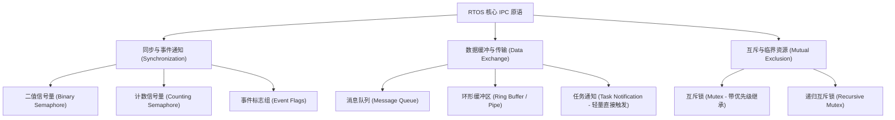
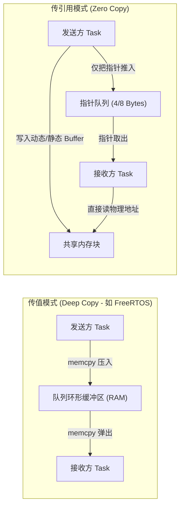
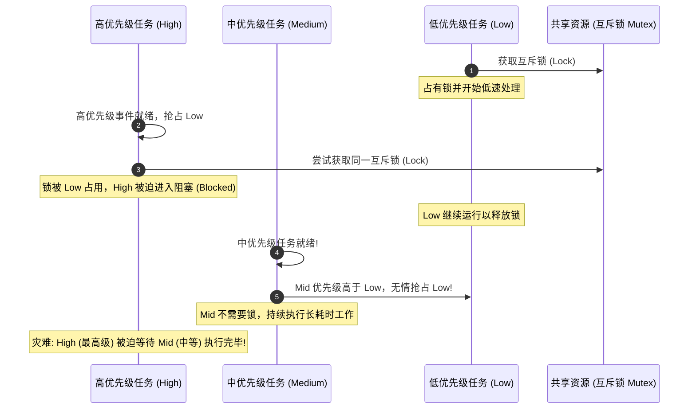
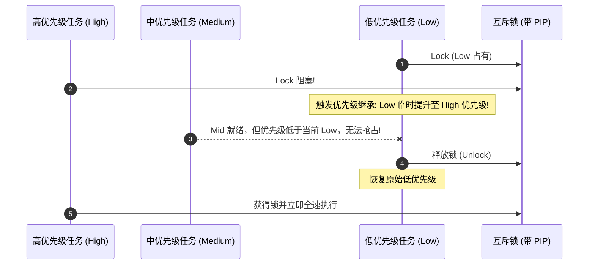
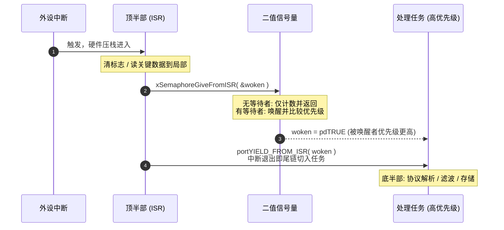

# IPC 通信与同步机制

## 1. 进程间通信（IPC）原语拓扑

在实时操作系统中，任务之间并非孤立运行，必须具备确定性的数据交换与协作同步机制。



---

## 2. 消息队列（Message Queue）底层设计

消息队列是线程安全、遵循先进先出（FIFO，亦支持 LIFO 紧急插队）的双向解耦容器。

### 2.1 传值（By Value） vs 传引用（By Pointer）



* **传值模式优点**：发送方在 `enqueue` 之后可以立即复用局部变量或修改源数据，无需担心并发脏读问题；对于 1~16 字节的小数据（如按键事件、ADC 采样值）效率极高。
* **传引用模式优点**：传输图像帧、音频流、网络数据包等大块内存时，零拷贝避免了昂贵的 CPU 拷贝消耗；**必须严格管理 Buffer 所有权**，通常结合引用计数或内存池（Memory Pool）。

---

## 3. IPC 原语选择矩阵

面向"事件通知 / 数据搬运 / 资源互斥"三类需求，**选错原语是实时缺陷的头号来源**（把信号量当互斥锁用 → 优先级反转；把互斥量当事件用 → ISR 里直接违规）：

| 原语 | 唤醒能力 | ISR 中可用性 | 优先级继承 | 携带数据 | 典型用途 |
| :--- | :--- | :--- | :--- | :--- | :--- |
| **消息队列** | 多生产者 / 多消费者 | 发送有 FromISR 变体 | ✗ | 值拷贝（uxItemSize 字节） | 跨任务结构化数据流 |
| **二值信号量** | 单令牌，唤醒一个等待者 | Give / Take 的 FromISR 版本均可用（不等待） | ✗ | ✗ | ISR→任务事件、任务间一次性同步 |
| **计数信号量** | 多令牌累计 | Give / Take 的 FromISR 版本均可用（不等待） | ✗ | ✗ | 资源池计数、事件计数 |
| **互斥量** | 单持有者，多等待者 | **完全禁止** | ✓ | ✗ | 共享资源互斥（临界区保护） |
| **递归互斥量** | 同一持有者可重复加锁 | **完全禁止** | ✓ | ✗ | 同任务多层调用复用进入 |
| **事件组** | 多任务等待同一组位 | Set ✓ | ✗ | 布尔位组（典型 8/24 位可用） | 多条件组合等待、多任务汇合 |
| **任务通知** | **严格单目标**任务 | Notify ✓ | ✗ | 32 位值 + 通知状态 | 最轻量的事件/数据直发 |

!!! tip
    **选型口诀**：传数据用队列；ISR 报信用二值/计数信号量；护资源用互斥量；多条件组合用事件组；单目标任务直发用任务通知（路径最短、开销最低，见 [任务通知、事件组与软件定时器](../02-FreeRTOS-Deep-Dive/07-task-notifications-event-groups-timers.md)）。


---

## 4. 致命的"优先级反转"（Priority Inversion）

优先级反转是所有抢占式实时系统中最臭名昭著的隐形杀手（曾在 1997 年导致 NASA 火星探路者火星车频繁死机重启）。

### 4.1 发生机理



由于中优先级任务（Medium）完全不需要锁，它不断抢占占用锁的低优先级任务（Low），导致低优先级任务无法执行并释放锁。最终结果是：**系统最高优先级的关键任务（High）被低优先级任务阻塞，而阻塞时长完全由毫不相干的中优先级任务（Medium）决定，导致高优先级任务的阻塞时间难以限定。**

---

## 5. 优先级反转的工程解法

### 5.1 优先级继承协议（PIP, Priority Inheritance Protocol）

* **机制**：当高优先级任务 $T_{\text{high}}$ 在请求互斥锁被 $T_{\text{low}}$ 阻塞时，内核**动态临时将 $T_{\text{low}}$ 的优先级提升至与 $T_{\text{high}}$ 相同**。
* **效果**：此时中优先级任务 $T_{\text{mid}}$ 无法再抢占 $T_{\text{low}}$。$T_{\text{low}}$ 得以全速完成临界区操作，一旦其释放互斥锁，内核立即将其恢复为原有的低优先级，并瞬间唤醒 $T_{\text{high}}$。



### 5.2 优先级天花板协议（PCP, Priority Ceiling Protocol）

* **机制**：在系统设计期，为每个共享资源赋予一个静态的"优先级天花板"（等于可能访问该资源的最高任务优先级）。当任何任务成功获得该锁时，其优先级立即升至该天花板。
* **协议区别**：上面描述的是立即天花板协议（ICPP）。原始 PCP 还要求请求者当前优先级高于其他任务已持资源形成的系统天花板，并在阻塞时使用继承。满足单核、资源访问和嵌套等协议前提时，才有防死锁和单次阻塞界。
* **代价**：即使没有高优先级任务来争抢，占有锁的任务也会被无差别提升优先级，降低了系统调度的平滑度。

### 5.3 栈资源策略（SRP, Stack Resource Protocol）

* **机制**：每个资源同样携带静态天花板，内核维护"系统天花板"（已锁资源天花板的最大值）；任务仅当其优先级**严格高于**系统天花板时才被允许**开始执行**——阻塞被移到作业启动之前，而非运行途中。
* **效果**：作业一旦投入运行就不再被任何资源阻塞；免死锁、$B_i$ 可静态界定、运行时判定极简。
* **代价**：需要离线的静态资源预算与可预测的任务集（不适合动态创建任务的通用系统），多见于学术界与航空电子内核。

### 5.4 三协议横向对比

| 协议 | 提升时机 | 死锁免疫 | 最坏阻塞 $B_i$ | 实现代价 |
| :--- | :--- | :--- | :--- | :--- |
| **PI（优先级继承）** | 阻塞发生时动态提升持有者 | ✗ 嵌套锁仍可形成环路死锁 | 可达多条临界区链 | 中：维护持有者与还原逻辑 |
| **PCP（优先级天花板）** | 加锁瞬间升至资源天花板 | ✓ | 单个临界区 | 中高：静态天花板表 + 系统天花板维护 |
| **SRP（栈资源策略）** | 作业启动前判定可运行性 | ✓ | 单个临界区 | 低（运行时）+ 高（离线预算约束） |

---

## 6. 信号量（Semaphore） vs 互斥锁（Mutex）的底层差异

许多初学者常将"二值信号量"误当互斥锁使用，在工业安全开发中这是严重违规：

| 特性 | 二值信号量 (Binary Semaphore) | 互斥锁 (Mutex) |
| :--- | :--- | :--- |
| **设计初衷** | **事件通知 / 同步**（1 对 1 或中断对任务） | **临界资源互斥访问**（保护共享数据） |
| **所有权 (Ownership)** | **无所有权概念**。任务 A 获取，可由任务 B 或中断释放 | **严格拥有所有权**。哪个任务加锁，必须由该任务解锁 |
| **中断中使用** | 可在 ISR 中安全 Give 信号量唤醒任务 | **绝对禁止在 ISR 中使用**（无法做优先级继承） |
| **反转保护** | **无**优先级继承机制 | **强制集成**优先级继承或天花板协议 |
| **递归上锁** | 不支持递归调用 | 通常支持递归锁（Recursive Mutex） |

---

## 7. ISR → 任务事件通知的标准范式



```c
/* ISR→任务事件的标准三步式（教育示例） */
void GPIO_IRQHandler( void )
{
    BaseType_t xHigherPriorityTaskWoken = pdFALSE;

    /* 1. 顶半部: 清硬件标志, 必要时取走数据 */

    /* 2. 释放二值信号量通知任务（不可用互斥量!） */
    xSemaphoreGiveFromISR( xEventSem, &xHigherPriorityTaskWoken );

    /* 3. 若唤醒了更高优先级任务, 退出中断立即切换（尾链进 PendSV） */
    portYIELD_FROM_ISR( xHigherPriorityTaskWoken );
}
```

!!! note
    **互斥量为何绝不能出现在 ISR**：优先级继承与所有权语义都以任务 TCB 为主体——中断上下文没有 TCB、没有阻塞态、没有"持有者"可言。ISR 中操作互斥量轻则被断言拦截，重则内核链表损坏。ISR→任务方向常用原语包括：二值/计数信号量 Give、队列 FromISR 发送、事件组 Set、任务通知 Notify。


---

## 8. 现场排查：IPC 类故障的定位顺序

1. **疑似 IPC 死锁**：多任务同时"卡死"但调度器与中断仍活着 → 用 `uxTaskGetSystemState()` / 队列等待链表 dump，绘制"任务 → 等待资源"有向图找环；重点核查两任务是否以相反顺序各持一把互斥量（PI 不防死锁，见 §5.4）。
2. **高优先级任务周期性抖动**：示波器定位抖动窗口 → 核查窗口内低优先级任务是否恰在持锁；确认共享资源用的是互斥量而非二值信号量（隐式反转）；排查该窗口内是否存在中优先级长任务。
3. **信号量泄漏（give/take 不配对）**：计数只增不减或长期归零卡死 → 审计所有提前 return / 错误分支是否漏 give；比对 ISR give 速率与任务 take 吞吐（队列深度 vs 消费 WCET）。
4. **队列满/空阻塞雪崩**：发送方阻塞引发上游连锁超时 → 检查队列深度设计与消费端 WCET；核查是否误用 `portMAX_DELAY` 把问题静默化（改为有限超时 + 超时监控告警）。
