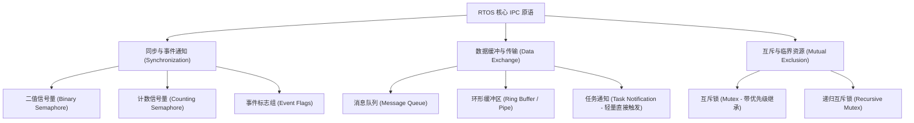
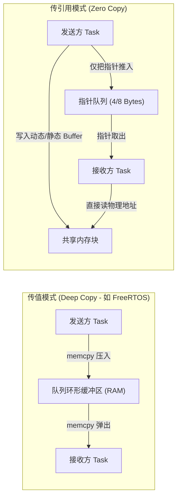
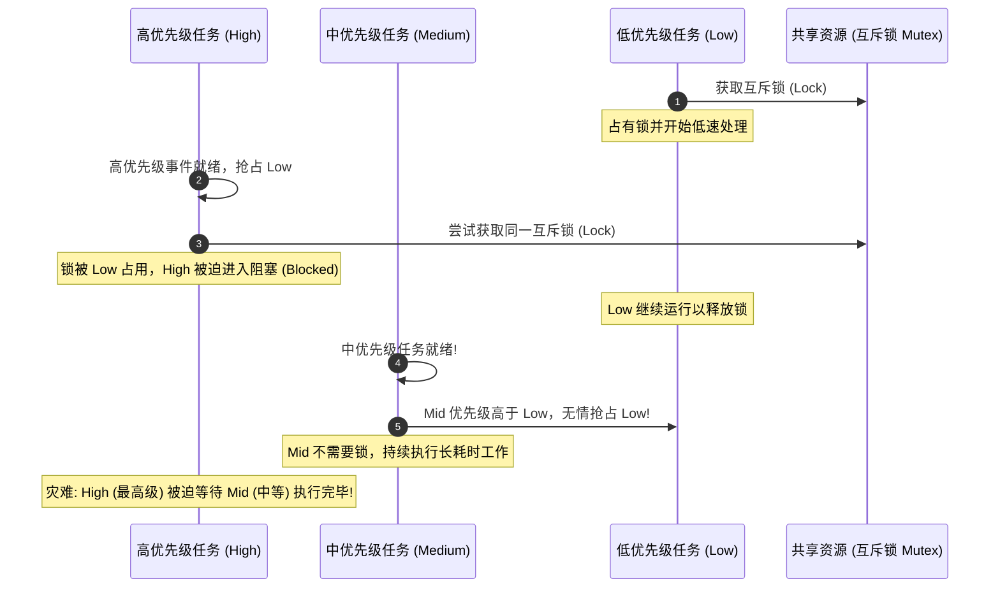
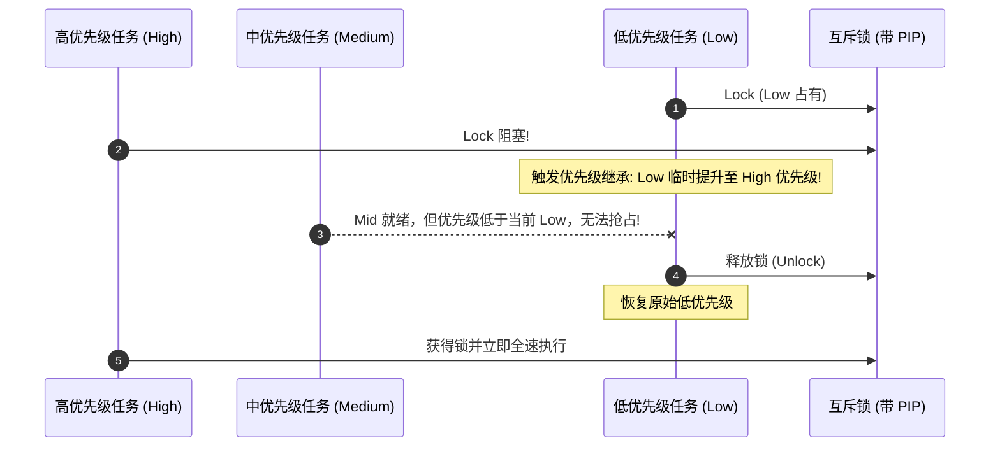

# IPC 通信与同步机制

## 1. 进程间通信（IPC）原语拓扑

在实时操作系统中，任务之间并非孤立运行，必须具备确定性的数据交换与协作同步机制。

---

## 2. 消息队列（Message Queue）底层设计

消息队列是线程安全、遵循先进先出（FIFO，亦支持 LIFO 紧急插队）的双向解耦容器。

### 2.1 传值（By Value） vs 传引用（By Pointer）

* **传值模式优点**：发送方在 `enqueue` 之后可以立即复用局部变量或修改源数据，无需担心并发脏读问题；对于 1~16 字节的小数据（如按键事件、ADC 采样值）效率极高。
* **传引用模式优点**：传输图像帧、音频流、网络数据包等大块内存时，零拷贝避免了昂贵的 CPU 拷贝消耗；**必须严格管理 Buffer 所有权**，通常结合引用计数或内存池（Memory Pool）。

---

## 3. 致命的“优先级反转”（Priority Inversion）

优先级反转是所有抢占式实时系统中最臭名昭著的隐形杀手（曾在 1997 年导致 NASA 火星探路者火星车频繁死机重启）。

### 3.1 发生机理

由于中优先级任务（Medium）完全不需要锁，它不断抢占占用锁的低优先级任务（Low），导致低优先级任务无法执行并释放锁。最终结果是：**系统最高优先级的关键任务（High）被低优先级任务阻塞，而阻塞时长完全由毫不相干的中优先级任务（Medium）决定，导致高优先级任务的阻塞时间难以限定。**

---

## 4. 优先级反转的工程解法

### 4.1 优先级继承协议（PIP, Priority Inheritance Protocol）

* **机制**：当高优先级任务 $T_{\text{high}}$ 在请求互斥锁被 $T_{\text{low}}$ 阻塞时，内核**动态临时将 $T_{\text{low}}$ 的优先级提升至与 $T_{\text{high}}$ 相同**。
* **效果**：此时中优先级任务 $T_{\text{mid}}$ 无法再抢占 $T_{\text{low}}$。$T_{\text{low}}$ 得以全速完成临界区操作，一旦其释放互斥锁，内核立即将其恢复为原有的低优先级，并瞬间唤醒 $T_{\text{high}}$。

### 4.2 优先级天花板协议（PCP, Priority Ceiling Protocol）

* **机制**：在系统设计期，为每个共享资源赋予一个静态的“优先级天花板”（等于可能访问该资源的最高任务优先级）。当任何任务成功获得该锁时，其优先级立即升至该天花板。
* **优点**：在满足协议前提时，可避免多锁嵌套带来的死锁（Deadlock），并将最坏阻塞时间限制在单个临界区内。
* **代价**：即使没有高优先级任务来争抢，占有锁的任务也会被无差别提升优先级，降低了系统调度的平滑度。

### 4.3 信号量（Semaphore） vs 互斥锁（Mutex）的底层差异

许多初学者常将“二值信号量”误当互斥锁使用，在工业安全开发中这是严重违规：

| 特性 | 二值信号量 (Binary Semaphore) | 互斥锁 (Mutex) |
| :--- | :--- | :--- |
| **设计初衷** | **事件通知 / 同步**（1 对 1 或中断对任务） | **临界资源互斥访问**（保护共享数据） |
| **所有权 (Ownership)** | **无所有权概念**。任务 A 获取，可由任务 B 或中断释放 | **严格拥有所有权**。哪个任务加锁，必须由该任务解锁 |
| **中断中使用** | 可在 ISR 中安全 Give 信号量唤醒任务 | **绝对禁止在 ISR 中使用**（无法做优先级继承） |
| **反转保护** | **无**优先级继承机制 | **强制集成**优先级继承或天花板协议 |
| **递归上锁** | 不支持递归调用 | 通常支持递归锁（Recursive Mutex） |
