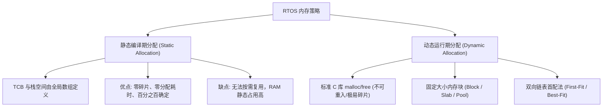
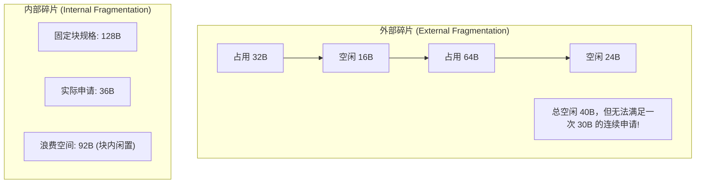
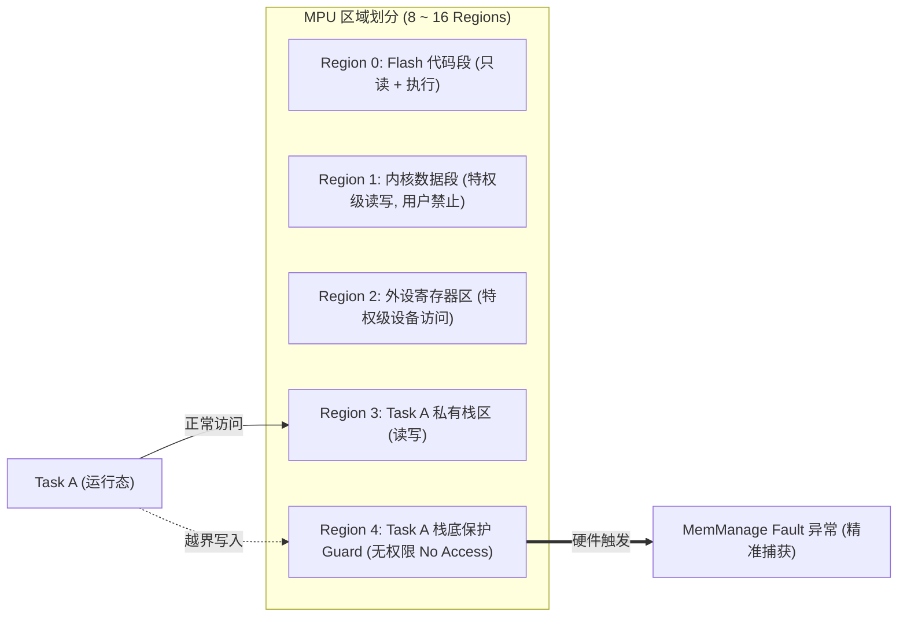

# 内存模型与保护机制

## 1. 嵌入式系统的内存严苛现实

在桌面或服务器 Linux 系统中，有虚拟内存（MMU）、4KB 分页机制与数十 GB 的物理 DDR 支撑，`malloc()` 导致的碎片可通过页置换或重启解决。

但在资源受限的嵌入式 RTOS 环境中：
1. **RAM 容量极小**：通常仅有数十 KB 到数 MB（如 STM32F4 具有 192KB SRAM）。
2. **通常没有 MMU**：所有任务、中断、内核共处同一物理扁平地址空间。
3. **长期无故障运行要求**：工业控制器、医疗输液泵、航天器需 7×24 小时连续运行数月乃至数年，**任何一次内存分配失败（OOM）都可能直接导致致命死机**。

---

## 2. 静态分配 vs 动态分配



### 2.1 MISRA C 与航天标准对动态内存的禁令

在车规 ISO 26262、航天 DO-178C 以及 MISRA-C 规范中，**强烈建议甚至强制禁止在系统进入主循环后调用通用动态内存分配（Dynamic Memory Allocation）**。
* **规避原则**：在 `main()` 函数初始化阶段将所有任务栈、消息队列、信号量静态或半静态分配完毕，系统启动调度器后不再进行任何 `free()` 和重新 `malloc()`。

### 2.2 静态分配 API 体系与认证动机

以 FreeRTOS 为例，开启 `configSUPPORT_STATIC_ALLOCATION = 1` 后可获得**全静态**创建路径：

```c
/* 全静态创建: 编译期定死一切, 零运行期分配 */
StaticTask_t  xTaskBuffer;                  /* 应用提供 TCB 存储 */
StackType_t   xStack[ 256 ];                /* 应用提供栈空间 */

TaskHandle_t h = xTaskCreateStatic( vMyTask, "my", 256, NULL,
                                     uxPriority, xStack, &xTaskBuffer );
```

* 注意：**idle 任务与软件定时器守护任务的内存也必须由应用供给**——内核通过强制实现的回调索取：

```c
void vApplicationGetIdleTaskMemory( StaticTask_t **ppxIdleTaskTCBBuffer,
                                    StackType_t **ppxIdleTaskStackBuffer,
                                    uint32_t     *pulIdleTaskStackSize );
/* 类似地: vApplicationGetTimerTaskMemory() 供给定时器守护任务 */
```

* **认证视角（为什么功能安全审计偏爱全静态）**：
  1. 运行期不存在"分配失败"这条不可达路径，错误分支可从验证范围中整体剔除；
  2. 内存布局更容易审计，但 WCET 仍需分析，任务栈地址可静态审计；
  3. 避免通用堆的外部碎片演化；不能据此豁免长时间运行测试；
  4. 所有内存在 map 文件中一一可见，可检查静态区间与重叠；运行期越界仍需其他检查。

---

## 3. 内存碎片（Fragmentation）分类与防治



### 3.1 内存池算法（Memory Pool / Slab Allocator）

* **原理**：预先开辟若干组固定尺寸的内存块链表（如 32B 规格池、128B 规格池、512B 规格池）。
* **时间复杂度**：从单向空闲链表取出一个空闲块仅需一次指针解引用，**耗时严格为 $O(1)$**。
* **优点**：**完全消除外部碎片**，分配与释放速度极快且完全确定。

### 3.2 链表堆 vs 固定块池：确定性对比

| 维度 | 链表堆（First/Best-Fit） | 固定块池（Slab / Pool） |
| :--- | :--- | :--- |
| **分配时间** | $O(n)$，随空闲链长度波动 | $O(1)$，严格确定 |
| **释放时间** | 含合并与按序插入定位，波动 | $O(1)$ |
| **碎片形态** | 外部碎片，长期运行持续演化 | 仅内部碎片（块规格浪费） |
| **失败模式** | "总量够、连续不够"的渐进恶化 | 规格耗尽，一次性且明确 |
| **适用对象** | 生命周期各异、尺寸不可枚举 | 数量可预估的定长对象（帧、报文、TCB） |
| **工程惯例** | 启动期集中分配、运行期不 free | 通信帧池、DMA 描述符池、协议报文池 |

---

## 4. 栈尺寸确定方法学

### 4.1 最坏深度估算法

$$S_{\text{worst}} = \underbrace{\max_{\text{调用路径}}\sum S_{\text{frame}}}_{\text{任务最深调用链}} \; + \; N_{\text{嵌套}} \times \underbrace{( S_{\text{硬件帧}} + S_{\text{ISR 软件}} )}_{\text{每级中断栈}} \; + \; S_{\text{FPU}} + S_{\text{margin}}$$

* **任务侧**：`-fstack-usage` 导出逐函数栈消耗，沿调用图求最长链；函数指针与递归必须人工给出上界（工具无法封闭）。
* **中断侧**：硬件自动帧 32B（无 FPU 扩展的示例值）+ ISR 自身软件帧与局部变量，乘以**最坏嵌套深度**——嵌套深度可由"优先级谱中高于自身的档数"静态推出（见 [中断体系与临界区保护](03-interrupt-systick-critical-section.md)）。
* **余量**：在计算值上再追加 25%~50%（示例值），覆盖库函数深层调用、断言与日志路径。

### 4.2 高水位标记（High-Water Mark）：原理与局限

```c
UBaseType_t uxLeft = uxTaskGetStackHighWaterMark( xTaskHandle );
/* 返回值 = 从栈底起、历史上从未被写过的最小字数（即最深触底后的剩余余量） */
```

* **原理**：任务创建时内核以 `0xA5A5A5A5` 魔数填充整个栈（教学口径：`tskSTACK_FILL_BYTE`）；运行期从栈底向上扫描**首个非魔数字**，即历史最深处。
* **局限（必须警惕）**：
  1. 它是**下界**——只记录"已经发生过"的最深路径，未覆盖的工况与分支永远看不到；
  2. 保留的填充值可记录短暂写入，不因晚读而消失；但只移动栈指针、未写入的空间可能使读数偏乐观；
  3. 若栈已溢出并污染了魔数带，读数本身不可信。
* **结论**：以"压测 + 高水位 + MPU Guard"三层联防，不能单靠高水位放行量产（Guard 见 §5.1）。

---

## 5. 硬件 MPU（Memory Protection Unit）安全防护

针对无 MMU 的单片微控制器，ARM Cortex-M0+/M3/M4/M7/M33 提供了硬件级别的内存保护单元（MPU）。



* **空间隔离**：用户任务被限定在自身的 RAM 区域与只读代码区内。当任务由于指针悬空（Wild Pointer）试图越界写入其他任务的栈或破坏操作系统内核 TCB 时，硬件 MPU 会在时钟周期内立即截获该总线请求并抛出 **MemManage Fault**，直接保护了系统其他健康任务的生存。

### 5.1 Guard Region vs 软件水印（Canary）：两种栈溢出探测的取舍

| 维度 | MPU Guard Region | 软件魔数水印（Canary） |
| :--- | :--- | :--- |
| **触发时机** | 越界**当拍**触发 MemManage Fault | 任务切换时才比对，事后诊断 |
| **定位精度** | 出错指令现场（故障栈帧 PC + CFSR） | 只知"溢出过"，不知何时何处 |
| **硬件代价** | 占用一个 MPU region + 每次切换重配（`xMPUSettings` 上下文） | 零硬件，仅创建时填充 |
| **粒度** | 受 region 对齐粒度约束（典型 32B） | 16~32B 魔数带 |
| **认证友好度** | 高（故障即捕获，证据链完整） | 中（依赖调度点，存在盲区） |
| **适用** | 安全关键任务逐个配置 | 通用任务的低成本巡检 |

---

## 6. 现场排查：内存类故障的定位顺序

1. **RAM 耗尽症状链**：`xTaskCreate` / `xQueueCreate` 返回失败 → 打开 `configUSE_MALLOC_FAILED_HOOK`，在 hook 中冻结系统并 dump `xPortGetFreeHeapSize()`（当前剩余）与 `xPortGetMinimumEverFreeHeapSize()`（历史最低水位）。
2. **map 文件审计**：`.bss` / `.data` 总量对照芯片 RAM 上限；heap 尺寸是否挤占任务栈预留；用 `arm-none-eabi-size` 或 puncover 按模块排序找内存大头。
3. **栈溢出症状 A（静默破坏）**：相邻变量 / TCB 字段莫名错乱、任务名字符串变乱码 → 高水位巡检 + 栈底魔数带检查（注意 §4.2 的局限）。
4. **栈溢出症状 B（HardFault）**：PC/LR 落在无意义地址 → 从故障栈帧提取 PC/LR 与 CFSR 精确位段，`addr2line` 反查出错函数；若任务栈配了 MPU Guard，越界当拍即被截获，现场最干净。
5. **区分碎化 vs 泄漏**：历史最低水位下降只说明出现更高用量，需结合分配/释放记录确认泄漏（审计未释放路径）；总量够但大块申请失败 = 碎化 → 改用固定块池（§3.1）或全静态（§2.2）。
