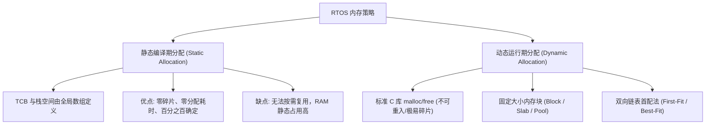
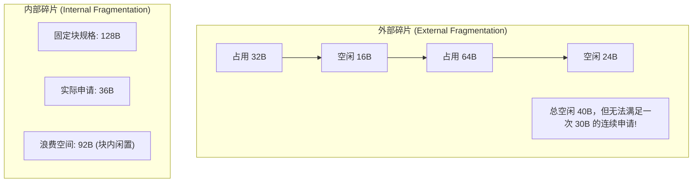
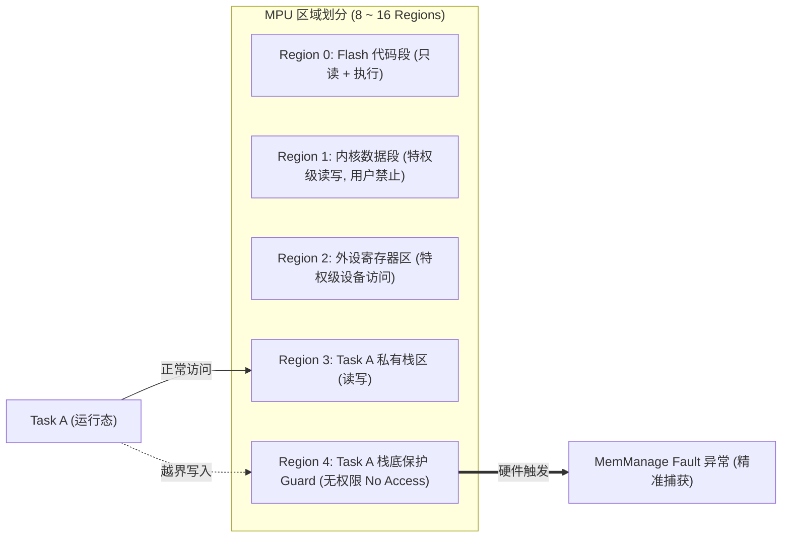

# 内存模型与保护机制

## 1. 嵌入式系统的内存严苛现实

在桌面或服务器 Linux 系统中，有虚拟内存（MMU）、4KB 分页机制与数十 GB 的物理 DDR 支撑，`malloc()` 导致的碎片可通过页置换或重启解决。

但在资源受限的嵌入式 RTOS 环境中：
1. **RAM 容量极小**：通常仅有数十 KB 到数 MB（如 STM32F4 具有 192KB SRAM）。
2. **通常没有 MMU**：所有任务、中断、内核共处同一物理扁平地址空间。
3. **长期无故障运行要求**：工业控制器、医疗输液泵、航天器需 7×24 小时连续运行数月乃至数年，**任何一次内存分配失败（OOM）都可能直接导致致命死机**。

---

## 2. 静态分配 vs 动态分配

### 2.1 MISRA C 与航天标准对动态内存的禁令
在车规 ISO 26262、航天 DO-178C 以及 MISRA-C 规范中，**强烈建议甚至强制禁止在系统进入主循环后调用通用动态内存分配（Dynamic Memory Allocation）**。
* **规避原则**：在 `main()` 函数初始化阶段将所有任务栈、消息队列、信号量静态或半静态分配完毕，系统启动调度器后不再进行任何 `free()` 和重新 `malloc()`。

---

## 3. 内存碎片（Fragmentation）分类与防治

### 3.1 内存池算法（Memory Pool / Slab Allocator）
* **原理**：预先开辟若干组固定尺寸的内存块链表（如 32B 规格池、128B 规格池、512B 规格池）。
* **时间复杂度**：从单向空闲链表取出一个空闲块仅需一次指针解引用，**耗时严格为 $O(1)$**。
* **优点**：**完全消除外部碎片**，分配与释放速度极快且完全确定。

---

## 4. 硬件 MPU（Memory Protection Unit）安全防护

针对无 MMU 的单片微控制器，ARM Cortex-M0+/M3/M4/M7/M33 提供了硬件级别的内存保护单元（MPU）。

* **空间隔离**：用户任务被限定在自身的 RAM 区域与只读代码区内。当任务由于指针悬空（Wild Pointer）试图越界写入其他任务的栈或破坏操作系统内核 TCB 时，硬件 MPU 会在时钟周期内立即截获该总线请求并抛出 **MemManage Fault**，直接保护了系统其他健康任务的生存。
