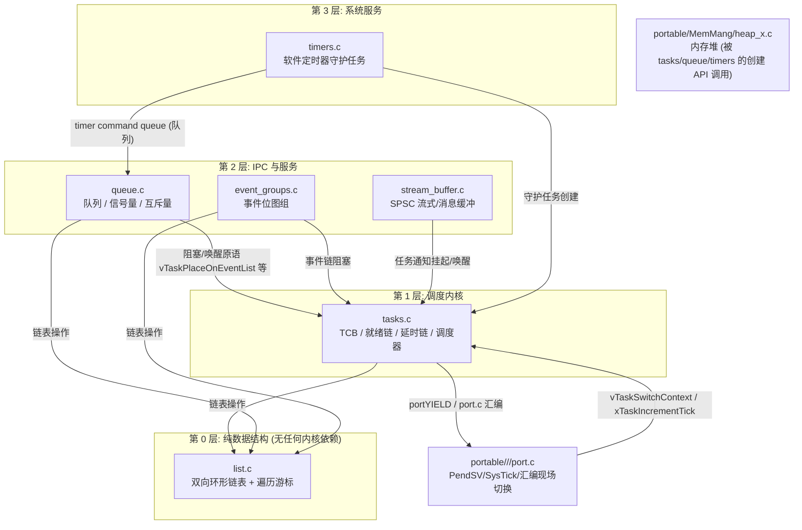

# FreeRTOS 架构哲学与源码拓扑

## 1. 架构设计哲学：极简调度微内核

与 Linux 或宏内核（Monolithic Kernel）不同，FreeRTOS 的核心定位是一个**不可分拆的高性能任务调度器库**。本文分析以官方长期维护版本 [FreeRTOS Kernel V10.5.1](https://github.com/FreeRTOS/FreeRTOS-Kernel/tree/V10.5.1) 为基准。
* **零额外硬件依赖**：只要硬件平台具备一个可递增的时钟中断和一个堆栈指针，只需编写数十行汇编即可跑起 FreeRTOS。
* **可裁剪性**：所有功能均通过静态编译宏 `FreeRTOSConfig.h` 控制，未使用的功能在编译链接阶段由死代码消除（Dead Code Elimination）移出固件，最小内核镜像仅需 **4KB~9KB Flash 与不到 1KB RAM**（参考 [官方二进制体积说明](https://www.freertos.org/Embedded-RTOS-Binary-Sizes.html)）。
* **严格代码规范**：遵循 MISRA-C 规范与官方 [FreeRTOS Coding Standard](https://www.freertos.org/FreeRTOS-Coding-Standard-and-Style-Guide.html)，全套源码采用特定的匈牙利命名法前缀，使变量作用域与数据类型在阅读时一目了然。

---

## 2. 源码树组织结构

官方源码树（[GitHub - FreeRTOS-Kernel V10.5.1](https://github.com/FreeRTOS/FreeRTOS-Kernel/tree/V10.5.1)）结构异常干净整洁：

```text
FreeRTOS-Kernel/
├── croutine.c           # [可选] 极小 RAM 协程实现（现极少使用）
├── event_groups.c       # 事件标志组
├── list.c               # 内核核心：双向循环链表实现
├── queue.c              # 内核核心：队列、信号量与互斥锁
├── stream_buffer.c      # 流式缓冲区与消息缓冲区
├── tasks.c              # 内核核心：任务管理与调度器
├── timers.c             # 软件定时器后台任务
├── include/             # 官方公共内核头文件
│   ├── FreeRTOS.h
│   ├── task.h
│   ├── queue.h
│   ├── semphr.h
│   └── list.h
└── portable/            # 硬件与编译器平台移植层
    ├── MemMang/         # 内存堆模型 (heap_1.c ~ heap_5.c)
    └── GCC/ARM_CM4F/    # 架构与编译器特定汇编 (port.c, portmacro.h)
```

`portable/` 按 `portable/<编译器>/<架构>/` 二级目录组织，每个端口只需实现 `portmacro.h`（类型与宏契约）与 `port.c`（上下文切换、 tick 与中断配置）两个文件；`MemMang/` 与架构正交，任何端口任选其一。

### 2.1 文件依赖拓扑：谁站在谁之上



依赖分层带来两个直接工程后果：

* **链接器按需收缩**：不使能 `configUSE_TIMERS` 时 `timers.c` 全部符号无人引用，整文件被裁掉；`stream_buffer.c`、`event_groups.c` 同理。
* **阅读源码的正确顺序**：`list.c`（~250 行）→ `tasks.c` 调度核心 → `queue.c` → 其余。理解 `list.c` 的双重身份是理解一切等待链表的前提（详见[就绪列表与位图调度器](02-ready-lists-bitmap-scheduler.md)第 3 节）。

### 2.2 内核裁剪哲学：一个 `queue.c` 通吃整个 IPC 家族

FreeRTOS 刻意避免为每种同步原语写独立实现。信号量、互斥量、递归互斥量在内核里**没有专属数据结构**，全部复用 `Queue_t`，仅在创建时打上类型标签，创建接口复用队列分配逻辑；发送、接收和信号量获取路径依据项目大小及互斥量字段区分行为。`ucQueueType` 主要用于跟踪配置，不能概括为所有路径的分派开关：

| 类型标签 (`ucQueueType`) | 对应创建 API | 队列几何参数 | 行为差异点 |
| :--- | :--- | :--- | :--- |
| `queueQUEUE_TYPE_BASE` | `xQueueCreate(len, size)` | `uxLength=len, uxItemSize=size` | 真实环形拷贝，满则阻塞/失败 |
| `queueQUEUE_TYPE_BINARY_SEMAPHORE` | `xSemaphoreCreateBinary()` | `1 × 0` 字节 | 创建后**空**（必须先 give），take 即 P、give 即 V |
| `queueQUEUE_TYPE_COUNTING_SEMAPHORE` | `xSemaphoreCreateCounting(max, init)` | `max × 0` 字节 | give 时 `uxMessagesWaiting++`（写入的是计数值而非数据） |
| `queueQUEUE_TYPE_MUTEX` | `xSemaphoreCreateMutex()` | `1 × 0` 字节 | 创建后**满**（可直接 take），take/give 挂接优先级继承与恢复 |
| `queueQUEUE_TYPE_RECURSIVE_MUTEX` | `xSemaphoreCreateRecursiveMutex()` | `1 × 0` 字节 | 在互斥量之上再挂 `uxRecursiveCallCount`，同任务可重复 take |

!!! tip
    **复用的红利与代价**：一份 `Queue_t` 代码同时获得临界区保护、阻塞/超时、ISR 安全路径与优先级排序唤醒，测试面集中；代价是"互斥量内部是个队列"这种概念错位——排查 IPC 问题时永远从 `Queue_t` 的数据结构出发思考（见[Queue 队列与互斥量继承](04-queue-internals-semaphore-mutex.md)）。


同理，`timers.c` 不自建通信机制：所有定时器启停命令（start/stop/reset/change-period）都打包成 `DaemonTaskMessage_t` 投递给一条**普通队列**（timer command queue），由守护任务消费——这是"用现有 IPC 原语搭建系统服务"哲学的第二个样本。

---

## 3. 命名约定体系（Coding Standard）

| 前缀 | 变量 / 函数类型 | 示例 |
| :--- | :--- | :--- |
| `c` | `char` 类型 | `cTaskName` |
| `s` | `int16_t` (short) | `sCounter` |
| `l` | `int32_t` (long) | `lValue` |
| `u` | `unsigned` 无符号数 | `uxPriority`（无符号 BaseType） |
| `p` | 指针变量（Pointer） | `pxTopOfStack`、`pxCurrentTCB` |
| `x` | `BaseType_t` 或复合结构体句柄 | `xQueueCreate()`、`xTaskHandle` |
| `v` | `void` 返回值或空类型 | `vTaskDelay()`、`vTaskStartScheduler()` |
| `prv` | 私有静态函数（Private static） | `prvAddNewTaskToReadyList()` |

函数命名整体遵循 `返回类型 + 所属模块 + 动作`（如 `xQueueReceive` = `BaseType_t` 返回 + queue 模块 + receive），拿到陌生函数名即可直接反推其签名轮廓。

---

## 4. `FreeRTOSConfig.h` 裁决体系

所有内核行为均由此头文件在**预编译期**决定，没有任何运行期动态解析开销：

```c
/* 基础系统时钟与调度 */
#define configUSE_PREEMPTION                    1   /* 1: 抢占式调度, 0: 协作式调度 */
#define configCPU_CLOCK_HZ                      ( 168000000UL ) /* CPU 核心频率 */
#define configTICK_RATE_HZ                      ( ( TickType_t ) 1000 ) /* SysTick 节拍频率: 1ms */
#define configMAX_PRIORITIES                    ( 32 ) /* 任务优先级上限 (0 为最低空闲优先级) */
#define configMINIMAL_STACK_SIZE                ( ( uint16_t ) 128 ) /* 空闲任务栈大小 (字) */

/* 核心优化开关 */
#define configUSE_PORT_OPTIMISED_TASK_SELECTION 1   /* 开启硬件前导零指令 (CLZ) 优化调度器 */
#define configUSE_TICKLESS_IDLE                 0   /* 低功耗 Tickless 模式 */
#define configUSE_MUTEXES                       1   /* 编译互斥锁支持 (含优先级继承) */

/* 中断安全阈值配置 (Cortex-M 关键) */
#define configPRIO_BITS                         4   /* STM32 等平台使用 4 个优先级位 (0~15) */
#define configLIBRARY_LOWEST_INTERRUPT_PRIORITY         15
#define configLIBRARY_MAX_SYSCALL_INTERRUPT_PRIORITY    5   /* 优先级数值 < 5 的中断禁止调用 FreeRTOS API! */
```

### 4.1 核心 config 宏分组地图

| 分组 | 宏 | 作用与典型值 | 配错后果 |
| :--- | :--- | :--- | :--- |
| **调度类** | `configUSE_PREEMPTION` | 抢占/协作模式（默认 1） | 协作模式下高优先级唤醒后干等低优先级 yield |
| | `configUSE_TIME_SLICING` | 同优先级时间片轮转（默认 1） | 关闭后同级任务先到先得，后到者饿死 |
| | `configMAX_PRIORITIES` | 优先级级数（ARM_CM4F 位图优化最多支持 32 级；超过时须关闭 configUSE_PORT_OPTIMISED_TASK_SELECTION） | 级数与实际任务数失配 → RAM 浪费或就绪链越界 |
| | `configTICK_RATE_HZ` | 1kHz 是精度与开销的常见折中 | 配错 → 全部 `vTaskDelay` 周期性失真（见第 5 节排查表） |
| **内存类** | `configTOTAL_HEAP_SIZE` | heap_1/2/4 的静态堆尺寸；heap_5 由区域表指定 | 过小 → 创建 API 静默返回 NULL；过大 → 链接失败或侵占任务栈 |
| | `configSUPPORT_DYNAMIC_ALLOCATION` / `configSUPPORT_STATIC_ALLOCATION` | 动态/静态创建开关（可同时为 1） | 全 0 时所有 `xTaskCreate`/`xQueueCreate` 不可用（编译期裁掉） |
| | `configMINIMAL_STACK_SIZE` | 空闲任务栈（字），仅够 idle 主循环 | idle hook 里调 `printf` 直接溢出 |
| **中断类** | `configPRIO_BITS` | MCU 实际实现的 NVIC 优先级位数 | 与芯片不符 → 优先级寄存器写入被截断，保护失效 |
| | `configLIBRARY_MAX_SYSCALL_INTERRUPT_PRIORITY` | 数值 **小于**它的中断禁止调 API | 设 0 = BASEPRI 屏蔽形同虚设（详见[中断安全](06-freertos-isr-safety-pitfalls.md)） |
| | `configKERNEL_INTERRUPT_PRIORITY` | SysTick/PendSV 固定最低 | 抬高后中断嵌套中切任务 → 栈损坏 |
| **IPC/定时器类** | `configUSE_MUTEXES` / `configUSE_RECURSIVE_MUTEXES` / `configUSE_COUNTING_SEMAPHORES` | 各原语编译开关 | 关闭后对应创建 API 不存在（链接错误） |
| | `configUSE_TIMERS` + `configTIMER_TASK_PRIORITY` / `configTIMER_QUEUE_LENGTH` / `configTIMER_TASK_STACK_DEPTH` | 守护任务三件套（三者必须同时给） | 回调优先级设低 → 定时器集体迟到 |
| **钩子/诊断类** | `configASSERT( x )` | 断言宏（生产固件建议保留最小实现） | 未定义 = 所有内核内部检查被编译为空 |
| | `configCHECK_FOR_STACK_OVERFLOW` | 0/1/2 三级栈检测 | 溢出表现为"随机"内存破坏而非可读报告 |
| | `configUSE_MALLOC_FAILED_HOOK` 等 | 各类钩子开关 | 开而不实现钩子函数 → 链接 undefined reference |

---

## 5. 现场排查：编译与启动期故障

此阶段的问题特征是**必现、与并发无关**，按"链接 → 上电 → 首任务"时间轴排查：

| 症状 | 疑似根因 | 验证手段 |
| :--- | :--- | :--- |
| 链接期 `PendSV_Handler` / `SysTick_Handler` / `SVC_Handler` 重复定义 | 向量表映射宏缺失或厂商启动文件自带空 handler 抢占符号 | 在 `FreeRTOSConfig.h` 中 `#define xPortPendSVHandler PendSV_Handler` 等三件套；`nm`/map 文件确认最终绑定的是 `xPortPendSVHandler` 而非启动文件的死循环版本 |
| `vTaskStartScheduler()` 调用后一去不返且无任务运行 | `svc 0` 进了错误的 SVC handler（映射缺失），或 `configASSERT` 命中优先级配置检查 | 单步进 `prvPortStartFirstTask`；观察是否到达 `vPortSVCHandler` |
| 启动即 `HardFault`，调用栈指向首个任务恢复处 | 移植层与芯片不符：`configPRIO_BITS` 与实际 NVIC 位宽不一致；或向量表重定位后 MSP 初值取错 | 在 HardFault 中 dump `SCB->CFSR` 与堆叠的 PC/LR（见 [Case 02](../Case-Studies/02-stack-overflow-isr-corruption-debug.md) 取证法） |
| 任务创建"成功"但行为怪异、内存随机踩踏 | `xTaskCreate` 未返回 pdPASS 且未检查（heap 耗尽），野指针句柄继续使用 | 检查每个创建调用的返回值；开 `configUSE_MALLOC_FAILED_HOOK` |
| 链接错误 `undefined reference to vApplicationMallocFailedHook` | 钩子开关打开但未实现函数体 | 补实现或关宏——这是配置自洽性检查，不是 bug |
| 一切正常唯独偶发断言/复位，时间点与某外设初始化相关 | 外设库把某中断优先级设到了 syscall 阈值之上，且该 ISR 调了 `FromISR` API | 检查 `HAL_NVIC_SetPriority` 数值与 `configLIBRARY_MAX_SYSCALL_INTERRUPT_PRIORITY` 的关系（详见[中断安全规范](06-freertos-isr-safety-pitfalls.md)第 2 节） |

!!! note
    **三条启动期铁律**：① 三个异常 handler 的映射宏必须与向量表符号严格一致；② 所有创建类 API 的返回值必须检查；③ `configASSERT` 与栈溢出检测（`configCHECK_FOR_STACK_OVERFLOW = 2`）在开发期永远开启——这些检查有助于尽早定位配置和内存错误。
