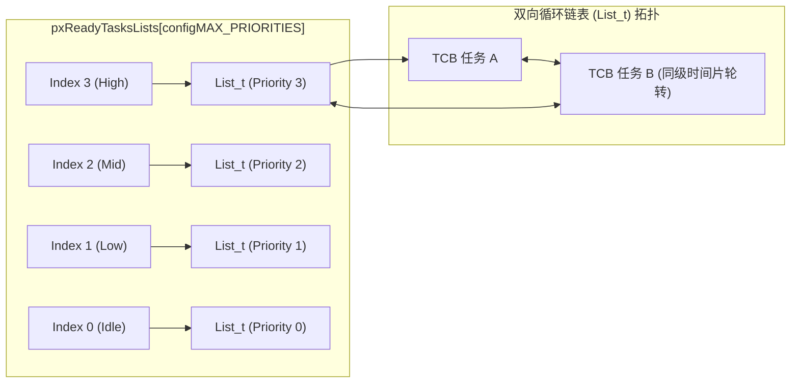
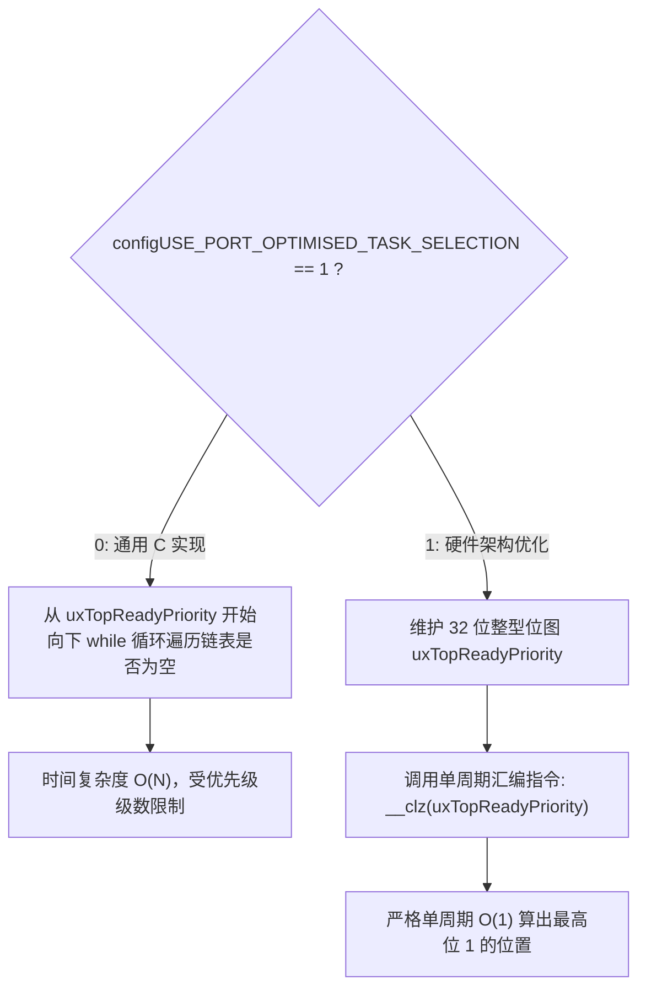

# 就绪列表与位图调度器

## 1. 就绪任务链表拓扑：`pxReadyTasksLists`

在 `tasks.c` 中，所有处于就绪态的任务按照优先级被挂载在全局数组 `pxReadyTasksLists` 中：

```c
PRIVILEGED_DATA static List_t pxReadyTasksLists[ configMAX_PRIORITIES ];
```

这是一个由 `List_t` 结构体组成的定长数组，下标直接对应优先级（0 到 `configMAX_PRIORITIES - 1`）。



### 1.1 `List_t` 与 `ListItem_t` 双向循环设计
FreeRTOS 的链表是首尾闭合的环形结构。`List_t` 内部含有一个哨兵节点 `xListEnd` 和一个游标指针 `pxIndex`：
* 当同优先级存在多个任务时，每次调用 `listGET_OWNER_OF_NEXT_ENTRY()` 会顺位移动 `pxIndex`，**天然实现了极轻量的时间片轮转（Round-Robin）**，无需额外的调度链表重排。

---

## 2. 调度器如何选中“最高优先级就绪任务”？

FreeRTOS 提供两种算法分支，由配置宏 `configUSE_PORT_OPTIMISED_TASK_SELECTION` 决定。



### 2.1 通用 C 算法（Generic Method）

```c
#define taskSELECT_HIGHEST_PRIORITY_TASK()                                      \
{                                                                                \
    UBaseType_t uxTopPriority = uxTopReadyPriority;                              \
    /* 循环向下寻找第一个非空的就绪链表 */                                         \
    while( listLIST_IS_EMPTY( &( pxReadyTasksLists[ uxTopPriority ] ) ) )       \
    {                                                                            \
        --uxTopPriority;                                                         \
    }                                                                            \
    listGET_OWNER_OF_NEXT_ENTRY( pxCurrentTCB, &( pxReadyTasksLists[ uxTopPriority ] ) ); \
    uxTopReadyPriority = uxTopPriority;                                          \
}
```
* **特点**：纯 C 语言，移植到任何无特定位操作指令的 8/16 位 MCU（如 8051、AVR）均可直接编译。
* **弊端**：最坏情况下循环执行次数随 `configMAX_PRIORITIES` 增加而增长，不具备绝对的调度周期确定性。

---

### 2.2 硬件加速位图算法（Port-Optimised Method）

在 ARM Cortex-M 或现代 RISC-V 平台上，内核维护一个 32 位的整型变量 `uxTopReadyPriority`：
* 当优先级 `uxPriority` 列表中加入第一个任务时，将该位拉高：
  
  $$\text{uxTopReadyPriority} \ |= (1 \ll \text{uxPriority})$$

* 当该优先级的最后一个任务移出时，将该位清零：
  
  $$\text{uxTopReadyPriority} \ \&= \sim(1 \ll \text{uxPriority})$$

当调度器需要选出最高优先级任务时，利用 ARM 硬件提供的 **`CLZ`（Count Leading Zeros，计算前导零个数）** 指令：

```c
#define portGET_HIGHEST_PRIORITY( uxTopPriority, uxReadyPriorities ) \
    uxTopPriority = ( 31UL - ( uint32_t ) __clz( ( uxReadyPriorities ) ) )
```

例如：若最高就绪任务在 Priority 6，则位图为 `0x00000040`。前导零个数为 25，最高优先级计算为：

$$31 - 25 = 6$$

> [!TIP]
> **绝对确定性 $O(1)$**：无论系统中有多少个任务处于何种优先级，`CLZ` 指令均在**单个 CPU 时钟周期**内输出结果，使调度器决算时间缩减到数个纳秒，从根本上保证了硬实时的极低抖动（Jitter）。
