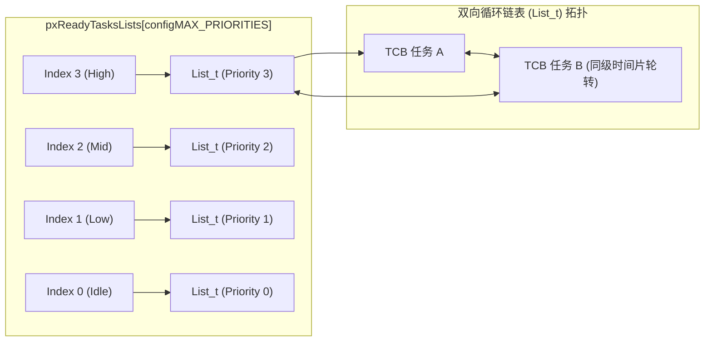
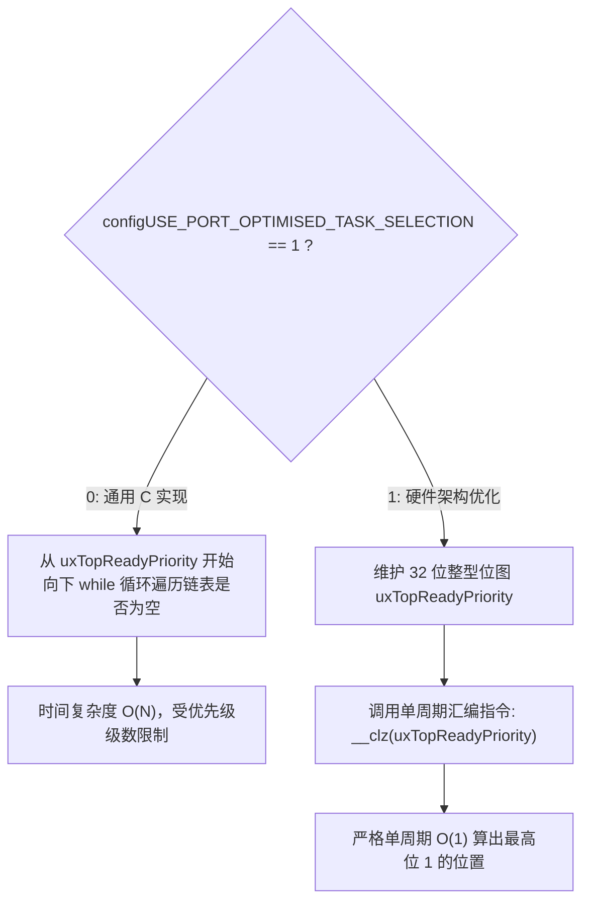
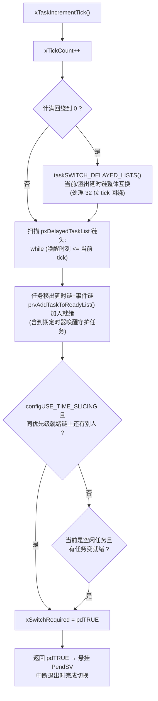

# 就绪列表与位图调度器

## 1. 就绪任务链表拓扑：`pxReadyTasksLists`

在 `tasks.c` 中，所有处于就绪态的任务按照优先级被挂载在全局数组 `pxReadyTasksLists` 中：

```c
PRIVILEGED_DATA static List_t pxReadyTasksLists[ configMAX_PRIORITIES ];
```

这是一个由 `List_t` 结构体组成的定长数组，下标直接对应优先级（0 到 `configMAX_PRIORITIES - 1`）。



### 1.1 `List_t` 与 `ListItem_t` 双向循环设计
FreeRTOS 的链表是首尾闭合的环形结构。`List_t` 内部含有一个哨兵节点 `xListEnd` 和一个游标指针 `pxIndex`：
* 当同优先级存在多个任务时，每次调用 `listGET_OWNER_OF_NEXT_ENTRY()` 会顺位移动 `pxIndex`，**天然实现了极轻量的时间片轮转（Round-Robin）**，无需额外的调度链表重排。

---

## 2. 调度器如何选中“最高优先级就绪任务”？

FreeRTOS 提供两种算法分支，由配置宏 `configUSE_PORT_OPTIMISED_TASK_SELECTION` 决定。



### 2.1 通用 C 算法（Generic Method）

```c
#define taskSELECT_HIGHEST_PRIORITY_TASK()                                      \
{                                                                                \
    UBaseType_t uxTopPriority = uxTopReadyPriority;                              \
    /* 循环向下寻找第一个非空的就绪链表 */                                         \
    while( listLIST_IS_EMPTY( &( pxReadyTasksLists[ uxTopPriority ] ) ) )       \
    {                                                                            \
        --uxTopPriority;                                                         \
    }                                                                            \
    listGET_OWNER_OF_NEXT_ENTRY( pxCurrentTCB, &( pxReadyTasksLists[ uxTopPriority ] ) ); \
    uxTopReadyPriority = uxTopPriority;                                          \
}
```
* **特点**：纯 C 语言，移植到任何无特定位操作指令的 8/16 位 MCU（如 8051、AVR）均可直接编译。
* **弊端**：最坏情况下循环执行次数随 `configMAX_PRIORITIES` 增加而增长，不具备绝对的调度周期确定性。

---

### 2.2 硬件加速位图算法（Port-Optimised Method）

在 ARM Cortex-M 或现代 RISC-V 平台上，内核维护一个 32 位的整型变量 `uxTopReadyPriority`：
* 当优先级 `uxPriority` 列表中加入第一个任务时，将该位拉高：

  $$\text{uxTopReadyPriority} \ |= (1 \ll \text{uxPriority})$$

* 当该优先级的最后一个任务移出时，将该位清零：

  $$\text{uxTopReadyPriority} \ \&= \sim(1 \ll \text{uxPriority})$$

当调度器需要选出最高优先级任务时，利用 ARM 硬件提供的 **`CLZ`（Count Leading Zeros，计算前导零个数）** 指令：

```c
#define portGET_HIGHEST_PRIORITY( uxTopPriority, uxReadyPriorities ) \
    uxTopPriority = ( 31UL - ( uint32_t ) __clz( ( uxReadyPriorities ) ) )
```

例如：若最高就绪任务在 Priority 6，则位图为 `0x00000040`。前导零个数为 25，最高优先级计算为：

$$31 - 25 = 6$$

!!! tip
    **位图选择的复杂度**：在支持该优化的端口上，最高就绪优先级查找为 $O(1)$。完整调度延迟还包括链表操作、上下文保存和中断干扰，不能由一条 CLZ 指令推导纳秒级响应保证。


---

## 3. `list.c`：支撑整个内核的双向环形链表

`tasks.c` 与 `queue.c` 中的每一个"链表"都是 `list.c` 提供的同一套结构。理解它的关键是**一个链表项同时具有两种身份**。

### 3.1 `ListItem_t` 的双重身份

```c
/* 据 V10.5.1 list.h 简化（省略完整性检查字段） */
struct xLIST_ITEM
{
    TickType_t xItemValue;              /* 排序键: 语义由所在链表决定 */
    struct xLIST_ITEM *pxNext;          /* 双向指针 */
    struct xLIST_ITEM *pxPrevious;
    void *pvOwner;                      /* 宿主: 反向指回 TCB */
    struct xLIST *pxContainer;          /* 当前挂在哪条链上 */
};
```

每个 TCB 内嵌**两个**链表项，使一个任务能同时挂在其状态链和事件链上：

| 链表项 | 挂在哪 | `xItemValue` 的语义 | 排序规则 |
| :--- | :--- | :--- | :--- |
| `xStateListItem`（状态项） | 就绪链 / 延时链 / 挂起链 | 在延时链上 = **唤醒时刻的绝对 tick 值**；在就绪链上无意义 | 延时链按唤醒时刻**升序**，链头永远是最先到期者 |
| `xEventListItem`（事件项） | 队列/信号量/事件组的等待链 | **`configMAX_PRIORITIES - uxPriority`** | 升序插入 |

!!! note
    **事件链的"取反"排序技巧**：优先级数值越大越高，而链表按 `xItemValue` 升序排列——把 `configMAX_PRIORITIES - uxPriority` 当作排序键，就完成了大小反转：**等待链的链头永远是等待者中优先级最高的任务**。于是 `xTaskRemoveFromEventList()` 直接摘链头即完成"唤醒最高优先级等待者"，无需任何搜索。这是 FreeRTOS 用最朴素的数据结构实现 $O(1)$ 优先级唤醒的核心机关。


### 3.2 关键操作与复杂度

| 操作 | 作用 | 复杂度 |
| :--- | :--- | :--- |
| `uxListRemove()` | 双向指针互指，摘除自身 | $O(1)$ |
| `listINSERT_END()` | 挂到 `pxIndex` 游标前（就绪链入队） | $O(1)$ |
| `vListInsert()` | 按 `xItemValue` 升序插入（延时链/事件链） | $O(n)$ 最坏，但链短且头部命中早退 |
| `listGET_OWNER_OF_NEXT_ENTRY()` | 游标步进一格并返回宿主 TCB | $O(1)$（时间片轮转的发动机） |

哨兵节点 `xListEnd` 永远在环上，判空即 `pxNext == &xListEnd`，不存在 NULL 指针路径——环形设计把边界条件消灭在结构里。

---

## 4. `xTaskIncrementTick()`：一个 tick 的全部副作用

SysTick 中断每拍调用一次该函数（经 `xPortSysTickHandler`，见 [PendSV 页第 7 节](03-context-switch-pendsv-assembly.md)）。它是内核所有时间行为的汇聚点：



三个容易被忽视的语义：

1. **溢出延时链**：任务可以 `vTaskDelay(0xFFFFFFFF)` 级别地长睡，唤醒时刻的计算可能回绕。内核维护 `pxDelayedTaskList` / `xOverflowDelayedTaskList` 一对链表，`taskSWITCH_DELAYED_LISTS()` 在 tick 回绕瞬间整体交换二者——回绕处理零逐项扫描开销。
2. **时间片判定在 tick 内完成**：同级轮转不依赖独立定时器，仅检查"当前优先级就绪链是否还有其他任务"。
3. **返回值即切换请求**：`xPortSysTickHandler` 只看返回值决定是否 pend PendSV，把"要不要切换"的决策权完整留给调度核心。

---

## 5. 调度器启动序列与两种"暂停"

### 5.1 `vTaskStartScheduler()` 启动序列

```text
vTaskStartScheduler()
  ├─ xTaskCreate(prvIdleTask, 优先级 0, configMINIMAL_STACK_SIZE)   # 空闲任务: 优先级 0，应用任务也可使用此级
  ├─ xTimerCreateTimerTask()                                        # configUSE_TIMERS=1 时: 守护任务+命令队列
  ├─ xPortStartScheduler()                                          # port 层接管
  │    ├─ 配 SysTick 频率、置 PendSV/SysTick 为最低优先级
  │    ├─ configASSERT 校验中断优先级配置自洽
  │    └─ prvPortStartFirstTask(): 重置 MSP → cpsie → svc 0
  │           └─ vPortSVCHandler 恢复最高就绪任务 (不再返回)
  └─ [不可达] 若返回说明 heap 不足以创建 idle 任务
```

空闲任务不是可选项：它承担删除任务的 TCB/栈回收（`prvCheckTasksWaitingTermination`）、tickless 低功耗入口与 `configUSE_IDLE_HOOK` 回调。

### 5.2 `taskENTER_CRITICAL()` vs `vTaskSuspendAll()`：两种"暂停世界"

| 维度 | 临界区 `taskENTER/EXIT_CRITICAL` | 调度器挂起 `vTaskSuspendAll/xTaskResumeAll` |
| :--- | :--- | :--- |
| 屏蔽对象 | 紧迫性不高于阈值的可配置异常（Cortex-M 经 BASEPRI） | 仅调度器本身，中断照常全速进出 |
| 硬件机制 | `BASEPRI = configMAX_SYSCALL_INTERRUPT_PRIORITY`（计数嵌套） | 软件计数 `uxSchedulerSuspended++/--` |
| ISR 能否运行 | 仅高于阈值的零延迟中断可运行 | 全部可运行，但 FromISR 唤醒被**暂存**进 `xPendingReadyList` |
| 持续时间预算 | 微秒级（关中断拖累所有中低优先级中断延迟） | 可较长（memcpy、堆操作在此保护下进行） |
| 退出副作用 | 解除屏蔽后可能执行挂起的 PendSV | `xTaskResumeAll` 冲洗暂存就绪链，可能触发立即切换 |
| 典型用途 | 保护 2~10 条语句的链表原子修改 | heap 分配、队列阻塞准备等操作；队列数据拷贝仍在临界区内 |

!!! warning
    **黄金法则**：临界区里绝不调用可能阻塞的内核 API；调度器挂起区里绝不调用会触发 `portYIELD()` 的 API（`uxSchedulerSuspended != 0` 时内核 `configASSERT` 会拦截 `taskYIELD` 类路径）。两把锁都只保护"调度数据结构一致性"，不保护你的业务数据。


---

## 6. 现场排查：调度行为异常

| 症状 | 疑似根因 | 验证手段 |
| :--- | :--- | :--- |
| 同优先级两个任务只有一个在跑 | `configUSE_TIME_SLICING = 0`；或抢占关闭后先跑者从不 yield | 读配置；在两任务里各翻转一个 GPIO 用逻辑分析仪看时序 |
| `vTaskDelay(1000)` 实际睡 ~2000ms | `configTICK_RATE_HZ` 与 SysTick 实际重装值不符（`configCPU_CLOCK_HZ` 错、时钟树超频后未同步） | 造一个每 1000 tick 翻转的任务，示波器量周期反推真实 tick |
| 延时任务永不唤醒 | `vTaskSuspendAll()`/`xTaskResumeAll()` 不配对，调度器永久挂起；或 SysTick 被某处关掉 | 断点看 `uxSchedulerSuspended` 计数；看 `xTickCount` 是否还在前进 |
| 空闲任务长期得不到运行 | 存在优先级 0 的应用任务长跑（idle 被同级压制）→ tickless 失效、被删任务内存永不回收 | `uxTaskGetSystemState()` 看各任务运行占比；检查删除型任务积压 |
| 新建任务"创建成功"却立刻 HardFault | heap 耗尽返回 NULL 未检查；或栈深不足且溢出检测未开 | 检查 `xTaskCreate` 返回值；开 `configCHECK_FOR_STACK_OVERFLOW = 2` 复跑 |
| 高优先级任务唤醒后明显迟到 | tick 频率过低（如 100Hz 时 10ms 粒度）+ 唤醒恰跨 tick 边界；或临界区过长拉高调度延迟 | 逻辑分析仪量"事件引脚→任务执行首指令"的真实延迟分布 |
