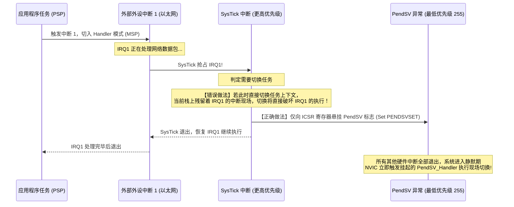
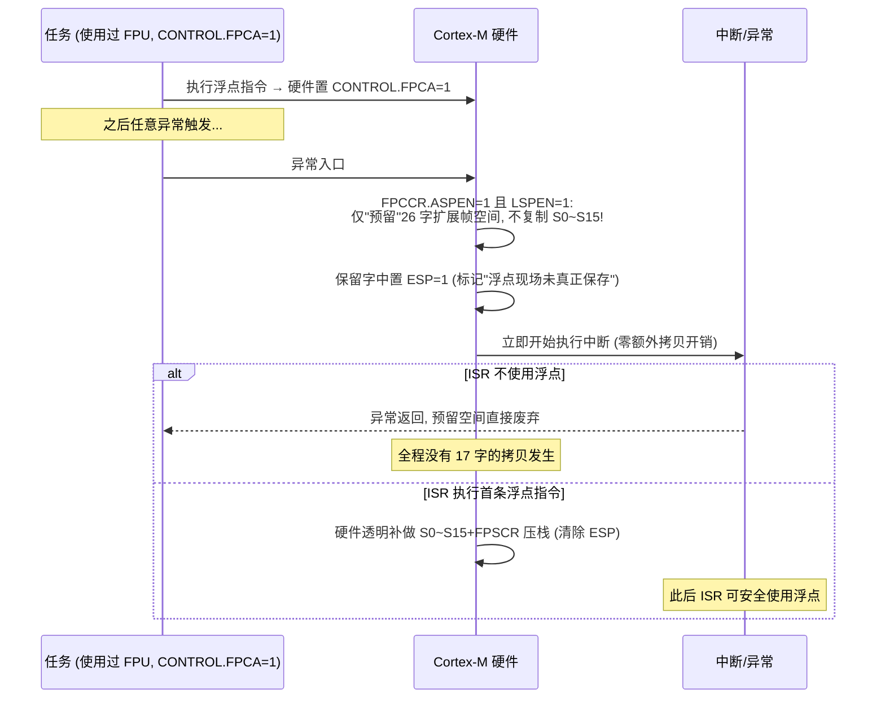

# PendSV 汇编现场切换

## 1. 为什么上下文切换必须推迟到 PendSV？

在早期的嵌入式 OS 移植中，上下文切换常直接在 SysTick 或外部外设的中断服务程序（ISR）内部直接触发。然而，这会在**中断嵌套**场景下引发严重灾难：



!!! note
    **设计铁律**：PendSV（Pended Service Call）的硬件优先级必须被设置为**系统最低优先级（0xFF）**。
    这样保证了**上下文切换永远推迟到所有嵌套硬件中断全部执行完毕后**，在系统安全返回线程模式前夕统一执行，彻底杜绝了中断现场被任务调度破坏的致命隐患。


---

## 2. 启动第一个任务：`vPortSVCHandler`

系统调用 `vTaskStartScheduler()` 会配置 SysTick 和 PendSV 优先级，最后执行 `svc 0` 软中断以启动第一个就绪任务。

以下以官方 [FreeRTOS V10.5.1 portable/GCC/ARM_CM4F/port.c](https://raw.githubusercontent.com/FreeRTOS/FreeRTOS-Kernel/V10.5.1/portable/GCC/ARM_CM4F/port.c) 为基准：

```assembly
    .syntax unified
    .thumb
    .global vPortSVCHandler

vPortSVCHandler:
    ldr r3, =pxCurrentTCB      /* 1. 加载指向当前 TCB 的二级指针地址 */
    ldr r1, [r3]               /* 2. r1 = pxCurrentTCB */
    ldr r0, [r1]               /* 3. r0 = *pxCurrentTCB (偏移量 0 即 pxTopOfStack) */

    ldmia r0!, {r4-r11, r14}   /* 4. 弹出软件上下文: R4~R11 以及初始化的 EXC_RETURN (r14) */
    msr psp, r0                /* 5. 将恢复后的栈顶赋予进程堆栈指针 PSP */
    isb                        /* 指令同步屏障: 确保后续指令立即使用新 PSP */

    mov r0, #0
    msr basepri, r0            /* 6. 将 BASEPRI 清零，放行所有受管中断 */

    bx r14                     /* 7. 异常返回: 硬件自动从 PSP 出栈 (R0-R3, R12, LR, PC, xPSR) 并跳入任务入口 */
```

!!! note
    **为何 CM4F 端口的 SVC 出栈需要包含 `r14`？**
    * **Cortex-M3 纯整型端口**：任务创建时栈上只压入 R4~R11，退出时写死 `orr r14, #0xd` 即可。
    * **Cortex-M4F 浮点端口**：在任务初始化 `pxPortInitialiseStack()` 时，栈顶预设了包含浮点状态位的初始 `portINITIAL_EXC_RETURN`（如 `0xfffffffd`）。因此出栈必须同时恢复 `{r4-r11, r14}`，使 `bx r14` 能根据任务自身是否使用 FPU 动态决定硬件出栈行为。


---

## 3. 上下文切换核心：`xPortPendSVHandler` 官方逐行汇编精析

当任务需要主动让出 CPU（`portYIELD()`）或被高优先级任务抢占时，内核悬挂 PendSV。由于其优先级为最低（0xFF），待所有活跃中断全部退出后，NVIC 触发 `xPortPendSVHandler`。此时 CPU 硬件已自动将 Caller 寄存器（xPSR, PC, LR, R12, R0~R3）压入 PSP。

```assembly
    .syntax unified
    .thumb
    .global xPortPendSVHandler

xPortPendSVHandler:
    mrs r0, psp                /* 1. 读取当前任务正在使用的 PSP 栈顶到 r0 */
    isb

    ldr r3, =pxCurrentTCB      /* 2. 获取 pxCurrentTCB 指针地址 */
    ldr r2, [r3]               /* r2 = pxCurrentTCB 首地址 */

    /* ---------- FPU 浮点上下文检测与压栈 ---------- */
    tst r14, #0x10             /* 测试 EXC_RETURN 的 Bit 4 (0: 使用了 FPU 扩展帧, 1: 标准帧) */
    it eq
    vstmdbeq r0!, {s16-s31}    /* 若使用了 FPU，软件将浮点高阶寄存器 s16~s31 压栈 */

    /* ---------- 软件保存 Callee 寄存器与 EXC_RETURN ---------- */
    stmdb r0!, {r4-r11, r14}   /* 将通用寄存器 R4~R11 与当前的 EXC_RETURN(r14) 压入任务栈 */
    str r0, [r2]               /* 3. 将最终计算出的栈顶地址回写到 pxCurrentTCB->pxTopOfStack */

    /* ---------- BASEPRI 屏蔽受管中断 (进入调度临界区) ---------- */
    mov r0, #configMAX_SYSCALL_INTERRUPT_PRIORITY
    msr basepri, r0            /* 4. 关键: 仅屏蔽优先级 <= MAX_SYSCALL 的中断，绝不使用粗暴的 cpsid i */
    dsb
    isb

    /* ---------- 决策新任务 ---------- */
    bl vTaskSwitchContext      /* 5. 调用 C 调度器: 选出新的最高就绪任务，更新 pxCurrentTCB */

    /* ---------- 退出调度临界区，恢复 BASEPRI ---------- */
    mov r0, #0
    msr basepri, r0            /* 6. 恢复 BASEPRI = 0，重新使能所有可屏蔽中断 */
    dsb
    isb

    /* ---------- 加载新任务现场 ---------- */
    ldr r3, =pxCurrentTCB      /* 7. 重新加载最新被选出的 pxCurrentTCB */
    ldr r1, [r3]               /* r1 = 新任务 TCB 首地址 */
    ldr r0, [r1]               /* 8. r0 = 新任务的 pxTopOfStack */

    /* ---------- 恢复 Callee 通用寄存器与 EXC_RETURN ---------- */
    ldmia r0!, {r4-r11, r14}   /* 弹出 R4~R11 与新任务切出时保存的 EXC_RETURN 到 r14 */

    /* ---------- 恢复新任务的浮点状态 ---------- */
    tst r14, #0x10             /* 检查新任务切出时是否使用了 FPU */
    it eq
    vldmiaeq r0!, {s16-s31}    /* 若使用了 FPU，恢复对应的 s16~s31 浮点寄存器 */

    msr psp, r0                /* 9. 将恢复后的最新栈顶写回硬件 PSP 寄存器 */
    isb

    bx r14                     /* 10. 异常返回: 硬件根据 r14 自动从 PSP 弹出 8 个基础寄存器并跳入任务 */
```

### 3.1 为什么调度临界区严禁使用 `cpsid i`？
在官方 ARM_CM4F 端口中，调度器决策（`vTaskSwitchContext`）必须使用：
```assembly
mov r0, #configMAX_SYSCALL_INTERRUPT_PRIORITY
msr basepri, r0
```
如果将其替换为全局关中断指令 `cpsid i`（修改 PRIMASK），将导致系统内所有不调用内核 API 的“零延迟强实时中断”（如急停保护、高频逆变器采样）也被无差别死死锁住，彻底摧毁系统的最高实时保证。使用 BASEPRI 既保护了内核链表不被可调用 API 的中断重入破坏，又赋予了关键硬件最高响应权。

---

## 4. 异常栈帧：硬件自动压入的部分

理解上下文切换的第一步是分清**谁保存哪些寄存器**。Cortex-M 在异常入口由硬件自动把 8 个"caller 保存"字压入当前栈（任务用 PSP），PendSV 汇编只需再补 R4~R11（callee 保存）。完整帧布局：

| 栈内偏移（字） | 基本帧（未用 FPU） | 扩展帧（FPCA=1） |
| :---: | :--- | :--- |
| 0 | R0 | R0 |
| 1 | R1 | R1 |
| 2 | R2 | R2 |
| 3 | R3 | R3 |
| 4 | R12 | R12 |
| 5 | LR (R14) | LR (R14) |
| 6 | **返回地址 PC**（bit0 恒 1，Thumb） | 返回地址 PC |
| 7 | **xPSR**（含位 9 STKALIGN 对齐标志） | xPSR |
| 8 | — | FPSCR |
| 9 | — | 保留字（惰性压栈状态位 ESP） |
| 10~25 | — | S0~S15 |

由帧结构可直接算出任务栈的最小物理开销：整型任务 $8_{\text{硬件}} + 8_{\text{软件}} = 16$ 字 = **64B**；使用 FPU 的任务 $26_{\text{硬件}} + 24_{\text{软件}} = 50$ 字 = **200B**——这还没算任务自身的局部变量与调用深度。给浮点任务按整型任务的经验值配栈是常见溢出诱因。

!!! note
    **8 字节对齐与 STKALIGN**：AAPCS 要求公共调用界面栈 8 字节对齐。异常入口时若 PSP 未对齐，硬件会垫入一个填充字并把压入的 xPSR 位 9（STKALIGN）置 1，异常返回时再抽掉。任务栈缓冲区本身必须 8 字节对齐，否则该垫片行为会与手工计算的栈帧偏移错位。


---

## 5. FPU 惰性压栈（Lazy Context Save）

第 3 节的 `tst r14, #0x10` 只处理了 **s16~s31**（软件保存部分）；s0~s15 + FPSCR 由硬件管理，且采用**惰性策略**：



这一设计的延迟收益：绝大多数 ISR（UART、GPIO、定时器）根本不碰浮点——惰性机制使它们的中断入口延迟与无 FPU 内核完全一致；只有真正用浮点的 handler 才在首个浮点指令处一次性支付 17 字压栈成本。

**分工总结**：硬件管 s0~s15+FPSCR（惰性、按需）、PendSV 软件管 s16~s31（按 EXC_RETURN bit4 判定、积极保存）。后者属于 AAPCS 的 callee-saved 寄存器，交由软件是体系结构约定的自然结果。

---

## 6. EXC_RETURN 位解码

`bx r14` 触发异常返回时，LR 中装载的不是普通地址而是 `EXC_RETURN` 魔数（高 27 位全 1）。工程调试中经常需要在 HardFault handler 里解码它来判断事发现场：

| 位 | 名称 | = 0 含义 | = 1 含义 |
| :---: | :--- | :--- | :--- |
| 4 | Frame Type | **扩展帧**（含 FPU 状态，本次现场用了浮点） | 标准帧（8 字基本帧） |
| 3 | Return Mode | 返回 **Handler** 模式（异常嵌套中） | 返回线程模式 |
| 2 | Return Stack | 返回后使用 **MSP** | 返回后使用 **PSP**（任务栈） |
| 1 | (v7-M 保留恒 0) | — | v8-M: ES 位（安全扩展栈） |
| 0 | 合法性 | 非法 | 恒 1（Thumb 状态） |

常见取值速查：

| EXC_RETURN | 解读 |
| :--- | :--- |
| `0xFFFFFFF1` | 中断嵌套内返回 Handler/MSP，标准帧 |
| `0xFFFFFFF9` | 返回线程/MSP，标准帧（MSP 运行的线程，如调度器启动前） |
| `0xFFFFFFFD` | **返回线程/PSP，标准帧——普通整型任务的常态** |
| `0xFFFFFFE9` | 返回 Handler/MSP，扩展帧 |
| `0xFFFFFFED` | **返回线程/PSP，扩展帧——浮点任务的常态**（即第 3 节 bit4=0 的场景） |

---

## 7. SysTick 与第一个任务：入口与起点的走读

### 7.1 `xPortSysTickHandler`：tick 入口为什么要先屏蔽

```c
/* 据 V10.5.1 ARM_CM4F port.c 节选 */
void xPortSysTickHandler( void )
{
    uint32_t ulPreviousMask;

    ulPreviousMask = portSET_INTERRUPT_MASK_FROM_ISR();   /* BASEPRI 屏蔽受管中断 */
    {
        if( xTaskIncrementTick() != pdFALSE )             /* 决策所有时间到期事件 */
        {
            portNVIC_INT_CTRL_REG = portNVIC_PENDSVSET_BIT; /* 仅悬挂 PendSV, 不直接切换 */
        }
    }
    portCLEAR_INTERRUPT_MASK_FROM_ISR( ulPreviousMask );  /* 恢复 */
}
```

先 `portSET_INTERRUPT_MASK_FROM_ISR()` 再触碰延时链/就绪链：tick 数据结构与更高优先级 ISR 可能调用的 FromISR API 共享，必须以 BASEPRI 阻断重入；而"要不要切换"依旧只悬挂 PendSV，不在 SysTick 内动手换栈——这正是第 1 节设计铁律的代码化。

### 7.2 `prvPortStartFirstTask`：系统冷启动的一跳

```assembly
    .syntax unified
    .thumb

prvPortStartFirstTask:
    ldr r0, =0xE000ED08     /* VTOR: 向量表偏移寄存器 */
    ldr r0, [r0]            /* r0 = 向量表基地址 */
    ldr r0, [r0]            /* r0 = 表第 0 项 = 芯片复位时约定的初始 MSP */
    msr msp, r0             /* 主栈指针重置到上电初值, 丢弃启动代码残留栈 */
    cpsie i                 /* 使能可屏蔽中断 (启动期默认 PRIMASK=1) */
    cpsie f                 /* 使能 Fault */
    dsb
    isb
    svc 0                   /* 主动陷入 → vPortSVCHandler 恢复第一个任务 */
```

两个容易误读的细节：

1. **重置 MSP**：`vPortStartScheduler` 之前的一切 C 代码运行在 MSP 的启动栈上，其中可能有编译器残留的临时数据。把 MSP 拨回向量表第 0 项定义的初值，未来所有异常handler 才有干净且充足的 Handler 栈。
2. **用 `svc` 而非直接改 PC**：恢复第一个任务需要"伪造一次异常返回"来让硬件自动出栈 R0~R3/PC/xPSR。`svc` 借用异常机制进入 `vPortSVCHandler`（第 2 节），由它完成 `ldmia`+`bx r14`——复用硬件出栈路径，杜绝手工恢复 PSR 的位级错误。

---

## 8. 现场排查：切换路径故障

| 症状 | 疑似根因 | 验证手段 |
| :--- | :--- | :--- |
| 切换后偶发 HardFault，栈底有踩踏痕迹 | 浮点任务栈按 64B 最小值配给（实际需 200B 帧深度+调用链）；或栈缓冲未 8 字节对齐与 STKALIGN 垫片错位 | 复算任务最深调用链；在任务创建处断言 `((uint32_t)stack & 7) == 0`；开栈溢出检测 2 级 |
| 浮点变量偶发"串值"，整型变量完好 | FPU 上下文保存路径失配：EXC_RETURN bit4 误判（自定义 port 把 `tst r14,#0x10` 写反）、或同一 port 混用有/无 FPU 配置 | 在 PendSV handler 的两条 `vstmdbeq/vldmiaeq` 上下断点，确认浮点任务双向都走 |
| 系统跑数小时后随机复位，复位前有中断风暴 | PendSV/SysTick 优先级被人改成非最低 → 深度嵌套中执行切换，MSP/PSP 互相踩踏 | 上电 dump `NVIC->IPR[]` 中 SysTick(15)/PendSV(14) 槽位核对；`configASSERT` 会自检 |
| 中断里唤醒任务后"偶尔"迟一拍才切 | ISR 末尾忘 `portYIELD_FROM_ISR()` 或条件写错（如恒传 pdFALSE） | 逻辑分析仪量"ISR 尾→任务首指令"，确认尾链无缝切换 |
| `vTaskStartScheduler()` 后卡死在 idle，业务任务不跑 | 业务任务全在阻塞；或创建失败（heap 不足）句柄为 NULL | 逐个检查创建返回值；`uxTaskGetSystemState()` 看任务状态分布 |
