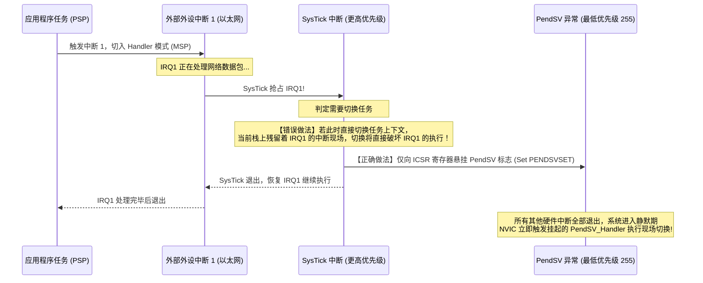

# PendSV 汇编现场切换

## 1. 为什么上下文切换必须推迟到 PendSV？

在早期的嵌入式 OS 移植中，上下文切换常直接在 SysTick 或外部外设的中断服务程序（ISR）内部直接触发。然而，这会在**中断嵌套**场景下引发严重灾难：



> [!IMPORTANT]
> **设计铁律**：PendSV（Pended Service Call）的硬件优先级必须被设置为**系统最低优先级（0xFF）**。  
> 将 PendSV 设为最低优先级后，上下文切换会在更高优先级的中断处理完毕后执行。

---

## 2. 启动第一个任务：`vPortSVCHandler`

系统调用 `vTaskStartScheduler()` 会配置 SysTick 和 PendSV 优先级，最后执行 `svc 0` 软中断以启动第一个就绪任务。

以下以官方 [FreeRTOS V10.5.1 portable/GCC/ARM_CM4F/port.c](https://raw.githubusercontent.com/FreeRTOS/FreeRTOS-Kernel/V10.5.1/portable/GCC/ARM_CM4F/port.c) 为基准：

```assembly
    .syntax unified
    .thumb
    .global vPortSVCHandler

vPortSVCHandler:
    ldr r3, =pxCurrentTCB      /* 1. 加载指向当前 TCB 的二级指针地址 */
    ldr r1, [r3]               /* 2. r1 = pxCurrentTCB */
    ldr r0, [r1]               /* 3. r0 = *pxCurrentTCB (偏移量 0 即 pxTopOfStack) */
    
    ldmia r0!, {r4-r11, r14}   /* 4. 弹出软件上下文: R4~R11 以及初始化的 EXC_RETURN (r14) */
    msr psp, r0                /* 5. 将恢复后的栈顶赋予进程堆栈指针 PSP */
    isb                        /* 指令同步屏障: 确保后续指令立即使用新 PSP */
    
    mov r0, #0
    msr basepri, r0            /* 6. 将 BASEPRI 清零，放行所有受管中断 */
    
    bx r14                     /* 7. 异常返回: 硬件自动从 PSP 出栈 (R0-R3, R12, LR, PC, xPSR) 并跳入任务入口 */
```

> [!NOTE]
> **为何 CM4F 端口的 SVC 出栈需要包含 `r14`？**  
> * **Cortex-M3 纯整型端口**：任务创建时栈上只压入 R4~R11，退出时写死 `orr r14, #0xd` 即可。  
> * **Cortex-M4F 浮点端口**：在任务初始化 `pxPortInitialiseStack()` 时，栈顶预设了包含浮点状态位的初始 `portINITIAL_EXC_RETURN`（如 `0xfffffffd`）。因此出栈必须同时恢复 `{r4-r11, r14}`，使 `bx r14` 能根据任务自身是否使用 FPU 动态决定硬件出栈行为。

---

## 3. 上下文切换核心：`xPortPendSVHandler` 官方逐行汇编精析

当任务需要主动让出 CPU（`portYIELD()`）或被高优先级任务抢占时，内核悬挂 PendSV。由于其优先级为最低（0xFF），待所有活跃中断全部退出后，NVIC 触发 `xPortPendSVHandler`。此时 CPU 硬件已自动将 Caller 寄存器（xPSR, PC, LR, R12, R0~R3）压入 PSP。

```assembly
    .syntax unified
    .thumb
    .global xPortPendSVHandler

xPortPendSVHandler:
    mrs r0, psp                /* 1. 读取当前任务正在使用的 PSP 栈顶到 r0 */
    isb

    ldr r3, =pxCurrentTCB      /* 2. 获取 pxCurrentTCB 指针地址 */
    ldr r2, [r3]               /* r2 = pxCurrentTCB 首地址 */

    /* ---------- FPU 浮点上下文检测与压栈 ---------- */
    tst r14, #0x10             /* 测试 EXC_RETURN 的 Bit 4 (0: 使用了 FPU 扩展帧, 1: 标准帧) */
    it eq
    vstmdbeq r0!, {s16-s31}    /* 若使用了 FPU，软件将浮点高阶寄存器 s16~s31 压栈 */

    /* ---------- 软件保存 Callee 寄存器与 EXC_RETURN ---------- */
    stmdb r0!, {r4-r11, r14}   /* 将通用寄存器 R4~R11 与当前的 EXC_RETURN(r14) 压入任务栈 */
    str r0, [r2]               /* 3. 将最终计算出的栈顶地址回写到 pxCurrentTCB->pxTopOfStack */

    /* ---------- BASEPRI 屏蔽受管中断 (进入调度临界区) ---------- */
    mov r0, #configMAX_SYSCALL_INTERRUPT_PRIORITY
    msr basepri, r0            /* 4. 关键: 仅屏蔽优先级 <= MAX_SYSCALL 的中断，绝不使用粗暴的 cpsid i */
    dsb
    isb

    /* ---------- 决算新任务 ---------- */
    bl vTaskSwitchContext      /* 5. 调用 C 调度器: 选出新的最高就绪任务，更新 pxCurrentTCB */

    /* ---------- 退出调度临界区，恢复 BASEPRI ---------- */
    mov r0, #0
    msr basepri, r0            /* 6. 恢复 BASEPRI = 0，重新使能所有可屏蔽中断 */
    dsb
    isb

    /* ---------- 加载新任务现场 ---------- */
    ldr r3, =pxCurrentTCB      /* 7. 重新加载最新被选出的 pxCurrentTCB */
    ldr r1, [r3]               /* r1 = 新任务 TCB 首地址 */
    ldr r0, [r1]               /* 8. r0 = 新任务的 pxTopOfStack */

    /* ---------- 恢复 Callee 通用寄存器与 EXC_RETURN ---------- */
    ldmia r0!, {r4-r11, r14}   /* 弹出 R4~R11 与新任务切出时保存的 EXC_RETURN 到 r14 */

    /* ---------- 恢复新任务的浮点状态 ---------- */
    tst r14, #0x10             /* 检查新任务切出时是否使用了 FPU */
    it eq
    vldmiaeq r0!, {s16-s31}    /* 若使用了 FPU，恢复对应的 s16~s31 浮点寄存器 */

    msr psp, r0                /* 9. 将恢复后的最新栈顶写回硬件 PSP 寄存器 */
    isb

    bx r14                     /* 10. 异常返回: 硬件根据 r14 自动从 PSP 弹出 8 个基础寄存器并跳入任务 */
```

### 3.1 为什么调度临界区严禁使用 `cpsid i`？
在官方 ARM_CM4F 端口中，调度器决算（`vTaskSwitchContext`）必须使用：
```assembly
mov r0, #configMAX_SYSCALL_INTERRUPT_PRIORITY
msr basepri, r0
```
如果改用 `cpsid i`（修改 PRIMASK），不调用内核 API 的可屏蔽中断也会被阻塞。BASEPRI 按优先级屏蔽中断，使高于阈值的中断仍可响应；这些中断不能调用受该临界区保护的内核 API。
