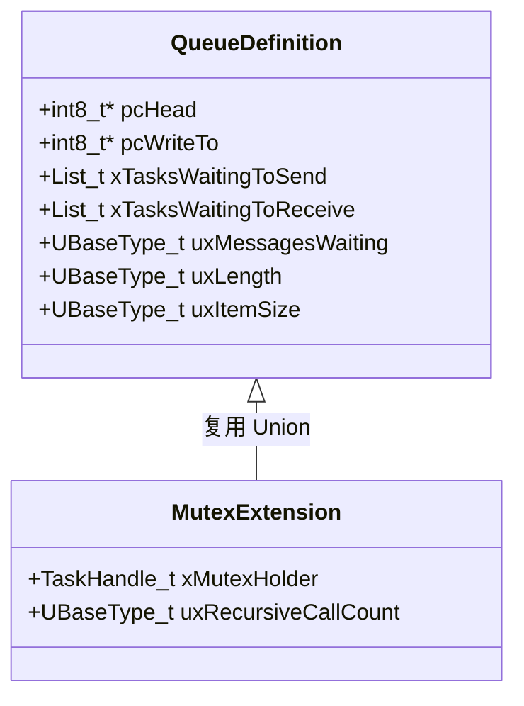
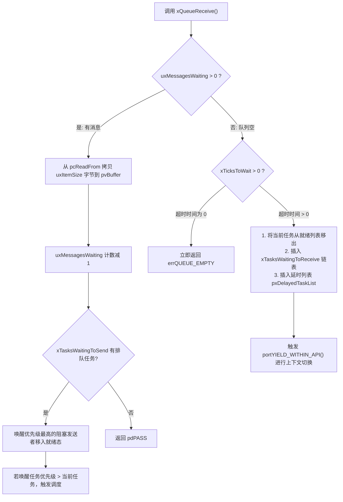
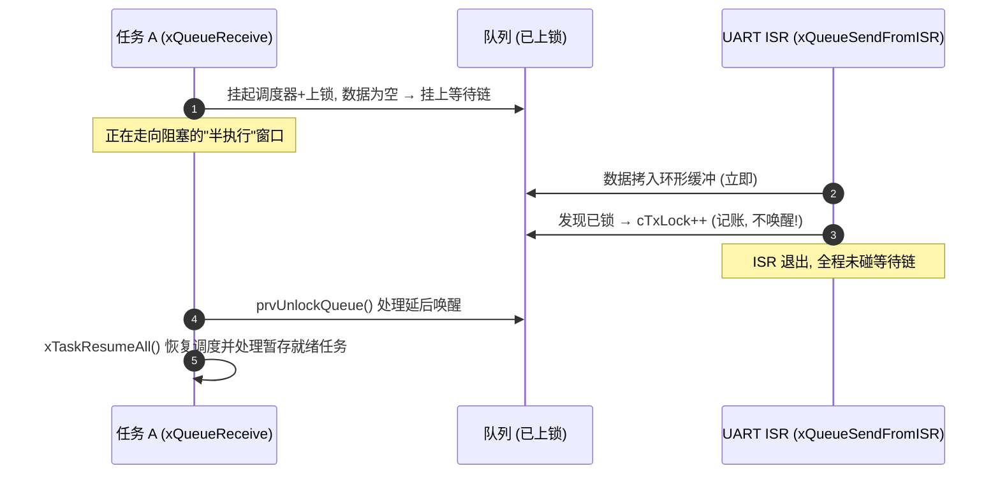

# Queue 队列与互斥量继承

## 1. `Queue_t` 控制块底层内存结构

在 FreeRTOS 中，**信号量（Semaphore）和互斥锁（Mutex）在底层完全基于 `Queue_t` 结构体实现**。理解了 `Queue_t`，就理解了 FreeRTOS 整个 IPC 体系的基石。

```c
typedef struct QueueDefinition
{
    int8_t *pcHead;                 /* 指向队列物理存储区首地址 (RAM 起点) */
    int8_t *pcWriteTo;              /* 指向下一个写入位置 (环形写指针) */

    union
    {
        QueuePointers_t xQueue;     /* 用于队列模式: pcTail 指向环形存储末端, pcReadFrom 指向读位置 */
        SemaphoreData_t xSemaphore; /* 用于互斥量模式: 记录锁占有者 TCB (xMutexHolder) 及递归计数 */
    } u;

    List_t xTasksWaitingToSend;     /* 等待发送的任务链表 (当队列满时，生产者在此按优先级降序排队) */
    List_t xTasksWaitingToReceive;  /* 等待接收的任务链表 (当队列空时，消费者在此按优先级降序排队) */

    volatile UBaseType_t uxMessagesWaiting; /* 当前队列中有效消息个数 */
    UBaseType_t uxLength;           /* 队列最大容量 (消息槽数) */
    UBaseType_t uxItemSize;         /* 单个消息的字节大小 (若为 0 则为信号量) */

    volatile int8_t cRxLock;        /* 队列锁状态: 记录在临界区内 ISR 移出消息的计数 */
    volatile int8_t cTxLock;        /* 队列锁状态: 记录在临界区内 ISR 写入消息的计数 */
} xQUEUE;
```



---

## 2. 队列阻塞与唤醒状态机

当调用 `xQueueReceive(xQueue, pvBuffer, xTicksToWait)` 时：



---

## 3. 互斥量（Mutex）如何实现优先级继承？

在 FreeRTOS 中，互斥量实质上是一个容量 `uxLength = 1` 且消息大小 `uxItemSize = 0` 的特殊队列。其 `u.xSemaphore.xMutexHolder` 保存了当前持有该互斥量的任务 TCB 指针。

### 3.1 继承发生点（`xQueueGenericReceive`）
当任务 $A$（优先级 10）尝试获取互斥锁，发现锁已被任务 $B$（优先级 2）占有：

```c
/* 简化内核核心源码逻辑 */
if( ( pxQueue->uxQueueType == queueQUEUE_IS_MUTEX ) )
{
    taskENTER_CRITICAL();
    {
        /* 检查持有者优先级是否低于申请者 */
        if( pxQueue->u.xSemaphore.xMutexHolder->uxPriority < pxCurrentTCB->uxPriority )
        {
            /* 动态提升持有者任务优先级 */
            vTaskPriorityInherit( ( TaskHandle_t ) pxQueue->u.xSemaphore.xMutexHolder );
        }
    }
    taskEXIT_CRITICAL();
}
```

### 3.2 恢复发生点（`xQueueGenericSend` / `xSemaphoreGive`）与 `xTaskPriorityDisinherit`

当任务 $B$ 退出临界区并调用 `xSemaphoreGive()` 释放锁时，内核最终调用 `xTaskPriorityDisinherit()`（参考官方 [FreeRTOS V10.5.1 tasks.c](https://raw.githubusercontent.com/FreeRTOS/FreeRTOS-Kernel/V10.5.1/tasks.c)）：

```c
/* 据 FreeRTOS V10.5.1 节选；省略部分断言、注释和覆盖率分支，非独立编译单元。 */
BaseType_t xTaskPriorityDisinherit( TaskHandle_t const pxMutexHolder )
{
    TCB_t * const pxTCB = pxMutexHolder;
    BaseType_t xReturn = pdFALSE;

    if( pxMutexHolder != NULL )
    {
        /* 1. 持有锁计数递减 */
        ( pxTCB->uxMutexesHeld )--;

        /* 2. 检查当前是否处于优先级被继承提升的状态 */
        if( pxTCB->uxPriority != pxTCB->uxBasePriority )
        {
            /* 3. 【关键前提】仅当该任务持有的所有互斥量全部释放完毕时，才降回基础优先级! */
            if( pxTCB->uxMutexesHeld == ( UBaseType_t ) 0 )
            {
                if( uxListRemove( &( pxTCB->xStateListItem ) ) == ( UBaseType_t ) 0 )
                {
                    portRESET_READY_PRIORITY( pxTCB->uxPriority, uxTopReadyPriority );
                }
                /* 降回原始基础优先级 */
                traceTASK_PRIORITY_DISINHERIT( pxTCB, pxTCB->uxBasePriority );
                pxTCB->uxPriority = pxTCB->uxBasePriority;

                listSET_LIST_ITEM_VALUE( &( pxTCB->xEventListItem ),
                    ( TickType_t ) configMAX_PRIORITIES - ( TickType_t ) pxTCB->uxPriority );
                prvAddTaskToReadyList( pxTCB );

                xReturn = pdTRUE;
            }
            else
            {
                /* 依然持有其他互斥锁: 不降级，维持当前继承的高优先级! */
                mtCOVERAGE_TEST_MARKER();
            }
        }
    }
    return xReturn;
}
```

!!! warning
    **多锁嵌套反例与工程等待时延影响（Nested Mutex Caveat）**：

    假设任务 $L$（基础优先级 2）依次获取了 **Mutex 1** 和 **Mutex 2**：
    1. 高优先级任务 $H$（优先级 10）请求 Mutex 1 发生阻塞，$L$ 的优先级被继承提升至 10；
    2. 任务 $L$ 执行完相关逻辑，调用 `xSemaphoreGive(Mutex 1)` 释放了 Mutex 1；
    3. **内核关键行为**：此时由于任务 $L$ 还持有 Mutex 2（`uxMutexesHeld = 1`），FreeRTOS **并不会将 $L$ 立即降回优先级 2**，而是继续保持在优先级 10！
    4. **设计取舍机理**：该版本采用简化的优先级继承机制；在这条正常释放路径上，不会逐锁重新计算仍需继承的优先级。代价是任务 $L$ 在持有 Mutex 2 期间会继续以优先级 10 执行，从而可能在短时间内延迟其他中间优先级任务的执行。在此正常释放路径中，只有当 $L$ 将所持有的**最后一把互斥量释放（`uxMutexesHeld == 0`）**后，才会真正恢复为原始的 `uxBasePriority`。


以上讨论限定于正常释放路径；等待超时还涉及 `vTaskPriorityDisinheritAfterTimeout()`，不能将“释放最后一把锁”概括成所有降级场景。

---

## 4. 队列锁：`cRxLock`/`cTxLock` 与延迟事件处理

这是 `queue.c` 源码中最常被教程跳过、却最能体现设计功力的机制。第 1 节结构体里那两个不起眼的 `int8_t` 字段，是任务级操作与 ISR 操作**安全交错**的关键。

### 4.1 问题：ISR 撞上"半执行"的队列操作

任务级的 `xQueueReceive` **不是**全程处在关中断临界区里（那会拖垮中断延迟）。它的骨架是：

```text
xQueueReceive():
    短临界区内检查队列；有数据则拷贝并返回
    仅在无数据且允许等待时进入阻塞准备分支:
    vTaskSuspendAll()          ← 挂起调度器 (uxSchedulerSuspended++)
    prvLockQueue(pxQueue)      ← 队列上锁 (cRxLock/cTxLock = 0)
    重新检查超时和队列是否仍为空
    [若需阻塞] 把自己挂上 xTasksWaitingToReceive + 延时链
    prvUnlockQueue()           ← 调度器仍挂起时处理延后唤醒
    xTaskResumeAll()           ← 恢复调度器，处理暂存就绪任务
```

危险窗口在 **上锁之后、彻底阻塞之前**：此刻任务正在事件链上排队但状态尚未冻结，若此刻 ISR 打进来并直接调用 `xTaskRemoveFromEventList()` 唤醒它——就绪链更新发生在调度器挂起期间，与主流程的状态推进竞态，内核链表可能被写坏。

### 4.2 解法：数据照搬，唤醒记账

FromISR 路径遇到已上锁的队列时：**环形缓冲的数据拷贝立即执行**（短临界区内安全），而**唤醒动作被记为欠账**——给对应计数器 +1：

```c
/* ISR 接收路径的控制流示意，省略返回值与跟踪字段 */
UBaseType_t saved = portSET_INTERRUPT_MASK_FROM_ISR();
{
    if( pxQueue->uxMessagesWaiting > ( UBaseType_t ) 0 )
    {
        prvCopyDataFromQueue( pxQueue, pvBuffer );            /* 数据照常搬走 */
        pxQueue->uxMessagesWaiting--;

        if( pxQueue->cRxLock == queueUNLOCKED )     /* 未锁: 立即唤醒等待的发送者 */
        {
            if( listLIST_IS_EMPTY( &pxQueue->xTasksWaitingToSend ) == pdFALSE )
            {
                if( xTaskRemoveFromEventList( &pxQueue->xTasksWaitingToSend ) != pdFALSE )
                {
                    *pxHigherPriorityTaskWoken = pdTRUE; /* 示例假定指针非 NULL；由 ISR 调用方请求切换 */
                }
            }
        }
        else
        {
            prvIncrementQueueRxLock( pxQueue, pxQueue->cRxLock );                     /* 已锁: 只记账, 欠一次"唤醒发送者" */
        }
    }
    /* 省略空队列处理 */
}
portCLEAR_INTERRUPT_MASK_FROM_ISR( saved );
```

计数器三态语义：

| `cTxLock`/`cRxLock` 值 | 队列状态 | 行为 |
| :--- | :--- | :--- |
| `queueUNLOCKED`（-1） | 自由 | 任务级/ISR 级操作均即时完成数据+事件处理 |
| `queueLOCKED_UNMODIFIED`（0） | 已锁、无欠账 | `prvLockQueue` 刚上锁的初始态 |
| $> 0$（N） | 已锁、欠 N 次事件 | ISR 每做一次数据操作 N++，唤醒推迟 |

队列函数在调度器仍挂起时调用 `prvUnlockQueue()`，随后才调用 `xTaskResumeAll()`；前者 把欠账清偿——按计数逐次唤醒等待者，最后把计数复位为 `queueUNLOCKED`：



!!! note
    **设计收益**：ISR 数据通路完全不需要知道任务侧正在做什么——最坏情况只是唤醒被推迟到解锁之后（微秒级），正确性依赖中断优先级与 API 使用约束。配合调度器挂起期的 `xPendingReadyList` 暂存机制（见[就绪列表页第 5.2 节](02-ready-lists-bitmap-scheduler.md)），整个内核实现了"**长操作不关中断、短临界区不记账**"的分层并发控制。


---

## 5. `xQueueGenericSend` 成功路径走读

队列为空且接收者在等待时的一次发送（以队列模式为例）：

```c
/* 据 V10.5.1 queue.c xQueueGenericSend 简化 (省略超时/队列集分支) */
taskENTER_CRITICAL();
{
    if( ( pxQueue->uxMessagesWaiting < pxQueue->uxLength ) || ( xCopyPosition == queueOVERWRITE ) )
    {
        prvCopyDataToQueue( pxQueue, pvItemToQueue, xCopyPosition );  /* ① */

        if( listLIST_IS_EMPTY( &( pxQueue->xTasksWaitingToReceive ) ) == pdFALSE )
        {
            if( xTaskRemoveFromEventList( &( pxQueue->xTasksWaitingToReceive ) ) != pdFALSE )
            {
                portYIELD_WITHIN_API();        /* ② 唤醒者优先级更高 → 立即切换 */
            }
        }
        xReturn = pdPASS;
    }
    else { /* 满: 走 4.1 的挂起-上锁-阻塞骨架 */ }
}
taskEXIT_CRITICAL();
```

`prvCopyDataToQueue()` 内部按队列类型分派，是"一个 `queue.c` 通吃全家"的落地现场：

| 队列类型 | 拷贝动作 | 附带动作 |
| :--- | :--- | :--- |
| 普通队列 | `memcpy` 到 `pcWriteTo` 后写指针步进（环形回卷） | 无 |
| `queueOVERWRITE`（长度 1 队列） | 覆盖已有值或写入空队列 | 断言长度为 1；覆盖已有值不增加消息数 |
| 计数信号量 | 不拷贝数据 | `uxMessagesWaiting++`（"写入"的是计数值） |
| 互斥量（give 路径） | 不拷贝数据 | **`xTaskPriorityDisinherit()`**（第 3.2 节） |

---

## 6. 信号量家族总表：选型与禁区

| 原语 | 创建 API | 几何参数 | 优先级继承 | ISR 可用性 | 典型用途 |
| :--- | :--- | :--- | :---: | :--- | :--- |
| 二值信号量 | `xSemaphoreCreateBinary()` | $1 \times 0$ | ❌ | give ✓ / take ✓ | ISR→任务的事件通知 |
| 计数信号量 | `xSemaphoreCreateCounting(max, init)` | $N \times 0$ | ❌ | ✓ | 资源池配额、事件累计 |
| 互斥量 | `xSemaphoreCreateMutex()` | $1 \times 0$ | ✓ | **双向禁止** | 共享资源互斥 |
| 递归互斥量 | `xSemaphoreCreateRecursiveMutex()` | $1 \times 0$ | ✓ | **双向禁止** | 可重入代码路径加锁 |
| 队列 | `xQueueCreate(len, size)` | $len \times size$ | ❌ | ✓ | 定长消息传递 |

!!! warning
    **互斥量为什么彻底禁入 ISR？** 优先级继承的操纵对象是"持有者任务的 TCB"（提升/恢复其 `uxPriority` 并做就绪链更新）。ISR 没有任务身份：take 会阻塞（ISR 不可阻塞）；give 则找不到持有者可 disinherite，且 give 时若持有者是任务，语义上 ISR 根本不可能是资源占有者——它只是"事件到达"的信使。**"ISR 里通知事件用二值信号量，任务间保护共享资源用互斥量"**，两者不可互换。


---

## 7. 任务通知：绕开队列的第三条路

`xTaskNotifyGive()` / `ulTaskNotifyTake()` 不创建任何 `Queue_t`——直接读写目标 TCB 内嵌的 `ulNotifiedValue` 与通知状态位，路径上没有环形缓冲拷贝、没有队列锁记账、没有事件链遍历。官方文档将其列为轻量级事件通知首选，通常可减少路径长度和独立对象内存。代价是**可多发送者、单目标接收**（定向投递给单个任务，不能广播、不能多消费者竞争）。完整机制见[任务通知、事件组与软件定时器](07-task-notifications-event-groups-timers.md)。

---

## 8. 现场排查：IPC 行为异常

| 症状 | 疑似根因 | 验证手段 |
| :--- | :--- | :--- |
| 发送任务死等在 `xQueueSend`，接收任务"在跑但收不到" | 接收端取走消息后处理过长，消费速率 < 生产速率（容量设计失配）；或接收任务实际阻塞在别处 | `uxQueueMessagesWaiting()` 定期采样看是否恒满；任务状态快照定位接收任务真实阻塞点 |
| ISR 里操作队列偶发死机/链表断言 | ISR 误用非 FromISR 版本（普通版本在临界区内部会尝试调度）；或该中断优先级数值低于 syscall 阈值仍调 API | 审查 ISR 代码的 API 后缀；核对 NVIC 优先级数值与 `configLIBRARY_MAX_SYSCALL_INTERRUPT_PRIORITY` |
| 中断唤醒任务"偶尔"迟一拍 | FromISR 之后 `portYIELD_FROM_ISR()` 被遗漏或参数恒为 pdFALSE | 逻辑分析仪量 ISR 退出到任务首指令延迟 |
| `xSemaphoreGive` 返回成功但对方 take 不到 | 用二值信号量做互斥，多次 give 导致计数漂移；或队列集路由吞掉事件 | 打印 give/take 次数配平；互斥需求改用 Mutex 并检查 `uxMessagesWaiting` |
| 互斥量保护的临界区偶发被第三方闯入 | 混用"互斥量+手动关中断"，或中断 handler 里直接读写了共享结构 | 审查共享资源的全部访问点；中断侧只允许"取数据入队，处理留任务" |
| 优先级继承开启仍出现长时间阻塞 | 多锁嵌套下释放非最后一把锁不降级（见第 3 节警告）；或持有者在临界区内长跑 | tracealyzer/SystemView 看持有者被提升后干了什么 |

## 参考

- [对应版本的官方文档或实现](https://github.com/FreeRTOS/FreeRTOS-Kernel/blob/V10.5.1/queue.c)
