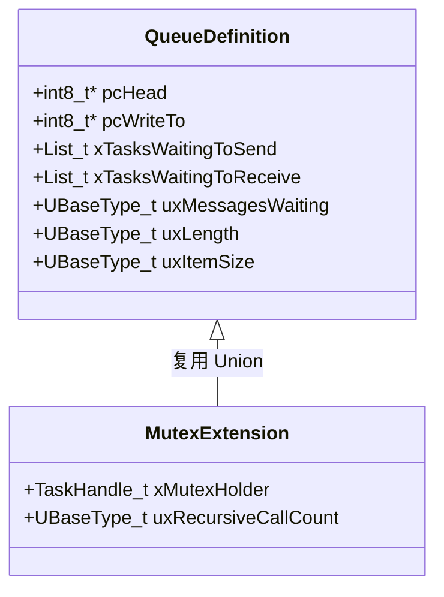
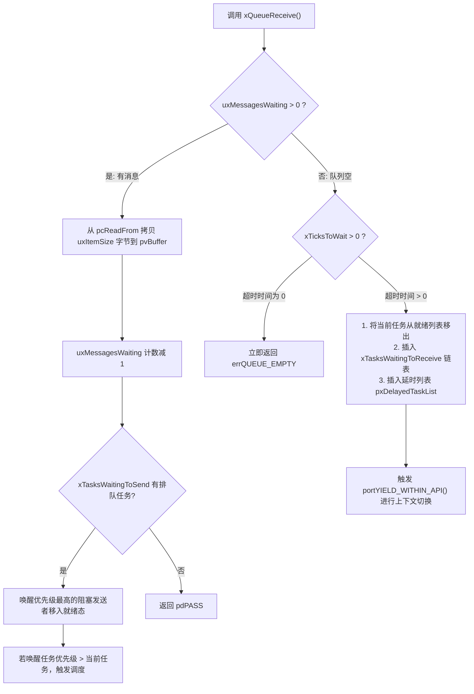

# Queue 队列与互斥量继承

## 1. `Queue_t` 控制块底层内存结构

在 FreeRTOS 中，**信号量（Semaphore）和互斥锁（Mutex）在底层完全基于 `Queue_t` 结构体实现**。理解了 `Queue_t`，就理解了 FreeRTOS 整个 IPC 体系的基石。

```c
typedef struct QueueDefinition
{
    int8_t *pcHead;                 /* 指向队列物理存储区首地址 (RAM 起点) */
    int8_t *pcWriteTo;              /* 指向下一个写入位置 (环形写指针) */

    union
    {
        QueuePointers_t xQueue;     /* 用于队列模式: pcTail 指向环形存储末端, pcReadFrom 指向读位置 */
        SemaphoreData_t xSemaphore; /* 用于互斥量模式: 记录锁占有者 TCB (xMutexHolder) 及递归计数 */
    } u;

    List_t xTasksWaitingToSend;     /* 等待发送的任务链表 (当队列满时，生产者在此按优先级降序排队) */
    List_t xTasksWaitingToReceive;  /* 等待接收的任务链表 (当队列空时，消费者在此按优先级降序排队) */

    volatile UBaseType_t uxMessagesWaiting; /* 当前队列中有效消息个数 */
    UBaseType_t uxLength;           /* 队列最大容量 (消息槽数) */
    UBaseType_t uxItemSize;         /* 单个消息的字节大小 (若为 0 则为信号量) */

    volatile int8_t cRxLock;        /* 队列锁状态: 记录在临界区内 ISR 移出消息的计数 */
    volatile int8_t cTxLock;        /* 队列锁状态: 记录在临界区内 ISR 写入消息的计数 */
} xQUEUE;
```



---

## 2. 队列阻塞与唤醒状态机

当调用 `xQueueReceive(xQueue, pvBuffer, xTicksToWait)` 时：



---

## 3. 互斥量（Mutex）如何实现优先级继承？

在 FreeRTOS 中，互斥量实质上是一个容量 `uxLength = 1` 且消息大小 `uxItemSize = 0` 的特殊队列。其 `u.xSemaphore.xMutexHolder` 保存了当前持有该互斥量的任务 TCB 指针。

### 3.1 继承发生点（`xQueueGenericReceive`）
当任务 $A$（优先级 10）尝试获取互斥锁，发现锁已被任务 $B$（优先级 2）占有：

```c
/* 简化内核核心源码逻辑 */
if( ( pxQueue->uxQueueType == queueQUEUE_IS_MUTEX ) )
{
    taskENTER_CRITICAL();
    {
        /* 检查持有者优先级是否低于申请者 */
        if( pxQueue->u.xSemaphore.xMutexHolder->uxPriority < pxCurrentTCB->uxPriority )
        {
            /* 动态提升持有者任务优先级 */
            vTaskPriorityInherit( ( TaskHandle_t ) pxQueue->u.xSemaphore.xMutexHolder );
        }
    }
    taskEXIT_CRITICAL();
}
```

### 3.2 恢复发生点（`xQueueGenericSend` / `xSemaphoreGive`）与 `xTaskPriorityDisinherit`

当任务 $B$ 退出临界区并调用 `xSemaphoreGive()` 释放锁时，内核最终调用 `xTaskPriorityDisinherit()`（参考官方 [FreeRTOS V10.5.1 tasks.c](https://raw.githubusercontent.com/FreeRTOS/FreeRTOS-Kernel/V10.5.1/tasks.c)）：

```c
/* 据 FreeRTOS V10.5.1 节选；省略部分断言、注释和覆盖率分支，非独立编译单元。 */
BaseType_t xTaskPriorityDisinherit( TaskHandle_t const pxMutexHolder )
{
    TCB_t * const pxTCB = pxMutexHolder;
    BaseType_t xReturn = pdFALSE;

    if( pxMutexHolder != NULL )
    {
        /* 1. 持有锁计数递减 */
        ( pxTCB->uxMutexesHeld )--;

        /* 2. 检查当前是否处于优先级被继承提升的状态 */
        if( pxTCB->uxPriority != pxTCB->uxBasePriority )
        {
            /* 3. 【关键前提】仅当该任务持有的所有互斥量全部释放完毕时，才降回基础优先级! */
            if( pxTCB->uxMutexesHeld == ( UBaseType_t ) 0 )
            {
                if( uxListRemove( &( pxTCB->xStateListItem ) ) == ( UBaseType_t ) 0 )
                {
                    portRESET_READY_PRIORITY( pxTCB->uxPriority, uxTopReadyPriority );
                }
                /* 降回原始基础优先级 */
                traceTASK_PRIORITY_DISINHERIT( pxTCB, pxTCB->uxBasePriority );
                pxTCB->uxPriority = pxTCB->uxBasePriority;
                
                listSET_LIST_ITEM_VALUE( &( pxTCB->xEventListItem ), 
                    ( TickType_t ) configMAX_PRIORITIES - ( TickType_t ) pxTCB->uxPriority );
                prvAddTaskToReadyList( pxTCB );

                xReturn = pdTRUE;
            }
            else
            {
                /* 依然持有其他互斥锁: 不降级，维持当前继承的高优先级! */
                mtCOVERAGE_TEST_MARKER();
            }
        }
    }
    return xReturn;
}
```

> [!WARNING]
> **多锁嵌套反例与工程等待时延影响（Nested Mutex Caveat）**：
> 
> 假设任务 $L$（基础优先级 2）依次获取了 **Mutex 1** 和 **Mutex 2**：
> 1. 高优先级任务 $H$（优先级 10）请求 Mutex 1 发生阻塞，$L$ 的优先级被继承提升至 10；
> 2. 任务 $L$ 执行完相关逻辑，调用 `xSemaphoreGive(Mutex 1)` 释放了 Mutex 1；
> 3. **内核关键行为**：此时由于任务 $L$ 还持有 Mutex 2（`uxMutexesHeld = 1`），FreeRTOS **并不会将 $L$ 立即降回优先级 2**，而是继续保持在优先级 10！
> 4. **设计取舍机理**：该版本采用简化的优先级继承机制；在这条正常释放路径上，不会逐锁重新计算仍需继承的优先级。代价是任务 $L$ 在持有 Mutex 2 期间会继续以优先级 10 执行，从而可能在短时间内延迟其他中间优先级任务的执行。在此正常释放路径中，只有当 $L$ 将所持有的**最后一把互斥量释放（`uxMutexesHeld == 0`）**后，才会真正恢复为原始的 `uxBasePriority`。

以上讨论限定于正常释放路径；等待超时还涉及 `vTaskPriorityDisinheritAfterTimeout()`，不能将“释放最后一把锁”概括成所有降级场景。
