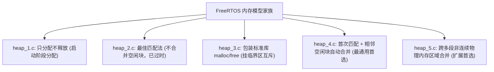
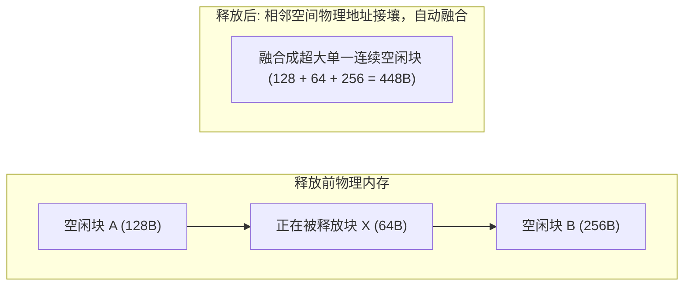

# 内存模型 heap_1 到 heap_5

FreeRTOS 将内存堆分配（`pvPortMalloc` 与 `vPortFree`）隔离在 `portable/MemMang/` 目录下，官方提供了 5 种不同设计取向的实现文件。



---

## 1. 深度对比矩阵

| 特性 | heap_1 | heap_2 | heap_3 | heap_4 | heap_5 |
| :--- | :--- | :--- | :--- | :--- | :--- |
| **支持 `vPortFree`** | ❌ 否 | ✅ 是 | ✅ 是 | ✅ 是 | ✅ 是 |
| **自动碎片合并** | 外部碎片为 0 | ❌ 否（易产生碎片） | 依赖 C 库 | ✅ 是（相邻自动融合成大块） | ✅ 是 |
| **执行时间确定性** | 极高（纯指针递增） | 随碎片增加退化 | 依赖 C 库 | 较高 | 较高 |
| **内存源** | 单一静态大数组 | 单一静态大数组 | 链接器堆（Heap） | 单一静态大数组 | **多个非连续硬件内存段** |
| **适用场景** | 汽车安全、工业认证 | 仅兼容历史代码 | 具备大物理 RAM | **90% 嵌入式项目首选** | 内部 SRAM + 外部 SDRAM |

---

## 2. 核心模型底层原理解析

### 2.1 `heap_1.c`：最安全的单向指针推进
* **机理**：在静态 RAM 中声明一个大数组 `ucHeap[configTOTAL_HEAP_SIZE]`。内部维护一个静态偏移量 `xNextFreeByte`。每次调用 `pvPortMalloc`，直接返回当前指针并将偏移量加上对齐后的字节数。
* **`vPortFree()` 实现**：函数体直接为空或断言拦截。
* **安全性**：**完全杜绝外部碎片与野指针释放引起的内存污染**。所有任务栈和队列在开机阶段初始化后永久驻留。

---

### 2.2 `heap_4.c`：相邻空闲块自动合并（First-Fit with Coalescence）
`heap_4.c` 是绝大多数 FreeRTOS 项目的标准配置。它在每个内存块前附加一个对齐的块头部结构体 `BlockLink_t`：

```c
typedef struct A_BLOCK_LINK
{
    struct A_BLOCK_LINK *pxNextFreeBlock; /* 指向下一个空闲块的单向链表指针 */
    size_t xBlockSize;                    /* 当前块总字节数 (最高位作为被占用 Allocated 标志) */
} BlockLink_t;
```

#### 相邻空闲块合并机理（Coalescence）
当释放一个内存块时，`heap_4` 按照物理内存地址升序遍历空闲链表：


* **有效抑制碎片**：多次小块频繁申请释放后，一旦接壤，算法在释放的瞬间立刻将其物理融合为一个大空闲块，极大地减缓了内存碎片化退化速度。

#### 空闲链表解剖：哨兵、分裂与占用标志位

heap_4 的空闲链表是**按物理地址严格升序**的单向链表，由静态头哨兵 xStart 与堆末端的 pxEnd 哨兵界定：

```text
xStart ──▶ [空闲块A @0x2000_0100] ──▶ [空闲块B @0x2000_0300] ──▶ pxEnd(xBlockSize=0, 位于堆的高地址端)
             ↑ pxNextFreeBlock 按地址递增串联, 与块大小无关
```

* **`xStart` / `pxEnd` 哨兵**：`pxEnd` 指向堆高地址端的零大小块，`prvInsertBlockIntoFreeList()` 插入遍历时以"插入块地址 < 后继块地址"为唯一停止条件——永不落空、无需 NULL 判断。
* **释放即三合一**：`vPortFree()` 把块按地址插回链表时，顺手检查与前驱、后继是否物理接壤，接壤即合并（正是上图 448B 融合的代码出处）。
* **块分裂阈值**：分配时若整块减去请求后剩余 $>$ `heapMINIMUM_BLOCK_SIZE`（= 两个 `BlockLink_t` 对齐后的最小可用块，具体取值依结构体大小和对齐要求），才分裂出余料小块挂回链表；否则整块交付，余料转为**内部碎片**（`xBlockSize` 大于请求但对外报"已用满"）。
* **最高位占用标志**：`vPortFree()` 先检查 `xBlockSize` 最高位——未置位说明它不是正常的已分配块，可能是重复释放或元数据损坏，`configASSERT` 直接拦截。这也是堆被前向越界写破坏时的第一道防线（块头被踩烂 → 最高位随机 → 大概率在此炸出而非静默污染）。
* **隐藏头部的指针算术**：`pvPortMalloc` 返回块头地址加上对齐后的 `xHeapStructSize`，用户指针前紧贴 8/16 字节块头；`vPortFree` 减去 `xHeapStructSize` 找回。任何对用户缓冲区的**前向越界写**首先谋杀的就是下一个块的 `pxNextFreeBlock`。

---

### 2.3 `heap_5.c`：跨物理非连续区域管理
在复杂嵌入式 SoC 中，RAM 往往分布在多个不连续的物理地址空间上（例如内部高速 SRAM 128KB @ `0x20000000`，外部低速 SDRAM 8MB @ `0xC0000000`）。

在使用 `heap_5` 之前，必须先在应用层显式调用 `vPortDefineHeapRegions()` 注入内存拓扑表：

```c
const HeapRegion_t xHeapRegions[] =
{
    { ( uint8_t * ) 0x20000000UL, 0x10000 }, /* 内部 SRAM: 64KB */
    { ( uint8_t * ) 0xC0000000UL, 0x800000 },/* 外部 SDRAM: 8MB */
    { NULL, 0 }                               /* 数组终止哨兵 */
};

vPortDefineHeapRegions( xHeapRegions );
```
`heap_5` 会将物理地址严格递增的各段离散空间虚拟串联进同一个空闲链表中，对外暴露统一的动态分配接口。

---

## 3. 并发保护与破坏防线

### 3.1 各 heap 的线程安全机制对比

| heap | 并发保护机制 | 保护期间中断是否运行 | 说明 |
| :--- | :--- | :--- | :--- |
| heap_1 | `vTaskSuspendAll()` 挂起调度器（V10.x） | 照常运行（高于阈值者可抢占） | 分配路径极短，挂起窗口微秒级 |
| heap_2 / heap_4 / heap_5 | `vTaskSuspendAll()` | 照常运行 | 走链表/合并操作较长，**不用关中断**正是为了不伤中断延迟 |
| heap_3 | `vTaskSuspendAll()` 包裹库 `malloc/free`（V10.x；newlib 场景另可配 `__malloc_lock` 钩子） | 照常运行 | 库分配器本身的线程安全由挂起调度器间接保证 |

!!! note
    共同点：**没有一个 heap 用关中断（PRIMASK/BASEPRI）做全程保护**——内存操作可能遍历整条空闲链，耗时不确定，关中断会直接污染全系统中断延迟上限。这与队列/调度器"短临界区用关中断、长操作用挂起调度器"的分层纪律一脉相承（见 [Queue 页第 4 节](04-queue-internals-semaphore-mutex.md)）。


### 3.2 破坏检测工具箱

| 手段 | 拦截时机 | 覆盖的故障 |
| :--- | :--- | :--- |
| `configASSERT( x )`（内核内部多处断言） | 运行期即时 | double free（最高位占用标志）、块尺寸非法 |
| `vApplicationMallocFailedHook()`（`configUSE_MALLOC_FAILED_HOOK = 1`） | `pvPortMalloc` 返回 NULL 前 | 堆耗尽/碎片化导致的分配失败——**比拿到 NULL 后解引用野指针早一步** |
| `vApplicationStackOverflowHook()`（`configCHECK_FOR_STACK_OVERFLOW = 2`） | 任务切换时机 | 任务栈向低地址越界踩进堆区（heap 与任务栈常相邻排布） |
| `xPortGetFreeHeapSize()` / `xPortGetMinimumEverFreeHeapSize()`（heap_4/5） | 主动巡检 | 高水位监测：运行 N 天后的最小剩余量 = 真实裕量，指导 `configTOTAL_HEAP_SIZE` 定容 |
| `configAPPLICATION_ALLOCATED_HEAP = 1` | 链接期 | 允许由链接脚本把 `ucHeap` 定位到指定段（如专用 SRAM 区、避开 DMA 侵扰区），`pvPortMalloc` 内部改用应用提供的缓冲 |

---

## 4. 现场排查：堆故障取证

| 症状 | 疑似根因 | 验证手段 |
| :--- | :--- | :--- |
| 运行数小时后 `pvPortMalloc` 间歇返回 NULL，复位即愈 | 碎片累积（频繁变长分配+释放）/ 任务/队列只建不删导致净泄漏 | 周期打印 `xPortGetFreeHeapSize()` 曲线：结合 xPortGetHeapStats() 对比总空闲量与最大空闲块，并记录分配/释放配对；总空闲量本身不能区分泄漏和碎片 |
| `vPortFree` 偶发 `configASSERT` 炸在最高位检查 | double free；或用户指针被改写/偏移后释放 | 在断言现场回溯该指针的全部持有路径；给 free 加"置空纪律"（释放后立刻 `ptr=NULL`） |
| 相邻任务数据被改，栈溢出检测却未报 | 越界方向向前（谋杀块头/下一块数据）而非栈底向下 | dump 被破坏块的前 8 字节——若 `pxNextFreeBlock` 变成 ASCII/递增计数，即某缓冲区前向越界写 |
| 大数组局部变量任务一启动就 HardFault | 任务栈深不足（含 200B 浮点帧场景），压到了相邻内存 | 复算调用链深度；开溢出检测 2 级；`uxTaskGetStackHighWaterMark()` 实测余量 |
| heap_5 区域部分内存"分不到" | `vPortDefineHeapRegions` 表未按地址升序/段重叠/漏终止哨兵 | 检查表中每段起址递增、`{NULL,0}` 收尾；对比 `xPortGetFreeHeapSize()` 与各段容量和 |

## 参考

- [对应版本的官方文档或实现](https://github.com/FreeRTOS/FreeRTOS-Kernel/blob/V10.5.1/portable/MemMang/heap_4.c)
