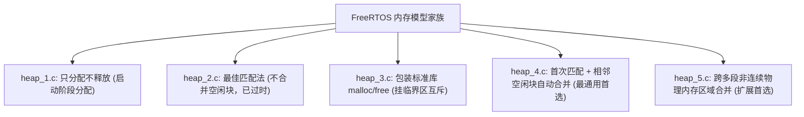
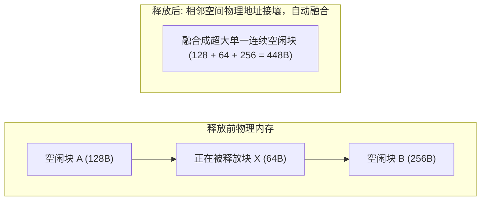

# 内存模型 heap_1 到 heap_5

FreeRTOS 将内存堆分配（`pvPortMalloc` 与 `vPortFree`）隔离在 `portable/MemMang/` 目录下，官方提供了 5 种不同设计取向的实现文件。



---

## 1. 深度对比矩阵

| 特性 | heap_1 | heap_2 | heap_3 | heap_4 | heap_5 |
| :--- | :--- | :--- | :--- | :--- | :--- |
| **支持 `vPortFree`** | ❌ 否 | ✅ 是 | ✅ 是 | ✅ 是 | ✅ 是 |
| **自动碎片合并** | 外部碎片为 0 | ❌ 否（易产生碎片） | 依赖 C 库 | ✅ 是（相邻自动融合成大块） | ✅ 是 |
| **执行时间确定性** | 极高（纯指针递增） | 随碎片增加退化 | 依赖 C 库 | 较高 | 较高 |
| **内存源** | 单一静态大数组 | 单一静态大数组 | 链接器堆（Heap） | 单一静态大数组 | **多个非连续硬件内存段** |
| **适用场景** | 汽车安全、工业认证 | 仅兼容历史代码 | 具备大物理 RAM | **90% 嵌入式项目首选** | 内部 SRAM + 外部 SDRAM |

---

## 2. 核心模型底层原理解析

### 2.1 `heap_1.c`：最安全的单向指针推进
* **机理**：在静态 RAM 中声明一个大数组 `ucHeap[configTOTAL_HEAP_SIZE]`。内部维护一个静态偏移量 `xNextFreeByte`。每次调用 `pvPortMalloc`，直接返回当前指针并将偏移量加上对齐后的字节数。
* **`vPortFree()` 实现**：函数体直接为空或断言拦截。
* **安全性**：**完全杜绝外部碎片与野指针释放引起的内存污染**。所有任务栈和队列在开机阶段初始化后永久驻留。

---

### 2.2 `heap_4.c`：相邻空闲块自动合并（First-Fit with Coalescence）
`heap_4.c` 是绝大多数 FreeRTOS 项目的标准配置。它在每个内存块前附加一个对齐的块头部结构体 `BlockLink_t`：

```c
typedef struct A_BLOCK_LINK
{
    struct A_BLOCK_LINK *pxNextFreeBlock; /* 指向下一个空闲块的单向链表指针 */
    size_t xBlockSize;                    /* 当前块总字节数 (最高位作为被占用 Allocated 标志) */
} BlockLink_t;
```

#### 相邻空闲块合并机理（Coalescence）
当释放一个内存块时，`heap_4` 按照物理内存地址升序遍历空闲链表：


* **有效抑制碎片**：多次小块频繁申请释放后，一旦接壤，算法在释放的瞬间立刻将其物理融合为一个大空闲块，极大地减缓了内存碎片化退化速度。

---

### 2.3 `heap_5.c`：跨物理非连续区域管理
在复杂嵌入式 SoC 中，RAM 往往分布在多个不连续的物理地址空间上（例如内部高速 SRAM 128KB @ `0x20000000`，外部低速 SDRAM 8MB @ `0xC0000000`）。

在使用 `heap_5` 之前，必须先在应用层显式调用 `vPortDefineHeapRegions()` 注入内存拓扑表：

```c
const HeapRegion_t xHeapRegions[] =
{
    { ( uint8_t * ) 0x20000000UL, 0x10000 }, /* 内部 SRAM: 64KB */
    { ( uint8_t * ) 0xC0000000UL, 0x800000 },/* 外部 SDRAM: 8MB */
    { NULL, 0 }                               /* 数组终止哨兵 */
};

vPortDefineHeapRegions( xHeapRegions );
```
`heap_5` 会将物理地址严格递增的各段离散空间虚拟串联进同一个空闲链表中，对外暴露统一的动态分配接口。
