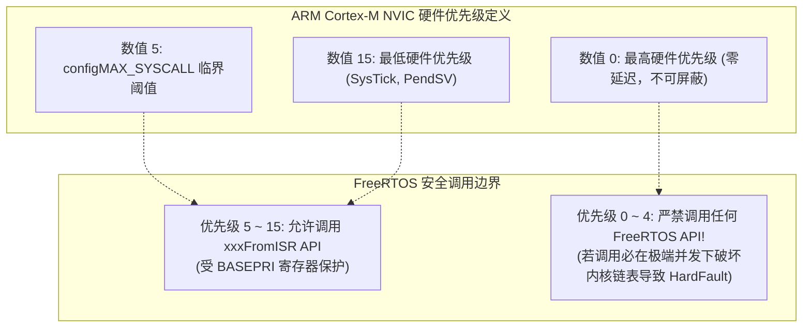
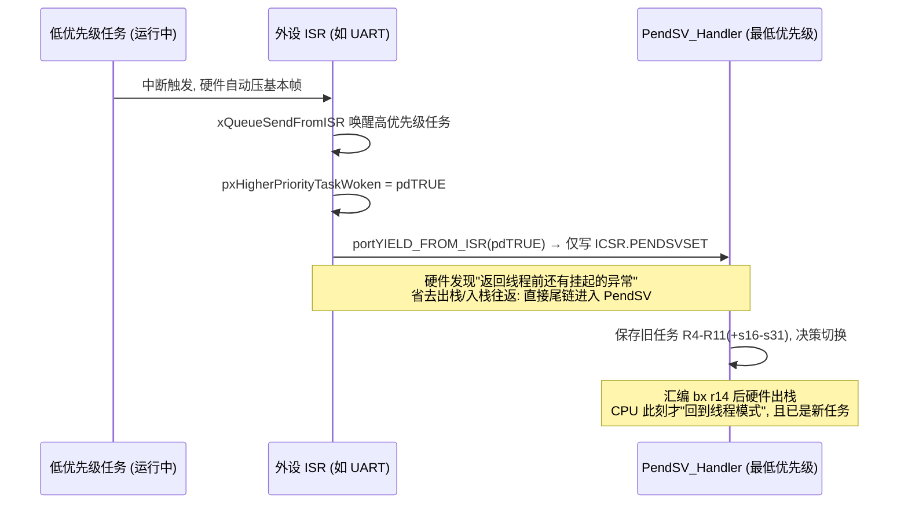

# 中断安全规范与工程踩坑

## 1. `xxxFromISR()` 语义设计哲学

在 FreeRTOS 中，所有可能被中断调用的 API 都有两个版本：
* 普通版本：如 `xQueueSend()`、`xSemaphoreGive()`
* 中断专用版本：如 `xQueueSendFromISR()`、`xSemaphoreGiveFromISR()`

### 为什么必须拆分两套 API？

1. **绝对不容许阻塞等待**：
   普通版本接受一个参数 `xTicksToWait`。如果在中断里调用并陷入阻塞挂起，因为中断上下文**没有独立 TCB**，CPU 将因破坏中断栈而直接产生 HardFault。因此 `FromISR` 系列**移除了阻塞等待入参**，队列满或锁已被占用时立即返回失败。
2. **上下文切换解耦**：
   `FromISR` 系列增加了一个关键指针出参：`BaseType_t *pxHigherPriorityTaskWoken`。
   如果中断里的操作（如写入队列）唤醒了一个比当前被中断任务优先级更高的任务，函数将该指针置为 `pdTRUE`。开发者在 ISR 结尾统一调用 `portYIELD_FROM_ISR()` 挂起 PendSV，确保中断内的多次 IPC 操作**只触发一次最终的上下文切换**。

```c
void USART1_IRQHandler(void)
{
    BaseType_t xHigherPriorityTaskWoken = pdFALSE;
    uint8_t rx_byte = USART1->DR;

    /* 中断安全写入队列，不阻塞 */
    xQueueSendFromISR(xRxQueue, &rx_byte, &xHigherPriorityTaskWoken);

    /* 若唤醒了高优先级任务，触发 PendSV 调度 */
    portYIELD_FROM_ISR(xHigherPriorityTaskWoken);
}
```

---

## 2. Cortex-M 中断优先级的“数值反转”陷阱

这是 FreeRTOS 开发中最隐蔽、导致随机死机的最高频根源：**ARM Cortex-M 架构的 NVIC 中断优先级数值越大，逻辑优先级越低！**



!!! warning
    **铁律准则**：凡是调用了 `FromISR` API 的硬件外设中断，其 NVIC 优先级数值**必须大于或等于** `configLIBRARY_MAX_SYSCALL_INTERRUPT_PRIORITY`！
    如果把一个调用了 `xQueueSendFromISR` 的串口中断优先级设为 0（最高），当内核正处于临界区修改全局链表时，该中断依然可以打断内核执行并修改同一链表，引发致命内存数据污染。


### 2.1 `configMAX_SYSCALL_INTERRUPT_PRIORITY` 绝不能为 0

Cortex-M 端口用 BASEPRI 实现临界区屏蔽：写 `BASEPRI = configMAX_SYSCALL_INTERRUPT_PRIORITY` 后，优先级寄存器数值**大于或等于**该非零阈值的可配置异常被屏蔽。BASEPRI 的一个硬件特性是**写 0 等于"完全不屏蔽"**（0 是"无效值/解除屏蔽"）。因此若把该宏设为 0：

* 所有 `taskENTER_CRITICAL()` 变成空操作，内核在"以为已上锁"的状态下裸奔修改就绪链、延时链；
* 任何优先级（包括 0 级）的 ISR 都能中途杀入并经 FromISR API 触碰同一批链表；
* 故障形态是**极低概率的随机链表损坏/HardFault**，复现率随中断负载上升，是官方支持论坛多年来的最高频事故源之一。

**合规判定法**（以 4 位优先级、`configLIBRARY_MAX_SYSCALL_INTERRUPT_PRIORITY = 5` 为例）：

```text
数值 0 ────── 4  │  5 ────────────────────── 15
  零延迟区        │  RTOS 可管理区
  禁止一切内核 API │  可调用 FromISR API
  (急停/高频采样)  │  (低于等于 PendSV 的 SysTick 在 15)
```

写任何 `NVIC_SetPriority()` 之前自问：*这个 ISR 调内核 API 吗？* 调 → 数值 ≥ 5；不调但必须零延迟 → 0~4 合法；**既想 0~4 又想调 API = 设计错误**，把通知动作挪进低优先级软中断或任务。

---

## 3. `FromISR` API 白名单速查

| 类别 | API | 说明 |
| :--- | :--- | :--- |
| ✅ 队列 | `xQueueSendFromISR` / `xQueueReceiveFromISR` / `xQueueOverwriteFromISR` | 收发均可，永不阻塞 |
| ✅ 信号量 | `xSemaphoreGiveFromISR` | 二值/计数可用，互斥量不适用（无持有者语义） |
| ✅ 信号量 | `xSemaphoreTakeFromISR` | 非阻塞获取二值/计数信号量；无令牌时立即失败 |
| 🚫 互斥量 | 互斥量的一切操作 | 依赖任务所有权和优先级继承，ISR 无任务身份 |
| ✅ 任务通知 | `vTaskNotifyGiveFromISR` / `xTaskNotifyFromISR` | 最轻量的事件通路（见[第 7 页](07-task-notifications-event-groups-timers.md)） |
| ✅ 事件组 | `xEventGroupSetBitsFromISR` | 实现为"投递给守护任务的命令"，非直接操作；需 `configUSE_TIMERS` |
| ✅ 定时器 | `xTimerStartFromISR` 等五件套 | 同上，转命令入队 |
| ✅ 流/消息缓冲 | `xStreamBufferSendFromISR` / `xMessageBufferSendFromISR` 等 | SPSC 专用通道 |
| 🚫 任务控制 | `vTaskDelay` / `vTaskSuspend`（挂起他人）/ `xTaskCreate` | 阻塞或复杂调度手术，一律禁止 |
| ✅ 调度请求 | `portYIELD_FROM_ISR( x )` | 唯一被允许的"切换"动作 |

记忆法：**ISR 使用中断上下文和栈，只能调用支持该上下文的非阻塞接口**。

---

## 4. `portYIELD_FROM_ISR` 与尾链（Tail-Chaining）切换

Cortex-M 的异常尾链可减少出栈再入栈的开销；切换请求和 PendSV 本身仍有执行成本：



* **只挂一次**：ISR 里多次 FromISR 调用共享同一个 `xHigherPriorityTaskWoken` 变量，末尾一次 `portYIELD_FROM_ISR()` 统一触发——多个唤醒合并为一次切换。
* **为什么不直接在 ISR 里切换**：ISR 自己的中断现场尚在栈上，直接换任务栈会把 ISR 帧遗留给旧任务甚至踩坏；悬挂最低优先级的 PendSV，让它在"所有活跃中断全部退光、即将回线程模式"的安全时机统一执行（与 [PendSV 页第 1 节](03-context-switch-pendsv-assembly.md)的设计铁律同源）。
* **传 pdFALSE 也无害**：宏内部条件执行，无切换需求时不碰 ICSR。因此"拿不准就调用"是安全的，"该调不调"才有害。

---

## 5. 现场排查：高频事故取证指南

### 5.1 坑一：未配置 NVIC 优先级分组（Priority Grouping）
* **现象**：STM32 项目启动后，一进入任务调度或几个中断后直接进入 `HardFault_Handler` 或触发 `configASSERT` 断言。
* **根源**：ARM NVIC 支持抢占优先级（Preemption Priority）和子优先级（Subpriority）。FreeRTOS 要求**必须将所有中断位全部配置为抢占优先级**。
* **规避**：在初始化任何外设前，必须调用：
  ```c
  NVIC_PriorityGroupConfig( NVIC_PriorityGroup_4 ); // ST 标准库
  HAL_NVIC_SetPriorityGrouping(NVIC_PRIORITYGROUP_4); // STM32 HAL
  ```

### 5.2 坑二：任务内局部大数组导致栈溢出（Stack Overflow）
* **现象**：系统运行一段时间后，邻近任务的 TCB 数据被篡改，或变量莫名其妙被改写。
* **根源**：在任务函数内部声明了大数组（如 `char buffer[1024];`），而创建任务时仅分配了 `256 words`（1024 字节）栈空间。
* **规避**：
  1. 打开内核栈越界检查宏：`#define configCHECK_FOR_STACK_OVERFLOW 2`
  2. 实现回调函数：
     ```c
     void vApplicationStackOverflowHook(TaskHandle_t xTask, char *pcTaskName)
     {
         printf("ERROR: Task [%s] Stack Overflow!\n", pcTaskName);
         while(1); // 现场断点
     }
     ```

### 5.3 坑三：中断服务程序内调用非 FromISR 接口
* **现象**：在 ISR 内部误调用了 `xSemaphoreTake()` 或 `vTaskDelay()`。
* **结果**：编译可能不会报错，但在运行期会导致当前任务的栈状态混乱，触发处理器非法上下文异常。

### 5.4 症状→根因速查矩阵

| 症状 | 疑似根因 | 验证手段 |
| :--- | :--- | :--- |
| 偶发死机/链表断言，低概率、与中断负载正相关 | 某 ISR 优先级数值 < `configLIBRARY_MAX_SYSCALL_INTERRUPT_PRIORITY` 却调了内核 API；或该宏被设为 0 | 上电 dump 全部 `NVIC->IPR[]`，逐个核对调 API 的中断；在 `taskENTER_CRITICAL` 处断点看 BASEPRI 实际写入值 |
| HardFault，CFSR 指向 INVSTATE/加载 PC 到 0x00000000 类地址 | ISR 内调了非 FromISR 阻塞 API，栈帧被破坏 | 回溯调用栈是否含普通版 API；`configASSERT` 开启后多数在进入前被拦 |
| 系统能跑但某中断"偶尔不触发"/外设丢数据 | 临界区（`taskENTER_CRITICAL`）内执行时间过长，或 ISR 内while轮询等待硬件 | 逻辑分析仪量中断引脚到 ISR 入口延迟分布；审查临界区长度（预算：微秒级） |
| 唤醒的任务"迟一拍"执行 | ISR 尾漏调 `portYIELD_FROM_ISR()` | 量"ISR 退出→任务首指令"间距；逐个 ISR 审计结尾宏 |
| 一进调度/开若干中断即 HardFault | 优先级分组未设全抢占位（坑 5.1） | 检查 `SCB->AIRCR` PRIGROUP 值是否为全抢占分组 |
| 双核/复杂 DMA 场景随机栈破坏，单线程复现失败 | ISR 栈（MSP）余量不足：嵌套深度 = 高优先级 ISR 链 + PendSV 帧 + FPU 扩展帧 | 用 MSP 水位标记法实测 Handler 模式最大深度；加大启动文件的初始 MSP 或削减嵌套 |

## 参考

- [对应版本的官方文档或实现](https://github.com/FreeRTOS/FreeRTOS-Kernel/blob/V10.5.1/include/semphr.h)
