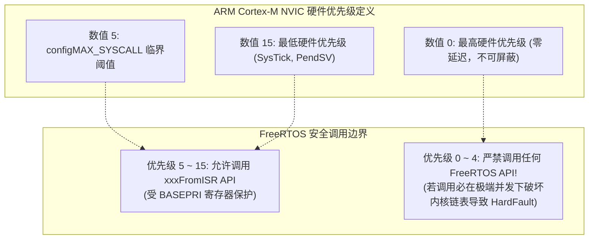

# 中断安全规范与工程踩坑

## 1. `xxxFromISR()` 语义设计哲学

在 FreeRTOS 中，所有可能被中断调用的 API 都有两个版本：
* 普通版本：如 `xQueueSend()`、`xSemaphoreGive()`
* 中断专用版本：如 `xQueueSendFromISR()`、`xSemaphoreGiveFromISR()`

### 为什么必须拆分两套 API？

1. **绝对不容许阻塞等待**：  
   普通版本接受一个参数 `xTicksToWait`。如果在中断里调用并陷入阻塞挂起，因为中断上下文**没有独立 TCB**，CPU 将因破坏中断栈而直接产生 HardFault。因此 `FromISR` 系列**移除了阻塞等待入参**，队列满或锁已被占用时立即返回失败。
2. **上下文切换解耦**：  
   `FromISR` 系列增加了一个关键指针出参：`BaseType_t *pxHigherPriorityTaskWoken`。  
   如果中断里的操作（如写入队列）唤醒了一个比当前被中断任务优先级更高的任务，函数将该指针置为 `pdTRUE`。开发者在 ISR 结尾统一调用 `portYIELD_FROM_ISR()` 挂起 PendSV，确保中断内的多次 IPC 操作**只触发一次最终的上下文切换**。

```c
void USART1_IRQHandler(void)
{
    BaseType_t xHigherPriorityTaskWoken = pdFALSE;
    uint8_t rx_byte = USART1->DR;

    /* 中断安全写入队列，不阻塞 */
    xQueueSendFromISR(xRxQueue, &rx_byte, &xHigherPriorityTaskWoken);

    /* 若唤醒了高优先级任务，触发 PendSV 调度 */
    portYIELD_FROM_ISR(xHigherPriorityTaskWoken);
}
```

---

## 2. Cortex-M 中断优先级的“数值反转”陷阱

这是 FreeRTOS 开发中最隐蔽、导致随机死机的最高频根源：**ARM Cortex-M 架构的 NVIC 中断优先级数值越大，逻辑优先级越低！**



> [!CAUTION]
> **铁律准则**：凡是调用了 `FromISR` API 的硬件外设中断，其 NVIC 优先级数值**必须大于或等于** `configLIBRARY_MAX_SYSCALL_INTERRUPT_PRIORITY`！  
> 如果把一个调用了 `xQueueSendFromISR` 的串口中断优先级设为 0（最高），当内核正处于临界区修改全局链表时，该中断依然可以无情打断内核执行并修改同一链表，引发致命内存数据污染。

---

## 3. 高频经典踩坑排查指南

### 3.1 坑一：未配置 NVIC 优先级分组（Priority Grouping）
* **现象**：STM32 项目启动后，一进入任务调度或几个中断后直接进入 `HardFault_Handler` 或触发 `configASSERT` 断言。
* **根源**：ARM NVIC 支持抢占优先级（Preemption Priority）和子优先级（Subpriority）。FreeRTOS 要求**必须将所有中断位全部配置为抢占优先级**。
* **规避**：在初始化任何外设前，必须调用：
  ```c
  NVIC_PriorityGroupConfig( NVIC_PriorityGroup_4 ); // ST 标准库
  HAL_NVIC_SetPriorityGrouping(NVIC_PRIORITYGROUP_4); // STM32 HAL
  ```

### 3.2 坑二：任务内局部大数组导致栈溢出（Stack Overflow）
* **现象**：系统运行一段时间后，邻近任务的 TCB 数据被篡改，或变量莫名其妙被改写。
* **根源**：在任务函数内部声明了大数组（如 `char buffer[1024];`），而创建任务时仅分配了 `256 words`（1024 字节）栈空间。
* **规避**：
  1. 打开内核栈越界检查宏：`#define configCHECK_FOR_STACK_OVERFLOW 2`
  2. 实现回调函数：
     ```c
     void vApplicationStackOverflowHook(TaskHandle_t xTask, char *pcTaskName)
     {
         printf("ERROR: Task [%s] Stack Overflow!\n", pcTaskName);
         while(1); // 现场断点
     }
     ```

### 3.3 坑三：中断服务程序内调用非 FromISR 接口
* **现象**：在 ISR 内部误调用了 `xSemaphoreTake()` 或 `vTaskDelay()`。
* **结果**：编译可能不会报错，但在运行期会导致当前任务的栈状态混乱，触发处理器非法上下文异常。
