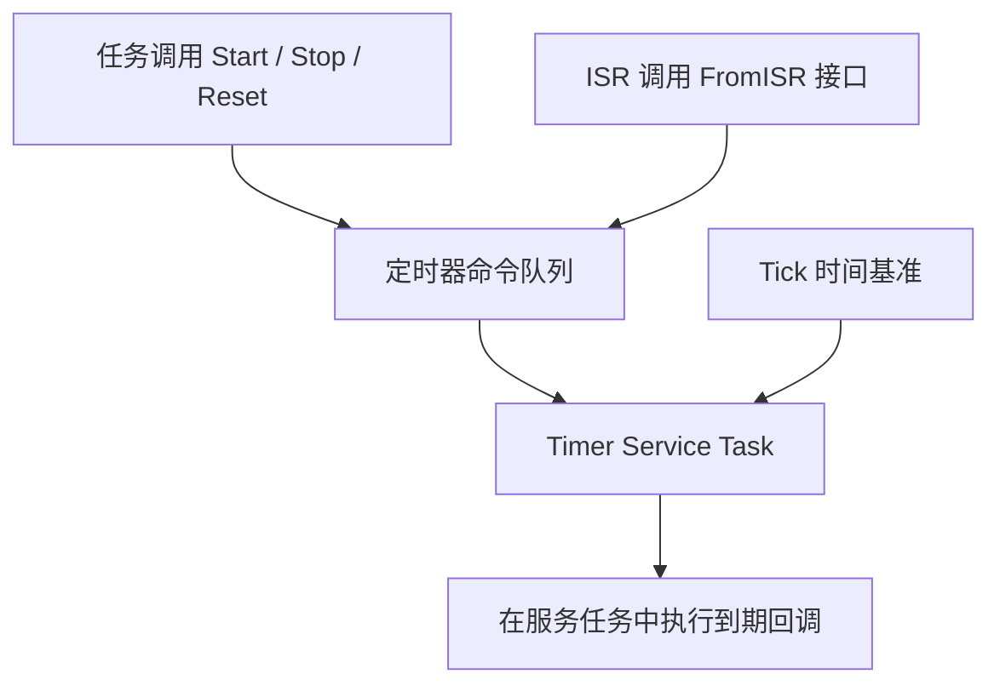

# 任务通知、事件组与软件定时器

本文按 FreeRTOS Kernel V10.5.1 说明接口语义；Tickless 示例以 Cortex-M 端口为背景。

## 1. 任务通知

任务通知把值和状态保存在目标任务的 TCB 中，无需单独创建队列或信号量对象。每个通知槽包含一个 32 位值和一个状态字段；这仍占用 TCB 空间，不能理解为没有内存成本。多个发送者可通知同一个任务，每个槽只有该目标任务接收。

| 动作 | 更新方式 | 注意事项 |
| :--- | :--- | :--- |
| `eSetBits` | 按位或 | 同一位的重复事件会合并，不保存次数 |
| `eIncrement` | 通知值加一 | 可用于计数；需考虑 32 位计数回绕 |
| `eSetValueWithOverwrite` | 覆盖旧值 | 尚未处理的值可能丢失 |
| `eSetValueWithoutOverwrite` | 仅当状态不是 `taskNOTIFICATION_RECEIVED` 时写入 | 失败时发送者需重试或处理丢弃 |
| `eNoAction` | 不修改值，只更新通知状态 | 用于单纯唤醒 |

`xTaskNotifyWait()` 可按参数清除入口/出口的位。入口清位只发生在没有待处理通知时；出口清位发生在成功接收后。需要计数信号量语义时可用 `xTaskNotifyGive()` 和 `ulTaskNotifyTake()`：后者在 `xClearCountOnExit=pdTRUE` 时清零，否则减一。

从 V10.4.0 起可通过 `configTASK_NOTIFICATION_ARRAY_ENTRIES` 配置多个槽，并使用 Indexed 接口。一个任务一次只能阻塞等待一个通知槽，不能同时等待任意槽；Stream/Message Buffer 默认使用索引 0，应避免冲突。

发送早于等待时，通知可保留为待处理状态；二值信号量也能保留一个令牌，这不是通知独有的能力。若每条消息都必须保留，应使用有容量和失败处理策略的队列。`Queue_t` 的大小随版本、端口和配置变化，应以目标构建的 `sizeof` 或 map 文件为准。

ISR 中使用 `xTaskNotifyFromISR()` 或 `vTaskNotifyGiveFromISR()`，并按 `pxHigherPriorityTaskWoken` 请求调度。

## 2. 事件组

事件组允许多个任务等待不同的事件位组合。在本文版本中，16 位 Tick 配置提供 8 个事件位，32 位配置提供 24 个事件位，其余位保留给内核。

```c
EventBits_t bits = xEventGroupWaitBits(group, mask,
                                      pdTRUE,  /* 成功时清除所等待的位 */
                                      pdFALSE, /* 任一位满足即可 */
                                      timeout);
```

`xWaitForAllBits=pdFALSE` 的满足条件为 `(bits & mask) != 0`；为 `pdTRUE` 时要求 `(bits & mask) == mask`。函数也可能因超时返回，因此必须检查返回位图。

一次 `xEventGroupSetBits()` 会在调度器挂起期间检查等待者。所有等待者先依据置位后的状态判定，随后统一清除请求自动清除的位；不能把它描述成第一个等待者清位后，其他已等待任务就收不到该事件。事件位不记录重复次数，后来的等待者仍可能错过已消费的位。

`xEventGroupSetBitsFromISR()` 将操作投递给 Timer Service Task，因为遍历等待者的耗时不适合直接放进 ISR。它依赖定时器服务配置，命令队列满时可能失败，返回成功也不代表置位已经完成。

`xEventGroupSync()` 把置位和等待全体位合并为屏障操作，适合多任务阶段同步；返回后同样应判定是否超时。

## 3. 软件定时器

软件定时器共享 RTOS Tick 和 Timer Service Task，不为每个定时器独立分配硬件定时器。



- `xTimerCreate()` 创建处于休眠状态的定时器，**不会自动启动**；需要另行调用 `xTimerStart()` 或 `xTimerReset()`。
- Start/Reset 命令以发送时记录的 Tick 为起点计算到期时间。服务任务调度或命令处理积压会推迟回调实际执行，不能把处理时刻当作统一的计时起点。
- `xAutoReload=pdTRUE` 表示周期定时器；单次定时器到期后停止，需再次启动。
- 使用 `pvTimerGetTimerID()` 读取用户 ID。动态创建的定时器删除时，由服务任务处理删除命令并回收其内存。

回调精度受 Tick 量化、服务任务优先级、其他回调耗时和系统负载影响。软件定时器也可用于毫秒级周期，但不能保证精确硬件边沿；严格时序动作应评估硬件定时器或外设触发。

回调不能阻塞，也不应执行长时间计算。在回调内调用定时器 API 时必须将等待时间设为 0，并检查命令入队是否成功；队列满时等待可能造成服务任务等待自己消费队列的死锁。

## 4. Tickless Idle

Tickless Idle 在预计空闲时间足够长时抑制周期 Tick 中断。它不保证进入某个深睡状态：睡眠深度、唤醒源和持续计时能力由端口及硬件决定。

```text
空闲任务估算可休眠的 Tick 数
  → configPRE_SUPPRESS_TICKS_AND_SLEEP_PROCESSING（若配置）
  → portSUPPRESS_TICKS_AND_SLEEP / vPortSuppressTicksAndSleep
      → 检查睡眠期间是否出现新的调度需求
      → 配置计时及唤醒
      → configPRE_SLEEP_PROCESSING
      → 等待唤醒（应用钩子也可接管睡眠）
      → configPOST_SLEEP_PROCESSING
      → 计算实际经过时间，恢复 Tick
```

常见端口用 `vTaskStepTick()` 跳过期间没有任务到期的完整 Tick；不能任意跨越下一个任务的唤醒期限，也不能将它当作逐任务处理到期事件的函数。到期边界还需由正常 Tick/调度路径处理，软件定时器回调仍由服务任务执行。

提前被外部事件唤醒时，只补偿实际经过的 Tick。若深睡会停止 SysTick 的时钟源，就需要仍在运行的计时源和对应端口支持，不能只修改一个配置宏。

## 5. 排查顺序

| 症状 | 先检查 |
| :--- | :--- |
| 所有软件定时器停滞 | 服务任务是否被回调阻塞；命令队列是否已满 |
| 回调延迟变大 | 服务任务优先级、其他回调耗时、Tick 分辨率 |
| 通知丢值或事件次数不符 | 覆盖动作、事件位合并、返回值及计数回绕 |
| ISR 置位事件后任务未及时运行 | 投递结果、服务任务是否获得 CPU、等待条件 |
| Tickless 后时间漂移 | 低功耗计时源、唤醒时长补偿及其分辨率 |

## 参考

- [V10.5.1 task.h：通知接口](https://github.com/FreeRTOS/FreeRTOS-Kernel/blob/V10.5.1/include/task.h)
- [V10.5.1 event_groups.c：等待者检查及 ISR 延后处理](https://github.com/FreeRTOS/FreeRTOS-Kernel/blob/V10.5.1/event_groups.c)
- [V10.5.1 timers.h：创建、启动与回调约束](https://github.com/FreeRTOS/FreeRTOS-Kernel/blob/V10.5.1/include/timers.h)
- [V10.5.1 ARM_CM4F port.c：Tickless 实现](https://github.com/FreeRTOS/FreeRTOS-Kernel/blob/V10.5.1/portable/GCC/ARM_CM4F/port.c)
