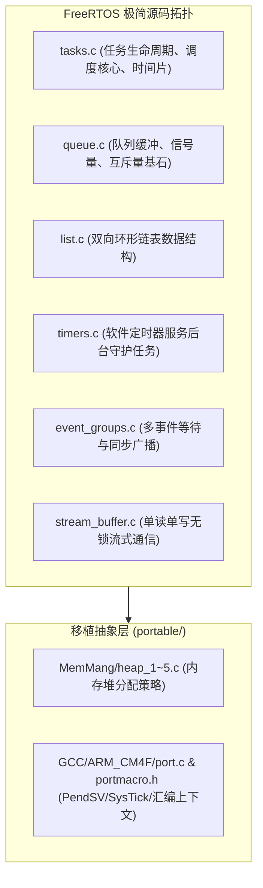

# 02 FreeRTOS 内核实现

FreeRTOS 由 Richard Barry 于 2003 年创立，是目前全球商用出货量最大、移植架构最广泛的嵌入式开源实时微内核之一。

FreeRTOS 的核心由少量 C 文件组成，不绑定硬件驱动框架。接入现有工程时，需要配置内核并提供目标处理器的移植层。

## 篇章目录

1. [FreeRTOS 架构哲学与源码拓扑](01-freertos-architecture-source-topology.md)
   - 极简微内核哲学与宏设计理念
   - 源码树物理布局：`Source/`、`portable/` 与 `FreeRTOSConfig.h`
   - 全局静态裁决体系（静态配置剪裁 vs 动态运行期开销）

2. [就绪列表与位图调度器](02-ready-lists-bitmap-scheduler.md)
   - `pxReadyTasksLists` 双向环形链表数组拓扑
   - 两种调度器查找实现：通用 C 循环遍历 vs 硬件前导零（CLZ）位图
   - 时间复杂度严格 $O(1)$ 的数学机理

3. [PendSV 汇编现场切换](03-context-switch-pendsv-assembly.md)
   - 为什么上下文切换必须推迟到 PendSV（Pended Service Call）执行？
   - Cortex-M3/M4/M7/M33 架构下的 `vPortSVCHandler` 与 `xPortPendSVHandler` 逐行汇编精析
   - 浮点单元（FPU）寄存器延迟压栈（Lazy Stacking）技术实战

4. [Queue 队列与互斥量继承](04-queue-internals-semaphore-mutex.md)
   - `Queue_t` 控制块底层内存结构：环形缓冲指针与双等待链表（`xTasksWaitingToSend` / `xTasksWaitingToReceive`）
   - 队列发送与接收的原子状态机：加锁计数、阻塞挂起与唤醒
   - 互斥量如何复用 Queue 实现、递归锁与优先级继承的代码级实现

5. [内存模型 heap_1 到 heap_5](05-heap-memory-models-comparison.md)
   - `heap_1.c`（只分配不释放，极高安全）
   - `heap_2.c`（最佳匹配法，历史遗留）
   - `heap_3.c`（封装标准库 malloc/free）
   - `heap_4.c`（相邻空闲块内存碎片自动合并，最常用）
   - `heap_5.c`（支持跨物理不连续内存区域合并，如内部 SRAM + 外部 SDRAM）

6. [中断安全规范与工程踩坑](06-freertos-isr-safety-pitfalls.md)
   - `xxxFromISR()` 语义设计初衷与 `pxHigherPriorityTaskWoken`
   - `configMAX_SYSCALL_INTERRUPT_PRIORITY` 的硬件中断优先级配置铁律
   - 常见现场死机原因：优先级反向配置、中断临界区内死等、栈溢出排查

7. [任务通知、事件组与软件定时器](07-task-notifications-event-groups-timers.md)
   - 任务通知：直写 TCB 的零对象开销 IPC、五种动作与索引变体
   - 事件组：位图等待语义与 `xEventGroupSync` 多方集合点
   - 软件定时器：守护任务 + 命令队列架构与回调铁律
   - Tickless Idle：停摆节拍、深睡决策链与唤醒后补偿
