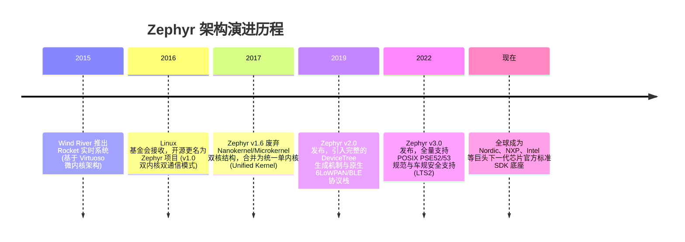
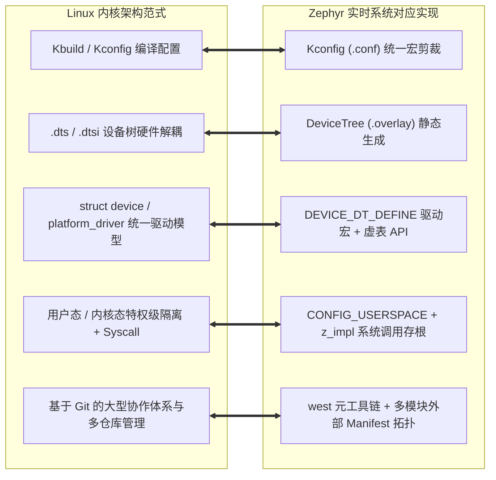

# 现代化演进与微内核谱系

## 1. Zephyr 的历史起源与架构演进

Zephyr 是 Linux 基金会旗下的开源顶级嵌入式实时操作系统项目（[官方文档](https://docs.zephyrproject.org/) 与 [GitHub 仓库](https://github.com/zephyrproject-rtos/zephyr)）。其诞生标志着嵌入式系统软件工程从“手工作坊式的极简微内核”向“平台化、标准化、软件定义硬件”的重大转型。本专题分析以 [Zephyr LTS 3.x 长期支持版](https://docs.zephyrproject.org/3.7.0/) 为基准。

### 1.1 从双内核（Dual-Kernel）到统一内核（Unified Kernel）的深刻转变
在早期版本中，Zephyr 模仿传统微内核设计，划分为两个实体：
* **Nanokernel**：负责最基础的中断和轻量级执行单元（Fiber）。
* **Microkernel**：运行在 Nanokernel 之上的高级任务（Task），支持复杂的 IPC 消息传递与管道。

**问题与重构**：微内核间的上下文通信（IPC）在微控制器上带来了较大的调用开销和内存抖动。在 v1.6 版本中，Zephyr 移除了复杂的微内核多服务架构，**重构为现代化的统一内核（Unified Kernel）**：所有线程使用统一的 `k_thread` 实体，保留极高实时响应的同时，大幅简化了内核调用路径。

---

## 2. 为什么 Zephyr 被称为“微缩版嵌入式 Linux”？

对于从 Linux 背景转入单片机 MCU 开发的工程师而言，Zephyr 具有天然的亲和力，它在架构范式上几乎完整移植了 Linux 的精髓：

### 2.1 与 Linux 的本质差异：静态绑定 vs 动态解析
虽然架构范式相近，但 Zephyr 针对嵌入式资源受限特性做了**编译期静态配置**：
1. **Linux 设备树**：DTS 编译成二进制的 DTB，由 Bootloader（U-Boot）传给 Linux 内核，在 Linux 启动阶段由内核在 RAM 中**动态解析并分配内存**构建设备节点树。
2. **Zephyr 设备树**：DTS 文件在**主机编译阶段**直接被 Python 脚本解析，直接生成精简的 C 语言头文件和静态结构体常数（`devicetree_generated.h`），**在 MCU 运行期零动态解析、零 RAM 内存占用**！
