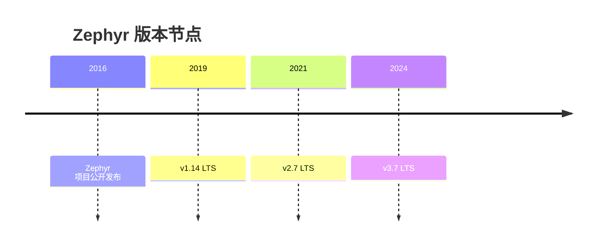
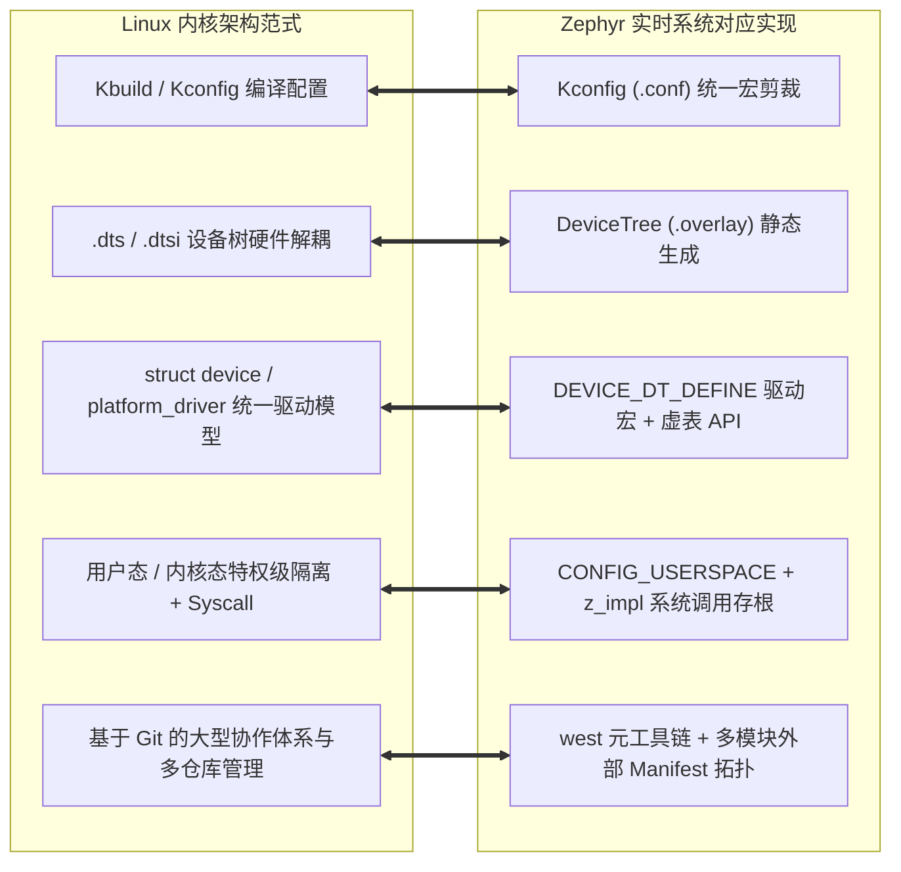

# 现代化演进与微内核谱系

## 1. Zephyr 的历史起源与架构演进

Zephyr 是 Linux 基金会旗下的开源嵌入式实时操作系统项目（[官方文档](https://docs.zephyrproject.org/) 与 [GitHub 仓库](https://github.com/zephyrproject-rtos/zephyr)）。它把内核、驱动、构建系统和板级描述放进同一套工程工具链，适合需要多芯片和多子系统协作的项目。本专题分析以 [Zephyr LTS 3.x 长期支持版](https://docs.zephyrproject.org/3.7.0/) 为基准。

版本历史参见 [Zephyr 3.7 发布文档](https://docs.zephyrproject.org/3.7.0/releases/index.html)。本文固定以 3.7.0 为阅读基准。

### 1.1 从双内核（Dual-Kernel）到统一内核（Unified Kernel）的深刻转变

在早期版本中，Zephyr 模仿传统微内核设计，划分为两个实体：
* **Nanokernel**：负责最基础的中断和轻量级执行单元（Fiber）。
* **Microkernel**：运行在 Nanokernel 之上的高级任务（Task），支持复杂的 IPC 消息传递与管道。

**问题与重构**：早期架构中的服务间通信会增加调用开销和内存管理复杂度。在 v1.6 版本中，Zephyr 将多个服务收拢到统一内核路径：所有线程使用统一的 `k_thread` 实体，减少了内核调用层次，也便于后续扩展。

---

## 2. 为什么 Zephyr 被称为“微缩版嵌入式 Linux”？

对于从 Linux 背景转入单片机 MCU 开发的工程师而言，Zephyr 具有天然的亲和力，它在架构范式上几乎完整移植了 Linux 的精髓：

### 2.1 与 Linux 的本质差异：静态绑定 vs 动态解析

虽然架构范式相近，但 Zephyr 针对嵌入式资源受限特性做了较多**编译期静态化**处理：

| 维度 | Linux 的动态世界 | Zephyr 的静态世界 |
| :--- | :--- | :--- |
| **设备树解析** | U-Boot 传 DTB → 内核启动期在 RAM 动态解析构树，`of_*` 接口运行期查找 | 主机编译期由 `gen_defines.py` 直接生成 C 宏头文件，运行期无需解析 DTS，但设备状态仍占 RAM |
| **驱动绑定** | 运行期 `probe()` 按总线枚举动态匹配 | 编译期由 DTS `status` 与 Kconfig 共同裁决是否链接进固件 |
| **内核对象** | `kmalloc` 运行期动态创建 | `K_SEM_DEFINE` 等宏静态放置进专属链接器段 |
| **系统调用表** | 由内核构建定义，不能通过普通模块任意扩展系统调用表 | 链接期静态生成 `z_mrsh_*` 分发表 |
| **配置裁决** | `sysctl` / 模块参数运行期可调 | Kconfig 编译期一锤定音，固件中不存在未选代码 |

---

## 3. 治理、许可证与生态出身对比

两大 RTOS 的技术分野，根源在于完全不同的“出身”与治理模型：

| 维度 | Zephyr | FreeRTOS |
| :--- | :--- | :--- |
| **治理主体** | Linux 基金会中立托管，TSC 技术委员会 + 数十家芯片原厂联合贡献 | AWS 主导维护（原 Real Time Engineers） |
| **开源许可证** | Apache 2.0（含专利授权条款，对商业闭源友好，无传染性） | MIT（极简宽松，无专利条款） |
| **贡献模型** | GitHub Pull Request 评审与 CI 检查 | 核心仓库集中维护，规模小、迭代快 |
| **版本策略** | 每年约 3 个 minor 版本 + 长期支持分支（如 v2.7 / v3.7；期限以发布公告为准） | 内核版本与 FreeRTOS LTS 发布分别管理，按项目锁定版本 |
| **生态重心** | 芯片原厂把 Zephyr 当“官方 SDK 底座”长期投资（nRF Connect SDK 即 Zephyr 超集） | 中间件与应用层厂商广泛集成，内核本身保持极小 |
| **供应链形态** | west manifest 拉取数十个模块仓库（HAL、CMSIS、mbedTLS、TinyCBOR…） | 单一 `FreeRTOS-Kernel` 仓库 + 各厂商 port 目录 |

!!! note
    **许可证细节的工程意义**：Apache 2.0 的显式专利授权使法务审查宽松；两者均允许产品闭源商用，不存在 GPL 式感染。真正的差别在**贡献治理**——Zephyr 的原厂联合贡献意味着新芯片支持通常“上游即得”，FreeRTOS 则依赖各原厂自行维护 port 与中间件适配。

---

## 4. 五大设计支柱

Zephyr 的全部子系统都构建在五根支柱之上，后续每个专题都是其中一根的展开：

| 支柱 | 解决的问题 | 核心机制 | 详见 |
| :--- | :--- | :--- | :--- |
| **DeviceTree 硬件描述** | 同一份应用/驱动代码跨板卡复用 | DTS/Overlay 描述硬件拓扑，编译期生成 C 宏 | [02 篇](02-build-system-kconfig-devicetree.md) |
| **Kconfig 软件裁剪** | 固件按需编译，未选代码零占用 | `CONFIG_*` 符号树 + 片段合并 | [02 篇](02-build-system-kconfig-devicetree.md) |
| **统一驱动模型** | 原厂 HAL 接口割裂 | `struct device` + API 虚表 + 编译期注册 | [04 篇](04-unified-driver-model.md) |
| **可伸缩内核** | 同一内核覆盖 8KB MCU 到多核 SMP | 统一 `k_thread`、可插拔调度器、`CONFIG_USERSPACE` 可关 | [03 / 06 篇](03-kernel-threads-scheduler-algorithms.md) |
| **安全纵深** | 无 MMU 设备上的故障隔离与可信启动 | MPU 用户态 + 系统调用校验 + MCUboot + TF-M 集成 | [06 篇](06-memory-protection-userspace-syscall.md) |

---

## 5. 版本策略与选型建议

面对具体项目，版本选择的决策要素：

1. **产品级长维护项目**：优先 LTS 分支（如 3.7 LTS）——按该分支公告获得维护，升级仍需回归验证；代价是拿不到新子系统特性。
2. **需要最新芯片/协议栈支持**：跟随最新 minor 版本——原厂新 SoC 的支持（devicetree、驱动、Linker）往往只进最新主线，回移植到 LTS 有延迟。
3. **跨版本升级成本**：minor 间以弃用告警渐进（`__DEPRECATED_MACRO`、`CONFIG_WARN_DEPRECATED`）；major（如 3.7 → 4.0）会一次性删除弃用 API，升级前应清零编译期弃用告警。
4. **锁定供应链**：`west.yml` manifest 应随产品基线入库并固定 revision，保证任何人任何时间可复现出完全一致的构建（这本身也是 Zephyr 工程范式的核心主张）。

!!! tip
    **判断“该不该上 Zephyr”的捷径**：项目是否需要 ≥2 个本节支柱（如“跨多款 MCU 复用” + “BLE/IPv6 协议栈”）？只用到调度器与几个队列的极小固件，FreeRTOS 的上手成本仍显著更低——详见[全维对比篇](../04-Comparative-Study/06-selection-decision-tree.md)。
