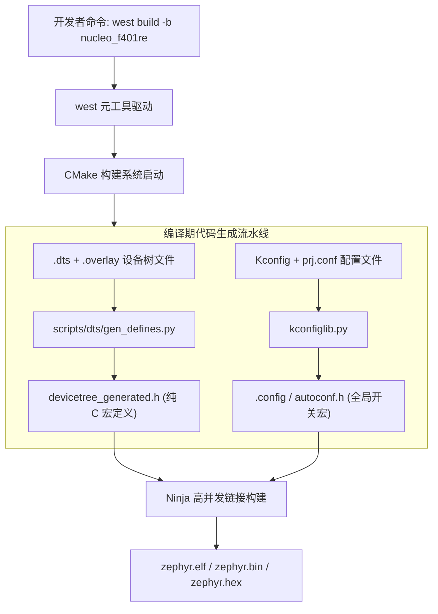

# Kconfig 与 DeviceTree 体系

## 1. 元工具链 `west` 与 CMake 流水线

Zephyr 摒弃了传统的单个 `Makefile` 或 IDE 工程文件（如 Keil `.uvproj`），引入了类 Google `repo` 的跨仓库管理工具 **`west`** 与 CMake 构建链。



---

## 2. Kconfig 静态功能裁决

Zephyr 将成千上万个系统级选项标准化为 Kconfig 树。开发者通过 `prj.conf` 覆盖默认值：

```ini
# prj.conf 生产环境精简示例
CONFIG_STDOUT_CONSOLE=y        # 打开控制台打印
CONFIG_PRINTK=y
CONFIG_GPIO=y                  # 启用 GPIO 统一驱动模型
CONFIG_SERIAL=y                # 启用 UART 驱动
CONFIG_MAIN_STACK_SIZE=2048    # 主线程栈大小
CONFIG_SYS_CLOCK_TICKS_PER_SEC=1000 # 时钟节拍 1ms
CONFIG_USERSPACE=n             # 禁用 MPU 用户特权隔离 (节省内存)
```

在预处理阶段，所有以 `CONFIG_` 开头的宏被提取进全局头文件 `autoconf.h`，内核通过简单的 `#ifdef CONFIG_GPIO` 决定对应代码段是否参与实际编译。

---

## 3. DeviceTree（设备树）硬件解耦原理

### 3.1 设备树源码描述（DTS / Overlay）
设备树通过类树状的节点结构描述外设物理地址、中断号、引脚复用和时钟：

```dts
/* 节点描述示例: USART1 外设定义 */
usart1: serial@40011000 {
    compatible = "st,stm32-usart", "st,stm32-uart";
    reg = <0x40011000 0x400>;
    interrupts = <37 0>;
    clocks = <&rcc STM32_CLOCK_BUS_APB2 0x00004000>;
    current-speed = <115200>;
    status = "okay";
};
```

### 3.2 编译期宏展开
与 Linux 在运行期动态解析设备树字符串不同，Zephyr 编译工具将其转换为一层又一层的 C 宏定义。

例如要获取 `usart1` 的物理基址与波特率，应用层或驱动层代码直接写：

```c
#define UART1_NODE DT_NODELABEL(usart1)

/* 编译期静态提取寄存器地址与波特率，完全零 CPU 运行开销! */
uint32_t base_addr = DT_REG_ADDR(UART1_NODE);      /* 展开为: 0x40011000 */
uint32_t baud_rate = DT_PROP(UART1_NODE, current_speed); /* 展开为: 115200 */
```

> [!TIP]
> **硬件描述与驱动代码分离**：设备树记录外设地址、中断和连接关系。迁移到其他芯片时，需要更新 DTS、检查驱动支持，并处理芯片特有的配置。
