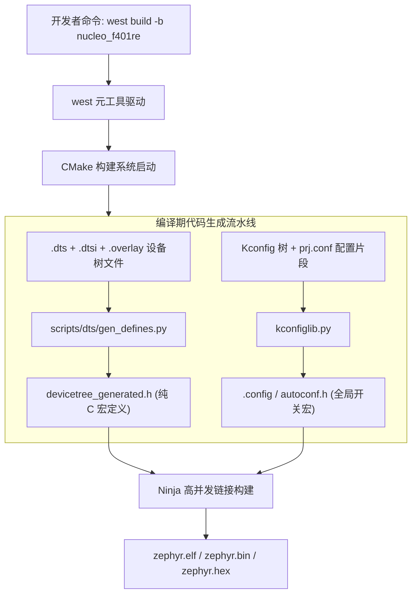

# Kconfig 与 DeviceTree 体系

## 1. 元工具链 `west` 与 CMake 流水线

Zephyr 摒弃了传统的单个 `Makefile` 或 IDE 工程文件（如 Keil `.uvproj`），引入了类 Google `repo` 的跨仓库管理工具 **`west`** 与 CMake 构建链。



### 1.1 west manifest：多仓库工作区（Workspace）管理

HAL、CMSIS、mbedTLS、OpenAMP 等模块散布在数十个独立 Git 仓库中，由 `west.yml` manifest 统一描述拓扑：

```yaml
# zephyr/west.yml (节选示意)
manifest:
  remotes:
    - name: zephyrproject-rtos
      url-base: https://github.com/zephyrproject-rtos
  defaults:
    remote: zephyrproject-rtos
  projects:
    - name: hal_stm32                # ST 芯片 HAL/CMSIS
      path: modules/hal/stm32
      revision: <固定的提交哈希>  # 示意：替换为实际 revision
    - name: mbedtls
      path: modules/crypto/mbedtls
  self:                              # manifest 所在仓库自身
    path: zephyr
```

| west 子命令 | 作用 | 工程类比 |
| :--- | :--- | :--- |
| `west init` + `west update` | 克隆并按 manifest 对齐所有仓库 revision | `git submodule update --init` 的多仓版 |
| `west build -b <board>` | 驱动 CMake + Ninja 增量构建 | `make` |
| `west flash` / `west debug` | 调用烧录/调试后端（pyOCD、openocd、JLink） | IDE 下载按钮 |
| `west boards` / `west build -t menuconfig` | 列板卡 / 交互式改配置 | `make menuconfig` |

!!! note
    **可复现性纪律**：产品基线应将 `west.yml` 入库并固定每个模块的 `revision`。任何“我机器上能编过”的玄学，第一步排查就是 `west diff` 确认工作区是否有本地改动或 manifest 漂移。


### 1.2 sysbuild：多镜像联合构建

AMP（主核 Linux/从核 Zephyr）或 MCUboot + 应用双镜像场景中，一个产品固件由**多个独立 Zephyr 镜像**组成。sysbuild（Zephyr 3.4+ 主线）以域（domain）为单位统一编排：

* 一条命令同时构建 `mcuboot`（引导器镜像）与 `helloworld`（应用镜像），自动共享板级配置；
* 各镜像的 Kconfig/devicetree 片段互不污染，共享配置经 sysbuild 级别统一注入；
* 构建产物按 domain 分目录输出，`west flash` 可一次性按依赖顺序烧录。

---

## 2. Kconfig 静态功能裁决

Zephyr 将成千上万个系统级选项标准化为 Kconfig 树。开发者通过 `prj.conf` 覆盖默认值：

```ini
# prj.conf 生产环境精简示例
CONFIG_STDOUT_CONSOLE=y        # 打开控制台打印
CONFIG_PRINTK=y
CONFIG_GPIO=y                  # 启用 GPIO 统一驱动模型
CONFIG_SERIAL=y                # 启用 UART 驱动
CONFIG_MAIN_STACK_SIZE=2048    # 主线程栈大小
CONFIG_SYS_CLOCK_TICKS_PER_SEC=1000 # 时钟节拍 1ms
CONFIG_USERSPACE=n             # 禁用 MPU 用户特权隔离 (节省内存)
```

在预处理阶段，所有以 `CONFIG_` 开头的宏被提取进全局头文件 `autoconf.h`，内核通过简单的 `#ifdef CONFIG_GPIO` 决定对应代码段是否参与实际编译。

### 2.1 符号类型与依赖闭包

| 符号类型 | 赋值语法 | 展开 | 典型代表 |
| :--- | :--- | :--- | :--- |
| `bool` | `CONFIG_FOO=y` / `# 不写或 =n` | `#define CONFIG_FOO 1`（=n 时不定义） | `CONFIG_GPIO` |
| `int` / `hex` | `CONFIG_MAIN_STACK_SIZE=2048` | `#define ... 2048` | 栈/缓冲尺寸 |
| `string` | `CONFIG_BATTERY_SENSOR_NAME="BATT"` | C 字符串字面量 | 设备名、版本串 |
| `choice` | 多选一（互斥单选组） | 仅选中项被定义 | 蓝牙控制器实现选择 |

每个符号都携带 `depends on` 依赖闭包：上游依赖未满足时，写入 `prj.conf` 的赋值可能被依赖规则改写，构建会发出警告，默认配置可将警告视为错误。

!!! warning
    **最常见的“配置没生效”陷阱**：`CONFIG_FOO=y` 写了但依赖未开——普通构建会报告赋值与最终值不符，并可能中止；menuconfig 可用于查看依赖。改完配置务必回看构建输出尾部告警。


### 2.2 配置片段的发现与合并顺序

无需写任何构建脚本，Zephyr 按固定路径自动发现并合并配置片段：

| 片段 | 路径约定 | 用途 |
| :--- | :--- | :--- |
| 应用主配置 | `prj.conf` | 应用功能全集 |
| 板级覆盖 | `boards/<board>.conf`、`boards/<board>_<revision>.conf` | 同一代码跑不同板时的差异 |
| 显式追加 | CMake 变量 `EXTRA_CONF_FILE` / `CONF_FILE` | 命令行注入构建变体（调试/量产） |

片段按发现顺序拼接后交给 kconfiglib：**同一符号被多处赋值时，后合并的值覆盖先前值**，并产生 "assigned more than once" 告警。调试配置裁决时，看 `build/zephyr/.config` 的最终态，而不是反复猜 prj.conf。

### 2.3 不可见符号（Invisible Symbol）

没有 `prompt` 的符号**不暴露给用户赋值**，只能由 `select` 或 `default` 推导——它们是“内部派生状态”。有 prompt 但依赖未满足的符号与无 prompt 的内部符号应区分。在 `.config` 里手写不可见符号的值是无效操作（合并时被丢弃），必须打开它依赖的上游开关。

---

## 3. DeviceTree（设备树）硬件解耦原理

### 3.1 设备树源码描述（DTS / Overlay）

设备树通过类树状的节点结构描述外设物理地址、中断号、引脚复用和时钟：

```dts
/* 节点描述示例: USART1 外设定义 */
usart1: serial@40011000 {
    compatible = "st,stm32-usart", "st,stm32-uart";
    reg = <0x40011000 0x400>;
    interrupts = <37 0>;
    clocks = <&rcc STM32_CLOCK_BUS_APB2 0x00004000>;
    current-speed = <115200>;
    status = "okay";
};
```

### 3.2 编译期生成的“宏黑魔法”

与 Linux 在运行期动态解析设备树字符串不同，Zephyr 编译工具将其转换为一层又一层的 C 宏定义。

例如要获取 `usart1` 的物理基址与波特率，应用层或驱动层代码直接写：

```c
#define UART1_NODE DT_NODELABEL(usart1)

/* 编译期静态提取寄存器地址与波特率，完全零 CPU 运行开销! */
uint32_t base_addr = DT_REG_ADDR(UART1_NODE);      /* 展开为: 0x40011000 */
uint32_t baud_rate = DT_PROP(UART1_NODE, current_speed); /* 展开为: 115200 */
```

!!! tip
    **跨芯片迁移**：统一 API 有助于复用应用代码，但不同控制器仍需对应驱动。换板后要验证 DTS、Kconfig、引脚、时钟和外设能力。


### 3.3 Overlay 覆盖语法：不改板级 dts 一步定制硬件

应用不修改 Zephyr 自带的板级 `.dts`，而是在 app 目录放 `.overlay` 文件做**增量覆盖**（默认自动发现 `app.overlay` / `boards/<board>.overlay`）：

```dts
/* app.overlay: 三种引用定位方式 + 增删改语法全集 */

/* ① 按 label 引用 — 最常用 */
&usart1 {
    current-speed = <921600>;        /* 改属性: 波特率提升 */
    status = "okay";                  /* 激活节点 */
};

/* ② 按全路径引用 — 无 label 时的兜底 */
&{/soc/serial@40011000} {
    /delete-property/ hw-flow-ctrl;   /* 删除不需要的属性 */
};

/* ③ 删除整个节点 */
/delete-node/ &can2;                  /* 顶层删除引用节点，须确认该标签存在 */

/* ④ chosen: 内核级"系统设备选择器" (console/日志/shell 走哪个外设) */
/ {
    chosen {
        zephyr,console = &usart1;
        zephyr,shell-uart = &usart1;
    };
};
```

`aliases` 提供短名别名（`sensor0 → &thermo_a`），供应用以编号遍历同类设备；`chosen` 则是内核与子系统查找“全局默认设备”的注册表——**console 找不到、日志不输出，第一现场就在 chosen**。

### 3.4 binding：YAML 硬件契约

binding 是节点属性的“类型契约”：按 `compatible` 字符串匹配，约束该类节点必须提供哪些属性、什么类型。它不进固件（零 ROM），只在**编译期**做校验与取值辅助：

```yaml
# dts/bindings/sensor/edu,tmp112.yaml (教学示例)
description: EDU 兼容 I2C 温度传感器
compatible: "edu,tmp112"

include: [sensor-device.yaml, i2c-device.yaml]   # 复用总线公共契约

properties:
  address:
    type: int
    required: true          # 缺失则构建直接报错, 拦截手写 DTS 笔误
  os-mode:
    type: int
    default: 0              # 可选属性带默认值
```

!!! note
    **binding 三大作用**：① 属性拼写/类型错误的**编译期拦截**；② `DT_PROP` 取值时生成带类型的宏；③ `DT_INST_FOREACH_STATUS_OKAY` 驱动实例化的依据。`compatible` 支持列表回退匹配（`"st,stm32-usart", "st,stm32-uart"` 依次尝试通用化绑定）。


---

## 4. 端到端实例：为一块板新增 I2C 传感器

三件套：**overlay 描述硬件 → binding 定契约 → C 代码取参数**。

```dts
/* ① app.overlay: 传感器挂到 i2c1 总线, 地址 0x48 */
&i2c1 {
    status = "okay";
    tmp112_edu: sensor@48 {
        compatible = "edu,tmp112";
        reg = <0x48>;
        address = <0>;          /* 器件内部寄存器基址 (binding 定义) */
        status = "okay";
    };
};
```

```c
/* ② 应用/驱动侧: 编译期取参, 换板零改动 */
#define SENSOR_NODE DT_NODELABEL(tmp112_edu)

#if DT_NODE_HAS_STATUS(SENSOR_NODE, okay)     /* 节点未启用则整段代码不编译 */
struct sensor_cfg cfg = {
    .bus   = DEVICE_DT_GET(DT_BUS(SENSOR_NODE)),      /* I2C 控制器 device */
    .addr  = DT_REG_ADDR(SENSOR_NODE),                /* 0x48 */
    .reg_base = DT_PROP(SENSOR_NODE, address),        /* 0 */
};
#endif

/* ③ 驱动批量实例化写法 (同一 compatible 的所有节点各生成一份) */
#define DT_DRV_COMPAT edu_tmp112
DT_INST_FOREACH_STATUS_OKAY(inst_init);  /* 对每个 status=okay 实例展开 inst_init(n) */
```

---

## 5. 现场排查：构建与设备树

| 症状 | 疑似根因 | 验证手段 |
| :--- | :--- | :--- |
| 设备节点“不存在”（`DT_NODE_HAS_STATUS` 为假） | overlay 未被引用（文件名/路径不合发现规则）或 `status="disabled"` | 看 `build/zephyr/zephyr.dts`（合并后的最终设备树），确认节点与 status |
| `compatible` 匹配不上 binding | 字符串拼写/大小写、vendor 前缀不一致 | 构建报 "no binding found for node" 时比对 dts 与 yaml 的 compatible |
| `DT_PROP` 编译错误“属性不存在” | 属性名拼写错、binding 未声明 required、Kconfig 未开驱动 | 查 `devicetree_generated.h` 中该节点实际生成的宏 |
| `CONFIG_FOO=y` 没生效 | 依赖闭包未满足（不可见符号/上游开关未开） | `west build -t menuconfig` 搜索符号看依赖；读 `.config` 最终态 |
| 改了 overlay 没变化 | 增量构建未重新生成宏 | 删 `build/` 全量重建；确认 `zephyr.dts` 时间戳 |
| console 打印不出 | `chosen` 未指向已启用的串口节点 | 检查 `zephyr.dts` 的 chosen 段与串口 status |
| 升级 Zephyr 后构建崩坏 | manifest revision 漂移、弃用 API 被移除 | `west diff` 对齐基线；清零弃用告警后升级 |
