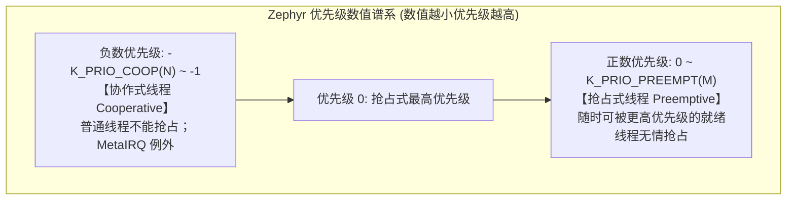
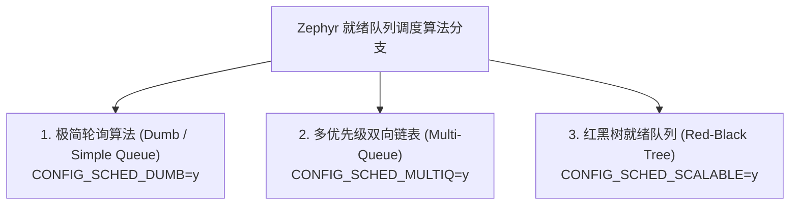
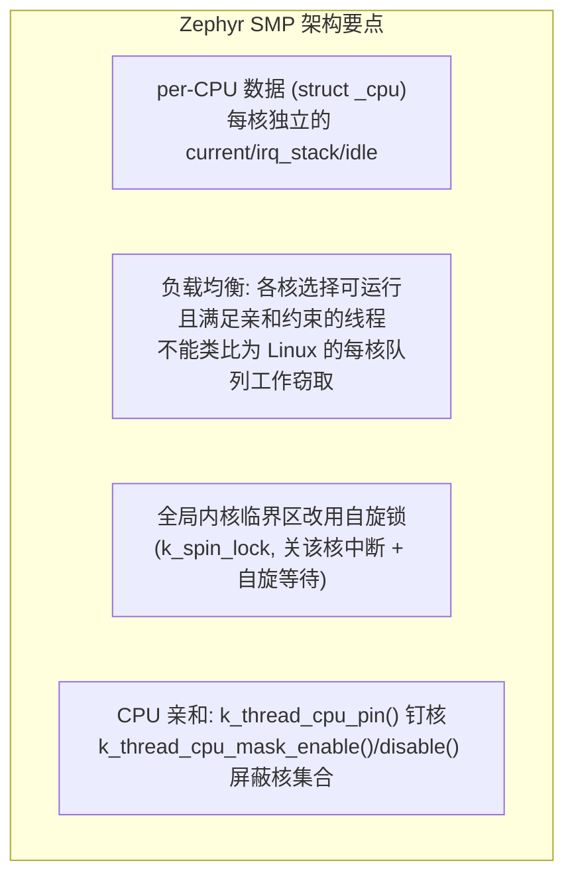
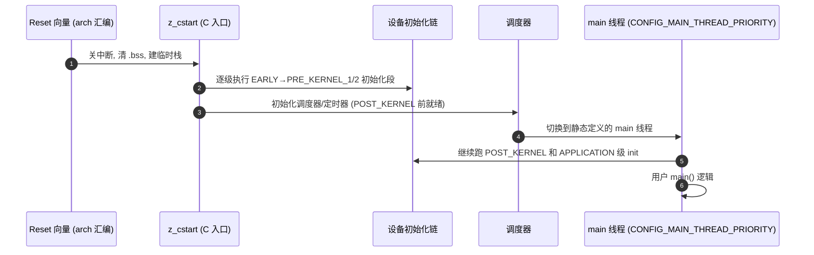

# 线程模型与多算法调度器

## 1. Zephyr 独特的线程分层模型

Zephyr 的任务单元被称为 **线程（Thread）**，以 `struct k_thread` 控制块表示。与许多系统不同，Zephyr 在同一个调度空间中原生区分**协作式（Cooperative）**与**抢占式（Preemptive）**线程。



* **协作式线程（Cooperative Threads）**：优先级为负数。一旦投入运行，直到其主动调用 `k_yield()`、等待信号量或退出前，**任何抢占式线程（无论优先级多高）以及同级或低级协作式线程都绝对无法打断它**（硬件中断依然可以正常响应并执行）。非常适合极度关键的电机控制、加密运算或通信时序控制。
* **抢占式线程（Preemptive Threads）**：优先级为非负数（$\ge 0$）。遵循标准优先级抢占原则。

!!! note
    **更深的负数层——MetaIRQ**：协作区还支持更低的 MetaIRQ 层（`CONFIG_NUM_META_IRQ_PRIORITIES`），其线程可**抢占普通协作线程**，专门承载“伪中断级”处理（如音频实时搬数），是介于硬件 ISR 与线程之间的第三层执行上下文。


---

## 2. 三大调度队列底层算法选型

传统的 RTOS（如 FreeRTOS）通常只固定一种链表或位图调度算法。而 Zephyr 将调度器的就绪队列（Ready Queue）抽象为可插拔的算法引擎，通过 Kconfig 配置：



### 2.1 算法特性与时空复杂度对比

| 算法引擎 | 插入就绪项时间复杂度 | 选取最高优先级时间复杂度 | RAM 静态开销 | 适用场景 |
| :--- | :--- | :--- | :--- | :--- |
| **Dumb** | $O(N)$（按优先级插入有序双向链表） | $O(1)$（无 CPU mask 过滤时取链头） | 较低（每线程双向链表节点） | 系统总线程极少（$< 5$ 个）的微型 MCU |
| **Multi-List** | $O(1)$（按优先级下标挂载） | $O(K)$ 或 $O(1)$（位图/游标加速，类似 FreeRTOS） | 中等（数组大小随优先级级数扩展） | 典型嵌入式项目（线程数在 5~32 之间） |
| **RBTree** | $O(\log N)$（二叉树插入与平衡旋转） | $O(\log N)$（自根向左走到最左节点，路径长度即树高） | 每个线程约 24 字节树节点开销 | **大规模并发、线程数动态上百的大型系统 / 多核 SMP** |

!!! warning
    **纠正一个流传甚广的说法**：红黑树调度器“取最高优先级是 $O(1)$”——这只对**缓存了最左节点指针**的实现成立。Linux CFS 正是因为缓存 `rb_leftmost` 才把选任务做到 $O(1)$；而 Zephyr 的可伸缩调度器取最左节点走的是自根向左的树遍历，严格复杂度为 $O(\log N)$。在大规模线程场景下 $\log N$ 足够平稳（$N=1024$ 时树高仍为对数量级，不能直接等同于 10 层），这才是红黑树方案“伸缩性好”的真正含义。


---

## 3. `struct k_thread` 控制块关键结构走读

理解调度行为的第一步是看懂线程控制块里调度器真正关心的字段（概念级分组，随版本演进细节有异）：

| 字段分组 | 代表内容 | 调度语义 |
| :--- | :--- | :--- |
| **基础调度状态** `_thread_base` | `prio`（int8_t，可为负）、`thread_state`（_PENDING/_PRESTART/_RUNNING/… 位图）、`sched_started` | 优先级与生命周期状态机的唯一事实来源 |
| **就绪队列挂载节点** | Dumb/MultiQ 的链表节点或 RBTree 的 `rb_node` + **deadline 域** | 同一控制块按所选算法引擎挂载；`CONFIG_SCHED_DEADLINE` 开启后同静态优先级内按截止时间排序 |
| **等待关系** | `pended_on`（所阻塞的 wait_q 指针） | 内核能回答“它堵在哪个对象上”，是 dump 死锁现场的关键数据 |
| **入口与栈** | `entry`（入口函数与三个参数）、`stack_info`（栈基址+大小）、`stack_ptr` | 上下文切换的恢复目标；栈边界供 MPU 保护与溢出检测 |
| **执行选项与身份** | `init_data.options`（K_USER 等）、`base.user_options`、线程名 | 决定特权级别与安全授权（详见 [06 篇](06-memory-protection-userspace-syscall.md)） |

---

## 4. 线程创建：动态接口与静态宏的两条路径

```c
/* 路径一: 运行期动态创建 (栈由调用者提供, 生命周期自管理) */
k_tid_t tid = k_thread_create(&my_thread, my_stack_area,
                              K_THREAD_STACK_SIZEOF(my_stack_area),
                              my_entry, p1, p2, p3,
                              prio, options, K_FOREVER /* 延迟启动 */);

/* 路径二: 编译期分配存储，启动时仍需初始化线程 */
K_THREAD_DEFINE(my_task, 1024, my_entry, NULL, NULL, NULL,
                5, 0, 0);
```

| 创建选项位 | 语义 | 典型用途 |
| :--- | :--- | :--- |
| `K_USER` | 以非特权用户态运行（依赖 `CONFIG_USERSPACE`） | 隔离不可信代码 |
| `K_ESSENTIAL` | “系统关键线程”，退出/abort 视为致命错误 | 空闲线程等内核自身线程 |
| `K_INHERIT_PERMS` | 继承创建者线程的内核对象授权 | 用户态管理线程派生子线程 |
| `K_FP_REGS` | 主动声明使用浮点寄存器（部分架构需显式开启 FPU 上下文保存） | DSP/滤波线程 |

!!! note
    **栈对齐与 MPU 联动**：栈对象必须用 `K_THREAD_STACK_DECLARE`/`K_KERNEL_STACK_DEFINE` 系列宏声明——它们会按架构要求插入对齐 padding 与 MPU guard 区。随手传一个普通数组当栈，轻则对齐告警，重则用户态/MPU 场景直接 MemManage Fault。


---

## 5. 抢占控制面：时间片、调度锁与截止时间

### 5.1 同优先级时间片（Time Slicing）

与 FreeRTOS 挂在 SysTick 上的隐式轮转不同，Zephyr 把时间片做成显式三旋钮：

| Kconfig | 语义 |
| :--- | :--- |
| `CONFIG_TIMESLICING` | 总开关：**仅在相同优先级的抢占式线程之间**轮转（协作线程永不参与） |
| `CONFIG_TIMESLICE_SIZE`（ms） | 每片时长上限 |
| `CONFIG_TIMESLICE_PRIORITY` | 参与轮转的优先级上限（比它更高的优先级不轮转，保证关键层确定性） |

运行期还可用 `k_sched_time_slice_set()` 动态调整全局参数；更新的版本提供逐线程时间片 `k_thread_time_slice_set()`（`CONFIG_TIMESLICE_PER_THREAD`）附到期回调。

### 5.2 调度锁与让出

* `k_sched_lock()` / `k_sched_unlock()`：**禁止抢占**但**不关中断**——锁住期间 ISR 照常执行、普通抢占被抑制，但 MetaIRQ 线程仍可能抢占；必须严格配对嵌套。协作式代码的“临时不可抢占区”由此构成。
* `k_yield()`：让给**同优先级或更高**优先级的下一个就绪线程。
* `k_sleep(K_MSEC(x))`：主动让出并定时唤醒（tickless 模式下精度见 §6）。

### 5.3 EDF 风格截止时间调度（可选）

`CONFIG_SCHED_DEADLINE` 开启后，可对线程调 `k_thread_deadline_set(tid, cycles)`——就绪队列在**静态优先级相同**时按截止时间排序。更高静态优先级仍优先，因此不能当作全局 EDF 调度器。

---

## 6. Tickless 时基：没有“固定节拍”的时钟

支持 Tickless 的时钟驱动可按下一次超时编程中断，实际行为由 `CONFIG_TICKLESS_KERNEL`、定时器驱动和时间片设置决定：

* **超时仍按 Tick 计量**：`K_MSEC` / `K_USEC` 转换为内核 Tick，仍有量化误差；微秒参数不代表微秒级调度保证；
* **功耗友好**：CPU 空闲窗口不再被无意义的周期 tick 打断，深睡时长可覆盖到下一个真实事件（与 [PM 子系统](07-subsystems-amp-power-management.md) 直接耦合）；
* `CONFIG_SYS_CLOCK_ALWAYS_ON`：若业务依赖高精度 uptime（如日志时戳、吞吐统计），可让时基在无事件时也持续运行，牺牲功耗换取时基连续。

!!! note
    **迁移者提醒**：从 FreeRTOS “一切超时皆 tick 数”的心智切换过来——Zephyr 所有超时参数统一是 `k_timeout_t`（`K_MSEC`/`K_USEC`/`K_SECONDS`/`K_FOREVER`），不要手算节拍数。


---

## 7. SMP：多核对称处理与 CPU 亲和

`CONFIG_SMP=y` 后，多个同构核并行运行同一个内核镜像：



* **自旋 vs 睡眠**：SMP 下高频短临界区持有自旋锁空转等待；长等待仍走睡眠阻塞。临界区代码必须按“持自旋锁绝不睡眠”的铁律审计。
* **亲和钉核**：`k_thread_cpu_pin(thread, cpu)` 把关键线程（电机控制）钉死在指定核，排除跨核迁移引入的 Cache 冷启动抖动；`k_thread_cpu_mask_enable/disable` 以位掩码控制可选核集合。
* **单核退化**：`CONFIG_SMP=n` 时自旋锁退化为普通关中断，代码无需修改——同一份内核覆盖单核到多核。

---

## 8. 启动序列与 `main` 线程的来历



`main` 在启动阶段创建的主线程中执行，默认处于特权态：优先级 `CONFIG_MAIN_THREAD_PRIORITY`、栈 `CONFIG_MAIN_STACK_SIZE`——它可以被更高优先级线程抢占，返回后线程结束，但静态栈存储不会自动归还堆。判断当前上下文统一用 `k_is_in_isr()` / `k_is_pre_kernel()`，禁止依赖“在 main 里就是安全的”直觉。

---

## 9. 现场排查：调度与线程

| 症状 | 疑似根因 | 验证手段 |
| :--- | :--- | :--- |
| 高优先级线程“永远不跑” | 更低优先级协作线程不让出（长循环无 `k_yield`/阻塞点） | 线程 dump（shell `kernel threads`）看谁占 CPU；`k_thread_name_set` 命名后再查 |
| 线程创建即 hardfault/oops | 栈过小、非 `K_THREAD_STACK_*` 宏声明、`K_USER` 未授权对象 | 看 fault 时 SP 是否贴栈底；检查栈宏与 grant 列表 |
| 偶发长延迟（数十 µs 级抖动） | 协作线程/MetaIRQ 长区间、`k_sched_lock` 忘配对解锁 | 打点测 `k_cycle_get_32()`；审计 lock/unlock 配对与协作区间 |
| SMP 下性能反不如单核 | 伪共享（多核频繁写同一缓存行）、自旋锁临界区过长 | 结构体按缓存行对齐；缩短持锁区间 |
| 时间片轮转“没生效” | 线程是协作式、优先级高于 `CONFIG_TIMESLICE_PRIORITY`、总开关未开 | 核对三个 Kconfig 与线程优先级正负号 |
| `K_FOREVER` 创建后线程不启动 | 忘记 `k_thread_start()` | 检查创建后启动调用 |

## 参考

- [对应版本的官方文档或实现](https://docs.zephyrproject.org/3.7.0/kernel/services/scheduling/index.html)

- [Zephyr 3.7.0 priority_q.h：就绪队列实现](https://github.com/zephyrproject-rtos/zephyr/blob/v3.7.0/kernel/include/priority_q.h)
