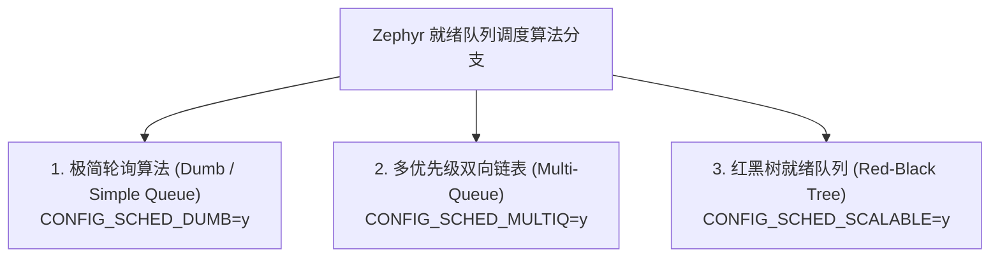

# 线程模型与多算法调度器

## 1. Zephyr 独特的线程分层模型

Zephyr 的任务单元被称为 **线程（Thread）**，以 `struct k_thread` 控制块表示。与许多系统不同，Zephyr 在同一个调度空间中原生区分**协作式（Cooperative）**与**抢占式（Preemptive）**线程。

* **协作式线程（Cooperative Threads）**：优先级为负数。一旦投入运行，直到其主动调用 `k_yield()`、等待信号量或退出前，**任何抢占式线程（无论优先级多高）以及同级或低级协作式线程都绝对无法打断它**（硬件中断依然可以正常响应并执行）。非常适合极度关键的电机控制、加密运算或通信时序控制。
* **抢占式线程（Preemptive Threads）**：优先级为非负数（$\ge 0$）。遵循标准优先级抢占原则。

---

## 2. 三大调度队列底层算法选型

传统的 RTOS（如 FreeRTOS）通常只固定一种链表或位图调度算法。而 Zephyr 将调度器的就绪队列（Ready Queue）抽象为可插拔的算法引擎，通过 Kconfig 配置：

### 2.1 算法特性与时空复杂度对比

| 算法引擎 | 插入就绪就绪项时间复杂度 | 选取最高优先级时间复杂度 | RAM 静态开销 | 适用场景 |
| :--- | :--- | :--- | :--- | :--- |
| **Dumb** | $O(1)$（直接插在单向链表末尾） | $O(N)$（线性遍历所有就绪线程） | 极低（每个线程 1 个指针） | 系统总线程极少（$< 5$ 个）的微型 MCU |
| **Multi-List** | $O(1)$（按优先级下标挂载） | $O(1)$ 或 $O(K)$（类似 FreeRTOS） | 中等（数组大小随优先级级数扩展） | 典型嵌入式项目（线程数在 5~32 之间） |
| **RBTree** | $O(\log N)$（二叉树插入与平衡旋转） | **$O(1)$**（直接取树的最左叶子节点 `rb_node`） | 每个线程约 24 字节树节点开销 | **大规模并发、线程数动态上百的大型系统 / 多核 SMP** |

> [!NOTE]
> **红黑树调度（Scalable Scheduler）优势**：  
> 当系统中有 50 到 200 个并发线程同时处于不同就绪或挂起状态时，红黑树算法表现出稳定的伸缩性（Scalability），这也是 Linux CFS 调度器与大型实时系统偏爱红黑树的核心原因。
