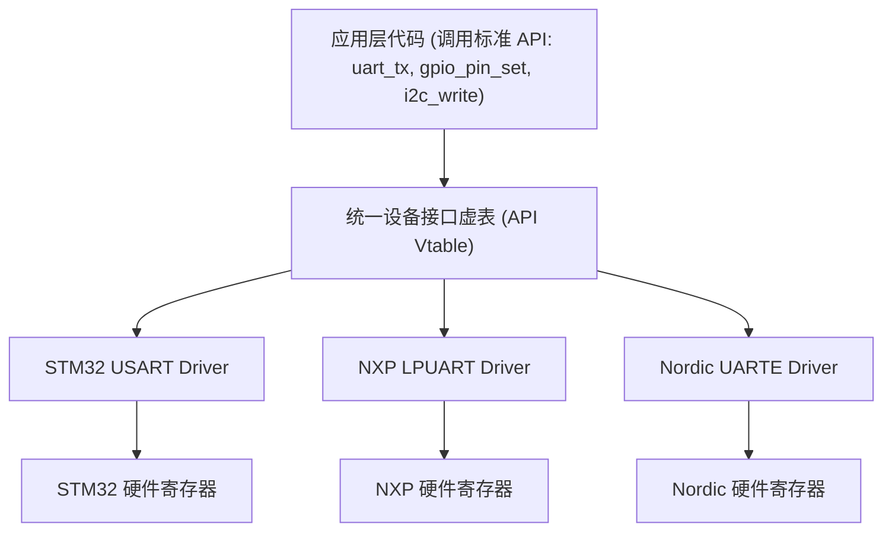
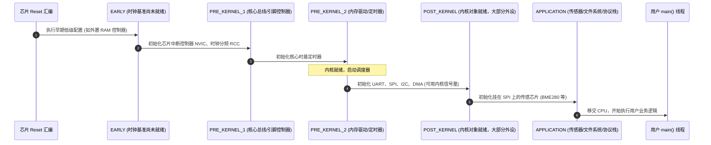

# 统一设备驱动模型

## 1. 传统嵌入式驱动开发的巨大痛点

在传统的嵌入式开发（如直接基于 FreeRTOS 裸机驱动）中，不同半导体原厂的驱动接口完全割裂：
* STM32 使用 `HAL_UART_Transmit()`
* NXP 使用 `LPUART_WriteBlocking()`
* TI 使用 `UART_write()`
* Nordic 使用 `nrfx_uarte_tx()`

若应用层需要换一颗 MCU，往往需要重写数万行胶水驱动代码，移植成本极高。

Zephyr 借鉴了 Linux 的 **统一设备模型（Device Driver Model）**，在所有外设驱动与上层应用之间建立了一套标准的**编译期虚函数表机制（Vtable API）**。



---

## 2. 核心数据结构：`struct device`

Zephyr 中的每一个外设在内存中都映射为一个只读的静态 `struct device` 结构体：

```c
struct device {
    const char *name;              /* 设备名称字符串 (如 "serial@40011000") */
    const void *config;            /* 编译期常数配置 (物理基址、中断号、引脚映射) */
    const void *api;               /* 指向该类设备驱动特有的虚函数表 (Vtable) */
    void *data;                    /* 运行期可变数据 (互斥锁、环形缓冲、状态标志) */
};
```

---

## 3. `DEVICE_DT_DEFINE` 宏展开与编译期注册

Zephyr 不允许在运行期动态执行 `register_driver()` 消耗堆内存，而是通过宏在编译期将驱动结构体放置在**特殊的链接器段（Linker Section）**中：

```c
/* 典型的 GPIO 或 UART 驱动注册宏 */
DEVICE_DT_DEFINE(
    DT_NODELABEL(usart1),          /* 绑定的设备树节点 */
    usart_stm32_init,              /* 驱动初始化入口函数 */
    NULL,                          /* 电源管理回调 PM 句柄 */
    &usart_stm32_data_1,           /* 运行期 RAM 数据区指针 */
    &usart_stm32_config_1,         /* 编译期 ROM 配置区指针 */
    POST_KERNEL,                   /* 初始化级别 (Initialization Level) */
    CONFIG_SERIAL_INIT_PRIORITY,   /* 同一级别内的执行优先级序号 */
    &usart_stm32_api_funcs         /* 驱动对外暴露的标准虚函数表 */
);
```

### 3.1 四大系统初始化级别（Init Levels）

Zephyr 启动时，内核会按照预先排序好的链接段内存，自动、有序地执行所有驱动的初始化函数，完全无需应用层在 `main()` 里面手写冗长又容易漏掉的 `BSP_Init()`：


