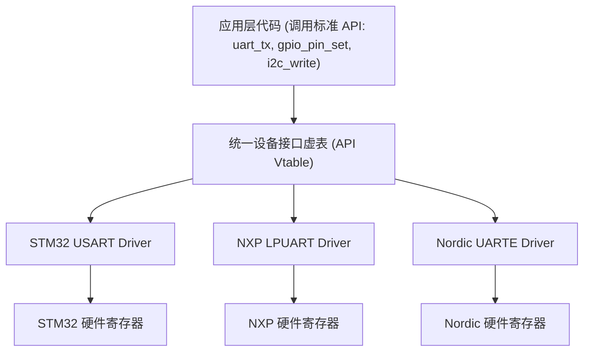
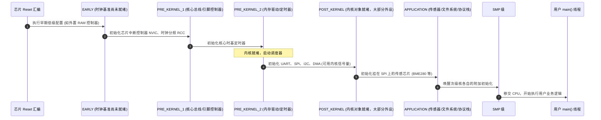

# 统一设备驱动模型

## 1. 传统嵌入式驱动开发的巨大痛点

在传统的嵌入式开发（如直接基于 FreeRTOS 裸机驱动）中，不同半导体原厂的驱动接口完全割裂：
* STM32 使用 `HAL_UART_Transmit()`
* NXP 使用 `LPUART_WriteBlocking()`
* TI 使用 `UART_write()`
* Nordic 使用 `nrfx_uarte_tx()`

若应用层需要换一颗 MCU，往往需要重写数万行胶水驱动代码，移植成本极高。

Zephyr 借鉴了 Linux 的 **统一设备模型（Device Driver Model）**，在所有外设驱动与上层应用之间建立了一套标准的**编译期虚函数表机制（Vtable API）**。



---

## 2. 核心数据结构：`struct device`

Zephyr 中的每一个外设在内存中都映射为一个只读的静态 `struct device` 结构体：

```c
struct device {
    const char *name;              /* 设备名称字符串 (如 "serial@40011000") */
    const void *config;            /* 编译期常数配置 (物理基址、中断号、引脚映射) */
    const void *api;               /* 指向该类设备驱动特有的虚函数表 (Vtable) */
    void *data;                    /* 运行期可变数据 (互斥锁、环形缓冲、状态标志) */
};
```

### 2.1 config 与 data 的 ROM/RAM 分裂设计

| 字段 | 存储域 | 内容性质 | 多实例共享 |
| :--- | :--- | :--- | :--- |
| `config` | **Flash（const）** | devicetree 提取的编译期常数：寄存器基址、中断号、引脚、总线速率 | 每实例一份，不可变 |
| `data` | **RAM** | 运行期状态：信号量、环形缓冲、上电标志 | 每实例独占 |
| `api` | **Flash（const）** | 该类设备的标准函数表 | 同类驱动全局一份，天然共享 |

!!! note
    **与 FreeRTOS/裸机驱动最大的范式差**：传统驱动把“宏定义的寄存器基址”散落在本文件顶部；Zephyr 把它压进 `config` 结构（内容由 devicetree 编译期生成）——**驱动源码里没有一颗芯片专属魔数**。Flash 紧张时还可以整个 `config` 留在 Flash 不搬 RAM（`__device_dts_ord_*` 静态放置于专属链接段）。


---

## 3. `DEVICE_DT_DEFINE` 宏展开与编译期注册

Zephyr 不允许在运行期动态执行 `register_driver()` 消耗堆内存，而是通过宏在编译期将驱动结构体放置在**特殊的链接器段（Linker Section）**中：

```c
/* 典型的 GPIO 或 UART 驱动注册宏 */
DEVICE_DT_DEFINE(
    DT_NODELABEL(usart1),          /* 绑定的设备树节点 */
    usart_stm32_init,              /* 驱动初始化入口函数 */
    NULL,                          /* 电源管理回调 PM 句柄 */
    &usart_stm32_data_1,           /* 运行期 RAM 数据区指针 */
    &usart_stm32_config_1,         /* 编译期 ROM 配置区指针 */
    POST_KERNEL,                   /* 初始化级别 (Initialization Level) */
    CONFIG_SERIAL_INIT_PRIORITY,   /* 同一级别内的执行优先级序号 */
    &usart_stm32_api_funcs         /* 驱动对外暴露的标准虚函数表 */
);
```

展开后的效果：一个 `struct device` 常量落入 `__device` 链接段，其 `(level, prio)` 元数据让启动代码像遍历有序数组一样逐个调用 init——**零运行期注册开销，且链接期裁剪：没有用户引用且 devicetree `status` 非 okay 的驱动整体不进固件**。

### 3.1 系统初始化级别（Init Levels）



| 级别 | 内核/服务可用性 | 典型住户 |
| :--- | :--- | :--- |
| `EARLY` | 无 C 库、无内核对象、中断常闭 | 片外 RAM 控制器、最深层的时钟勾选 |
| `PRE_KERNEL_1` | 仍不可用内核 API | 中断控制器、引脚/时钟驱动（一切驱动的驱动） |
| `PRE_KERNEL_2` | 接近就绪 | 系统定时器、片上 Flash 控制器 |
| `POST_KERNEL` | **内核对象/调度器可用**，可 `k_sem_take` | UART/SPI/I2C/DMA 绝大多数外设 |
| `APPLICATION` | 全部就绪（在 main 线程上下文执行） | 挂在总线上的传感器、文件系统、协议栈 |
| `SMP` | 各次级核本地初始化 | 多核场景 per-CPU 外设 |

!!! warning
    **级别错位的典型死法**：在 `PRE_KERNEL_1` 的 init 里用了 `k_sleep()`/信号量——此时尚无调度器，轻则断言挂死，重则静默行为未定义。原则：**越早的级别只做“纯寄存器 + 忙等”**。


---

## 4. 完整教学驱动骨架：一个 I2C 温度传感器

下面三段代码构成一个用于说明注册与数据访问的驱动骨架（还需接入 Kconfig/CMake 和设备树，未进行硬件验证）（教学示例，寄存器语义为虚构教育值）：

```c
/* ===== ① 驱动私有结构: config(ROM) + data(RAM) + API 虚表 ===== */
#include <zephyr/device.h>
#include <zephyr/drivers/i2c.h>
#include <zephyr/drivers/sensor.h>
#include <errno.h>
#include <zephyr/kernel.h>

struct tmp_edu_config {               /* 全 const, 编译期由 DT 宏填充 */
    struct i2c_dt_spec i2c;           /* 总线 device + 从机地址封装 */
    uint8_t reg_base;
};
struct tmp_edu_data {                 /* 运行期状态 */
    struct k_mutex lock;              /* 多线程共享传感器的串行化 */
    int16_t last_raw;                 /* 上次采样原始值 */
};

static int tmp_edu_sample_fetch(const struct device *dev, enum sensor_channel ch);
static int tmp_edu_channel_get(const struct device *dev, enum sensor_channel ch, struct sensor_value *val);

/* 标准传感器子系统 API 虚表 */
static const struct sensor_driver_api tmp_edu_api = {
    .sample_fetch = tmp_edu_sample_fetch,
    .channel_get  = tmp_edu_channel_get,
};

/* ===== ② 实现: init 与两个 API 入口 ===== */
static int tmp_edu_init(const struct device *dev)
{
    const struct tmp_edu_config *cfg = dev->config;
    uint8_t id;

    if (!i2c_is_ready_dt(&cfg->i2c)) {
        return -ENODEV;               /* 总线不可用: 设备永判 not ready */
    }
    if (i2c_reg_read_byte_dt(&cfg->i2c, cfg->reg_base + 0, &id) != 0) {
        return -EIO;                  /* 探测失败: 芯片不在/地址错 */
    }
    k_mutex_init(&((struct tmp_edu_data *)dev->data)->lock);
    return 0;
}

static int tmp_edu_sample_fetch(const struct device *dev,
                                enum sensor_channel ch)
{
    struct tmp_edu_data *data = dev->data;
    const struct tmp_edu_config *cfg = dev->config;
    uint8_t raw[2];
    if (ch != SENSOR_CHAN_ALL && ch != SENSOR_CHAN_AMBIENT_TEMP) { return -ENOTSUP; }

    k_mutex_lock(&data->lock, K_FOREVER);
    int rc = i2c_burst_read_dt(&cfg->i2c, cfg->reg_base + 1,
                              raw, sizeof(raw));
    if (rc == 0) {
        data->last_raw = (int16_t)((raw[0] << 8) | raw[1]);
    }
    k_mutex_unlock(&data->lock);
    return rc;
}

static int tmp_edu_channel_get(const struct device *dev,
                               enum sensor_channel ch,
                               struct sensor_value *val)
{
    struct tmp_edu_data *data = dev->data;
    if (ch != SENSOR_CHAN_AMBIENT_TEMP) { return -ENOTSUP; }
    k_mutex_lock(&data->lock, K_FOREVER);
    int16_t raw = data->last_raw;
    k_mutex_unlock(&data->lock);
    val->val1 = raw / 256;            /* 整数部分 */
    val->val2 = (raw % 256) * 1000000 / 256; /* 小数微度 */
    return 0;
}

/* ===== ③ 实例化: 对每个 DT 实例展开一套 device + init ===== */
#define DT_DRV_COMPAT edu_tmp112           /* 匹配 compatible = "edu,tmp112" */

#define TMP_EDU_INIT(n)                                                     \
    static struct tmp_edu_data tmp_edu_data_##n;                            \
    static const struct tmp_edu_config tmp_edu_cfg_##n = {                  \
        .i2c = I2C_DT_SPEC_INST_GET(n),      /* 总线+地址自动从 DT 提取 */   \
        .reg_base = DT_INST_PROP(n, address),                               \
    };                                                                      \
    SENSOR_DEVICE_DT_INST_DEFINE(n, tmp_edu_init, NULL,                     \
            &tmp_edu_data_##n, &tmp_edu_cfg_##n, POST_KERNEL,               \
            CONFIG_SENSOR_INIT_PRIORITY, &tmp_edu_api);

DT_INST_FOREACH_STATUS_OKAY(TMP_EDU_INIT)     /* 每个 okay 实例各展开一次 */
```

调用方（应用）完全不感知上述细节：

```c
const struct device *thermo = DEVICE_DT_GET(DT_NODELABEL(tmp112_edu));
if (!device_is_ready(thermo)) { /* 必查! 见 §5 */ }
sensor_sample_fetch(thermo);
sensor_channel_get(thermo, SENSOR_CHAN_AMBIENT_TEMP, &val);
```

---

## 5. 设备就绪协议：`device_is_ready()` 不是可选项

init 返回值决定了设备的命运，应用/上层驱动必须遵守的就绪判定协议：

| init 返回 | 内核处置 | `device_is_ready()` | 驱动应对 |
| :--- | :--- | :--- | :--- |
| `0` | 标记就绪 | ✅ true | — |
| `-EAGAIN` | 记录初始化失败；V3.7.0 不会自动重试 | ❌ false | 修正初始化依赖、优先级或应用恢复流程 |
| `-EIO` / 其它负值 | 永久失败，**不再重试** | ❌ false | 硬件不存在/损坏，设备逻辑性移除 |

```c
/* 标准防御范式: 使用任何设备前先查就绪 */
const struct device *dev = DEVICE_DT_GET(DT_CHOSEN(zephyr_console));
if (!device_is_ready(dev)) {
    LOG_ERR("console not ready");   /* 而不是继续调用然后 NULL 解引用 */
}
```

> 初始化依赖应通过级别和优先级安排。返回错误不会自动产生延后探测队列，不能照搬 Linux 的 deferred probe 思路。

---

## 6. 设备电源管理挂钩（与 [07 篇](07-subsystems-amp-power-management.md) 联动）

`DEVICE_DT_DEFINE` 的第三个参数不再是 `NULL`，而是由 `PM_DEVICE_DT_DEFINE` 生成的 PM 对象；驱动只需实现一个 action 分发回调：

```c
static int tmp_edu_pm_action(const struct device *dev,
                             enum pm_device_action action)
{
    switch (action) {
    case PM_DEVICE_ACTION_SUSPEND:   /* 停采样、关器件内部时钟 */
    case PM_DEVICE_ACTION_RESUME:    /* 恢复配置寄存器 */
    case PM_DEVICE_ACTION_TURN_OFF:  /* 物理断电前的状态保存 */
    case PM_DEVICE_ACTION_TURN_ON:   /* 物理上电后的早期恢复 */
    default:
        return -ENOTSUP;
    }
}
PM_DEVICE_DT_INST_DEFINE(n, tmp_edu_pm_action);
SENSOR_DEVICE_DT_INST_DEFINE(n, tmp_edu_init,
        PM_DEVICE_DT_INST_GET(n),    /* 第 3 参数接入 PM 框架 */
        ...);
```

系统 PM 挂起时框架按设备链自动回调；运行期按需挂起/恢复由运行时 PM（`pm_device_runtime_get/put`）驱动，详见[子系统篇](07-subsystems-amp-power-management.md)。

---

## 7. 现场排查：驱动与设备

| 症状 | 疑似根因 | 验证手段 |
| :--- | :--- | :--- |
| `DEVICE_DT_GET` 拿到设备但报 not ready | init 返回非零错误码或设备尚未初始化 | 看 boot log 的 init 错误码；`CONFIG_DEVICE_SHELL` 后用 `device list` 查状态 |
| 设备“根本不存在”（链接错误 no such symbol） | devicetree 无节点 / `status="disabled"` / overlay 未被引用 | 查 `build/zephyr/zephyr.dts` 合并结果 |
| init 顺序依赖崩溃（A 初始化时 B 还没好） | 级别或优先级错配 | 调整 B/A 的级别和初始化优先级，确保依赖先就绪 |
| 驱动 API 调用 NULL 指针跳转 | `api` 未绑定就调用（init 失败后仍被使用） | 审计所有调用点的 `device_is_ready` 前置检查 |
| `DT_INST_FOREACH_STATUS_OKAY` 展开数为 0 | `DT_DRV_COMPAT` 与 compatible 不匹配（下划线 vs 逗号转换） | 宏必须是 `vendor_device` 形式（`edu,tmp112` → `edu_tmp112`） |
| 多线程并发访问外设偶发数据错乱 | 驱动 data 无锁保护 | 在驱动 API 入口加 `k_mutex`；ISR 中不能直接执行可能阻塞的 I2C 事务，应转交工作线程 |

## 参考

- [对应版本的官方文档或实现](https://github.com/zephyrproject-rtos/zephyr/blob/v3.7.0/kernel/init.c)
