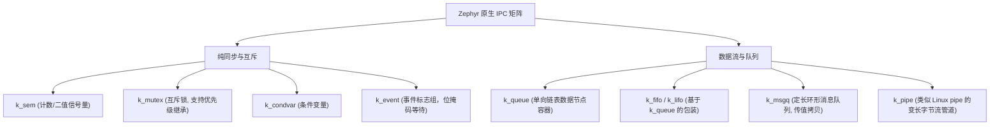
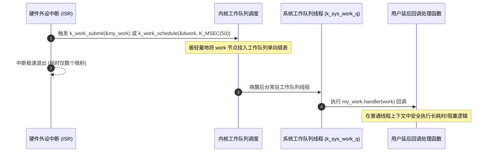

# 内核对象 IPC 与 Workqueue

## 1. Zephyr 原生 IPC 原语全景

Zephyr 为不同场景提供了比传统 RTOS 更细粒度的同步与通信组件：

### 1.1 典型组件应用场景对比

| IPC 原语 | 数据形式 | 零拷贝特性 | 中断安全（ISR-Safe） | 典型适用场景 |
| :--- | :--- | :--- | :--- | :--- |
| **`k_sem`** | 纯计数（无数据） | — | ✅ 可以 `k_sem_give` | 中断到底半部通知、资源计数 |
| **`k_mutex`** | 无数据 | — | ❌ 禁止在 ISR 中调用 | 保护独占外设（如 Flash 写入） |
| **`k_msgq`** | 定长结构体数据 | ❌ 内存拷贝（Deep Copy） | ✅ 可以 `k_msgq_put` | 按键状态、ADC 温度等小数据采样 |
| **`k_fifo`** | 单向链表指针节点 | ✅ **严格零拷贝** | ✅ 可以 `k_fifo_put` | 网络数据包（`net_buf`）、音频流帧 |
| **`k_pipe`** | 变长无格式字节流 | 视情况部分拷贝 | ❌ 仅限线程间 | 蓝牙透传串口、文件传输协议解析 |

---

## 2. 系统工作队列（System Workqueue）

在事件驱动与中断底半部设计中，为每一个零碎异步事件单独创建一个线程（Thread）会浪费大量的 TCB 结构体与私有任务栈（每个栈通常至少消耗 512B~2KB RAM）。

Zephyr 原生提供了 **工作队列（Workqueue）** 机制。

* **延迟工作项（Delayed Work / Scheduled Work）**：支持使用 `k_work_schedule()` 指定未来的某个延时（如等待外设上电稳定 20ms 后执行），无需自行开辟软件定时器与额外线程。
* **节省 RAM**：全系统所有的网络协议驱动、按键防抖、蓝牙事件通知均可复用同一个 `k_sys_work_q` 的线程栈空间，极大压低了整个系统的内存基线。
