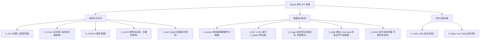
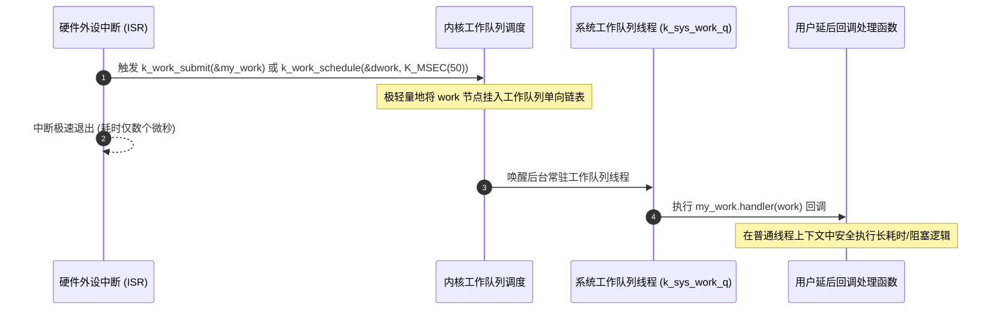
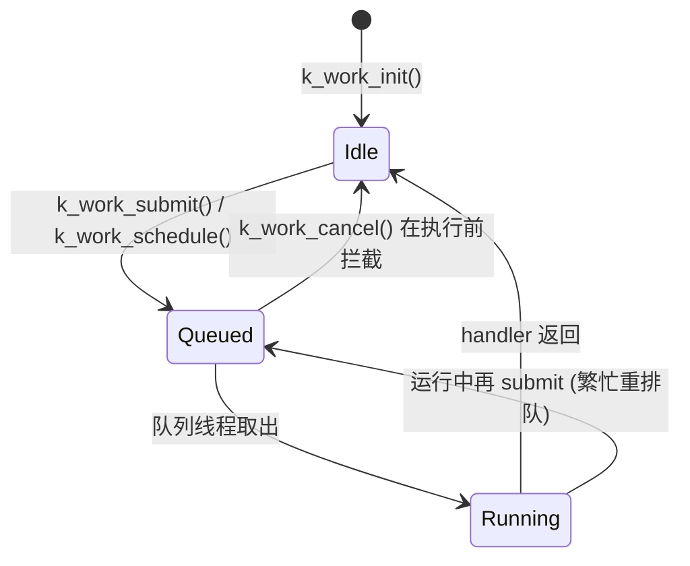

# 内核对象 IPC 与 Workqueue

## 1. Zephyr 原生 IPC 原语全景

Zephyr 为不同场景提供了比传统 RTOS 更细粒度的同步与通信组件：



### 1.1 典型组件应用场景对比

| IPC 原语 | 数据形式 | 零拷贝特性 | 中断安全（ISR-Safe） | 典型适用场景 |
| :--- | :--- | :--- | :--- | :--- |
| **`k_sem`** | 纯计数（无数据） | — | ✅ 可以 `k_sem_give` | 中断到底半部通知、资源计数 |
| **`k_mutex`** | 无数据 | — | ❌ 禁止在 ISR 中调用 | 保护独占外设（如 Flash 写入） |
| **`k_msgq`** | 定长结构体数据 | ❌ 内存拷贝（Deep Copy） | ✅ 可以 `k_msgq_put` | 按键状态、ADC 温度等小数据采样 |
| **`k_fifo`** | 单向链表指针节点 | ✅ **严格零拷贝** | ✅ 可以 `k_fifo_put` | 网络数据包（`net_buf`）、音频流帧 |
| **`k_mbox`** | 消息头 + 可选数据 | 依交换方式而定 | ❌ ISR 不支持 | 协议栈层间带元数据的命令传递 |
| **`k_pipe`** | 变长无格式字节流 | 视情况部分拷贝 | ❌ 仅限线程间 | 蓝牙透传串口、文件传输协议解析 |

### 1.2 k_queue 家族的零拷贝原理

`k_fifo`/`k_lifo` 的“零拷贝”不是魔法：**通过 `k_fifo_put` / `k_lifo_put` 投递的数据须按机器字对齐，并将第一个机器字保留给内核链接**。发送方把结构体（如 `net_buf`）指针入队，接收方拿到的就是原结构体——数据从头到尾没搬家，所有权随之转移（**发送后不得再碰该结构，直到收回**）。

!!! warning
    **零拷贝的所有权纪律**：`k_fifo_put()` 之后缓冲区所有权归消费者。最常见的崩溃不是 API 用错，而是生产者 `put` 后又异步改写了同一缓冲。


---

## 2. 同步原语深化

### 2.1 `k_sem`：计数信号量

* `K_SEM_DEFINE(name, initial_count, count_limit)`：编译期静态初始化；`k_sem_take(sem, timeout)` 超时返回 `-EAGAIN`，`k_sem_give()` 到达上限后计数不再增长（**不是错误**，天然实现事件合流）。
* ISR 可调用 give，也可用 `k_sem_take(sem, K_NO_WAIT)` 非阻塞获取，禁止等待。

### 2.2 `k_mutex`：为什么它比“二值信号量”更安全

| 特性 | `k_mutex` | 二值 `k_sem` 冒充锁 |
| :--- | :--- | :--- |
| 所有者追踪 | ✅ 记录持有线程与递归计数 | ❌ 任何人都能释放 |
| 递归加锁 | ✅ 同线程重复 take 只增计数 | ❌ 直接自锁死 |
| 优先级继承 | ✅ 阻塞高优先级者时自动提升持有者 | ❌ 优先级反转无解 |
| ISR 使用 | ❌ 禁止（继承/递归语义在 ISR 无意义） | give 可用 |

优先级继承的完整机制与 FreeRTOS `xSemaphoreCreateMutex()` 的差异，见[全维对比篇](../04-Comparative-Study/02-scheduler-determinism-benchmark.md)与[FreeRTOS Queue 深析](../02-FreeRTOS-Deep-Dive/04-queue-internals-semaphore-mutex.md)。

### 2.3 `k_condvar` 与 `k_event`

* `k_condvar`：等待侧必须已持有配对的 `k_mutex`；`k_condvar_wait()` 原子地“放锁 + 入睡”，被唤醒后重新持锁——解决“检查-睡眠”窗口竞态的标准件（与 POSIX 条件变量同构）。
* `k_event`：32 位事件掩码，`k_event_set/set_masked/clear/wait` 支持任意位组合等待（`k_event_wait` 等任一位，`k_event_wait_all` 等全部位），是“多个独立事件位”场景下比 N 个信号量更省内存的聚合方案。

---

## 3. 数据流原语深化

### 3.1 `k_msgq`：定长环形缓冲

```c
K_MSGQ_DEFINE(uart_mq, sizeof(struct line_msg), 16, 4); /* 16 条 × 定长, 4 字节对齐 */

struct line_msg msg = { .len = n };
if (k_msgq_put(&uart_mq, &msg, K_NO_WAIT) != 0) {
    /* 满了: ISR 里必须显式决策丢弃/覆盖, 返回值不可忽略! */
    /* 本示例丢弃当前消息；如需保留最新消息，应另行实现并发安全的替换策略 */
}
```

环形满/空用读写下标差判定，容量恒定、**无动态分配**；代价是定长——超长消息要么拆条要么换 `k_pipe`。

### 3.2 `k_pipe`：变长字节流与“部分完成”语义

`k_pipe_put/get` 的关键设计：请求 N 字节，实际搬运 `bytes_written` 字节即返回（可能不足 N）——**调用方必须按实际字节数推进游标**，这是与“全有或全无”队列最大的思维差异：

```c
size_t off = 0;
while (off < total) {
    size_t chunk = 0;
    int rc = k_pipe_put(&p, buf + off, total - off, &chunk, 1, K_FOREVER);
    if (rc != 0 || chunk == 0) { break; }
    off += chunk;                 /* 部分写入也要记账 */
}
```

`min_xfer` 参数可要求“至少搬多少字节才算数”，供上层做报文对齐。

### 3.3 `k_mbox`：带元数据的异步信箱

消息 = 固定消息头（发送/接收线程、尺寸）+ 数据指针：发送方可同步等待，或使用异步发送并由完成信号量通知；数据缓冲在传输完成前必须保持有效——把“拷贝时机”交给接收方选择，适合协议栈这类“生产者不愿等消费者”的分层结构。

---

## 4. `k_poll` 与 `k_poll_signal`：单点多路等待

一个线程同时等待多个不同类型的事件源，不必为每个源开线程：

```c
struct k_poll_event events[2] = {
    K_POLL_EVENT_STATIC_INITIALIZER(K_POLL_TYPE_SEM_AVAILABLE,
                                    K_POLL_MODE_NOTIFY_ONLY, &data_ready_sem, 0),
    K_POLL_EVENT_STATIC_INITIALIZER(K_POLL_TYPE_FIFO_DATA_AVAILABLE,
                                    K_POLL_MODE_NOTIFY_ONLY, &rx_fifo, 0),
};

k_poll(events, 2, K_FOREVER);      /* 任一就绪即返回 */
for (int i = 0; i < 2; i++) {
    if (events[i].state != K_POLL_STATE_NOT_READY) {
        /* 消费对应对象; 并重新置 NOT_READY 以备下次 poll */
    }
}
```

* 支持的事件类型：信号量可用、消息队列有数据、FIFO 有节点、`k_poll_signal` 触发。
* `k_poll_signal`：单值 + 标志的极轻量异步通知（`k_poll_signal_raise(&sig, result)`），ISR 侧友好，常作“错误/紧急事件”注入 `k_poll` 组合的通道。

---

## 5. 内存分配对象：slab 与 heap

| 对象 | 分配粒度 | 确定性 | 对应 FreeRTOS 世界 |
| :--- | :--- | :--- | :--- |
| `k_mem_slab` | 固定块大小，无外部碎片；可能有内部浪费 | $O(1)$，时间确定 | 静态池/队列预分配风格 |
| `k_heap`（`K_HEAP_DEFINE`） | 变长 | 不确定 | `heap_4` 风格合并分配（内核包装 sys_heap） |
| `k_malloc()`（系统堆） | 变长，全局 | 不确定 | `pvPortMalloc` |

!!! tip
    **实时系统的选型直觉**：ISR/高频路径取 `k_mem_slab`（固定时间）；启动期/低频路径才用堆。ISR 中的分配必须使用 `K_NO_WAIT` 并处理池耗尽。Zephyr 还可配置系统堆与线程资源池，内存使用需按具体配置核算。


---

## 6. 系统工作队列（System Workqueue）

在事件驱动与中断底半部设计中，为每一个零碎异步事件单独创建一个线程（Thread）会浪费大量的 TCB 结构体与私有任务栈（每个栈通常至少消耗 512B~2KB RAM）。

Zephyr 原生提供了 **工作队列（Workqueue）** 机制。



* **延迟工作项（Delayed Work / Scheduled Work）**：支持使用 `k_work_schedule()` 指定未来的某个延时（如等待外设上电稳定 20ms 后执行），无需自行开辟软件定时器与额外线程。
* **节省 RAM**：全系统所有的网络协议驱动、按键防抖、蓝牙事件通知均可复用同一个 `k_sys_work_q` 的线程栈空间，极大压低了整个系统的内存基线。

### 6.1 `k_work` 生命周期状态机



| API | 语义 | 使用铁律 |
| :--- | :--- | :--- |
| `k_work_submit()` | 入队（已在队列则忽略） | ISR/线程皆可 |
| `k_work_schedule()` / `k_work_reschedule()` | 延迟入队 / 顺延到期点 | 用 `k_work_delayable` 包装 |
| `k_work_cancel()` | 尽力拦截未执行的 work | **返回值必须检查**：可能已拦截、可能正在跑 |
| `k_work_flush()` | 阻塞等待“本次执行彻底结束” | **不得在 work 自身回调里调用**（自等自死锁） |
| `k_work_busy_test()` 系 | 查询 busy 位图 | 仅为瞬时快照，不能替代同步协议 |

### 6.2 ISR 卸载标准范式

```c
static void gpio_isr(const struct device *dev, struct gpio_callback *cb, uint32_t pins)
{
    struct my_ctx *ctx = CONTAINER_OF(cb, struct my_ctx, gpio_cb);
    k_work_submit(&ctx->bottom_half);   /* 顶半部: 只做入队, 微秒级退出 */
}

static void bottom_half(struct k_work *w)      /* 底半部: 线程上下文 */
{
    struct my_ctx *ctx = CONTAINER_OF(w, struct my_ctx, bottom_half);
    /* 这里可以 k_sleep、拿 mutex、调任何阻塞 API */
}
```

!!! warning
    **系统队列的隐性耦合**：默认队列线程优先级为 `CONFIG_SYSTEM_WORKQUEUE_PRIORITY`（以项目最终 Kconfig 为准，可为协作式优先级）。把长耗时任务塞进系统队列会**拖死所有共享者**（协议栈、PM 子系统都在用它）。重负载应 `k_work_queue_start()` 起私有队列隔离。


---

## 7. 现场排查：IPC 与 Workqueue

| 症状 | 疑似根因 | 验证手段 |
| :--- | :--- | :--- |
| work 提交了从不执行 | 队列线程未 start（私有队列）/ 系统队列被长任务阻塞 | shell `kernel threads` 看 `sysworkq` 状态与 CPU 占用 |
| `k_msgq_put` 返回 `-EAGAIN` 被无视 → 数据“丢失” | 非阻塞满队且未做丢弃/覆盖决策 | grep 所有 `K_NO_WAIT` 调用点核对返回值处理 |
| `k_fifo` 收到野数据/崩溃 | 零拷贝所有权违约：put 后生产者仍写该缓冲 | 审计缓冲归还路径；改用 slab 池显式借还 |
| poll 空转 100% CPU | 事件 state 未消费/未复位，立即满足 | 循环体内复位 `events[i].state` |
| mutex 持有者“查无此人” | ISR 里误用 `k_mutex` / 手动改优先级绕过继承 | 检查 give/take 调用上下文（ISR 误用会直接 k_oops 并留下现场） |
| workqueue 回调内 flush 自身 → 挂死 | 自等死锁 | 让回调返回，由其他线程执行同步等待；自旋查询自身状态也无法结束当前回调 |
| 延迟 work 从不触发 | `k_work_schedule` 用在未初始化的 dwork / 单位误用 `K_SECONDS` | 核对 `k_work_init_delayable` 与超时单位 |

!!! note
    **中断路径排查注**：ISR 中调用非法阻塞 API 在部分配置下直接 `k_oops`（转储中标注 "object not allowed in ISR"），这是最有价值的现场证据——不要把它当噪音关掉。


## 参考

- [对应版本的官方文档或实现](https://docs.zephyrproject.org/3.7.0/kernel/services/synchronization/semaphores.html)
