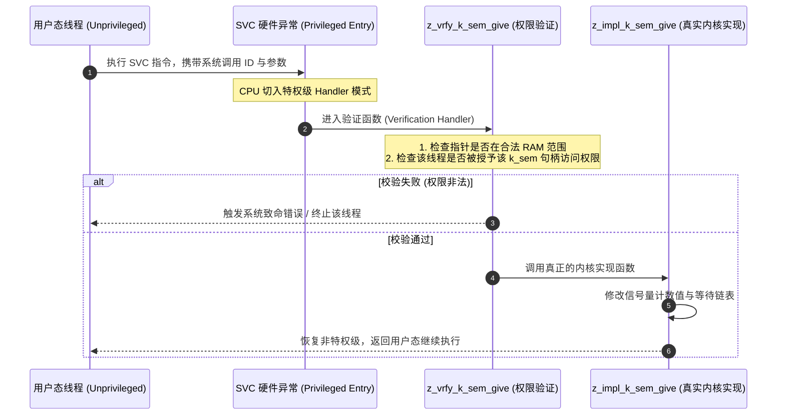

# MPU 用户空间隔离与系统调用

## 1. 嵌入式系统的“非特权革命”：`CONFIG_USERSPACE`

传统 RTOS（包括标准 FreeRTOS 与早期 Zephyr）的所有线程都运行在 CPU 的**最高特权级（Privileged Mode）**。这意味着：
* 任何一个第三方库（如未经验证的 JSON 解析器或蓝牙库）内部只要发生空指针解引用或越界写入，就能直接改写内核 TCB、关停全局中断甚至破坏底层寄存器。

Zephyr 提供了原生的 **`CONFIG_USERSPACE` 用户空间特权隔离**。

---

## 2. 系统调用机制（Syscall Stubs & Handlers）

当用户态代码调用内核 API（如 `k_sem_give(&my_sem)`）时，编译系统不会直接链接内核符号，而是通过代码生成器生成**系统调用桩函数（Syscall Stub）**：

### 2.1 编译期自动生成的三个孪生函数
在 Zephyr 源码中，声明一个系统调用宏 `__syscall void k_sem_give(struct k_sem *sem);`，工具链会在编译期自动分馏出三层代码：
1. `z_impl_k_sem_give()`：**特权内核实现**，包含最纯粹的原子修改逻辑。
2. `z_vrfy_k_sem_give()`：**参数安全屏障**，负责调用 `K_OOPS(Z_SYSCALL_OBJ(sem, K_OBJ_SEM))` 严格检验对象类型合法性。
3. `z_mrsh_k_sem_give()`：**寄存器解包分发**，负责将用户栈传过来的寄存器参数提取并安全压入内核态调用。

---

## 3. 动态内存域（Memory Domains）

为了防止用户线程间相互踩踏，Zephyr 引入了 `struct k_mem_domain`。
* 一个内存域可以绑定 1~8 个 MPU 分区（Partition）。
* 多个协同运行的线程可以加入同一个内存域，共享其中的一段共享缓冲区；而处于该域之外的其他用户线程无论如何也无法读写该物理内存，实现了**类似 Linux 进程间内存隔离的高度安全性**。
