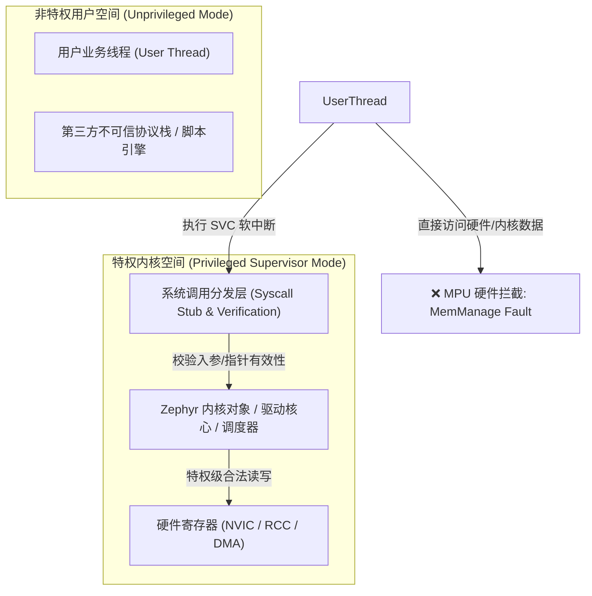
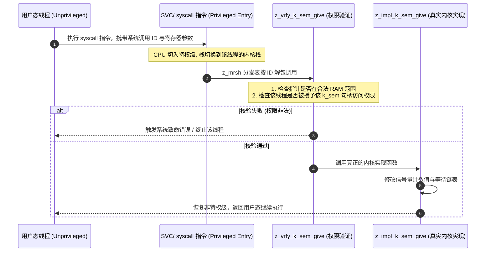
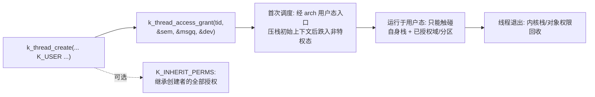

# MPU 用户空间隔离与系统调用

## 1. 嵌入式系统的“非特权革命”：`CONFIG_USERSPACE`

传统 RTOS（包括标准 FreeRTOS 与早期 Zephyr）的所有线程都运行在 CPU 的**最高特权级（Privileged Mode）**。这意味着：
* 任何一个第三方库（如未经验证的 JSON 解析器或蓝牙库）内部只要发生空指针解引用或越界写入，就能直接改写内核 TCB、关停全局中断甚至破坏底层寄存器。

Zephyr 提供了原生的 **`CONFIG_USERSPACE` 用户空间特权隔离**。



与传统“MPU 只防栈溢出”的用法不同，Zephyr 把 MPU 从**调试辅助**升级为**安全边界**：MPU 区域在线程切换时随 `k_mem_domain` 动态重编程，形成“每个线程一个视图”的类进程隔离——这是无 MMU MCU 上最接近 Linux 进程模型的工业实现。

---

## 2. 系统调用机制（Syscall Stubs & Handlers）

当用户态代码调用内核 API（如 `k_sem_give(&my_sem)`）时，编译系统不会直接链接内核符号，而是通过代码生成器生成**系统调用桩函数（Syscall Stub）**：



### 2.1 编译期自动生成的三个孪生函数

在 Zephyr 源码中，声明一个系统调用宏 `__syscall void k_sem_give(struct k_sem *sem);`，接口分为实现、验证和生成的存根/分发三层；实现与验证函数通常由开发者编写：

| 层 | 函数 | 职责 | 运行上下文 |
| :--- | :--- | :--- | :--- |
| 实现 | `z_impl_k_sem_give()` | 最纯粹的原子操作逻辑 | 特权内核 |
| 验证 | `z_vrfy_k_sem_give()` | `K_OOPS(Z_SYSCALL_OBJ(sem, K_OBJ_SEM))` 校验对象类型/权限/内存 | 特权内核（syscall 入口） |
| 桩/分发 | 用户侧存根 + `z_mrsh_k_sem_give()` | 打包参数进寄存器触发 syscall；内核侧解包恢复 | 用户栈 ↔ 内核栈 |

`__syscall` 宏同时生成用户侧存根：特权路径可直接调用 `z_impl_*`（零开销），仅用户线程走 SVC 路径——**同一份源码按调用者特权自动选择快慢路径**。

### 2.2 内核对象表：句柄即安全凭证

* 构建工具扫描 ELF/DWARF 信息发现静态内核对象，生成对象查找与权限元数据；启用动态对象配置时，`k_object_alloc()` 也可创建可授权对象。
* 用户态拿到的“指针”在 syscall 边界被还原成表项校验：**类型对不对（魔数）、允不允许（该线程的授权位）**，二者任一失败即 `k_oops`。
* 这解释了一条铁律：**普通栈上临时构造或 memcpy 伪造的对象不能代替合法对象分配**；应使用可被构建工具发现的静态对象或受支持的动态分配 API。

---

## 3. 动态内存域（Memory Domains）

为了防止用户线程间相互踩踏，Zephyr 引入了 `struct k_mem_domain`。
* 一个内存域聚合若干 MPU 分区（`struct k_mem_partition`，典型上限 8 个，架构相关）。
* 多个协同运行的线程可以加入同一个内存域，共享其中的一段共享缓冲区；而处于该域之外的其他用户线程无论如何也无法读写该物理内存，实现了**类似 Linux 进程间内存隔离的高度安全性**。

### 3.1 域的编程模型与共享内存分区

```c
K_APPMEM_PARTITION_DEFINE(app_a_part);        /* 应用 A 专属分区 */
K_APP_BMEM(app_a_part) uint8_t codec_buf[4096]; /* 把变量放入该分区 */

struct k_mem_partition *app_a_parts[] = { &app_a_part };
struct k_mem_domain app_a_domain;
k_mem_domain_init(&app_a_domain, ARRAY_SIZE(app_a_parts), app_a_parts);
k_mem_domain_add_thread(&app_a_domain, thread_a_tid); /* 线程入域 */
```

`K_APP_BMEM`（.bss 域）/`K_APP_DMEM`（.data 域）在链接期把变量聚拢进分区段；`CONFIG_APP_SHARED_MEM=y` 开启整个机制。**线程切换时内核重编程 MPU 活动区域**——这就是“每线程内存视图”的物理实现，切换成本约等于若干条 MPU 寄存器写。

### 3.2 ARMv8-M MPU 的硬约束（移植期必读）

| 约束 | 后果 |
| :--- | :--- |
| 区域数量有限（8/16 视实现） | 分区过多时编译失败；需合并或调 `CONFIG_MAX_DOMAIN_PARTITIONS` |
| ARMv8-M 的区域边界按 32 字节粒度；不要套用 ARMv7-M 的幂次大小要求 | 奇数尺寸缓冲自动 padding，RAM 规划要留余量 |
| 特权侧存在“背景区域” | 内核态不受用户分区限制；但侧信道上内核可读一切（非威胁模型范围） |
| 无 MMU 的重映射 | 隔离是“权限级”而非“地址级”：物理地址恒定，仅访问位随线程切换 |

---

## 4. 用户线程的完整生命周期



* **授权即能力（capability 模型）**：`k_thread_access_grant()` 显式把内核对象的使用权授予用户线程——未授权对象即使地址可猜，syscall 边界也会拒绝。
* **双栈设计**：每个用户线程既有用户栈（日常运行）也有内核栈（syscall 期间），两栈物理分离，杜绝“用户栈溢出冲垮内核现场”。
* **驱动设备句柄**同样走授权制：`k_thread_access_grant(tid, dev)` 之后用户态才能对该设备发起 syscall 级操作。

---

## 5. 用户态限制清单（从特权代码迁移的审计项）

| 限制 | 原因 | 迁移改法 |
| :--- | :--- | :--- |
| 禁直访内核静态数据（`z_impl_*` 全家、内核结构） | MPU 用户视图不含内核区 | 全部改为 `__syscall` API |
| 禁裸指针跨边界传参 | 内核无法验证用户内存有效性 | 用 syscall 校验宏声明的缓冲 API；或 `mem_domain` 显式共享 |
| 禁 ISR/回调上下文调用需阻塞语义的 API | 用户态不拥有中断上下文 | 用 workqueue 把活搬回线程 |
| 禁直接操作外设寄存器（MMIO） | 外设区不在用户 MPU 视图 | 走统一驱动模型 syscall |
| 全局变量默认不可见 | 全局区属内核域 | `K_APP_*MEM` 分区显式声明 |

---

## 6. 典型 oops 现象与取证

用户态违规的第一现场几乎总是一份异常转储（`CONFIG_EXCEPTION_DEBUG`）：

```text
>>> MPU FAULT (instruction access) @ 0x0800abcd    ← 出错类型与地址
 r0-a3 / r12 / lr / pc / xpsr 寄存器组             ← 现场寄存器
 Faulting instruction address (LR): 0x0800ab99     ← 用 addr2line 对回符号
 Thread: 0x20001ff0 (unpriv_worker)                ← 肇事线程
```

!!! tip
    **取证三步**：① 转储中 `pc`/`lr` 交给 `addr2line -e zephyr.elf` 定位源码行；② 看 `Thread` 名确认是哪个用户线程；③ 按 §5 清单对照——十有八九是“未授权对象访问”或“用户指针未过校验宏”。相比特权态的“随机 HardFault 三天后死机”，userspace 把故障**当场定格成可定位事件**，这正是它最大的工程价值。


---

## 7. 现场排查：Userspace 与 MPU

| 症状 | 疑似根因 | 验证手段 |
| :--- | :--- | :--- |
| 用户线程调内核 API 即 oops（`-EACCES`/对象拒绝） | 对象未 `k_thread_access_grant` 授权 | 对照 grant 列表；补授权或加 `K_INHERIT_PERMS` |
| MPU fault 但代码“看起来没越界” | 链接期变量未进分区（散在内核域） | 查 `.elf` 的 map：变量是否落在 `K_APP_*` 分区段 |
| 编译期 "no space for MPU region"/分区溢出 | 域分区数超架构上限 / 对齐 padding 膨胀 | 合并分区；调整 `CONFIG_MAX_DOMAIN_PARTITIONS` |
| syscall 后数据“没写进去” | 传的是用户指针，缓冲区权限、长度或 API 返回值不符合预期 | 检查 API 返回值与 z_vrfy 校验；非法用户内存通常触发 oops，并非静默忽略 |
| 开 USERSPACE 后 RAM 暴涨 | 每线程双栈 + 对象表元数据开销 | 核对每线程内核栈尺寸；评估隔离收益是否匹配威胁模型 |
| 极难复现的偶发崩溃变成稳定 MPU fault | 隔离起效：把原“潜伏越界”定格成现场 | 按 §6 三步取证（这是特性不是回归!） |
