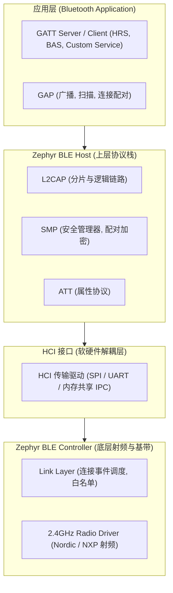
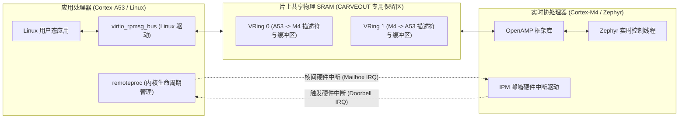
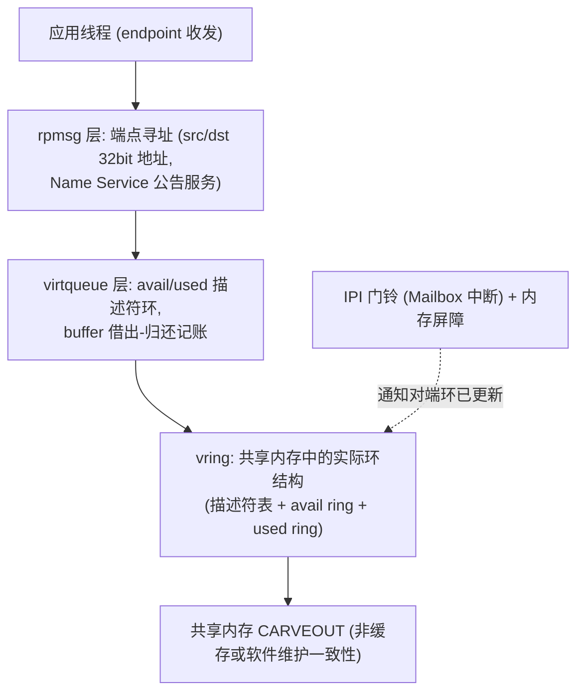
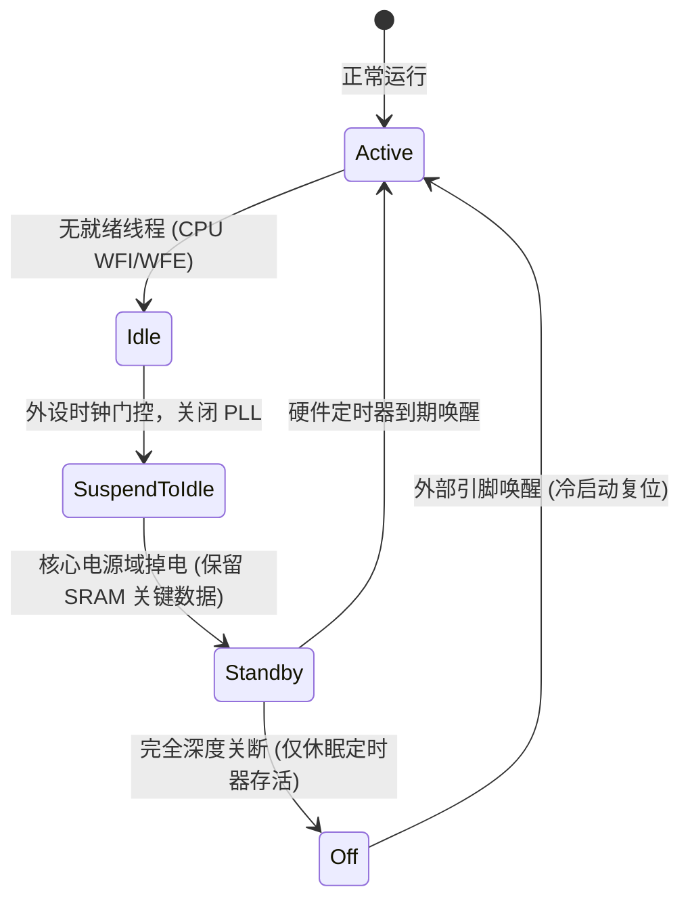

# 子系统生态与多核 AMP

## 1. 原生 BLE（低功耗蓝牙）协议栈架构

在绝大多数单片机方案中，蓝牙协议栈要么是闭源的固件二进制包（如 TI CC2640、Dialog），要么依赖体积较大的外部库。

Zephyr 拥有业界极罕见且完全开源、符合 Bluetooth SIG 规范的 **原生 BLE 协议栈（Host 与 Controller）**：



* **支持分体式拓扑**：Host 和 Controller 既可以编译在同一个单核 SoC（如 nRF52840）中，也可以将 Host 编译在主控芯片上，通过 UART HCI 接口控制外置的蓝牙从芯片，架构灵活性极强。
* **控制器级实时性**：Link Layer 的连接事件调度以硬件 Radio 时序为硬实时约束（µs 级），由高优先级/协作线程 + Radio DPPI 事件驱动实现——Zephyr 调度器本身就是为此类负载设计的。
* 在 BLE 之上还有方向查找（AoA/AoD）、BLE Mesh、广播 ISO（Audio LE）等协议扩展，支持范围依版本和控制器而异；源码支持不等于产品已完成认证。

---

## 2. 非对称多核（AMP）与核间通信

随着 SoC 复杂度攀升，多核异构架构已成为主流（例如 NXP i.MX 8M 包含 4× Cortex-A53 跑 Linux，辅以 1× Cortex-M4 跑实时系统）。

Zephyr 原生集成了 **OpenAMP（Open Asymmetric Multi-Processing）** 与硬件邮箱驱动（IPM, Inter-Processor Mailbox）：



* **零内存拷贝**：大量实时传感器或雷达数据无需通过低速串口传输，直接在共享 SRAM 中就地写入，通过 Mailbox 敲击一个中断门铃（Doorbell），Linux 侧即可通过零拷贝机制映射读取。

---

## 3. OpenAMP 实现细节：vring、缓冲与资源表

### 3.1 分层拓扑



* **rpmsg 端点**：通信的寻址单元（32 位地址，预定义 `0x35` 为 Name Service）。Linux 侧 `rpmsg_chrdev`/`rpmsg_ctrl` 暴露成字符设备，Zephyr 侧以回调收包。
* **vring 结构**：借鉴 virtio——**avail 环**登记“生产者已放好的缓冲描述符”，**used 环**登记“消费者已用完归还的描述符”；双 ring 方向各一套，数据本体在 CARVEOUT 中的预分配缓冲池里。

### 3.2 缓冲生命周期：拷贝发送 vs 零拷贝借出

| 发送方式 | API（OpenAMP 原生） | 流程 | 适用 |
| :--- | :--- | :--- | :--- |
| 拷贝发送 | `rpmsg_send()` | 数据 memcpy 进 vring 缓冲 → avail 入环 → 敲铃 | 简单通用，小消息 |
| 零拷贝借出 | `rpmsg_get_tx_payload_buffer()` → 填数 → `rpmsg_send_nocopy()` | 先借缓冲、就地填充、入环 | 音频/大帧，省一次拷贝 |

!!! note
    **借出-归还纪律**：零拷贝缓冲借出后所有权归框架，直到对端消费（used 环归还）前**不得复用**。接收侧若要持有数据跨回调生命周期，必须先“持有”接收缓冲（现代封装见 §5 的 `ipc_service_hold_rx_buffer`），否则框架复用该缓冲，数据在下一次到达时被覆盖。


### 3.3 资源表（resource table）：AMP 的“硬件握手清单”

Zephyr 固件导出一张 `resource_table`（ROM 常量）：声明 vring 数量、对齐、缓冲区尺寸、CARVEOUT 布局。Linux `remoteproc` 启动从核前解析它，据此在自己一侧映射共享内存、准备 vrings——主端可在启动时填写分配地址等字段，具体协商和内存配置依平台而定；变更后需验证两端兼容性。

---

## 4. 缓存一致性：AMP 最经典的偶发事故源

多数异构 SoC 的共享 SRAM 对 Cortex-M 是**非一致的**（M 核直连无 cache 侦听，或走不同 cache 域）：

```c
/* M 核向共享缓冲写数据后通知 A 核——错误示范 */
fill_payload(shared_buf, len);        /* 写只进了 M 核 D-Cache */
kick_doorbell(ipm_ch);                /* A 核立刻读——读到旧内存! */

/* 正确示范: clean + 屏障 + 再通知 */
fill_payload(shared_buf, len);
__DSB();                              /* 写操作完成可见 */
SCB_CleanDCache_by_Addr(shared_buf, len);  /* 地址/长度须符合所用 CMSIS 的对齐要求 */
__DSB();                              /* 确保清理完成后再通知 */
kick_doorbell(ipm_ch);                /* 此后数据保证对端可见 */
```

| 方向 | 一致性动作 | 忘做的症状 |
| :--- | :--- | :--- |
| M 写 → A 读 | 写后 `CleanDCache`（+ DSB）再敲铃 | A 核偶发读到**旧数据**，且随负载随机 |
| A 写 → M 读 | 读前 `InvalidateDCache`（+ DSB 于收铃后） | M 核读到**过期 cache 行**，且“过一会儿又对了” |
| 双向零拷贝环 | 缓冲区整体标记非缓存（MPU/MP 竞性） | 性能换正确性，牺牲带宽 |

!!! warning
    **这类 bug 的恐怖之处**：概率性、与时钟频率相关、加打印即消失。任何 AMP 项目第一天就要把“共享内存默认当作非一致”写进编码规范；用非缓存 MPU 区域或显式 clean/invalidate 二选一，绝不依赖“碰巧能跑”。


---

## 5. `ipc_service`：对 OpenAMP 的现代封装

直接写 OpenAMP（endpoint 状态机、vring 对齐、缓存维护）冗长易错。Zephyr 3.x 提供面向对象的 `ipc_service` 层（`CONFIG_IPC_SERVICE`，后端可插拔：rpmsg/icmsg）：

```c
/* --- 端点配置与回调 --- */
static struct ipc_ept_cfg ept_cfg = {
    .name = "ctrl",                       /* Name Service 自动匹配对端 */
    .prio = 0,
    .cb = {
        .bound    = ept_bound_cb,          /* 对端上线回调 */
        .received = ept_received_cb,       /* 收包回调 (payload/len/priv) */
        .error    = ept_error_cb,
    },
};

ipc_service_open_instance(&ipc_instance);  /* 打开传输实例 */
ipc_service_register_endpoint(&ipc_instance, &ept, &ept_cfg);

/* --- 零拷贝发送: 借缓冲 → 填充 → 发送 --- */
void *buf;
uint32_t buf_size = sizeof(pkt);
int rc = ipc_service_get_tx_buffer(&ept, &buf, &buf_size, K_FOREVER);
if (rc == 0) {
    if (buf_size < sizeof(pkt)) {
        ipc_service_drop_tx_buffer(&ept, buf);
    } else {
        memcpy(buf, &pkt, sizeof(pkt));
        rc = ipc_service_send_nocopy(&ept, buf, sizeof(pkt));
        if (rc < 0) { ipc_service_drop_tx_buffer(&ept, buf); }
    }
}

/* --- 接收侧长持有: 先 hold 再 release --- */
static void ept_received_cb(void *data, size_t len, void *priv)
{
    /* 想跨回调保存 data: */
    ipc_service_hold_rx_buffer(&ept, data);
    /* ... 用完: */
    ipc_service_release_rx_buffer(&ept, data);
}
```

| ipc_service 能力 | 对应裸 OpenAMP 痛点 |
| :--- | :--- |
| `bound` 回调 | 不再手写 endpoint 名字服务握手与就绪标志 |
| 内建缓存维护（rpmsg 后端） | §4 的 clean/invalidate 由框架按后端能力处理 |
| `hold/release_rx_buffer` | 显式建模“接收缓冲借出周期” |
| icmsg 轻量后端 | 极小 RAM 场景免 vring，单环字节流 |

**remoteproc 生命周期**（Linux 主导）：`offline`（加载 ELF 到 CARVEOUT，解析 resource_table）→ 启动向量放行 → `running`（rpmsg Name Service 握手、建端点）→ 异常时 `crashed`（可配置自动重启策略）。Zephyr 侧只需提供正确的资源表与入口地址，无需自建生命周期管理。

---

## 6. 电源管理子系统（Power Management, PM）

Zephyr 拥有比传统简单 Tickless 复杂得多的统一电源状态机：



### 6.1 策略驱动的架构

* **`CONFIG_PM`**：总开关。空闲线程检测到无就绪线程时询问 **PM Policy**（策略模块：residency 时间阈值 / deadline 约束 / 自定义）该坠入哪一级睡眠。
* **tickless 联动**：无周期 tick 的时基（见[线程调度篇 §6](03-kernel-threads-scheduler-algorithms.md)）让“睡到下一个真实事件”成为默认行为——PM 与调度器共享同一套超时预算，不存在“tick 把睡眠打断”的空转。
* **子状态（Substates）**：同一大状态下平台可暴露多档（不同 PLL/电压点），由 `pm_policy` 按 residency 成本择优。
* **约束机制**：业务线程可动态施加约束（如“接下来 500ms 内禁止深睡”——UART 正在收流）阻止降档，`pm_policy_device_power_lock_get/put()` 则在设备维度锁门。

### 6.2 设备级电源感知（Device PM）

系统准备从 `Active` 坠入深睡前，内核电源管理器会遍历活动设备，依次调用其 `pm_action_cb(PM_DEVICE_ACTION_SUSPEND)`，安全保存外设寄存器现场并关断时钟总线，降低外设耗电；仍需实测电流和检查板级供电。

**运行时 PM（Runtime PM）** 则解决“系统醒着、单设备想睡”的场景——**引用计数**模型：

```c
pm_device_runtime_get(dev);   /* 用前 +1: 若为 0→1 自动 RESUME 设备 */
do_flash_operation(dev);
pm_device_runtime_put(dev);   /* 用后 -1: 若归 0 自动 SUSPEND 设备 */
```

| 机制 | 触发者 | 粒度 | 关键 API/Kconfig |
| :--- | :--- | :--- | :--- |
| 系统 PM | 空闲线程 + 策略 | 全局睡眠状态机 | `CONFIG_PM`、pm_policy |
| 系统管理的设备 PM | 系统 PM 流程 | 随全局起落 | `CONFIG_PM_DEVICE_SYSTEM_MANAGED` |
| 运行时 PM | 驱动/应用按需 | 单设备 | `pm_device_runtime_get/put`、`CONFIG_PM_DEVICE_RUNTIME` |
| 自动开启 | 设备初始化后 | 单设备 | devicetree `zephyr,pm-device-runtime-auto` 属性 |

!!! note
    **两条实战纪律**：① 运行时 PM 不自动管理依赖——传感器驱动用总线前必须自己 `get/put` 它依赖的总线设备；② 深睡恢复路径必须完整实现 `PM_DEVICE_ACTION_RESUME`，否则“醒来外设哑”（见 §8 排查表）。


---

## 7. 子系统生态巡礼

| 子系统 | 一句话能力 | 关键 Kconfig/入口 |
| :--- | :--- | :--- |
| **网络栈** | 原生 IPv4/IPv6/TCP/UDP、6LoWPAN、CoAP/LwM2M 物联网协议 | `CONFIG_NETWORKING` |
| **BLE** | 认证级 Host+Controller，见 §1 | `CONFIG_BT` |
| **MCUboot** | 安全引导：签名验证、防回滚、A/B 双槽 OTA | `CONFIG_BOOTLOADER_MCUBOOT` |
| **日志系统** | 多后端、编译期过滤、延迟投递与 panic 模式 | `CONFIG_LOG` |
| **设置（settings）** | NVS/文件系统键值持久化 | `CONFIG_SETTINGS` |
| **Shell** | 交互式调试 CLI（蓝牙/设备/内核插件齐备） | `CONFIG_SHELL` |
| **POSIX 层** | PSE52 剖面的 pthread/时钟/消息队列适配 | `CONFIG_POSIX_API` |

这些子系统共享同一个设计基因：**Kconfig 可关到零、devicetree 声明硬件、内核对象静态化**——生态扩张不侵蚀最小系统的资源底线。

---

## 8. 现场排查：AMP 与电源

| 症状 | 疑似根因 | 验证手段 |
| :--- | :--- | :--- |
| rpmsg 偶发读到旧数据 | 共享内存非一致，漏 clean/invalidate | 按 §4 补缓存维护；或缓冲标非缓存复测 |
| 对端完全收不到消息 | endpoint 未 bind/名字不匹配、IPI 通道号错、resource_table 两端不同步 | 检查 Name Service 握手日志；比对两端资源表 |
| 零拷贝发送数据“错乱” | 借出缓冲提前复用（未等归还） | 审计 get_tx_buffer→send 生命周期；必要时退回拷贝发送验证 |
| Linux 启动从核失败 | 入口地址/ELF 加载区与 CARVEOUT 冲突 | dmesg remoteproc 报错；核对链接脚本与资源表 |
| 深睡唤醒后外设不工作 | 驱动未实现/不完整实现 RESUME action | 检查 `pm_action` 分支；单独 `pm_device_runtime_get` 强制拉醒验证 |
| 平均电流远高于预期 | 某设备引用计数泄漏（put 少于 get）、策略禁深睡约束未解除 | 电流台 + 逐设备排查 get/put 配对 |
| `ipc_service` open 阻塞不返回 | 对端镜像未起/传输后端不匹配 | 先验证 IPI 通路；确认两端 `CONFIG_IPC_SERVICE` 后端一致 |

## 参考

- [对应版本的官方文档或实现](https://docs.zephyrproject.org/3.7.0/services/ipc/ipc_service/ipc_service.html)
