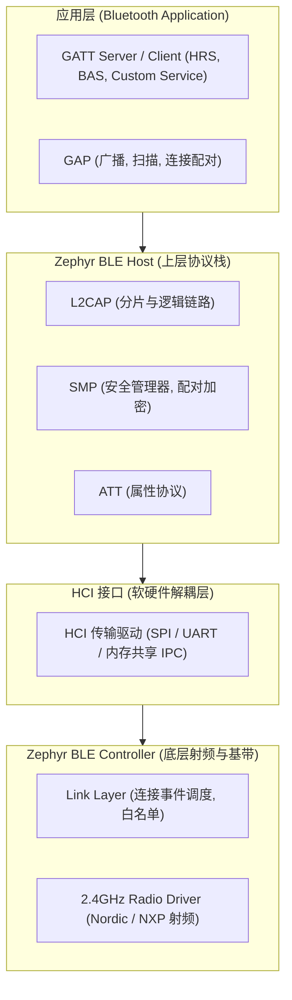
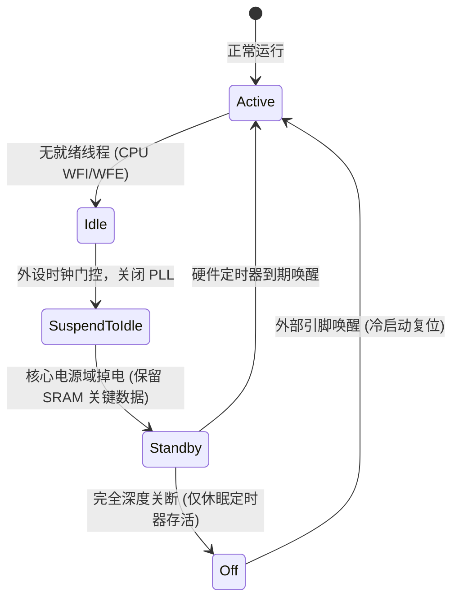

# 子系统生态与多核 AMP

## 1. 原生 BLE（低功耗蓝牙）协议栈架构

在绝大多数单片机方案中，蓝牙协议栈要么是闭源的固件二进制包（如 TI CC2640、Dialog），要么依赖体积较大的外部库。

Zephyr 拥有业界极罕见且完全开源、符合 Bluetooth SIG 规范的 **原生双模 BLE 协议栈**：



* **支持分体式拓扑**：Host 和 Controller 既可以编译在同一个单核 SoC（如 nRF52840）中，也可以将 Host 编译在主控芯片上，通过 UART HCI 接口控制外置的蓝牙从芯片，架构灵活性极强。

---

## 2. 非对称多核（AMP）与核间通信

随着 SoC 复杂度攀升，多核异构架构已成为主流（例如 NXP i.MX 8M 包含 4× Cortex-A53 跑 Linux，辅以 1× Cortex-M4 跑实时系统）。

Zephyr 原生集成了 **OpenAMP（Open Asymmetric Multi-Processing）** 与硬件邮箱驱动（IPM, Inter-Processor Mailbox）：

```mermaid
flowchart LR
    subgraph AP_Core["应用处理器 (Cortex-A53 / Linux)"]
        LinuxApp["Linux 用户态应用"]
        Remoteproc["remoteproc (内核生命周期管理)"]
        RPMsgLinux["virtio_rpmsg_bus (Linux 驱动)"]
    end

    subgraph SharedRAM["片上共享物理 SRAM (Shared Memory)"]
        Vring0["VRing 0 (A53 -> M4 描述符与缓冲区)"]
        Vring1["VRing 1 (M4 -> A53 描述符与缓冲区)"]
    end

    subgraph MCU_Core["实时协处理器 (Cortex-M4 / Zephyr)"]
        ZephyrApp["Zephyr 实时控制线程"]
        OpenAMP["OpenAMP 框架库"]
        IPM["IPM 邮箱硬件中断驱动"]
    end

    LinuxApp <--> RPMsgLinux
    RPMsgLinux <--> SharedRAM
    SharedRAM <--> OpenAMP
    OpenAMP <--> ZephyrApp

    Remoteproc -.->|核间硬件中断 (Mailbox IRQ)| IPM
    IPM -.->|触发硬件中断 (Doorbell IRQ)| Remoteproc
```

* **零内存拷贝**：大量实时传感器或雷达数据无需通过低速串口传输，直接在共享 SRAM 中就地写入，通过 Mailbox 敲击一个中断门铃（Doorbell），Linux 侧即可通过零拷贝机制映射读取。

---

## 3. 电源管理子系统（Power Management, PM）

Zephyr 拥有比传统简单 Tickless 复杂得多的统一电源状态机：



* **设备级电源感知（Device PM）**：在系统准备从 `Active` 坠入深睡前，内核电源管理器会沿着设备树逆序遍历所有处于活动状态的驱动，依次调用其 `pm_action_cb(PM_DEVICE_ACTION_SUSPEND)`，安全保存外设寄存器现场并关断时钟总线，从源头封死任何漏电通路。
