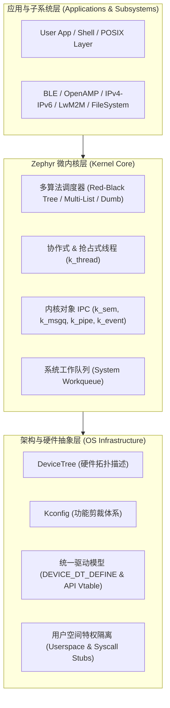

# 03 Zephyr 架构与驱动

Zephyr 是 Linux 基金会旗下的开源顶级嵌入式实时操作系统项目，由 Intel、Nordic、NXP 等众多半导体巨头联合推动。

与传统以纯调度器为中心的 RTOS 不同，Zephyr 的定位是 **“面向互联计算与物联网时代的现代化类 Linux 嵌入式操作系统平台”**：它原生继承了 Linux 内核的优秀设计范式（DeviceTree 硬件描述、Kconfig 编译裁决、统一设备驱动模型、特权域用户空间隔离），并具备完善的原生网络栈、BLE 协议栈与安全固件体系。

## 篇章目录

1. [现代化演进与微内核谱系](01-zephyr-architecture-evolution.md)
   - Zephyr 的历史起源（Wind River Rocket 到 Linux 基金会项目）
   - 单内核（Monolithic）与微内核（Microkernel）思想的融合演进
   - Linux 开发者视角的“微缩嵌入式操作系统”

2. [Kconfig 与 DeviceTree 体系](02-build-system-kconfig-devicetree.md)
   - 元工具链 `west` 与 CMake 编译流水线
   - Kconfig 静态配置树（配置宏 `CONFIG_XXX` 的展开与依赖依赖关系）
   - DeviceTree（DTS/DTSI）硬件解耦原理：节点属性提取与编译期 C 头文件生成

3. [线程模型与多算法调度器](03-kernel-threads-scheduler-algorithms.md)
   - 协作式线程（Cooperative Threads，负优先级）与抢占式线程（Preemptive Threads）
   - 三大就绪队列算法选型：Dumb（极简轮询）、Multi-List（多优先级链表）、Red-Black Tree（红黑树）
   - 调度策略与时间片控制机制

4. [统一设备驱动模型](04-unified-driver-model.md)
   - 传统 RTOS 驱动痛点：厂商 HAL 接口严重撕裂
   - `DEVICE_DT_DEFINE` 宏展开深度剖析
   - 编译期静态链接与驱动初始化级别（EARLY / PRE_KERNEL_1 / POST_KERNEL / APPLICATION）
   - 基于虚函数表（Vtable API）的标准化外设调用

5. [内核对象 IPC 与 Workqueue](05-kernel-objects-ipc-workqueue.md)
   - 核心 IPC：信号量 `k_sem`、数据队列 `k_fifo` / `k_lifo`、消息队列 `k_msgq`、字节流管道 `k_pipe`
   - 内核对象权限验证（K_OBJ_TYPE）
   - 系统工作队列（System Workqueue）在底半部异步处理中的核心作用

6. [MPU 用户空间隔离与系统调用](06-memory-protection-userspace-syscall.md)
   - `CONFIG_USERSPACE` 机制：无 MMU 下的线程安全隔离
   - 用户态到特权态的跨越：`z_impl_xxx` 与自动生成的系统调用存根（Syscall Stubs）
   - 栈溢出硬件 MPU Guard 与动态内存域（Memory Domains）

7. [子系统生态与多核 AMP](07-subsystems-amp-power-management.md)
   - 原生低功耗蓝牙（BLE Host/Controller）架构
   - 非对称多核（AMP）与核间通信：OpenAMP / IPM（Inter-Processor Mailbox）
   - 电源管理子系统（Power Management, PM）：低功耗状态机与外设电源挂起
