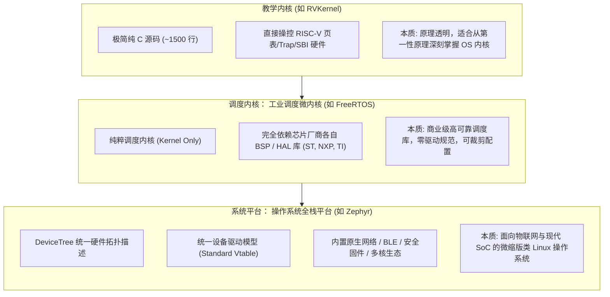

# 设计哲学与架构范式

## 1. 核心定位的根本分歧

FreeRTOS 侧重调度与同步，Zephyr 还提供驱动、构建和子系统框架。下面将它们与 [RVKernel Lab](../Labs/README.md) 对照，比较各自包含的功能。

---

## 2. 软件构建与集成体验对比

### 2.1 FreeRTOS 的集成范式
* **极低的侵入性**：开发者可以在现有的任何 Makefile、Keil MDK 工程、IAR 甚至 CMake 裸机工程中，直接把 `tasks.c`, `queue.c`, `list.c`, `port.c` 几个文件“扔进工程目录树”，再放一个 `FreeRTOSConfig.h`，点击编译即可成功。
* **零工具链束缚**：不需要在主机安装特定的 Python 依赖、Ninja 工具链或特定包管理器。

### 2.2 Zephyr 的集成范式
* **强约束与现代工程化**：必须遵循 Zephyr 的工作空间规范（Workspace），依赖 `west init` 拉取源码树。
* **依赖环境要求**：开发机必须具备 Python 3、CMake 3.20+、Ninja 以及交叉编译器工具链（Zephyr SDK）。
* **收益**：大型团队协作时，代码风格、构建产物、依赖版本高度可复现，杜绝了“在张三电脑上编译得通、在李四电脑上找不到头文件”的经典工程顽疾。

---

## 3. 全局技术栈特征对比表

| 对比维度 | FreeRTOS | Zephyr |
| :--- | :--- | :--- |
| **项目主导机构** | Amazon Web Services (AWS) | Linux Foundation (由 Intel, Nordic, NXP 等共建) |
| **开源许可证** | MIT License | Apache 2.0 License |
| **代码量基线** | 约 1.5 万行核心 C 代码 | 超过 200 万行（含完整驱动、协议栈与测试用例） |
| **硬件驱动绑定** | **完全无官方驱动标准**，依赖芯片厂裸机 HAL | **高度标准化**，具备类 Linux 统一设备模型 |
| **硬件描述方式** | C 头文件宏定义（或 CubeMX / 原厂代码生成器） | **DeviceTree（DTS / DTSI / Overlay）** |
| **配置裁决方式** | 手写 `FreeRTOSConfig.h` 宏开关 | 交互式或声明式 **Kconfig（prj.conf / menuconfig）** |
| **POSIX 兼容度** | 需额外挂载极简抽象兼容包 | **原生支持 POSIX PSE51/52 规范**，易于迁移 Linux 代码 |
| **系统调用机制** | 无（所有代码通常处于特权态） | **完整支持非特权用户空间系统调用存根** |
| **调试与跟踪** | 支持 FreeRTOS Tracealyzer、Segger SystemView | 支持原生 Shell、Logging 子系统与 SystemView |
