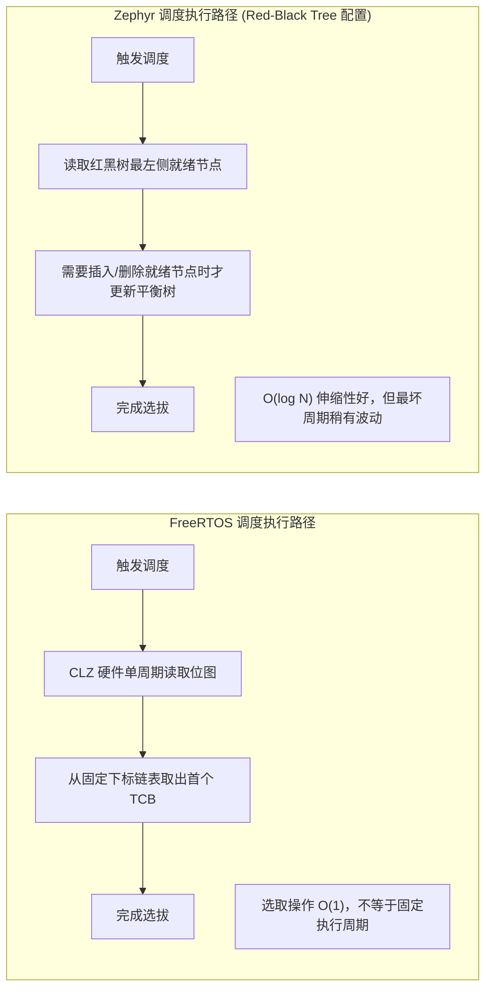

# 调度机制与实时确定性

## 1. 调度算法复杂度深度对比

实时系统的首要考核标准是**最坏情况下的决策时间是否具有确定性（Determinism）**。



| 调度属性 | FreeRTOS (开启 Port Optimised) | Zephyr (Multi-Queue) | Zephyr (Red-Black Tree) |
| :--- | :--- | :--- | :--- |
| **选取最高优先级** | **严格 $O(1)$**（单周期 CLZ 指令） | $O(1)$ 或小范围遍历 | **$O(\log N)$**（自根向左下行至最左节点；Linux CFS 因额外缓存 `rb_leftmost` 指针才被称作 $O(1)$，Zephyr 未做此缓存） |
| **就绪节点插入** | **严格 $O(1)$**（直接插在双向链表尾部） | **严格 $O(1)$** | **$O(\log N)$**（二叉树比较与再平衡） |
| **删除就绪节点** | **严格 $O(1)$**（双向链表解引用） | **严格 $O(1)$** | **$O(\log N)$**（涉及树旋转操作） |
| **支持的优先级级数** | 通常限定在 32 级（匹配单字位图宽） | 灵活可配（通常 32~128 级） | 由内核优先级类型和配置限定（不是无限） |

!!! note
    **为什么树结构仍值得**：在线程数动态达到数百、且优先级取值分散的大型系统（多核 SMP、协议栈密集）中，$O(\log N)$ 的平稳伸缩性优于「优先级数组 + 线性扫描」的 $O(K)$；而在 32 级位图已够用的经典控制场景，FreeRTOS 的 CLZ 方案在**最坏决策周期**上仍占优——选型应看「就绪集规模」，而非单点复杂度标签。


---

## 2. 实时性能评测框架与测量方法论

在评估实时操作系统的性能与确定性时，不能将局部指令的执行速度简单等同于整个系统的实时指标。在工程上，必须将测量对象严格拆解为三个独立层级：


!!! warning
    **常见逻辑误区防范**：
    不能由“FreeRTOS 采用了单周期 CLZ 指令”直接得出“整个系统在纳秒级必定更快或更具确定性”的结论。单周期指令仅代表“任务选拔”这一步骤是常数时间；但完整的上下文切换还受到内存总线速度、Flash 预取缓冲区、Cache 缺失率以及临界区嵌套深度的综合制约。


---

## 3. 标准化测量手段与干扰变量控制

### 3.1 物理电平脉冲法（GPIO + 逻辑分析仪 / 示波器）
在两个明确的执行位置写 GPIO，用示波器测量边沿间隔。打标会增加指令和总线访问，必须估计打标开销，并说明探针位置；该方法并非无侵入测量。


### 3.2 计数器插桩与内核调用边界

Cortex-M 可使用 `DWT->CYCCNT` 记录核心周期数（须确认目标实现支持并已启用）。RISC-V 的 `rdcycle` 与 `rdtime` 含义不同：前者读取周期计数，后者读取时间计数，其频率由平台时基决定，不能直接当成 CPU 周期；还需检查访问权限、分辨率和回绕。

测量 FreeRTOS 的 `vTaskSwitchContext()` 时，应在**端口现有的合法调度调用位置**前后插桩，保留原有寄存器保存、栈对齐和 BASEPRI 保护。不要从普通任务直接调用该内核函数：它会更新当前任务指针，却不会独立完成硬件现场切换。参见 [V10.5.1 ARM_CM4F 端口](https://github.com/FreeRTOS/FreeRTOS-Kernel/blob/V10.5.1/portable/GCC/ARM_CM4F/port.c)。

```text
端口保存任务上下文并进入原有调度临界区
    读取起始周期计数（插桩必须遵守寄存器约定）
    执行端口原有的 vTaskSwitchContext 调用
    读取结束周期计数，将差值写入预分配缓冲区
端口退出临界区并恢复被选中任务的上下文
```

以上是插桩位置示意，不是可直接复制的任务代码。该区间测到的是调度函数开销，不含完整异常入栈和出栈；函数内部也可能包含统计、栈检查等配置相关工作。测量期间避免 `printf`、动态分配和阻塞调用，另测读取计数器及记录结果的开销。

仅挂起调度器（例如 `vTaskSuspendAll()`）不等于屏蔽中断：它影响任务何时运行，不能直接算作 ISR 入口延迟。报告中应分别统计中断入口延迟、任务唤醒延迟与上下文切换区间。

### 3.3 必须在评测报告中注明的核心变量
任何脱离具体硬件边界声明的实时数据均无实际工程意义。在对比 FreeRTOS 与 Zephyr 时，评测工程必须固定并披露以下要素：
1. **指令与数据存放介质**：零等待内部 SRAM vs 具等待周期的 Flash（含 ART Accelerator / Flash Cache 状态）；
2. **高速缓存命中状态**：冷启动（Cold Cache，频繁 Cache Miss 带来时钟抖动）vs 热循环（Warm Cache）；
3. **编译器与链接优化**：GCC 优化等级（`-O2` 倾向循环展开，`-Os` 侧重体积缩减）、链接器 `--gc-sections`；
4. **内核功能配置集**：是否使能 FPU、是否开启断言检查（`configASSERT` / `__ASSERT`）、是否使能跟踪工具（SystemView / Tracealyzer）以及是否激活 MPU 特权域。

---

## 4. 事件到任务首指令：机制级延迟预算分解

高优先级任务被外设事件唤醒的完整路径，可拆为五段串联预算。两套 OS 在每段贡献的机制不同：

| 预算段 | 物理含义 | FreeRTOS 贡献机制 | Zephyr 贡献机制 |
| :--- | :--- | :--- | :--- |
| **① 硬件识别与取向量** | IRQ 信号有效 → 流水线冲刷、取向量、压栈基本帧 | 同为 Cortex-M 硬件行为，两 OS 无差异（12 周期量级，含尾链时更少） | 同左 |
| **② ISR 入口前的屏蔽窗口** | 该 IRQ 被屏蔽的最长时间 | `taskENTER_CRITICAL()` 走 BASEPRI，窗口 = 应用最长临界区 | `k_spin_lock`/`irq_lock` 关中断窗口 + SMP 下可能的 `CONFIG_SPINLOCK` 自旋等待 |
| **③ ISR 执行与唤醒动作** | FromISR API 更新就绪表 | `xQueueSendFromISR` → 就绪链表插入 + `pxHigherPriorityTaskWoken` 标记 | `k_msgq_put(K_NO_WAIT)` → 就绪队列插入 + `z_set_pendsv`/reschedule 请求 |
| **④ 调度决策** | 选出最高优先级任务 | CLZ 位图 + 链表取首（PendSV 最低优先级保证不抢 ISR） | 就绪队列算法（见第 1 节）+ SMP 下可能的跨核唤醒 IPI |
| **⑤ 现场恢复到首指令** | 出栈 + 取指执行 | PendSV 汇编出栈（FPU 帧视任务而定） | `z_swap`/arch 层上下文恢复 |

!!! warning
    **预算叠加原则**：总延迟的最坏值 = ②的屏蔽窗口 + ③的实际 ISR 执行时长（含同优先级排队）+ ④⑤。②由**应用代码**决定而非内核——工程实践中 90% 的「RTOS 抖动大」根因是应用里某段临界区过长，而非调度器算法本身。


---

## 5. 抖动源清单与典型量级

| 抖动源 | 作用段 | FreeRTOS | Zephyr | 缓解手段 |
| :--- | :--- | :--- | :--- | :--- |
| 关中断临界区 | ② | `taskENTER_CRITICAL` 区间内嵌套深度 | `irq_lock` 区间 | 缩短临界区、只保护链表操作 |
| 调度器决策 | ④ | CLZ 常数 | 视就绪队列算法 | 线程规模可控时均可忽略 |
| Tick 粒度 | ③ | `vTaskDelay` 对齐到下一个 tick 边界 | 同理；`k_timer` 周期由内核时钟驱动 | 周期事件用硬件定时器直接触发或 tickless 补偿 |
| Flash 取指等待 | ①③④⑤ | 中断向量/ISR/内核代码在 Flash 上执行时的 wait states（与预取、缓存状态相关） | 同左 | 关键路径函数放 RAM 执行（`__attribute__((section(".ramfunc")))`） |
| FPU 惰性压栈 | ⑤ | 首次 FPU 指令触发 s0–s15 硬件压栈 | `CONFIG_FPU_SHARING` 下类似 | 实时任务避免混用 FPU，或预留该项预算 |
| 总线竞争 | 全程 | DMA 抢占总线延迟取指/访存 | 同左 | 关键 DMA 仲裁优先级、突发长度限制 |
| SMP 跨核唤醒 | ④ | `configNUMBER_OF_CORES > 1` 时可能 IPI 唤醒空闲核 | `CONFIG_SMP` 下同 | 关键任务绑核（affinity） |

**典型示例值（教育用途，Cortex-M4 @ 168MHz、零等待 SRAM 执行，须以实测为准）**：中断延迟数百 ns 量级、任务级上下文切换 1~3 µs 量级、从 ISR 唤醒高优先级任务到首指令数 µs 量级。量级本身并不重要——重要的是**分布**：报告应给出 min/avg/max/P99.9，而非单次示波器截图。

---

## 6. 跟踪工具链与抖动尖峰现场排查

### 6.1 周期性跟踪采集

| 工具 | 适用 | 采集内容 | 注意 |
| :--- | :--- | :--- | :--- |
| Percepio Tracealyzer | FreeRTOS | 任务切换/阻塞/队列事件流，时间线可视化 | 需 `trcKernelPort.c` 与流接口（J-EGGER RTT/ETH） |
| SEGGER SystemView | FreeRTOS / Zephyr | 连续事件流 + 中断级时序，RAM 缓冲 RTT 上传 | SystemView 3.x 起 RTT 无需暂停目标 |
| Zephyr Tracing 子系统 | Zephyr | `CONFIG_TRACING` 将线程切换/ISR 进出送入后端（`tracing_cpu_stats`、CTF/SystemView） | 后端可插拔，CTF 可离线分析 |

### 6.2 抖动尖峰定位顺序（现场排查）

1. **先定性**：GPIO+示波器捕获尖峰波形，量级是「多了几 µs」还是「多了 ms 级」——后者直接怀疑关中断临界区或长 ISR。
2. **扫 ISR**：跟踪数据里检查尖峰时刻是否有低优先级设备 ISR 正在执行（同/更高优先级抢占排队）。
3. **扫临界区**：在 `taskENTER_CRITICAL` / `irq_lock` 的进出打点统计持有时长直方图，找最长持有点。
4. **扫优先级反转**：高优先级任务尖峰时刻是否在等某个 mutex（Tracealyzer 的阻塞链视图直接可见持有者）。
5. **查硬件嫌疑**：Flash 执行段、DMA 总线饱和、时钟降频（PM 状态切换导致的频率爬升间隙）。
6. **复现固化**：将定位到的最长路径写成回归用例，纳入 CI 的延迟监控（如 `zephyr,test` 类 suite 或自定义 cyclictest 式任务）。
    FreeRTOS 与 Zephyr 的开销取决于具体端口、功能配置、工作负载和存储系统，不能只按主频或内核代码行数判断。先按资源、驱动和隔离需求选择候选配置，再测量目标平台上的延迟分布及压力场景；观测到的最大值不等于已经证明的最坏情况上界。
