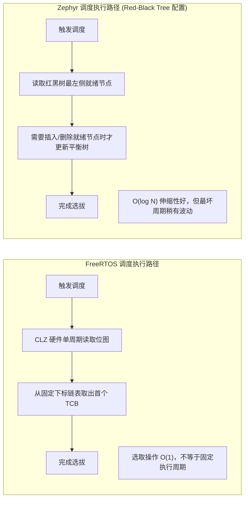
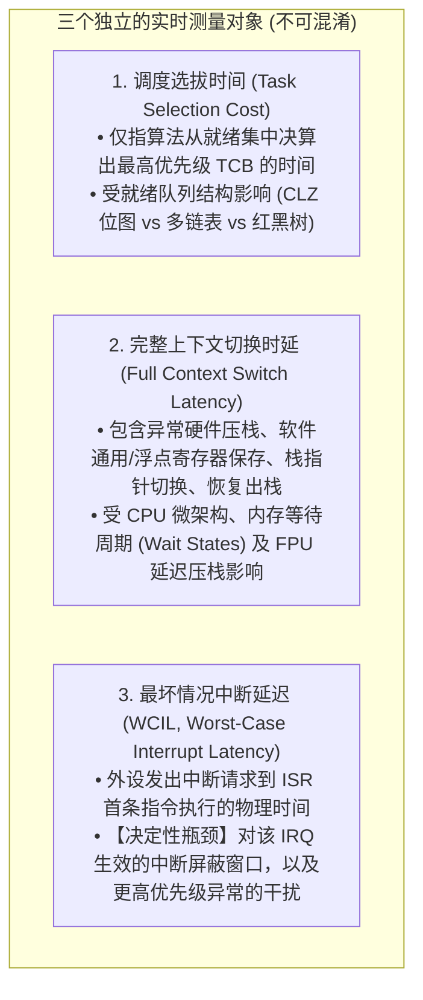

# 调度机制与实时确定性

## 1. 调度算法复杂度对比

实时系统的首要考核标准是**最坏情况下的决算时间是否具有确定性（Determinism）**。



| 调度属性 | FreeRTOS (开启 Port Optimised) | Zephyr (Multi-Queue) | Zephyr (Red-Black Tree) |
| :--- | :--- | :--- | :--- |
| **选取最高优先级** | **严格 $O(1)$**（单周期 CLZ 指令） | $O(1)$ 或小范围遍历 | **严格 $O(1)$**（直接读取最左节点） |
| **就绪节点插入** | **严格 $O(1)$**（直接插在双向链表尾部） | **严格 $O(1)$** | **$O(\log N)$**（二叉树比较与再平衡） |
| **删除就绪节点** | **严格 $O(1)$**（双向链表解引用） | **严格 $O(1)$** | **$O(\log N)$**（涉及树旋转操作） |
| **支持的优先级级数** | 通常限定在 32 级（匹配单字位图宽） | 灵活可配（通常 32~128 级） | 由内核优先级类型和配置限定（不是无限） |

---

## 2. 实时性能评测框架与测量方法论

在评估实时操作系统的性能与确定性时，不能将局部指令的执行速度简单等同于整个系统的实时指标。在工程上，必须将测量对象严格拆解为三个独立层级：



> [!CAUTION]
> **常见逻辑误区防范**：  
> 不能由“FreeRTOS 采用了单周期 CLZ 指令”直接得出“整个系统在纳秒级必定更快或更具确定性”的结论。单周期指令仅代表“任务选拔”这一步骤是常数时间；但完整的上下文切换还受到内存总线速度、Flash 预取缓冲区、Cache 缺失率以及临界区嵌套深度的综合制约。

---

## 3. 标准化测量手段与干扰变量控制

### 3.1 物理电平脉冲法（GPIO + 逻辑分析仪 / 示波器）
在两个明确的执行位置写 GPIO，用示波器测量边沿间隔。打标会增加指令和总线访问，必须估计打标开销，并说明探针位置；该方法并非无侵入测量。


### 3.2 计数器插桩与内核调用边界

Cortex-M 可使用 `DWT->CYCCNT` 记录核心周期数（须确认目标实现支持并已启用）。RISC-V 的 `rdcycle` 与 `rdtime` 含义不同：前者读取周期计数，后者读取时间计数，其频率由平台时基决定，不能直接当成 CPU 周期；还需检查访问权限、分辨率和回绕。

测量 FreeRTOS 的 `vTaskSwitchContext()` 时，应在**端口现有的合法调度调用位置**前后插桩，保留原有寄存器保存、栈对齐和 BASEPRI 保护。不要从普通任务直接调用该内核函数：它会更新当前任务指针，却不会独立完成硬件现场切换。参见 [V10.5.1 ARM_CM4F 端口](https://github.com/FreeRTOS/FreeRTOS-Kernel/blob/V10.5.1/portable/GCC/ARM_CM4F/port.c)。

```text
端口保存任务上下文并进入原有调度临界区
    读取起始周期计数（插桩必须遵守寄存器约定）
    执行端口原有的 vTaskSwitchContext 调用
    读取结束周期计数，将差值写入预分配缓冲区
端口退出临界区并恢复被选中任务的上下文
```

以上是插桩位置示意，不是可直接复制的任务代码。该区间测到的是调度函数开销，不含完整异常入栈和出栈；函数内部也可能包含统计、栈检查等配置相关工作。测量期间避免 `printf`、动态分配和阻塞调用，另测读取计数器及记录结果的开销。

仅挂起调度器（例如 `vTaskSuspendAll()`）不等于屏蔽中断：它影响任务何时运行，不能直接算作 ISR 入口延迟。报告中应分别统计中断入口延迟、任务唤醒延迟与上下文切换区间。

### 3.3 必须在评测报告中注明的核心变量
任何脱离具体硬件边界声明的实时数据均无实际工程意义。在对比 FreeRTOS 与 Zephyr 时，评测工程必须固定并披露以下要素：
1. **指令与数据存放介质**：零等待内部 SRAM vs 具等待周期的 Flash（含 ART Accelerator / Flash Cache 状态）；
2. **高速缓存命中状态**：冷启动（Cold Cache，频繁 Cache Miss 带来时钟抖动）vs 热循环（Warm Cache）；
3. **编译器与链接优化**：GCC 优化等级（`-O2` 倾向循环展开，`-Os` 侧重体积缩减）、链接器 `--gc-sections`；
4. **内核功能配置集**：是否使能 FPU、是否开启断言检查（`configASSERT` / `__ASSERT`）、是否使能跟踪工具（SystemView / Tracealyzer）以及是否激活 MPU 特权域。

!!! note "架构取舍结论"
    FreeRTOS 与 Zephyr 的开销取决于具体端口、功能配置、工作负载和存储系统，不能只按主频或内核代码行数判断。先按资源、驱动和隔离需求选择候选配置，再测量目标平台上的延迟分布及压力场景；观测到的最大值不等于已经证明的最坏情况上界。
