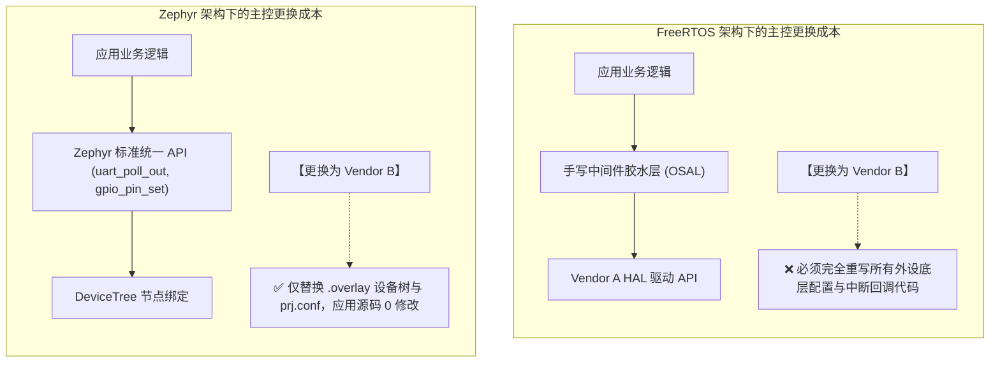

# 硬件抽象与驱动可移植性

## 1. 嵌入式产品的“换芯”噩梦与解耦诉求

在消费电子、工业物联网与汽车制造中，由于供应链波动、芯片停产或成本优化，工程团队经常面临**更换主控 MCU**的挑战（例如：从 STM32 切换为 NXP LPC，或从 ARM Cortex-M 架构切换为 RISC-V）。

此时，软件架构是否具备良好的**硬件抽象层（HAL）解耦能力**，直接决定了项目是“换个板级配置文件即刻交付”，还是“全团队加班半年重写全部驱动”。

---

## 2. 跨平台移植工作量与工程周期参考评估

以一个包含 **UART 协议通信 + SPI 屏显 + I2C 传感器 + GPIO 继电器控制** 的典型工业边缘控制器项目为例，当主控 MCU 从 STM32 系列平移至 NXP i.MX RT 或 RISC-V 架构时，两类架构的工程成本对比如下（参考 [DeviceTree Specification 规范](https://www.devicetree.org/specifications/) 与 [Zephyr Device Driver Model](https://docs.zephyrproject.org/latest/kernel/drivers/index.html)）：

| 工程迁移环节 | FreeRTOS + 裸机厂商 HAL 方案 | Zephyr 统一设备模型方案 | 核心工程边界与差异剖析 |
| :--- | :--- | :--- | :--- |
| **内核本身移植** | 替换 `portable/` 汇编（$< 1$ 人天） | 选用对应 SoC / Board 目标（$< 0.5$ 人天） | 两者内核移植均已非常成熟，开销极小 |
| **引脚复用与时钟树** | 重写寄存器 / 重新配置图形代码生成器（2~3 人天） | 修改 DTS 中的 `pinctrl` 节点（$\sim 1$ 人天） | Zephyr 将引脚统一为标准设备树节点，声明式解耦更佳 |
| **标准外设驱动 (I2C/SPI)** | 需将应用层调用全面重构至新原厂 API（8~12 人天） | 直接复用上游官方统一驱动（$\sim 1 - 2$ 人天联调） | **标准化收益显著**：主流半导体外设均有社区维护驱动 |
| **中断服务与回调胶水** | 需重写各 IRQ Handler 并重新绑定 FromISR（2~4 人天） | DTS 声明中断线，内核自动关联派发（$< 0.5$ 人天） | 避免手写繁琐且容易漏配优先级的中断胶水代码 |
| **自研/非标外设边界** | 按常规编写私有驱动 | **需手写 YAML Binding 与设备驱动实现** | 若外设为小众自研芯片，Zephyr 驱动编写门槛略高于裸机 |
| **综合工程迁移周期** | **约 2 ~ 4 周**（含全量回归） | **约 3 ~ 7 天** | 标准化驱动模型显著收敛了更换主控的重构风险 |

---

## 3. 驱动模型的本质差异

### 3.1 FreeRTOS 的“无为而治”
FreeRTOS 官方长期坚持“只做内核，不涉足驱动规范”。这一策略的巨大好处是保持了自身的超轻量与自由度；但代价是把驱动抽象的巨大包袱完全推给了芯片原厂和最终开发者。

### 3.2 Zephyr 的“工业统一大一统”
Zephyr 使用设备树描述硬件，并通过统一 API 访问外设。应用迁移时可复用这些接口；板级配置、驱动支持和芯片特有功能仍需检查。
