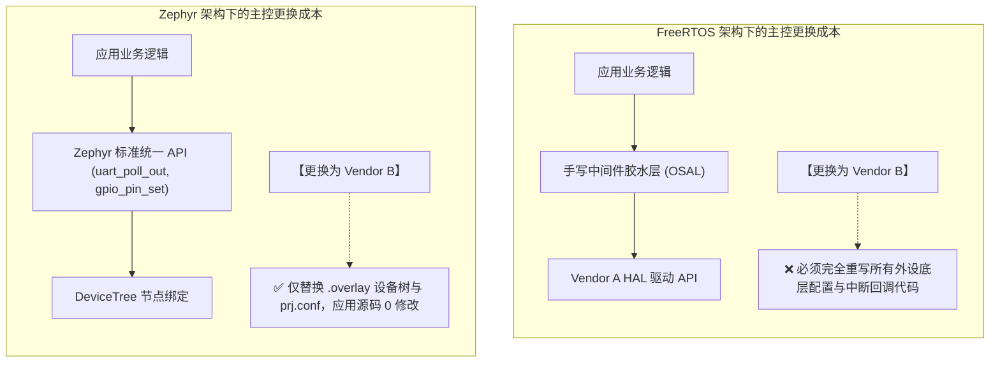

# 硬件抽象与驱动可移植性

## 1. 嵌入式产品的“换芯”噩梦与解耦诉求

在消费电子、工业物联网与汽车制造中，由于供应链波动、芯片停产或成本优化，工程团队经常面临**更换主控 MCU**的挑战（例如：从 STM32 切换为 NXP LPC，或从 ARM Cortex-M 架构切换为 RISC-V）。

此时，软件架构是否具备良好的**硬件抽象层（HAL）解耦能力**，直接决定了项目是“换个板级配置文件即刻交付”，还是“全团队加班半年重写全部驱动”。

---

## 2. 跨平台移植工作量与工程周期参考评估

以一个包含 **UART 协议通信 + SPI 屏显 + I2C 传感器 + GPIO 继电器控制** 的典型工业边缘控制器项目为例，当主控 MCU 从 STM32 系列平移至 NXP i.MX RT 或 RISC-V 架构时，两类架构的工程成本对比如下（参考 [DeviceTree Specification 规范](https://www.devicetree.org/specifications/) 与 [Zephyr Device Driver Model](https://docs.zephyrproject.org/latest/kernel/drivers/index.html)）：

| 工程迁移环节 | FreeRTOS + 裸机厂商 HAL 方案 | Zephyr 统一设备模型方案 | 核心工程边界与差异剖析 |
| :--- | :--- | :--- | :--- |
| **内核本身移植** | 替换 `portable/` 汇编（$< 1$ 人天） | 选用对应 SoC / Board 目标（$< 0.5$ 人天） | 两者内核移植均已非常成熟，开销极小 |
| **引脚复用与时钟树** | 重写寄存器 / 重新配置图形代码生成器（2~3 人天） | 修改 DTS 中的 `pinctrl` 节点（$\sim 1$ 人天） | Zephyr 将引脚统一为标准设备树节点，声明式解耦更佳 |
| **标准外设驱动 (I2C/SPI)** | 需将应用层调用全面重构至新原厂 API（8~12 人天） | 直接复用上游官方统一驱动（$\sim 1 - 2$ 人天联调） | **标准化收益显著**：主流半导体外设均有社区维护驱动 |
| **中断服务与回调胶水** | 需重写各 IRQ Handler 并重新绑定 FromISR（2~4 人天） | DTS 声明中断线，内核自动关联派发（$< 0.5$ 人天） | 避免手写繁琐且容易漏配优先级的中断胶水代码 |
| **自研/非标外设边界** | 按常规编写私有驱动 | **需手写 YAML Binding 与设备驱动实现** | 若外设为小众自研芯片，Zephyr 驱动编写门槛略高于裸机 |
| **综合工程迁移周期** | **约 2 ~ 4 周**（含全量回归） | **约 3 ~ 7 天** | 标准化驱动模型显著收敛了更换主控的重构风险 |

---

## 3. 驱动模型的本质差异

### 3.1 FreeRTOS 的“无为而治”
FreeRTOS 官方长期坚持“只做内核，不涉足驱动规范”。这一策略的巨大好处是保持了自身的超轻量与自由度；但代价是把驱动抽象的巨大包袱完全推给了芯片原厂和最终开发者。

### 3.2 Zephyr 的“工业统一大一统”
Zephyr 采用了与 Linux 相近的设备树理念。ST、NXP、Nordic、TI、Espressif 等厂商及社区会向主线贡献驱动，但支持范围和维护状态需要按具体 SoC、板卡和版本核对。统一 API 可以减少板级适配工作，底层时钟、DMA、引脚和时序仍需结合芯片手册验证。

---

## 4. 移植层解剖：内核如何贴上硅片

两个系统都存在「架构相关层」，但形态与职责边界完全不同：

| 解剖维度 | FreeRTOS 移植层 | Zephyr 移植层 |
| :--- | :--- | :--- |
| **目录形态** | `portable/<编译器>/<架构>/port.c + portmacro.h`，一套目录一端口 | `arch/<架构>/`（ARM CoreSight/RISC-V/x86…）+ `soc/<厂商>/` + `boards/` 三级 |
| **职责内容** | 上下文切换汇编、临界区宏、tick 配置、栈生长方向、字宽定义 | 异常/中断框架、线程栈初始化、MMU/MPU/PMP 管理、SMP 启动、链接脚本模板 |
| **硬件描述耦合** | **无**——内核不认识任何外设，地址信息全在厂商 HAL | **强绑定**——SoC 层 dtsi 描述每个控制器的地址/中断/引脚，成为内核可引导的先决条件 |
| **新增架构的工作量** | 移植 port.c/portmacro.h（数千行级，社区有移植指南） | 补齐 arch 层 + SoC 支持 + 至少一块 board（上游有 review 门禁） |
| **选型切换粒度** | 工程里换 `portable/` 目录 + 改 `FreeRTOSConfig.h` | `west build -b <board>` 一个参数换目标，CMake/Kconfig/DT 全自动切换 |

!!! note
    **「便携内核」与「携板系统」**：FreeRTOS 的移植层回答「如何在 CPU 上跑调度器」；Zephyr 的移植层回答「如何让这片 SoC 上的每个控制器都可被设备树寻址」。前者轻，后者重——但重的那部分正是换芯时能免于重写的部分。

---

## 5. 驱动生态的现实判定表

「标准化」不等于「全覆盖」，选型前应按下表核查目标芯片的现实支持状态：

| 现实情形 | FreeRTOS + 厂商 HAL | Zephyr upstream | 判定建议 |
| :--- | :--- | :--- | :--- |
| **主流 MCU（ST/NXP/Nordic/Espressif 热门型号）** | 原厂 HAL/SDK 完备，例程丰富 | 驱动与板级支持均 upstream，长期有人维护 | 两者皆可，按第 04 模块选型树决策 |
| **冷门/国产 MCU** | 原厂通常提供 FreeRTOS 移植（含 port.c 与例程） | upstream 覆盖可能缺失，需自写 SoC/board 支持 | FreeRTOS 显著稳妥 |
| **自研 ASIC/自研外设** | 裸写驱动即可，无框架约束 | 需自写驱动 + YAML binding，但换来统一的测试与文档骨架 | 一次性项目选 FreeRTOS；平台化多产品线选 Zephyr |
| **需要「带驱动的中间件」(文件系统/USB/BLE)** | 厂商 SDK 或第三方库拼接，版本矩阵混乱 | 原生子系统集成，`CONFIG` 一致管理 | Zephyr 生态收益最大 |
| **原厂 SDK 深度绑定工具链（如厂商 IDE + 配置器）** | CubeMX/SysConfig 生成代码与 HAL 强耦合 | Zephyr 不依赖厂商 IDE，但需芯片在支持列表内 | 团队习惯定夺 |

!!! warning
    **Zephyr 的前提条件**：设备树带来的「换芯零成本」只在**目标芯片已被 upstream 支持**时成立。立项前先查 [Zephyr 支持板卡列表](https://docs.zephyrproject.org/latest/boards/index.html) 与 `soc/` 目录——若需要自己补 SoC 层，成本曲线会立刻反转（估计 2~6 人周量级，视外设复杂度）。
