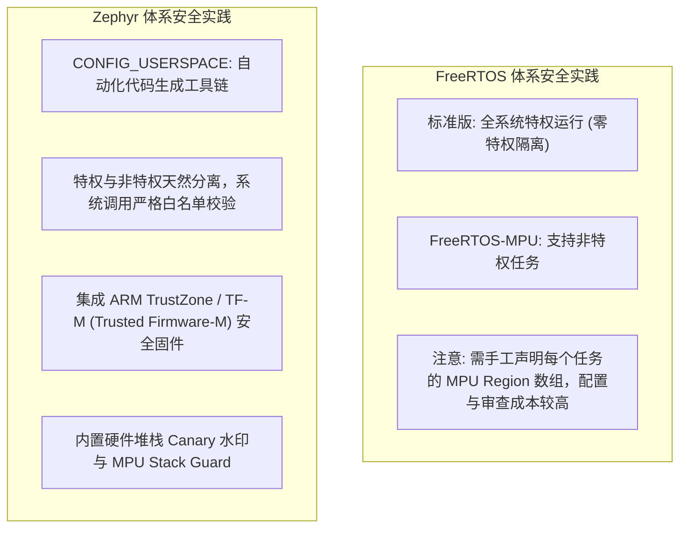
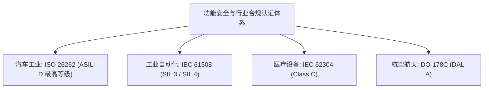

# 内存保护与安全合规

## 1. 内存隔离与保护方案对比

随着嵌入式设备越来越多地连接互联网，针对固件的逆向工程、缓冲区溢出攻击（Buffer Overflow）与权限越权攻击已成为严重的工业威胁。

### 1.1 版本与接口边界

FreeRTOS-MPU 端口自带包装与 SVC 路径，不要求应用从零实现系统调用。较新的 MPU wrappers v2 还提供系统调用栈和可选对象访问控制，不能将所有版本概括为“只有地址隔离”。本文其他 FreeRTOS 源码笔记采用 V10.5.1，涉及 v2 的设计需单独核对版本。

Zephyr 3.7 的内存域与内核对象授权是两套相关但不同的机制：分区约束用户内存访问，对象元数据用于验证 syscall 的对象类型与权限。`gen_kobject_list.py` 不负责自动计算所有 MPU 区域。

--- | :--- | :--- |
| **MPU 区域配置方式** | 开发者在 C 代码中**手动计算并硬编码** Region 大小与对齐 | 编译器与 `gen_kobject_list.py` **全自动静态计算生成** |
| **内核对象访问控制** | 缺乏细粒度权限控制，仅能按地址段粗暴隔离 | **对象级权限掩码**（Thread 必须获得特定句柄才可操作） |
| **系统调用安全性** | 开发者自行封装 SVC 中断 | 官方自带严密的参数有效性验证（`z_vrfy` 校验层） |
| **TrustZone / 安全域隔离** | 需另配安全固件（如 TF-M/PSA 服务） | 可集成 TF-M，安全世界与非安全世界之间仍需按目标芯片配置和验证 |

---

## 2. 行业功能安全与合规认证（Functional Safety）

在涉及人身与生命财产安全的高危行业（如轨道交通、汽车动力总成、医疗起搏器、航空电子），实时系统的认证门槛至关重要。

### 2.1 FreeRTOS 与 SafeRTOS
* **开源版 FreeRTOS**：本身**不具备**官方出具的功能安全认证包。
* **商业衍生版 SafeRTOS**：由 WITTENSTEIN high integrity systems（WHIS）维护的商业闭源产品，面向需要功能安全证据链的项目。其认证范围、版本和适用条件应以供应商当前资料为准，项目仍需自行完成系统级安全论证与授权评估。

### 2.2 Zephyr Safety Scope 与开源安全认证
* **Zephyr Safety Working Group**：由社区成员推动安全相关工作，目标是补充面向 IEC 61508、ISO 26262 等标准的工程证据；这不等同于开源发行版已经取得对应认证。
* **LTS（长期支持版本）机制**：Zephyr 会发布维护周期较长的 LTS 分支。具体支持期限、补丁范围和工程文档以当前版本公告为准，不能替代项目自己的 V-Model 和安全评估。

---

## 3. 需要验证的隔离配置

- 目标处理器提供多少 MPU 区域，栈保护和内核保留区占用多少。
- 应用线程可访问哪些内存分区、设备与内核对象。
- 系统调用是否验证对象授权、用户缓冲区长度和读写权限。
- 无效访问是否按预期触发故障，以及故障后的线程或系统恢复策略。

Zephyr 的 Object Core 主要用于对象追踪和统计，不等同于 userspace 的对象权限表。动态内核对象也可通过对应的分配和授权接口使用。

## 4. TrustZone 双世界与安全启动

### 4.1 ARMv8-M TrustZone 上的两种姿态

* **Zephyr + TF-M（PSA 参考实现）**：Zephyr 运行于非安全侧（NSPE）作为 Rich Application，安全侧由 TF-M 承载 PSA Functional API（Crypto/Secure Storage/Internal Trusted Storage/Initial Attestation）。跨世界调用走 SG/BXNS 门禁函数，Zephyr 侧有配套的 TF-M 集成样例与集成构建（`sysbuild`）。安全资产（密钥）由安全世界独占，NSPE 代码漏洞无法直读。
* **FreeRTOS on Cortex-M33**：端口提供安全上下文原语（如 `portALLOCATE_SECURE_CONTEXT`/`portRAISE_PRIVILEGE` 类机制），可将任务栈与上下文分配进安全世界管理；但「安全侧固件」本身（PSA 服务、密钥管理）需另配 TF-M 或第三方安全固件，官方集成样例较 Zephyr 生态稀疏。

### 4.2 安全启动（Secure Boot）与 OTA

| 环节 | FreeRTOS 生态 | Zephyr 生态 |
| :--- | :--- | :--- |
| **Bootloader** | MCUboot 可集成（开源，Apache 2.0），需自行接适配层与 flash 驱动 | MCUboot 为**事实默认**（`CONFIG_BOOTLOADER_MCUBOOT`），签名/加密/swap 或 direct-xip 升级策略现成 |
| **镜像签名验证** | ECDSA/RSA 验签由 MCUboot 提供，密钥与产线灌装流程自理 | 同左，且与 Zephyr 的 `build` 系统（`west sign`）一键衔接 |
| **OTA 传输** | 第三方（AWS OTA 服务、自研） | 原生 `sysbuild` 多镜像 + SMP（MCUmgr）蓝牙/串口传输管理 |
| **防回滚** | MCUboot 版本计数器 | 同左 |

!!! note
    **PSA Certified 认证状态为动态生态**（芯片与软件组合逐案认证），立项时应查证目标组合的当期认证清单，而非引用任何静态表格结论。

---

## 5. 安全需求分层判定（选型前的自查顺序）

1. **是否有人身安全（功能安全）**？→ 走 ISO 26262/IEC 61508 路径：不要由 LTS 标签推断认证状态；FreeRTOS 系考虑 SafeRTOS 商业版，Zephyr 系评估 Safety 工作组交付物与 LTS + V 模型文档。
2. **是否有可提取资产（密钥/证书/算法）**？→ 需要 TrustZone/TF-M 或独立安全核；按目标平台核对两种系统的集成支持。
3. **是否暴露物理攻击面（调试口/旁路）**？→ 无论选谁，锁 RDP/调试口、开 MPU guard、Canary 与签名启动是通用基线。
4. **是否只需「防御性编程」级别**？→ 评估静态分配、栈检查与 MPU guard 是否覆盖已识别故障，不能据此保证全部安全需求。

## 参考

- [FreeRTOS MPU support](https://github.com/FreeRTOS/FreeRTOS-Kernel/blob/V11.1.0/portable/Common/mpu_wrappers_v2.c)
- [Zephyr Userspace](https://docs.zephyrproject.org/latest/kernel/usermode/index.html)
- [Zephyr Safety](https://www.zephyrproject.org/safety/)
- [SafeRTOS](https://www.highintegritysystems.com/safertos/)
