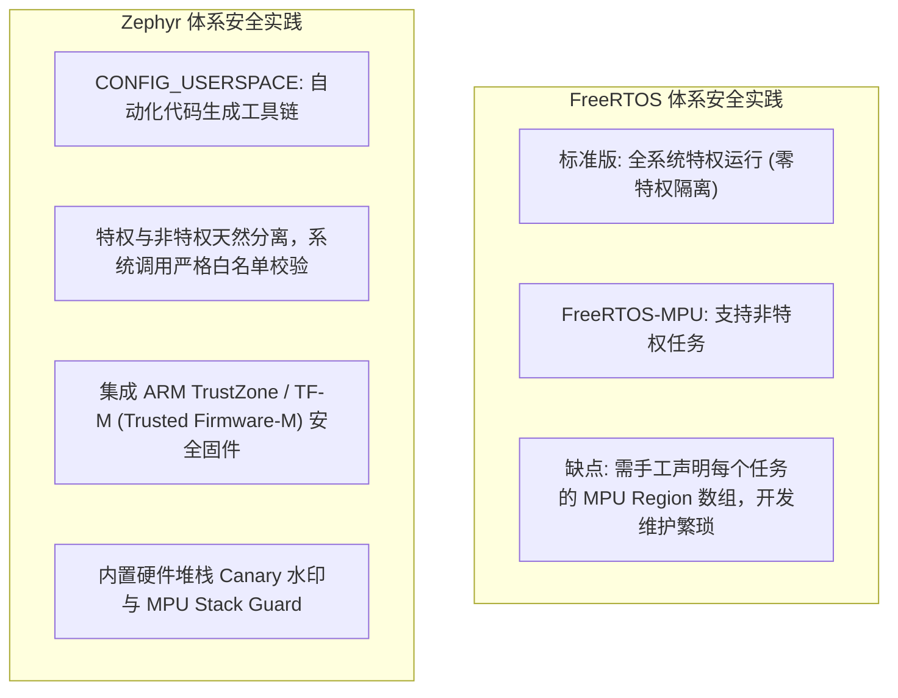
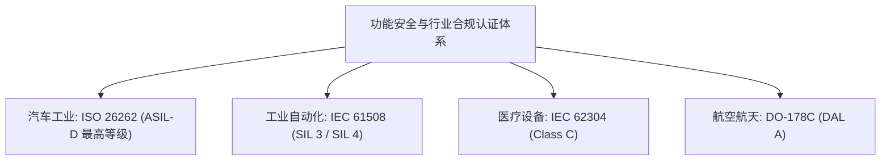

# 内存保护与安全合规

## 1. 内存隔离与保护方案对比

随着嵌入式设备越来越多地连接互联网，针对固件的逆向工程、缓冲区溢出攻击（Buffer Overflow）与权限越权攻击已成为严重的工业威胁。

### 1.1 隔离机制细节对比

| 安全特性 | FreeRTOS-MPU | Zephyr Userspace |
| :--- | :--- | :--- |
| **MPU 区域配置方式** | 开发者在 C 代码中**手动计算并硬编码** Region 大小与对齐 | 编译器与 `gen_kobject_list.py` **静态计算生成** |
| **内核对象访问控制** | 缺乏细粒度权限控制，仅能按地址段粗暴隔离 | **对象级权限掩码**（Thread 必须获得特定句柄才可操作） |
| **系统调用安全性** | 开发者自行封装 SVC 中断 | 官方自带参数有效性验证（`z_vrfy` 校验层） |
| **TrustZone / 安全域隔离** | 需第三方固件配合（如 PSA API） | **原生集成 TF-M**，支持安全世界（Secure World）与非安全世界交互 |

---

## 2. 行业功能安全与合规认证（Functional Safety）

在涉及人身与生命财产安全的高危行业（如轨道交通、汽车动力总成、医疗起搏器、航空电子），实时系统的认证门槛至关重要。

### 2.1 FreeRTOS 与 SafeRTOS
* **开源版 FreeRTOS**：本身**不具备**官方出具的功能安全认证包。
* **商业衍生版 SafeRTOS**：由 WITTENSTEIN high integrity systems（WHIS）基于 FreeRTOS 早期内核重构并完全独立重写的商业闭源版本。它通过了 **ISO 26262 ASIL-D、IEC 61508 SIL 3、IEC 62304** 预认证，广泛应用于国际一线整车厂与医疗设备，但需要支付昂贵的商业授权费用。

### 2.2 Zephyr Safety Scope 与开源安全认证
* **Zephyr Safety Working Group**：由 Intel、Linaro、Baumer 等成员发起，直接致力于使开源版 Zephyr 达到 **IEC 61508 SIL 3 与 ISO 26262 ASIL-D** 标准。
* **LTS（长期支持版本）机制**：Zephyr 定期发布提供长期维护的 LTS 分支（如 LTS 2, LTS 3），并按照严格的软件工程生命周期（V-Model）提供可追溯的安全交付文档。
