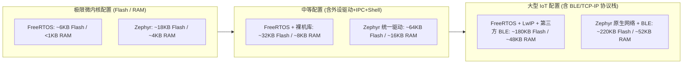

# 资源 Footprint 极值对比

## 1. 内存资源占用（Footprint）的现实意义

在千万级出货量的消费电子或成本极度敏感的传感器节点中，MCU 的 Flash 和 RAM 规格直接决定单颗芯片的 BOM 成本（例如：从 128KB Flash / 32KB RAM 跨越到 512KB Flash / 128KB RAM，每片成本可能增加 0.5 ~ 1.5 美元）。

因此，评估 RTOS 的**资源开销底线与增长弹性**，是技术选型的决定性考量之一。

---

## 2. 典型场景资源开销估算模型与配置边界

嵌入式二进制文件的尺寸直接受链接器 `--gc-sections` 死代码消除、C 运行时库实现（如 newlib-nano vs picolibc）以及静态堆栈预留大小的剧烈影响。

> [!NOTE]
> **估算基准与裁剪约束假设**：
> * **架构与工具链**：ARM Cortex-M4（32-bit Thumb-2），GCC 工具链开启 `-Os`（尺寸优先优化）与 `-ffunction-sections -fdata-sections`；
> * **FreeRTOS 基准**：[FreeRTOS V10.5.1](https://www.freertos.org/Embedded-RTOS-Binary-Sizes.html)，采用 `heap_4.c`，关闭所有运行期 Assert 和 Trace 挂钩，RAM 统计包含内核 TCB 与空闲任务栈；
> * **Zephyr 基准**：[Zephyr Project Minimal Footprint](https://docs.zephyrproject.org/latest/hardware/emulator/footprint.html)，关闭 Shell、Logging 与 Userspace 特权隔离，仅保留基础设备驱动与时钟源。

### 典型工程开销参考区间（Flash / RAM）

| 评估配置级别 | 组件构成范畴 | FreeRTOS + 原厂裸机 HAL | Zephyr 统一驱动模型 | 资源占用机理客观解读 |
| :--- | :--- | :--- | :--- | :--- |
| **极简内核 (Minimal)** | 仅任务切换、SysTick 定时器、无外部外设驱动 | $\sim 5 - 8\,\text{KB}$ / $\sim 0.8 - 1.5\,\text{KB}$ | $\sim 15 - 22\,\text{KB}$ / $\sim 3 - 5\,\text{KB}$ | **FreeRTOS 显著占优**：Zephyr 内置了必须的 DeviceTree 节点元数据与异常派发框架 |
| **基础工程 (Basic)** | 基础任务 + 信号量/互斥锁 + 控制台串口打印 | $\sim 14 - 20\,\text{KB}$ / $\sim 2.5 - 4\,\text{KB}$ | $\sim 32 - 45\,\text{KB}$ / $\sim 6 - 10\,\text{KB}$ | Zephyr 统一驱动模型引入了驱动虚函数表和统一设备结构体常数 |
| **进阶工程 (Advanced)** | 基础外设驱动 (GPIO/UART/I2C/SPI) + 动态内存堆 | $\sim 30 - 45\,\text{KB}$ / $\sim 6 - 10\,\text{KB}$ | $\sim 55 - 80\,\text{KB}$ / $\sim 14 - 22\,\text{KB}$ | 厂商 HAL 较为扁平；Zephyr 驱动框架分层较多，内存基线略高 |
| **带网络协议栈 (Network)** | 以太网驱动 + IPv4/IPv6 + Socket 抽象 | $\sim 140 - 180\,\text{KB}$ / $\sim 35 - 50\,\text{KB}$ (外挂 LwIP) | $\sim 170 - 220\,\text{KB}$ / $\sim 40 - 60\,\text{KB}$ (Zephyr 原生 Net 栈) | **两者差距明显收窄**：网络协议栈主要开销在于 TCP 报文环形缓冲（Buffer） |
| **低功耗蓝牙 (BLE)** | BLE Controller + Host + GATT 服务 | 外挂厂商协议栈 ($\sim 160 - 200\,\text{KB}$) | $\sim 190 - 240\,\text{KB}$ / $\sim 38 - 50\,\text{KB}$ (Zephyr 原生 BLE) | Zephyr 具备全开源、经过严格蓝牙 SIG 认证的完整原生协议栈 |

---

## 3. 选型资源权衡结论

1. **极端资源受限场景（Flash $< 32\,\text{KB}$，RAM $< 8\,\text{KB}$）**：  
   * **可优先评估 FreeRTOS**。其调度核心代码可压缩至 6KB 以内，能够在低成本的 Cortex-M0+ 或传统 8/16 位微控制器上运行；而 Zephyr 即使经过裁剪，其系统基础设施也很难压缩在 16KB Flash 以下。
2. **现代主流 MCU 场景（Flash $\ge 128\,\text{KB}$，RAM $\ge 32\,\text{KB}$）**：  
   * Flash 与 RAM 不再是首要死线。Zephyr 虽然多消耗了约 20~40KB 的 Flash 存储，但换取了跨芯片统一的设备树驱动模型、原生网络/BLE 协议栈以及高可复现的 CMake/Kconfig 构建链，显著降低了长期工程维护与芯片换型的边际成本。相比之下，若追求极简、原理透彻的百行代码自研练习，亦可参考 [RVKernel Lab 01](../Labs/lab01-rv32-boot-trap-paging.md)。
